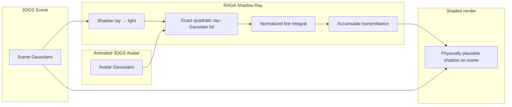

# RAGA — Real Time Ray Traced Gaussian Shadow Casting

**RAGA**（*Real Time Ray Traced Gaussian Shadow Casting for 3DGS Avatar-Scene Interaction*，[arXiv:2606.29329](https://arxiv.org/abs/2606.29329)，Mir 等 · **Tübingen AI Center** / **MPI for Informatics** / **Imperial College London** / **KAUST** / **Snap Inc.**；[项目页](https://miraymen.github.io/raga/)，**ECCV 2026**）研究：在 **已有 3DGS 场景** 中动画 **3DGS avatar**（单人、多人或 avatar–物体交互）时，如何 **不重建 mesh** 仍得到 **物理可信阴影**。

## 一句话定义

**从场景 Gaussian 向光源 cast shadow ray，用精确 ray–Gaussian 交与归一化线积分累积 avatar 的 volumetric obstruction，在纯 Gaussian 空间 ~50 FPS 实时渲染 avatar–场景阴影。**

## 英文缩写速查

| 缩写 | 英文全称 | 简要说明 |
|------|----------|----------|
| RAGA | Ray Traced Gaussian Avatar (shadow casting) | 本文方法简称 |
| 3DGS | 3D Gaussian Splatting | 场景与 avatar 的统一表示 |
| 3DGRT | 3D Gaussian Ray Tracing | 基线：icosahedron 代理求交 |
| RT | Ray Tracing | 阴影 ray 累积 transmittance |
| SMPL | Skinned Multi-Person Linear Model | mesh 人体 proxy 对照（本文不用） |
| FPS | Frames Per Second | 项目页 ~50 FPS 实时渲染 |

## 为什么重要

- **Real2Sim / 数字孪生读法：** 3DGS 场景 increasingly 用于 **重建→仿真→策略**（如 [RL-GSBridge](./paper-sa-2409-20291-rl-gsbridge-3d-gaussian-splatting-based-real2sim.md)、[VLK](./paper-vlk-synthetic-loco-manipulation.md)）；若 avatar 插入场景但 **阴影与接触光照不一致**，视觉 sim2real 与 human-in-scene 合成会露馅。
- **坚持 Gaussian-native：** 避免 **场景 mesh 提取**（丢墙/家具阴影接收面）与 **SMPL mesh caster**（丢衣发 silhouette）；也支持 **任意 3DGS 物体** 与 avatar 共 casting。
- **几何细节在 shadow 里：** 相对 3DGRT 的 **块状阴影** 与 RaySplat 的 ** traversal 等权**，line integral 更 faithful 反映「射线穿过多少 Gaussian 体积」。

## 核心信息

| 项 | 内容 |
|----|------|
| **作者** | Aymen Mir*、Riza Alp Guler、Jian Wang、Peter Wonka、Bing Zhou、Gerard Pons-Moll |
| **机构** | Tübingen AI Center / University of Tübingen；MPI for Informatics；Imperial College London；KAUST；Snap Inc. |
| **发表** | **ECCV 2026**（项目页）；arXiv 2026-06-28 |
| **性能** | ~**50 FPS** 实时（项目页） |
| **表示** | 场景 + avatar **全无 mesh**；shadow 计算在 **Gaussian 空间** |
| **开源** | **官方训练/渲染代码未发布**（项目页 2026-09-10 无 Code 链） |
| **arXiv** | <https://arxiv.org/abs/2606.29329> |

## 流程总览

## 核心原理

### Shadow ray 与 transmittance

对场景中的 shading point（场景 Gaussian），向光源方向 cast **shadow ray**。射线穿过 **animated avatar** 的全部 Gaussians，累积 **opacity / transmittance**，得到该点是否处于阴影中。

### 相对 3DGRT 与 RaySplat

| 策略 | 问题 |
|------|------|
| **3DGRT icosahedron proxy** | 在 Gaussian support **外** 误判 hit → avatar 表面过度遮挡 → **块状阴影** |
| **RaySplat exact entry/exit** | 有交点但 **不建模 traversal 深度**；同过一点不同 grazing 射线等权 |
| **Max response along ray** | 忽略 traversal 深度；grazing ray  overweight |
| **RAGA line integral** | **归一化线积分** 量化射线穿过每个 Gaussian 的体积 obstruction |

### 为何拒绝 mesh pipeline

1. **场景 mesh 提取有损** — 墙/家具阴影接收面丢失；floor proxy 仅适合评测子集。
2. **SMPL 等人体 mesh** — 阴影 silhouette 丢 **衣发** 细节；3DGS avatar 保留几何 fidelity。
3. **Gaussian 物体** — mesh proxy 无法覆盖插入场景的 **任意 3DGS object**。

## 源码运行时序图

**不适用（官方可运行代码尚未发布）。** 项目页（2026-09-10）无 GitHub / 权重链接；方法为 **实时光线追踪 + Gaussian 积分** 渲染栈，复现需等待作者发布或社区实现。

## 实验与评测（项目页归纳）

- **Single avatar：** 多样 3DGS 场景中单人动画 + 阴影。
- **Avatar–object interaction：** avatar 与 **3DGS 物体** 共 casting，阴影 coherent。
- **对比可视化：** RaySplat (Mod) / 3DGRT (Mod) / **Ours** — 块状 vs 浅层 hit vs line integral。
- **定量表：** 以 PDF 为准；本页未搬运完整 benchmark 数值。

## 结论

**RAGA 把 avatar–场景阴影从 mesh 管线拉回纯 3DGS，并用 ray–Gaussian 线积分在 ~50 FPS 下修复 3DGRT/RaySplat 类近似带来的块状或深度失配阴影。**

1. **Shadow 是 Real2Sim 可信度的一环** — 3DGS 场景 + 动画 avatar 若无一致阴影，合成数据与策略视觉域会偏。
2. **Gaussian-native 优于双重 mesh 化** — 场景提取 + SMPL caster 各丢一类细节；RAGA 对插入式 3DGS 物体自然成立。
3. **交点精度 ≠ 体积 obstruction** — icosahedron 与 shallow hit 都说明：shadow 需要 **沿 ray 的积分**，不是 binary hit。
4. **实时性可工程落地** — ~50 FPS 表明非离线 path tracer demo，可接入交互式 sim / 内容管线。
5. **官方代码未发布** — 选型与复现前须以项目页为准再核；暂无源码运行时序图。
6. **边界在静态 3DGS 假设** — 动态场景、复杂 BRDF 与多光源扩展见原文；与机器人控制仍隔一层策略接口。

## 与其他工作对比

| 路线 | 代表 | 阴影 / 交互 | 表示 |
|------|------|-------------|------|
| Mesh shadow caster | SMPL + mesh scene | 快但丢细节 | Mesh |
| 3DGRT RT | icosahedron proxy | 块状 artifact | 3DGS |
| RaySplat 类 | exact entry/exit | traversal 等权 | 3DGS |
| **RAGA** | line integral RT | **~50 FPS 可信阴影** | **纯 3DGS** |
| Real2Sim 管线 | [RL-GSBridge](./paper-sa-2409-20291-rl-gsbridge-3d-gaussian-splatting-based-real2sim.md) | 侧重 RL 视觉域 | 3DGS in sim |

## 常见误区与局限

- **不是新 3DGS 重建方法** — 假设 **已有** 场景与 avatar Gaussian；贡献在 **shadow casting**。
- **不是机器人策略论文** — 服务 **渲染 / sim 视觉 fidelity**；到 loco-manip 策略需另接数据管线。
- **2.5D / 光照模型边界** — 项目页强调 plausible shadow；完整全局光照与材质解耦以 PDF 为准。
- **开源：** 截至 2026-09-10 **无官方代码** — 勿与社区同名仓库混淆。

## 参考来源

- [raga_arxiv_2606_29329.md](../../sources/papers/raga_arxiv_2606_29329.md)
- [raga-miraymen-github-io.md](../../sources/sites/raga-miraymen-github-io.md) — 项目页开源核查
- Mir et al., *RAGA*, [arXiv:2606.29329](https://arxiv.org/abs/2606.29329) · [ECCV 2026 项目页](https://miraymen.github.io/raga/)

## 关联页面

- [Generative World Models](../methods/generative-world-models.md)
- [Video as Simulation](../concepts/video-as-simulation.md)
- [RL-GSBridge](./paper-sa-2409-20291-rl-gsbridge-3d-gaussian-splatting-based-real2sim.md) — 3DGS Real2Sim RL
- [Awesome-Real2Sim2Real](./awesome-real2sim2real.md)
- [Spark 3DGS Renderer](./spark-3dgs-renderer.md) — Web 大场景 3DGS 渲染对照

## 推荐继续阅读

- [RAGA 项目页](https://miraymen.github.io/raga/)
- [arXiv PDF](https://arxiv.org/pdf/2606.29329)
- [RoboGSim](./paper-sa-2411-11839-robogsim-a-real2sim2real-robotic-gaussian-splatt.md) — 机器人 Gaussian Real2Sim2Real 另一轴
