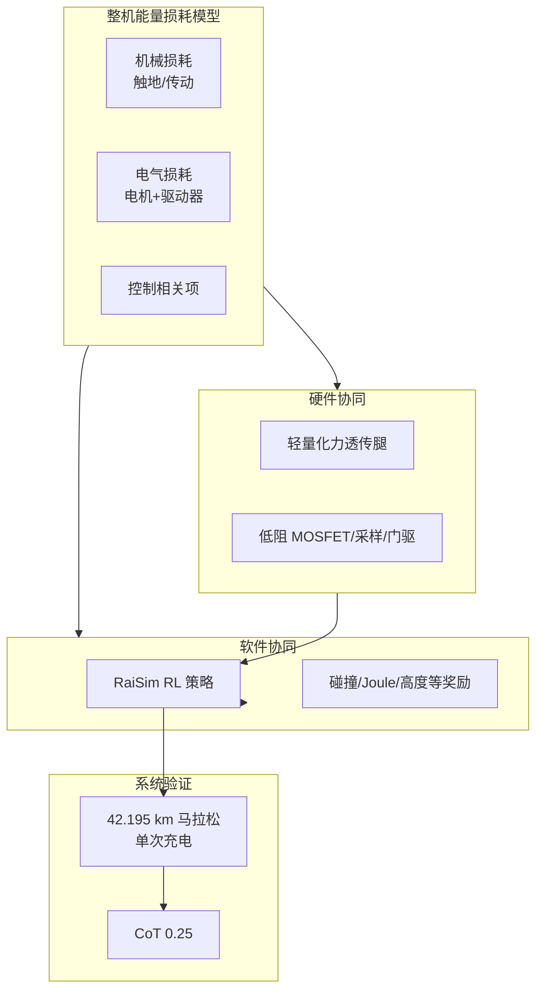
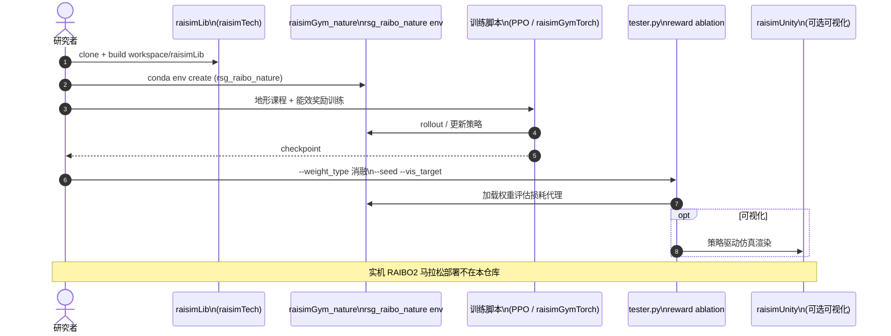

# RAIBO2：单次充电完成马拉松的高能效四足

**A quadruped robot designed to complete a marathon on a single battery charge**（Lee, Youm, Park *et al.*，*Nature* 2026，DOI [10.1038/s41586-026-11102-5](https://doi.org/10.1038/s41586-026-11102-5)；KAIST **RaiLab**，通讯 **Jemin Hwangbo**）展示四足 **RAIBO2**：在 **约 1,447 Wh** 电池上 **一次充电** 跑完 **42.195 km** 马拉松，用时 **4 h 19 min 52 s**，**运输成本（CoT）0.25**，低于人类长跑参照 **0.37**；相对文献中四足平台，**单次充电航程约提升 3 倍以上**。贡献来自 **整机能量损耗模型** 下的 **硬件（力透传轻量化腿 + 低损耗电机驱动）** 与 **软件（低耗散 RL 步态与奖励设计）** 协同，而非单点改齿比或只加能耗奖励。

## 一句话定义

**把四足当「会走路的电池系统」做联合优化——RAIBO2 用可分解的总损耗模型同时改腿、改驱动、改 RL 奖励，让真实马拉松成为能效指标，而不只是仿真里的 reward 标量。**

## 英文缩写速查

| 缩写 | 英文全称 | 简要说明 |
|------|----------|----------|
| CoT | Cost of Transport | 单位距离运输成本；本文 **0.25** vs 人类 **0.37** |
| RL | Reinforcement Learning | RaiSim 中 PPO 类训练低耗散策略 |
| PPO | Proximal Policy Optimization | 论文引用与 raisimGym 惯例训练算法 |
| WH | Watt-hour | 电池能量；全文分析约 **1,447 Wh** 配置 |
| MOSFET | Metal-Oxide-Semiconductor Field-Effect Transistor | 驱动器导通/开关损耗优化对象 |
| RaiSim | Rigid Articulated Interactive Simulator | KAIST 组常用刚体仿真栈 |
| Sim2Real | Simulation to Real | 仿真训策略 → RAIBO2 户外马拉松部署 |

## 为什么重要

- **户外四足的主瓶颈是航程，不是峰值速度：** 救援、巡检、山地物流需要 **数小时** 连续步行；以往四足 demo 多强调 **3–5 m/s 冲刺或特技**，与 **Wh/km** 产品指标错位。
- **能效必须软硬一体：** 仅 **轻腿** 或仅 **Joule 奖励** 都会在其它损耗项上反弹；论文用 **Fig. 3 损耗分解 + Extended Data 驱动器 ablation** 说明 **联合设计** 必要性。
- **Nature 级系统证据：** 完整 **马拉松**（非缩圈实验室）+ **Zenodo 数据** + **训练代码**，为 [Locomotion](../tasks/locomotion.md) 路线增加 **「CoT / 续航」** 与 **「敏捷 / 感知」** 并列的选型轴。
- **与 Hwangbo 组技术栈连续：** 同 [RSS 2018 四足 sim2real](./paper-quadruped-agile-sim2real-rss2018.md)、[并发策略–估计器](./paper-concurrent-policy-estimator-locomotion.md) 的 RaiSim/raisimGym 脉络，便于把 **能效奖励** 接到已有训练管线。

## 核心信息

| 项 | 内容 |
|----|------|
| 机构 | 韩国科学技术院（KAIST）Robotics and AI Laboratory（RaiLab） |
| 平台 | **RAIBO2** 四足 |
| 里程碑 | **42.195 km** @ **4:19:52**，**单次充电** |
| 能效 | **CoT 0.25**；约为现有四足 **>3× 航程**（论文相对表述） |
| 数据 | [Zenodo 10.5281/zenodo.14825866](https://doi.org/10.5281/zenodo.14825866) |
| 代码 | [railabatkaist/raisimGym_nature](https://github.com/railabatkaist/raisimGym_nature) |
| 开源核查 | **部分开源**（2026-09-25）：训练 + 奖励消融 + 数据集；**硬件/部署栈未发布** |
| 资助 | Samsung SRFC-IT2002-02 |

## 核心原理

### 硬件：减机械与电气损耗

- **腿足：** 力透传、**应力导向镂空** 的髋座与小腿；针状/交叉滚子轴承维持刚度与紧凑外形（Extended Data Fig. 1）。
- **驱动器：** 集成通信处理器 + 功率级；系统对比 **Hall vs shunt 电流采样**、**MOSFET 导通/开关**、**PCB 铜厚**、**门电阻**、**开关频率** 等对总损耗与 CoT 的 sensitivity（Extended Data Fig. 2–3）。

### 软件：低耗散 RL 策略

- **框架：** RaiSim + **raisimGymTorchNature**；特权信息 / 本体观测 / actor–critic 架构（Extended Data Fig. 4a）。
- **地形课程：** 按最大足端接触角分 **三类地形**（坡/标准楼梯/带 nose 与管台阶）训练泛化户外步态。
- **关键奖励项（消融）：** **碰撞/触地速度** 降机械损耗；**执行器 Joule 损耗**  reshape 膝力矩；**身体高度** 影响电气损耗（Supplementary Video 2–3，跑步机 **4 m/s** 对照）。

### 流程总览

## 源码运行时序图

节点对齐 [`sources/repos/raisimGym_nature.md`](../../sources/repos/raisimGym_nature.md) 与 Nature **Code availability**；**实机马拉松栈未开源**，下图覆盖 **可复现的仿真训练与 ablation**。

关键复现路径：`workspace/{raisimLib, raisimGym_nature}` → `conda activate rsg_raibo_nature` → 训练 → `tester.py` 复现 **remove_grf_smoothness** 等 `weight_type` 消融；论文数值对照 **Zenodo** 包。

## 工程实践

| 项 | 建议 |
|----|------|
| 仿真复现 | MIT 仓 + **raisimLib** + CUDA 12.1 与 **PyTorch 2.5.1+cu121** |
| 奖励调试 | 优先跑 **collision / Joule / body height** ablation，再看 CoT proxy |
| 数据对照 | 下载 Zenodo 包核对 **马拉松分段与损耗曲线** |
| 选型读法 | 要 **长时户外续航** 看 CoT 与 Wh/km；要 **极限敏捷** 看 [Walk These Ways](./paper-walk-these-ways-quadruped-mob.md) 等 |
| 与商业四足 | Spot/B2/ANYmal 等公开资料多强调负载与速度；本文提供 **马拉松尺度能效** 标杆 |

## 实验与评测

| 维度 | 结果（论文/补充） |
|------|-------------------|
| 马拉松 | **42.195 km**，**4:19:52**，**单次充电** |
| CoT | **0.25**（人类长跑参考 **0.37**） |
| 相对四足 | **>3×** 单次充电航程（作者与文献对照） |
| 策略消融 | 无 **collision reward** → 机械损耗显著升高（Supp. Video 2） |
| 高度 | 更高机身 → 更低 **electric loss**（Supp. Video 3，4 m/s 跑步机） |
| 跨系统对照 | Supp. Data 1：四足/轮式/动物/EV 等 **质量–能耗–CoT** 表 |

## 与其他工作对比

| 路线 | 代表 | 优化目标 | 与 RAIBO2 差异 |
|------|------|----------|----------------|
| 高功率四足 | Cheetah/Mini Cheetah、Unitree B2 | 峰值速度、跳跃 | 少以 **全马单次充电** 为验收 |
| 能耗奖励 RL | Fu *CoRL* 2022 等 | 仿真 gait 能效 | 少含 **驱动器级 + 马拉松系统实验** |
| 多步态切换 | [Learning to Adapt](./paper-learning-to-adapt-bio-inspired-quadruped-gait.md) | 地形/步态 versatility | 主轴是 **BGS/πG**，非 Wh 极限 |
| 行为多样性 | [Walk These Ways](./paper-walk-these-ways-quadruped-mob.md) | MoB 参数化敏捷 | 正交于 **CoT/续航** |
| **本文** | RAIBO2 | **整机 CoT + 马拉松** | 软硬联合 + 公开训练/数据 |

## 结论

**一句话总判：RAIBO2 把四足能效从「仿真 reward 项」拉到「真实马拉松 + CoT 0.25」——选型户外长航时平台应同时看 Wh、驱动器损耗与触地奖励，而不是只比峰值 trot 速度。**

1. **验收指标是马拉松航程，不是实验室 10 分钟 demo** — 单次充电 **42.195 km** 是可复现的产品叙事。
2. **CoT 0.25 要对标人类 0.37 读** — 说明 **系统级** 能效，而非单一关节扭矩最优。
3. **硬件 ablation 与 RL ablation 必须一起看** — 驱动器门阻/采样方式与 **collision/Joule** 奖励同屏 sensitivity。
4. **开源边界清晰** — `raisimGym_nature` + Zenodo 可复现 **策略与数据**；**整机复制** 仍需自研硬件。
5. **RaiSim 栈可延续** — 已有 Hwangbo 系工程可在同一 env 上 **追加能效 reward**，不必换仿真器。
6. **与敏捷/感知四足互补** — 巡检「跑一天」与「跑酷」是不同 SKU 能力。
7. **资助来自 Samsung** — 与消费级/工业级长续航产品路线相关，但论文 **无 competing interests** 声明。

## 局限与风险

- **硬件未开源：** 无法仅凭 GitHub 复刻 RAIBO2 机体与驱动板；CoT 数字绑定特定质量与电池包。
- **马拉松条件不可直接泛化：** 赛道坡度、气温、电池老化未在 wiki 层展开；用户域需自测 Wh/km。
- **依赖 RaiSim 商业/授权栈：** 复现需 **raisimLib** 与 GPU 环境，门槛高于纯 MuJoCo 仓库。
- **任务单一强调 locomotion：** 未覆盖操作负载、感知栈功耗；真实系统 **Wh** 还要加计算与传感器。
- **相对倍数依赖对照集** — 「3× 航程」来自论文 curated 对照，选型应拉齐 **速度/载荷** 再比。

## 关联页面

- [Locomotion 任务](../tasks/locomotion.md) — 四足 RL 与能效指标
- [四足机器人](./quadruped-robot.md) — 平台谱系
- [RSS 2018 敏捷四足 sim2real](./paper-quadruped-agile-sim2real-rss2018.md) — 同团队 RaiSim 迁移脉络
- [并发策略–估计器](./paper-concurrent-policy-estimator-locomotion.md) — RaiLab 训练框架
- [Sim2Real](../concepts/sim2real.md) — 仿真到实机部署语境

## 参考来源

- [论文摘录 · Nature DOI 10.1038/s41586-026-11102-5](../../sources/papers/raibo2_marathon_nature_s41586_026_11102_5.md)
- [raisimGym_nature 代码归档](../../sources/repos/raisimGym_nature.md)
- [Zenodo 数据集 10.5281/zenodo.14825866](../../sources/sites/zenodo_raibo2_marathon_dataset.md)

## 推荐继续阅读

- [Nature 全文](https://www.nature.com/articles/s41586-026-11102-5) — 损耗分解 Fig. 3、马拉松 Fig. 4
- [GitHub raisimGym_nature README](https://github.com/railabatkaist/raisimGym_nature) — Conda、`tester.py` 消融参数
- [YouTube：RAIBO2 全马 4:19:52](https://youtu.be/-HMFoa3g9nA) — 实机长时运行影像
