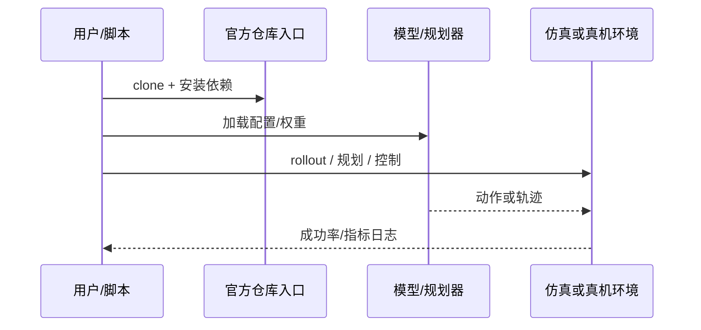

# Rapid Dexterous Pen Writing（arXiv:2609.11775）

**Rapid Dexterous Pen Writing**（[Rapid Learning of Dexterous In-Hand Pen Writing through Real-Time Jacobian Estimation](https://arxiv.org/abs/2609.11775)）来自 [具身智能小站 14 篇盘点](../../sources/blogs/wechat_embodied_station_14_papers_dexterous_wm_humanoid_2026-09-11.md)。ORCA 手在线估计任务 Jacobian，约 18 秒激励后手内写字；无仿真/预收集示范。

## 一句话定义

**不给示范、不做仿真，靠实时 Jacobian 估计让灵巧手在约 18 秒内学会手内写字。**

## 英文缩写速查

| 缩写 | 英文全称 | 简要说明 |
|------|----------|----------|
| VLA | Vision-Language-Action | 视觉-语言-动作策略 |
| VLM | Vision-Language Model | 视觉-语言多模态模型 |
| WM | World Model | 预测未来观测或表征的动力学模型 |
| IL | Imitation Learning | 模仿学习 |
| RL | Reinforcement Learning | 强化学习 |
| DoF | Degrees of Freedom | 自由度 |

## 为什么重要

- 纳入本期 **灵巧手 / 世界模型 / 人形控制 / VLA** 主线之一。
- 开源状态：**已开源**（步骤 2.5 核查，2026-09-11）。
- 与 [14 篇技术地图](../overview/dexterous-wm-humanoid-14-papers-technology-map.md) 中同类工作可横向对照。

## 核心机制

| 项 | 内容 |
|----|------|
| **arXiv** | [2609.11775](https://arxiv.org/abs/2609.11775) |
| **项目页** | https://srl-ethz.github.io/rapid-dexterous-writing/ |
| **代码/资源** | https://github.com/srl-ethz/dexterity_from_jacobian |
| **开源** | **已开源** |
| **文内指标** | 空中与纸面轨迹亚毫米级平面精度。 |

## 源码运行时序图

## 实验与评测

| 项 | 文内口径 |
|----|----------|
| 要点 | 空中与纸面轨迹亚毫米级平面精度。 |

- **读法：** 本页为索引级摘要，上表取自 [公众号盘点](../../sources/blogs/wechat_embodied_station_14_papers_dexterous_wm_humanoid_2026-09-11.md) 与项目页；具体对照方法、任务集与逐项指标以 **原文 PDF** 为准（[参考来源](#参考来源)）。

## 与其他工作对比

- **仿真训练 + sim2real 迁移的手内操作（见 [In-Hand Reorientation](../methods/in-hand-reorientation.md)）** — 依赖手模与接触建模保真度、迁移需随机化；本文 **不做仿真、不收集示范**，靠约 18 秒激励在线估计任务 Jacobian。
- **示范驱动的 [模仿学习](../methods/imitation-learning.md)** — 需先采集手内示范数据；本文把「学习」压缩成一次 **在线系统辨识**，成本换在激励时间而非数据集。
- **[OnOff 可微笔刷书法](./paper-onoff-handwriting.md)** — 同为机器人书写，但 OnOff 的核心是 **可微物理笔刷 + 渲染对齐**（online 轨迹与 offline 图像统一）；本文核心是 **实时 Jacobian 估计** 下的手内笔具操控。
- **[Expressive Robotic Pianist](./paper-expressive-robotic-pianist.md)** — 同属灵巧精细动作，但钢琴一侧靠 **图结构模仿 + 声学模型** 对齐表现力；本文不依赖任何先验示范。
- **[轨迹优化 vs 强化学习](../comparisons/trajectory-opt-vs-rl.md)** — 该页对照模型式与学习式两条路；本文属「在线辨识模型 + 模型式控制」一侧，文内以空中与纸面轨迹 **亚毫米级平面精度** 为口径。

- **读法：** 以上为知识库内 **路线级** 对照；与原文 baseline 的逐项定量比较与消融以 **原文 PDF** 为准（[参考来源](#参考来源)）。

## 结论

**Rapid Dexterous Pen Writing 适合作为本期「已开源」边界下的快速索引页，部署前请核对仓库/README 可运行性。**

1. 核心贡献：不给示范、不做仿真，靠实时 Jacobian 估计让灵巧手在约 18 秒内学会手内写字。
2. 开源结论：**已开源** — 以项目页实际链接为准（入库日 2026-09-11）。
3. 横向对照见 [14 篇技术地图](../overview/dexterous-wm-humanoid-14-papers-technology-map.md)，避免与同 arXiv 重复造页。

## 关联页面

- [14 篇技术地图](../overview/dexterous-wm-humanoid-14-papers-technology-map.md)
- [VLA（Vision-Language-Action）](../methods/vla.md)
- [Generative World Models](../methods/generative-world-models.md)
- [Manipulation](../tasks/manipulation.md)

## 参考来源

- [rapid-dexterous-pen-writing_arxiv_2609_11775.md](../../sources/papers/rapid-dexterous-pen-writing_arxiv_2609_11775.md)
- [wechat 14篇盘点](../../sources/blogs/wechat_embodied_station_14_papers_dexterous_wm_humanoid_2026-09-11.md)
- [arXiv:2609.11775](https://arxiv.org/abs/2609.11775)

## 推荐继续阅读

- [arXiv PDF](https://arxiv.org/pdf/2609.11775)
- [项目页/资源](https://srl-ethz.github.io/rapid-dexterous-writing/)
- [代码/资源](https://github.com/srl-ethz/dexterity_from_jacobian)
