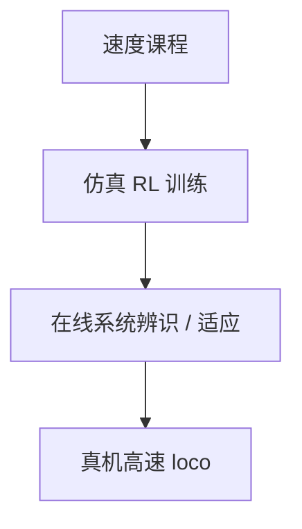
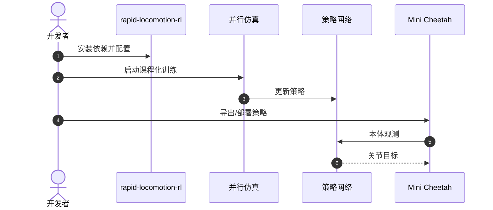

# Rapid Locomotion via Reinforcement Learning

## 一句话定义

**Margolis, Yang, Paigwar, Chen & Agrawal（MIT，[arXiv:2205.02824](https://arxiv.org/abs/2205.02824)）** 训练端到端 RL 控制器，使 **Mini Cheetah** 在草地/冰/砾石等自然地形高速奔跑与转向，持续速度达 **3.9 m/s**；关键是**速度命令自适应课程**与**在线系统辨识式 Sim2Real**。Robot Daycare 清单中的标题为 *Agile Locomotion via Model-free Learning*。

## 英文缩写速查

| 缩写 | 英文全称 | 简要说明 |
|------|----------|----------|
| RL | Reinforcement Learning | 无模型策略学习 |
| Sim2Real | Simulation to Real | 仿真到真机 |
| RMA | Rapid Motor Adaptation | 相关适应/辨识思路先验 |
| CNN | Convolutional Neural Network | 策略网络常见结构语境 |
| PD | Proportional–Derivative | 关节目标跟踪 |

## 为什么重要

- 刷新 Mini Cheetah **野外高速**叙事（相对早期 cMPC ~2.45 m/s 量级）。
- 开源代码 [Improbable-AI/rapid-locomotion-rl](https://github.com/Improbable-AI/rapid-locomotion-rl) 降低复现门槛。
- 展示 model-free 路线在敏捷 loco 上可与模型基栈并存。

## 核心信息

| 项 | 内容 |
|----|------|
| **机构** | 麻省理工（MIT）CSAIL Improbable AI |
| **速度** | 持续至 **3.9 m/s** |
| **项目页** | https://agility.csail.mit.edu/ |
| **开源** | **已开源** |

## 核心原理

1. **Adaptive curriculum on velocity commands：** 按能力提升速度指令难度。
2. **Online system identification：** 借鉴先验适应模块思想，缩小 sim–real 动力学缝。
3. 单一神经网络策略端到端输出，真机部署。

## 源码运行时序图

- **最短路径：** 按仓库 README 完成仿真训练或加载发布配置 → 再进行真机安全部署。

## 工程实践

| 项 | 建议 |
|----|------|
| 课程 | 监控速度指令分位数与跌倒率，避免过早拉满 |
| 适应 | 确认在线辨识模块频率与观测历史长度 |
| 场地 | 冰/砾石测试注意打滑与保护 |

## 评测

| 维度 | 要点 |
|------|------|
| 速度 | 至 3.9 m/s |
| 地形 | 草、冰、砾石等 |
| 扰动 | 报告鲁棒响应 |

## 结论

**总判：** 这是 Mini Cheetah **学习高速 loco** 的开源旗舰论文；与模型基 cMPC/WBIC 对照阅读最有收获。

- 真影响：课程 + 在线辨识带来的野外速度包络。
- 次要代价：训练算力；安全部署成本。
- 部署：优先官方仓库；硬件仍需 Mini Cheetah 或动力学接近的仿制机。

## 与其他工作对比

| 对照对象 | 差异要点 |
|----------|----------|
| 模型基 [WBIC + MPC / cMPC](./paper-wbic-mpc-mini-cheetah.md) 栈 | 本文用端到端 model-free RL 达 3.9 m/s，对照早期 cMPC ~2.45 m/s；展示学习路线可与模型基并存 |
| [Learning to Jump from Pixels](./paper-learning-to-jump-from-pixels.md) | 同组视觉技能线聚焦间断地形跳跃；本文聚焦连续自然地形高速盲走 |
| [并发策略 + 估计](./paper-concurrent-policy-estimator-locomotion.md) | 并发文侧重可学习状态估计；本文侧重速度自适应课程 + 在线系统辨识式 Sim2Real |

## 局限与风险

- 高速失败冲击大。
- 策略对机体参数敏感，换机需重标定/重训。

## 关联页面

- [Learning to Jump from Pixels](./paper-learning-to-jump-from-pixels.md)
- [Concurrent policy+estimator](./paper-concurrent-policy-estimator-locomotion.md)
- [Curriculum learning](../concepts/curriculum-learning.md)
- [Sim2Real](../concepts/sim2real.md)
- [MIT Mini Cheetah](./mit-mini-cheetah.md)

## 参考来源

- [论文归档](../../sources/papers/rapid_locomotion_rl_arxiv_2205_02824.md)
- [代码归档](../../sources/repos/improbable-ai-rapid-locomotion-rl.md)
- [项目页归档](../../sources/sites/agility-csail-mit.md)
- [博文清单](../../sources/blogs/robot_daycare_mini_cheetah_2019.md)

## 推荐继续阅读

- arXiv：<https://arxiv.org/abs/2205.02824>
- 代码：<https://github.com/Improbable-AI/rapid-locomotion-rl>
- 项目页：<https://agility.csail.mit.edu/>
