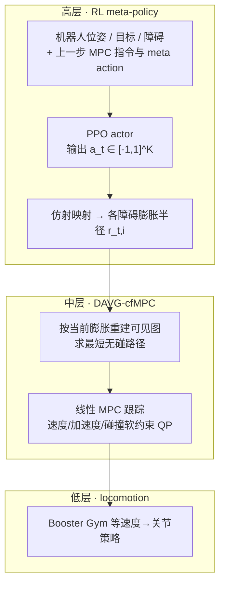

# RAVEN：强化学习自适应可见图规划 + 无碰撞 MPC

**RAVEN**（*Reinforcement-Adaptive Visibility-Graph Planning for Robust Humanoid Navigation with Collision-Free MPC*，[arXiv:2607.15701](https://arxiv.org/abs/2607.15701)，UCLA **RoMeLa**）是面向 **动态环境下人形导航** 的分层框架：高层 **RL meta-policy** 不直接出速度，而是调节 **可见图规划器的障碍膨胀等几何参数**；中层沿用实验室既有 **DAVG + collision-free MPC（cf-MPC）** 生成并跟踪无碰撞轨迹；低层用 locomotion 策略把速度指令落到关节。训练注入 **控制延迟与观测噪声**，真机部署在 **Booster T1**。

## 一句话定义

**用 RL「学会怎么规划」——在线改可见图的障碍膨胀，重塑自由空间拓扑，再交给带硬约束的 cf-MPC 跟踪，从而在延迟与噪声下兼顾路径效率与安全可解释性。**

## 英文缩写速查

| 缩写 | 英文全称 | 简要说明 |
|------|----------|----------|
| RAVEN | Reinforcement-Adaptive Visibility-Graph Planning with Collision-Free MPC | 本文分层导航框架简称 |
| DAVG | Dynamic Augmented Visibility Graph | 动态增广可见图全局路径规划 |
| cf-MPC | Collision-free Model Predictive Control | 带线性化碰撞软约束的凸 QP 跟踪层 |
| PPO | Proximal Policy Optimization | meta-policy 与端到端基线的训练算法 |
| QP | Quadratic Program | cf-MPC 每步求解的凸二次规划 |
| SPS | Steps Per Second | 并行仿真吞吐；RAVEN 受 MPC 求解限制约 10k |

## 核心信息

| 字段 | 内容 |
|------|------|
| **机构** | 加州大学洛杉矶分校（UCLA）RoMeLa |
| **arXiv** | [2607.15701](https://arxiv.org/abs/2607.15701) |
| **平台** | 仿真 + **Booster T1** 真机（半场 RoboCup 场地 + mocap） |
| **底层行走** | 开源 **Booster Gym** locomotion（JIT 嵌入训练环境） |
| **规划频率** | cf-MPC alone ~**120 Hz**；含 RL meta ~**100 Hz** |

## 为什么重要

- **改「几何」而非改「代价矩阵」：** 相对可微 MPC / RL 调 Q 权重，直接调 **障碍膨胀** 能改变最短路径 **拓扑**，对延迟引起的贴障超调是更直观的杠杆。
- **保留可解释约束：** 长视界仍走可见图最短路族；速度、加速度与碰撞由 **cf-MPC** 显式约束——相对端到端 RL 更易安全论证。
- **同实验室导航栈的学习化升级：** [ARTEMIS](./paper-notebook-a-hierarchical-model-based-system-for-high-perfo.md) 已用 **DAVG+cf-MPC** 做人形足球避障；RAVEN 在同一骨干上加 **RL 自适应膨胀**，专门对抗 **延迟与跟踪误差**。
- **混合范式实证：** 0.06 s 延迟下相对固定 MPC **显著降低穿透**，相对纯 RL **更短路径、更快完成**，真机轨迹更贴近仿真。

## 核心原理

### 三层架构

### Meta-policy 机制

| 组件 | 要点 |
|------|------|
| **观测** | 世界/本体坐标系下的机器人与目标位姿、最近 **K** 个障碍位置、上一步 MPC 速度指令与 meta action；默认 **K=3**，actor 维 **15+5K** |
| **动作** | \(a_t\in[-1,1]^K\) → \(r_{t,i}=\frac12(a_{t,i}+1)(r_{\max}-r_{\min})+r_{\min}\) |
| **不对称 critic** | Actor 见延迟/噪声态；Critic 见噪声+干净特权态 |
| **奖励** | 时间/路径惩罚、碰撞与穿透、动作变化率、成功 **+5000**、摔倒 **-50000** |

### 与基线的结构差

| 方法 | 全局规划 | 局部控制 | 学习对象 |
|------|----------|----------|----------|
| **固定 DAVG-cfMPC** | 固定膨胀（文中 1 m） | cf-MPC | 无 |
| **端到端 RL** | 无显式图 | 直接出速度指令 | 整条导航策略 |
| **RAVEN** | **RL 自适应膨胀的可见图** | cf-MPC | **仅规划几何参数** |

## 工程实践

| 维度 | 要点 |
|------|------|
| **仿真栈** | **MuJoCo Playground MJX** + **Brax PPO**；cf-MPC 用 **JAX / JAXopt** 投影梯度，GPU 并行 |
| **吞吐** | RAVEN ~**10k SPS**（MPC 瓶颈）；纯 RL ~**100k SPS**；步数 **1e8** vs **1e9** 对齐训练墙钟 |
| **延迟设定** | 主评测注入 **0.06 s** 驱动延迟 + 观测噪声 |
| **真机** | 外部 **RTX 4050** 跑 RAVEN，**ROS 2** 下发至 T1 机载机；关节环 **500 Hz**、策略 **50 Hz** |
| **评测指标（0.06 s 延迟）** | 路径长：MPC **11.25** / RL **9.80** / RAVEN **9.33** m；最大穿透：MPC **0.128** / RL **0** / RAVEN **0.03** m |

## 实验评测

| 设定 | 相对固定 DAVG-cfMPC | 相对端到端 RL |
|------|---------------------|---------------|
| **无延迟** | 更短路径与更短完成时间 | 路径略短 |
| **0.06 s 延迟** | 穿透 **0.128→0.03 m**，路径 **11.25→9.33 m** | 完成时间更快（**11.58** vs **12.21 s**），穿透略高（**0.03** vs **0**） |
| **真机 T1** | 仿真–真机轨迹一致性接近固定 MPC | 纯 RL 真机侧向振荡更大，sim2real 差距更明显 |

## 与其他工作对比

| 对照 | RAVEN 的差异 |
|------|--------------|
| **固定膨胀 DAVG-cfMPC**（ICRA 2025 前作） | 同一中层骨干；RAVEN 用 RL **在线改膨胀**，专治延迟超调 |
| **端到端导航 RL** | 不黑盒出速度；保留可见图最短路先验与 cf-MPC 硬约束 |
| **可微 / RL 调 MPC 代价权重** | 不反传 QP；只调 **几何参数**，计算更轻、空间行为更直观 |
| **[ARTEMIS](./paper-notebook-a-hierarchical-model-based-system-for-high-perfo.md)** | 同实验室足球全栈用 DAVG-cfMPC 避障；RAVEN 聚焦 **单机导航鲁棒性** 而非群控战术 |

## 源码运行时序图

**不适用。** 截至 2026-07-21 arXiv 正文与摘要 **未提供** 官方代码或项目页；无可运行训练/推理入口。底层 [Booster Gym](./paper-notebook-booster-gym-an-end-to-end-rl-framework-for-human.md) 可单独复现 locomotion，但不包含 RAVEN meta-policy 与 DAVG-cfMPC 全栈。

## 局限与风险

- **开源状态：未开源** — 无 GitHub / 项目页；复现需自行实现 DAVG-cfMPC（参见 ICRA 2025 前作）与 Brax 训练环。
- **静态障碍假设：** 结论写明未来才扩到 **动态障碍**；当前膨胀适应主要服务延迟与跟踪误差，而非移动对手。
- **障碍模型简化：** 规划空间按 **圆形障碍** 处理；复杂非凸几何需额外近似。
- **误区：** 把 RAVEN 当成「可微 MPC」——中层是 **标准非可微 QP**，学习只动高层几何参数，故意避开端到端可微求解开销。

## 关联页面

- [ARTEMIS 人形足球全栈](./paper-notebook-a-hierarchical-model-based-system-for-high-perfo.md) — 同实验室 **DAVG+cf-MPC** 导航骨干与群控语境
- [Booster Gym](./paper-notebook-booster-gym-an-end-to-end-rl-framework-for-human.md) — 真机底层 locomotion 策略来源
- [MPC vs RL](../comparisons/mpc-vs-rl.md) — 「RL 适配规划 / MPC 保约束」选型对照
- [PPO](../methods/ppo.md) — meta-policy 与端到端基线算法
- [Humanoid locomotion](../tasks/humanoid-locomotion.md) — 导航层与行走层解耦任务语境
- [MPC–WBC 集成](../concepts/mpc-wbc-integration.md) — 模型预测层在全身控制栈中的位置

## 参考来源

- [raven_rl_adaptive_visibility_graph_arxiv_2607_15701.md](../../sources/papers/raven_rl_adaptive_visibility_graph_arxiv_2607_15701.md) — arXiv:2607.15701 论文归档
- 论文：<https://arxiv.org/abs/2607.15701>
- Hou et al., *Model predictive control with visibility graphs for humanoid path planning and tracking against adversarial opponents*, ICRA 2025 — DAVG-cfMPC 前作

## 推荐继续阅读

- 论文 HTML：<https://arxiv.org/html/2607.15701>
- [ARTEMIS（arXiv:2512.09431）](https://arxiv.org/abs/2512.09431) — 同实验室分层足球系统中的 DAVG+cf-MPC 用法
- [Booster Gym（arXiv:2506.15132）](https://arxiv.org/abs/2506.15132) — T1 开源端到端 RL locomotion 框架
