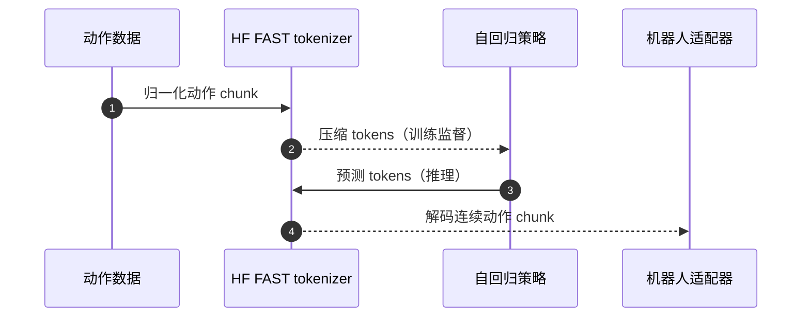

# FAST：高效动作分词

## 一句话定义

FAST 用时间轴离散余弦变换、量化和字节对编码压缩连续动作块，使自回归 VLA 能高效学习高频动作序列。

## 英文缩写速查

| 缩写 | 英文全称 | 简要说明 |
| --- | --- | --- |
| VLA | Vision-Language-Action | 视觉和语言条件下生成动作 |
| DCT | Discrete Cosine Transform | 把时序动作转为频域系数 |
| BPE | Byte Pair Encoding | 合并高频符号序列的分词方式 |

## 为什么重要

- 逐时间步独立离散化会产生很长的 token 序列；时间相关性可以直接用于压缩。
- tokenizer 是可复用的动作表示组件，适合比较自回归动作头与连续 flow 动作头。

## 核心原理

连续动作 chunk → 沿时间轴 DCT → 系数量化 → BPE token → 自回归预测 → 逆变换恢复动作。低频系数聚集平滑运动信息，BPE 再利用符号重复；压缩率与误差取决于动作归一化、采样率和量化配置。

**FAST+** 提供跨机器人数据训练的通用 tokenizer。tokenizer 的泛化不等于策略在新本体上即插即用，控制输出仍须匹配动作维度和语义。

## 源码运行时序图

这里描绘官方 tokenizer 的编码/解码接口；策略训练与真机适配不属于 tokenizer 本身。

## 工程实践

1. 从官方 HF 模型卡加载 tokenizer，先验证自己的动作 chunk 编码→解码重建。
2. 对齐采样率、chunk 长度、归一化与动作顺序，检查重建误差和每个 chunk 的 token 数。
3. 比较闭环成功率与真实时延：训练序列缩短不保证逐 token 生成满足控制预算。
4. 已有 tokenizer 实现与资产；全套策略/机器人接口须另查 [openpi](../methods/π0-policy.md)。

## 评测与指标

对比动作离散化方案时，至少同时记录 **token 数、解码误差、训练收敛与策略成功率、在线生成时延**。这些指标依赖机器人动作频率与任务，本页不把 tokenizer 压缩比当成整机性能提升比例。

## 结论

**FAST 的可操作价值是压缩动作序列，并提供可独立验证的 tokenizer。**

1. 先做动作重建检查，再接自回归策略。
2. 把训练效率与实时执行效率分开评测。
3. 高频灵巧任务须关注量化误差，而非只追求短序列。

## 与其他工作对比

与连续 flow 动作头相比，FAST 优化的是自回归动作序列长度，仍须承担逐 token 生成成本。与 [RTC](paper-real-time-chunking.md) 相比，FAST 处理动作表示，RTC 处理执行中新旧 chunk 的调度；二者可以组合，不能用一项收益替代另一项评测。

## 局限与风险

- 高频接触动作的细节可能受量化与频域截断影响；应检查末端速度、夹爪事件和任务成功率。
- 动作压缩与 [RTC](paper-real-time-chunking.md) 的推理调度处理不同问题。

## 关联页面

- [π₀ / openpi](../methods/π0-policy.md)
- [RTC](./paper-real-time-chunking.md)
- [VLA](../methods/vla.md)

## 参考来源

- [PI 一手资料补核](../../sources/sites/pi-memory-rlt-fast.md)

## 推荐继续阅读

- [官方 tokenizer](https://huggingface.co/physical-intelligence/fast)
- [FAST 论文](https://arxiv.org/abs/2501.09747)
