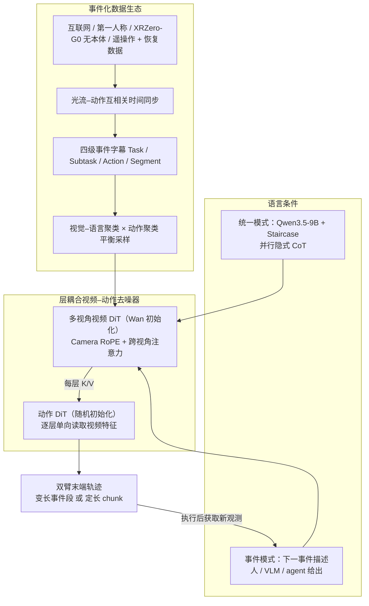
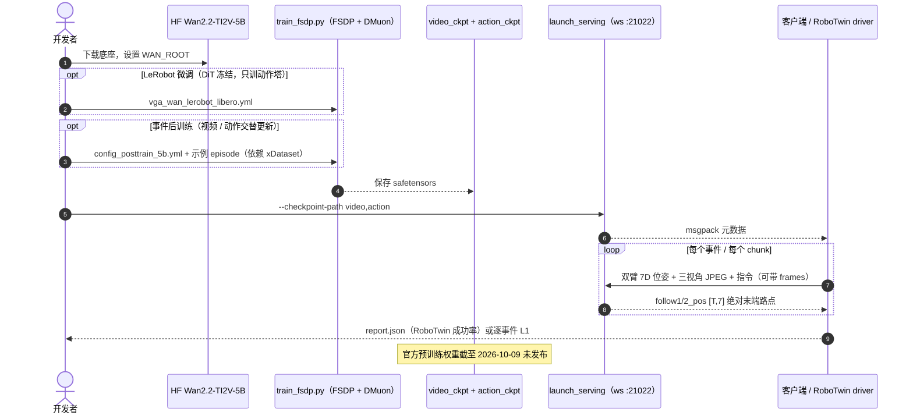

# WALL-WM（以动作事件为单元的世界动作模型）

**WALL-WM**（*WALL-WM: Carving World Action Modeling at the Event Joints*，[arXiv:2606.01955](https://arxiv.org/abs/2606.01955)，[项目页](https://x2robot.com/pages/wm)，[GitHub](https://github.com/X-Square-Robot/wall-wm)）由 **自变量机器人（X Square Robot）** 发布。官网技术报告页日期为 **2026-05-29**，arXiv v1 于 2026-06-01 提交，v2 于 2026-09-06 修订。论文主张不再把语言、视频和动作硬塞进同一个定长预测窗口，而是以 **reach / grasp / lift / place 这类动作语义事件** 为原子单元，对视频和动作做联合去噪预训练。它也收录于 [RCL Awesome WAM 清单](paper-rcl-wam-robot-learning-control-survey.md)（531/564，WAMs 分组）。

## 一句话定义

**这是一个以「语义事件」为切分单元的视频–动作世界模型：Wan 视频 DiT 预测多视角未来，动作 DiT 逐层读取视频特征、生成末端轨迹。事件模式按「下一事件描述」输出变长执行段，统一模式则用 VLM 隐式推理来驱动定长 chunk。**

## 英文缩写速查

| 缩写 | 英文全称 | 简要说明 |
|------|----------|----------|
| WALL-WM | WALL World Model（自变量 WALL 系列） | 本文以事件为单元的世界动作模型 |
| WAM | World Action Model | 把未来观测预测和动作生成显式耦合的具身基础模型 |
| VLA | Vision-Language-Action | 从视觉+语言输入直接预测动作的策略；本文把它当对照范式 |
| DiT | Diffusion Transformer | 视频塔继承自 Wan 的 DiT；动作塔同深度、随机初始化 |
| TI2V / T2V | Text-Image-to-Video / Text-to-Video | 视频塔底座 Wan2.2-TI2V-5B；论文强调要保留 native-T2V 先验 |
| VAE | Variational Autoencoder | Wan 3D 因果 VAE，负责视频时序压缩，全程冻结 |
| RoPE | Rotary Position Embedding | Camera RoPE：给每个相机一个可学习的旋转身份，推理时不需要标定 |
| VI-SA | View-Interaction Self-Attention | 跨视角自注意力分支，消融里被移除的组件 |
| VLM | Vision-Language Model | Qwen3.5-9B，作文本条件器，并输出下一事件描述 |
| CoT | Chain-of-Thought | Staircase 解码一次并行输出连续隐式 CoT 向量 |
| MoT | Mixture-of-Transformers | Staircase 推理分支挂在冻结 VLM 上的轻量结构 |
| UMI | Universal Manipulation Interface | XRZero-G0 无本体穿戴采集装置属于 UMI 式路线 |
| DMuon | Distributed Muon | 适配混合并行的分布式 Muon 优化器实现 |
| DMD | Distribution Matching Distillation | 少步去噪蒸馏，同时保留动作损失 |
| FP8 / PTQ | 8-bit Floating Point / Post-Training Quantization | 按 block 缩放的训练后 FP8 量化，部署提速用 |
| FSDP | Fully Sharded Data Parallel | 开源仓库的统一训练器 |
| OOD | Out-of-Distribution | 视频生成基准里的 50 个分布外任务 |

## 为什么重要

- **它挑战的是 WAM 的默认切分方式。** 主流 WAM / VLA 都在当前观测和全局指令条件下预测定长动作 chunk。论文认为这会造成粒度错配：语言描述的是事件，视觉是连续动力学，动作则在控制频率上运行。三者被塞进同一窗口后，训练容易退化成短程相关拟合，还会用 chunk 捷径覆盖掉预训练的视觉语义先验。
- **它保留了视频底座的先验。** 视频塔保持 Wan 的视图内计算不变，跨视角分支用零初始化投影接入；动作塔只单向读取视频特征，不往视频塔回写。这条路线不是「在 VLM 后面接一个动作头」。
- **同一骨干覆盖两种部署形态。** 事件模式适合交给上游 agent 或 VLM 编排「下一步做什么」；统一模式保留传统定长 chunk 接口，方便和常规 VLA 评测对齐。
- **数据工程写得很具体。** 光流–动作互相关做时间同步，Task / Subtask / Action / Segment 四级事件字幕，视觉–语言与动作双重聚类平衡采样，在接触位姿附近随机初始化来造恢复数据。这几项都可以单独借鉴。
- **它有代码可跑，但有边界。** 训练、推理服务和 RoboTwin 评测代码以 Apache-2.0 开源；截至 2026-10-09 权重和数据尚未发布，论文数字暂时无法复现。

## 核心信息

| 项 | 内容 |
|----|------|
| **机构** | 自变量机器人（X Square Robot），作者署名 *X Square Robot Team* |
| **时间线** | 官网技术报告 2026-05-29；arXiv v1 2026-06-01、v2 2026-09-06；GitHub 开源提交 2026-07-02 |
| **视频塔** | Wan 系列 T2V DiT；实验与 README 使用 **Wan2.2-(TI2V-)5B**，并扩展为多视角 |
| **动作塔** | 与视频塔同深度的动作 DiT，flow matching 去噪双臂末端轨迹（README：20 维 = 两臂各 3 位置 + 6D 旋转 + 1 夹爪） |
| **语言 / 推理** | Qwen3.5-9B VLM 对齐到 T5 特征空间；Staircase 隐式 CoT 由冻结的 Qwen3.5-0.8B 做「隐变量→文本」重建监督 |
| **数据** | 互联网视频（含 120 万片段 OpenVID 子集、HD-VILA）、第一人称视频（Ego4D、EPIC-KITCHENS）、XRZero-G0 无本体穿戴采集、机器人数据（DROID、AgiBot World、自采） |
| **自研本体** | 高性能桌面双臂、QUANTA X1 / X1 Pro 移动平台、带高自由度灵巧手的轮式人形 QUANTA X2 |
| **部署速度** | DMD 少步蒸馏 + FP8 PTQ + CUDA Graph 后，端到端推理 **10 Hz** |
| **开源（2026-10-09）** | 代码 **已开源**（Apache-2.0）；权重 **coming soon**（HF 尚无）；预训练数据 **未发布**，详见 [项目页归档](../../sources/sites/x2robot-wall-wm.md) |

## 核心原理（方法）

### 流程总览

### 1. 事件替代 chunk：先确定「学什么单元」

论文的形式化目标是：给定当前多视角观测（每个相机一帧关键帧）、本体状态和事件字幕，联合去噪 **长度随事件变化** 的未来多视角视频和末端轨迹。事件在动作边界处切分，同一条字幕、同一段视频和同一段动作覆盖同一个物理区间。这样做满足作者提出的三条原则：保持几何结构（不把三种模态压进一个共享空间）、保留先验（贴合 caption→video 的 T2V 归纳偏置）、可执行的因果性（预测目标有清楚的时间支撑，时长由任务决定）。

### 2. 多视角视频塔：从单视角先验扩展而来

- **跨视角分支**：每个 DiT block 在原 Wan 视图内自注意力之后，把同一潜帧上所有相机的 token 拼成一个序列再做自注意力。输出经过 **零初始化投影** 和 AdaLN 门控加回原流，所以训练开始时它完全不起作用。
- **Camera RoPE**：在 RoPE 里加一个视角轴，旋转量来自可学习的每视角嵌入。增删相机只需改嵌入表，推理时不读标定参数。
- **跨视角几何掩码（仅训练时使用）**：*sight-cone* 掩码用每台机器人的内外参判断两个 patch 的视锥是否相交，不相交就禁止它们互相注意；*tube patch* 掩码把某个视角的同一空间窗口在所有潜帧上置为噪声，迫使模型从其他视角恢复内容。主配方保留 sight-cone，tube 默认关闭。

### 3. 动作塔：逐层单向耦合 + 非对称时间步

- 每个动作 block 依次做：动作 token 自注意力 → 对 **单独状态 token** 的交叉注意力（让绝对本体感觉在每一层都能直接访问）→ 对 **同层视频特征**（各视角拼接）的交叉注意力 → 门控 FFN。视频塔不增加任何反向分支。
- **时间对齐**：事件窗口内用共享的帧索引查表，让每组动作 token 偏向对应的潜帧。统一模式的「观测中心窗口」把历史帧、锚帧和未来帧一次送进 3D VAE 编码，动作改用相对锚帧位姿的增量表示。
- **非对称 1-to-N 映射（大规模默认设置）**：视频只在一个固定的中等噪声锚点 \(t^\*\) 上前向一次，动作则跑完整去噪日程，每一步都读这同一份视频 K/V（默认 50 步日程）。作者的理由是：高噪声视频特征不一定对应真实片段，接近干净的特征又没有足够结构来指导控制。

### 4. 语言推理与两种推理模式

- **VLM 文本条件器**：冻结 Qwen3.5-9B 主干，只训练 project-out 头，把隐藏状态对齐到 DiT 原本使用的 T5 特征空间，相当于即插即用替换 T5。另外两个辅助头分别预测 **下一事件描述** 和 **当前事件剩余时间**。
- **Staircase 隐式 CoT**：在中继深度 \(r\) 处切分 Transformer。只有第一个隐变量走完底层共享的视觉–语言计算，其余隐变量从上层并行展开。一次前向就能生成全部连续 CoT 向量，再由冻结的 Qwen3.5-0.8B 把它们重建成文本 CoT 作为监督。
- **事件模式**：每一步由人或 VLM 给出下一事件描述，模型去噪整段变长视频–动作，执行完再观测、再给下一事件。
- **统一模式**：定长 chunk 加可配置的历史窗口，文本侧条件可在三种来源间切换且无需重训：全局指令的连续编码（梯度连续路径）、逐 chunk 的原子指令、Staircase CoT 隐变量。

### 5. 训练阶段（论文表 1）

| 阶段 | 训练部分 | 冻结部分 |
|------|----------|----------|
| ① 视频预训练 | 视频 DiT（含视角注意力） | VAE、T5 |
| ② 动作预训练 | 动作 DiT（含层耦合） | 视频 DiT、VAE、T5 |
| ③ VLM 文本条件器 | project-out 与两个辅助头 | VLM 主干、两个 DiT |
| ④ Staircase 蒸馏 | MoT 推理分支 + 前缀投影 | 其余全部 |
| ⑤ Next-chunk 适配（可选） | 两个 DiT | VAE、T5、VLM |

事件模式只需要 ①–④。视频预训练按事件长度调整字幕丢弃概率：丢弃字幕时退化为只看观测的未来合成。准静止帧会被剪掉，让监督集中在末端有明显运动的片段。

## 源码运行时序图

官方仓 [X-Square-Robot/wall-wm](https://github.com/X-Square-Robot/wall-wm) 的入口：`wall_wm/trainer/fsdp_trainer/train_fsdp.py`（训练）、`wall_wm._vendor.harrix.serving.launch_serving`（WebSocket 推理服务），以及 `scripts/infer_robotwin/`、`scripts/infer_openloop/`（评测）。

- **最短核对路径**：装好环境与 Wan 底座，用自己训练的 (video, action) 检查点启动服务，再用 `run_openloop_event.sh` 回放随仓示例 episode，按事件计算 L1。
- **复现缺口**：LIBERO 微调配置要求从「WALL-WM 视频预训练检查点」初始化，而这个检查点官方没有发布。推测：现阶段只能从 Wan 底座自己训练，论文里的数字无法直接核对。

## 工程实践

| 项 | 建议 |
|----|------|
| **接口** | 服务端输入是两臂 `[x,y,z,roll,pitch,yaw,gripper]` 绝对位姿和三视角（face / left / right）图像，输出是 `[T,7]` 绝对末端路点。欧拉角→6D、增量→绝对的转换都在服务端完成 |
| **事件长度** | 事件模式下每次请求可传 `frames`，模型预测 \(T=(\text{frames}-1)\times\text{skip\_interval}\) 步；训练分辨率 192×224，`skip_interval: 2` |
| **两种微调方式** | 只训动作塔（LeRobot / LIBERO，DiT 冻结）；或视频与动作交替更新的事件后训练（`vga_post_training: true`）。数据少、任务固定时，前者更省 |
| **自采数据** | 先做视频–动作时间同步：论文举例 20 FPS 下 2 帧偏差约 100 ms。同步结果弱或不一致的 episode 应隔离或降权，不要直接用 |
| **事件字幕** | 先在动作边界切分，再写字幕；只给整条轨迹一句话，会把重抓、纠偏这类恢复行为平均掉 |
| **采样** | 视觉–语言聚类和动作聚类都离线算好，dataloader 只读聚类标签，不增加训练开销 |
| **延迟** | 论文用 DMD + FP8 + CUDA Graph 达到 10 Hz；推测：开源仓库只有 FP8 训练开关，部署侧压缩需要自己实现 |
| **何时用统一模式** | 作者自己承认：任务少、指令固定、不需要 OOD 泛化、数据稀缺时，定长推理可能更快收敛到局部最优 |

## 实验与评测

### 具身视频生成（WorldArena 协议；200 ID + 50 OOD 任务）

| 模型 | 图像质量 | 动态程度 | 运动平滑 | 语义对齐 | 交互质量 | 指令跟随 | 轨迹准确 |
|------|---------|---------|---------|---------|---------|---------|---------|
| Wan2.1-1.3B | **0.577** | 0.199 | 0.619 | 0.857 | 0.219 | 0.308 | 0.214 |
| Wan2.2-5B | 0.527 | 0.418 | 0.683 | 0.805 | 0.226 | 0.298 | 0.223 |
| **WALL-WM** | 0.503 | **0.484** | **0.771** | **0.886** | **0.434** | **0.391** | **0.234** |

交互质量相对 Wan2.2-5B 接近翻倍，但 **图像质量反而最低**：具身训练换来的是物理与交互先验，不是画面美观。CO3Dv2 3D 探针上，WALL-WM 的 Point Err **0.271**、Depth Err **0.132**、AUC@5 **0.210** 均为最优，AUC@30 为 0.727，略低于 Wan2.1-14B 的 0.736。

### 真机（自研桌面双臂；Task Progress 0–100）

| 套件 | π0.5 | LingBot-VA | DreamZero | WALL-WM-U-Scratch | **WALL-WM-E（事件模式）** |
|------|------|-----------|-----------|-------------------|--------------------------|
| Diverse（7 任务） | 55.64 | 29.71 | 39.97 | 63.00 | **75.86** |
| Reasoning（5 任务） | 56.40 | 31.60 | 32.70 | 59.50 | **71.60** |
| Dexterous（2 任务） | 15.00 | 24.00 | 25.00 | 31.25 | **32.00** |
| Generalization（4 任务） | 24.00 | — | 28.50 | 18.50 | **53.75** |

- 官网把四套件平均汇总为 **58.30**（π0.5 37.76 / DreamZero 31.54），标签写作 *Core15*。按论文表 6 实际计分任务是 7+5+2+4=18 个，标签和任务数对不上，以论文表为准。
- 单任务上并非全胜：*Pair Up Items* 上 π0.5 得 77、WALL-WM-E 只有 36；*Put Stationery in Case* 上 DreamZero 领先；*Cover Pot with Lid* 上 U-Scratch 领先。
- **U-Scratch** 指不做事件预训练、直接在相同真机数据上训练的定长基线（不是统一推理模式）。事件模式在 Diverse 上领先它 12.86 分，在 Dexterous 上只差 0.75 分，说明精细接触主要受低层位姿精度限制。

### 消融：事件执行 + 跨视角注意力

| 套件 | 预训练基线（无 VI-SA、定长统一解码） | 事件模式 |
|------|-----------------------------------|---------|
| Reasoning | 32.6 | **71.6**（*Press Button in Order* 0 → 64） |
| Generalization | 22.0 | **53.75** |

作者注明这两个变量是一起改的，只能读作两者的联合贡献。

### RoboTwin 零样本（附录）

预训练模型不做任务微调，50 任务 × 10 回合：平均成功率 **15.2%**（76/500），26 个任务至少成功一次。*click_bell* 90%、*press_stapler* 80%、*click_alarmclock* 60%。

### 系统指标

DMD 蒸馏如果去掉保留的动作损失，动作 MAE 恶化 **53%**；整套压缩之后端到端 **10 Hz**。论文提到模型家族覆盖 10B 以下到数百亿参数，规模越大，精度和 OOD 泛化越好，但没有给出分规模的数字。

## 结论

**WALL-WM 真正可借鉴的是「对齐单元」这个选择：让语言、视频、动作在同一段物理事件上互相监督。真机上的大幅领先有一部分来自平台和数据同源，读数字时要打折。**

1. **先确定切分单元，再谈融合** — 定长 chunk 可能切断一个语义动作，也可能把几个动作并进一个目标。按动作边界切分并逐段写字幕，是整条数据管线的前提。
2. **保护先验靠结构，不靠正则** — 零初始化跨视角分支、单向逐层耦合、动作阶段冻结视频塔、VLM 对齐到 T5 空间，四处都在避免底座被动作捷径覆盖。
3. **非对称时间步是关键的工程选择** — 视频只在中等噪声锚点前向一次，动作跑完整日程；这既省算力，又给动作提供结构合适的视觉证据。
4. **收益集中在语义与泛化，精细接触提升有限** — Reasoning 和 Generalization 两个套件差距最大；Dexterous 的绝对分只有 32，和从零训练的基线基本持平。
5. **视频指标要分维度看** — 交互、轨迹、语义维度上涨，图像质量下降；它是物理先验，不是画质更好的生成器。
6. **开源只到代码层** — Apache-2.0 训练和推理栈可以读、可以跑；截至 2026-10-09 没有权重和数据，Staircase、DMD 和部署端 FP8 也大概率不在仓库里（推测）。

## 与其他工作对比

| 对比轴 | WALL-WM | [LingBot-VA](./paper-sa-2601-21998-lingbot-va-causal-video-action-world-model-for-g.md) / [DreamZero](./paper-notebook-dreamzero-world-action-models-are-zero-shot-poli.md) | [π0.5](./paper-pi05-open-world-vla.md) | [Fast-WAM](./paper-fast-wam.md) |
|--------|---------|----------------------------|------|----------|
| **预测单元** | 变长语义事件（事件模式）/ 定长 chunk（统一模式） | 定长未来；用 KV-cache 流式衔接 chunk（据 WALL-WM §9.4 的描述） | 定长动作 chunk | —（WALL-WM 引用它作「测试时不解码视频」的提效路线） |
| **未来视频** | 联合去噪多视角未来 | 联合建模视频与动作 | 不显式预测 | 测试时避免显式视频解码 |
| **语言接口** | 下一事件描述 / Staircase 隐式 CoT | 全局指令 | VLM 指令 | — |
| **本文真机均分** | **58.30** | LingBot-VA 缺 Generalization；DreamZero 31.54 | 37.76 | 未参评 |

- **为什么 KV-cache 不够**：论文附录认为，LingBot-VA、DreamZero 一类的流式缓存能保留历史、缓解一部分对齐漂移，但训练和推理仍然生成「锚点后固定帧数」，不会停在指令语义的终点。事件模式正是针对这一点。
- **同公司谱系**：[WALL-OSS / wall-x](./cn-os-wall-x.md) 是自变量的 VLA 基础模型仓；[WALL-SS](./paper-wall-ss.md)（2026-08）是用于策略评估的下一尺度自回归像素世界模型，其虚实闭环用的策略检查点就来自 WALL-WM 家族；[HOST](./paper-host-one-shot-human-video.md) 是同公司参与的单视频技能习得工作。
- 与 [Muon](./paper-muon-scalable-llm-training.md) 的关系：WALL-WM 的 DMuon 是工程化的分布式实现（LPT 归属分配、异步广播、对称 Gram kernel），不改 Muon 算法本身。

## 局限与风险

- **评测平台和数据同源** — 论文第 8 节自己承认：真机评测在自研平台上进行，WALL-WM 又在该平台的数据上做了大规模预训练；对比的 LingBot-VA、DreamZero 调参投入也不对等。领先幅度不能直接外推到其他本体。
- **指标口径** — 主指标是按任务规则打的稠密 Task Progress，不是二值成功率；唯一的二值指标是 RoboTwin 零样本 15.2%。
- **依赖标注** — 事件边界目前靠大规模时间对齐和细粒度字幕提供；论文把「自监督发现事件边界」列为未来工作。
- **复现边界** — 截至 2026-10-09 没有官方权重和预训练数据；官网 GitHub 按钮还指向 wall-x 而不是 wall-wm，引用时注意区分。
- **动作空间** — 开源接口是双臂末端 7D + 夹爪（训练用 20 维）；论文提到 QUANTA X2 灵巧手平台的数据，但真机评测只在桌面双臂上做，多指灵巧手的控制效果没有验证。
- **README 与论文措辞不一致** — README 把 *Staircase Decoding* 描述为「动作日程映射到视频中等噪声锚点」，论文 §3.4 中的 Staircase 指 VLM 隐式 CoT 的并行解码，锚点映射属于 §3.3 的非对称时间步。本页以论文为准。

## 关联页面

- [World Action Models（WAM）](../concepts/world-action-models.md) — 概念总览
- [Generative World Models](../methods/generative-world-models.md) — 生成式世界模型谱系
- [VLA](../methods/vla.md) — 定长 chunk 范式的对照
- [Video-as-Simulation](../concepts/video-as-simulation.md) — 以视频先验作为物理先验
- [LingBot-VA](./paper-sa-2601-21998-lingbot-va-causal-video-action-world-model-for-g.md) — 真机基线，KV-cache 流式 WAM
- [DreamZero](./paper-notebook-dreamzero-world-action-models-are-zero-shot-poli.md) — 真机基线
- [π0.5](./paper-pi05-open-world-vla.md) — 真机 VLA 基线
- [Fast-WAM](./paper-fast-wam.md) — 测试时跳过视频解码的提效路线
- [RoboTwin](./robotwin.md) — 附录零样本评测基准，也是开源评测入口
- [Muon](./paper-muon-scalable-llm-training.md) — DMuon 的算法来源
- [WALL-SS](./paper-wall-ss.md) — 同公司长程世界模型，用 WALL-WM 家族策略做虚实校准
- [WALL-OSS / wall-x](./cn-os-wall-x.md) — 同公司 VLA 基础模型仓
- [HOST](./paper-host-one-shot-human-video.md) — 同公司参与的单视频技能习得
- [Manipulation](../tasks/manipulation.md)
- 列表与地图：[Awesome World-Action Models（RCL）](paper-rcl-wam-robot-learning-control-survey.md)、[RCL Awesome WAM 技术地图](../overview/rcl-awesome-wam-technology-map.md)
- 国内开源索引：[国内具身开源全景技术地图](../overview/china-domestic-embodied-opensource-76-companies-technology-map.md)、[424 项覆盖索引](../queries/china-domestic-opensource-424-coverage.md)、[HMI 开源项目主表导读](../queries/hmi-opensource-projects-coverage.md)、[Humanoid Motion Intelligence](../entities/humanoid-motion-intelligence.md)、[Locomotion](../tasks/locomotion.md)

## 参考来源

- [WALL-WM 项目页归档（含 2026-10-09 开源核查）](../../sources/sites/x2robot-wall-wm.md)
- [WALL-WM 源码归档](../../sources/repos/wall-wm.md)（<https://github.com/X-Square-Robot/wall-wm>）
- [RCL 清单条目摘录](../../sources/papers/rcl_awesome_wam_2606_01955_wall-wm-carving-world-action-modeling-at.md) · [RCL 列表总表](../../sources/papers/rcl_awesome_wam_catalog.md) · [RCL 仓库归档](../../sources/repos/awesome-world-action-models-rcl.md)
- [国内具身智能开源全景（微信公众号）](../../sources/blogs/wechat_embodied_station_domestic_opensource_panorama_2026-09-06.md)
- 论文：<https://arxiv.org/abs/2606.01955>（HTML v2：<https://arxiv.org/html/2606.01955>）

## 推荐继续阅读

- 项目页 — <https://x2robot.com/pages/wm>
- 技术报告 PDF（官网）— <https://x2robot.com/api/files/file/WALL-WM.pdf>
- GitHub README — <https://github.com/X-Square-Robot/wall-wm>
- Wan2.2-TI2V-5B 底座 — <https://huggingface.co/Wan-AI/Wan2.2-TI2V-5B>
- [Awesome World-Action Models (RCL) 仓库](https://github.com/rcl-robotics/Awesome-World-Action-Models)
