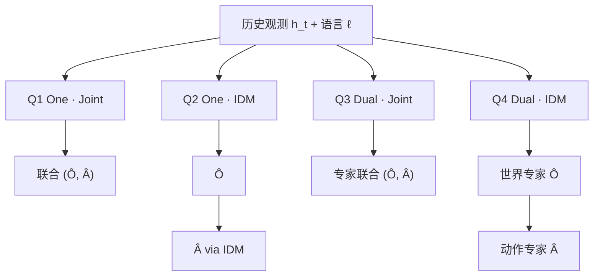
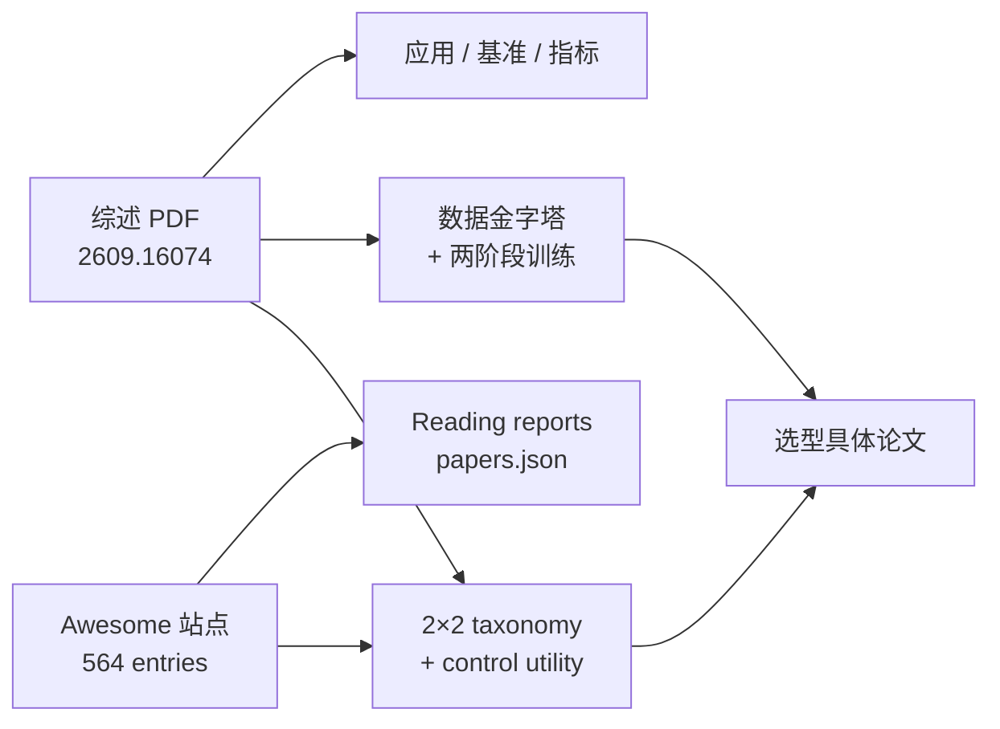
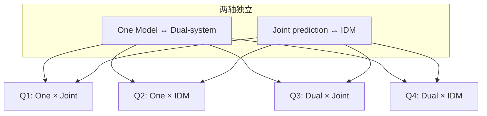

# World-Action Models for Robot Learning and Control: A Survey

**World-Action Models for Robot Learning and Control: A Survey**（[arXiv:2609.16074](https://arxiv.org/abs/2609.16074)，2026-09-25；[项目页](https://rcl-robotics.github.io/Awesome-World-Action-Models/)，[Awesome 仓库](https://github.com/RCL-Robotics/Awesome-World-Action-Models)）由 **MBZUAI RCL Robotics** 牵头，系统整理 **机器人学习与控制** 语境下的 **World-Action Models（WAM）**：在部分可观测与物理约束下，把 **未来世界预测** 与 **可执行动作生成** 放进 **同一学习/推理过程**，并给出 **架构 taxonomy、训练数据组织、应用域与评测协议** 的统一读法。

## 一句话定义

**用 control utility（动作接地、时空一致、闭环改进、实时预算）定义 WAM，并以 One/Dual × Joint/IDM 四象限 + 数据金字塔 + 预训练→后训练，把「预测后果如何 inform 动作」从 VLA、纯世界模型与 MBRL 里单独拎出来讲清楚。**

## 英文缩写速查

| 缩写 | 英文全称 | 简要说明 |
|------|----------|----------|
| WAM | World-Action Model | 未来观测/状态预测与动作生成在同一策略框架内耦合 |
| VLA | Vision-Language-Action | 常见 \(p(a \mid o, l)\) 反应式语义策略 |
| WM | World Model | \(p(o' \mid o, a)\) 环境前向预测，策略可外接 |
| IDM | Inverse Dynamics Model | 先规划/预测未来再反推动作的 plan-then-act 接口 |
| MBRL | Model-Based Reinforcement Learning | 经典「动力学模型 + 规划/策略」分解范式 |
| Q1–Q4 | Architecture quadrants | One/Dual-system × Joint/IDM 的站点浏览键 |

## 为什么重要

- **机器人导向的 WAM 判据**：强调 **动作是否可执行、时空是否自洽、闭环能否改进、是否满足实时预算** — 避免只用视频保真度或单点成功率评价 WAM。
- **比 Cascaded/Joint 更细的 2×2 架构轴**：**One Model vs Dual-system** 与 **Joint prediction vs IDM** 解耦，形成 **Q1–Q4**；**Joint training  alone 不决定 One Model**，部分 IDM 推理时不滚完整未来。
- **工程路径可落地**：**三类数据金字塔**（互联网/第三视角视频、第一视角人类演示、具身轨迹）+ **预训练（视频自监督 + 动作表征）→ 后训练（微调 / 世界模型增广 / 神经仿真 RL）** 与站内 [π0.5](../methods/pi07-policy.md)、EgoScale 类 VLA 扩展对照。

## 核心信息

| 字段 | 内容 |
|------|------|
| **机构** | Mohamed bin Zayed University of Artificial Intelligence（MBZUAI，RCL Robotics；通讯 Xingxing Zuo 等） |
| **类型** | Survey（机器人学习与 **控制** 向 WAM） |
| **arXiv** | [2609.16074](https://arxiv.org/abs/2609.16074)（v1 2026-09-25） |
| **项目页** | [Awesome World-Action Models 站点](https://rcl-robotics.github.io/Awesome-World-Action-Models/) |
| **开源** | **策展与站点已开源**（MIT，[RCL-Robotics/Awesome-World-Action-Models](https://github.com/RCL-Robotics/Awesome-World-Action-Models)）；综述 PDF 见 arXiv，**非**单篇方法的训练代码仓库 |

## 核心机制

### 统一对象与相邻范式分界

历史观测 \(h_t\) 与语言 \(\ell\) 条件下，WAM 可写成联合或分步产生未来观测块 \(\mathbf{O}\) 与动作块 \(\mathbf{A}\)：

\[
(\widehat{\mathbf{O}}, \widehat{\mathbf{A}}) = f_{\mathrm{WAM}}(h_t, \ell)
\]

| 范式 | 典型对象 | 与 WAM 的分界 |
|------|-----------|----------------|
| **VLA** | \(p(a \mid o, l)\) | 反应式映射；多数不显式滚未来物理状态 |
| **World model** | \(p(o' \mid o, a)\) | 预测演化；策略/planner 常外接 |
| **Action-conditioned video** | 动作条件视频生成 | 未必构成闭环可部署策略 |
| **WAM** | \(p(o', a \mid o, l)\) 或等价分解 | **预测后果 inform 动作**；端到端策略的一部分 |

### 架构 taxonomy（2×2）

|  | **Joint prediction** | **IDM** |
|--|----------------------|---------|
| **One Model** | Q1：共享骨干联合出未来与动作 | Q2：共享骨干，先规划未来再 IDM |
| **Dual-system** | Q3：世界/动作专家分离，联合预测 | Q4：双专家 + plan-then-act |

### 训练与数据（金字塔 + 两阶段）

| 数据层 | 监督侧重 | 典型用途 |
|--------|----------|----------|
| 互联网 / 第三视角视频 | 画面时序自监督 | 物体运动、接触后果（无机器人标签） |
| 第一视角人类演示 | 手–物交互；可选姿态 | 意图与相对运动先验 |
| 具身轨迹 | 观测–动作–结果配对 | 动作接地、闭环微调与 RL |

**预训练** 学时空变化与（潜在）动作表征，并用前向/逆动力学或联合生成绑定「预期变化」与「控制信号」。**后训练** 适配目标机器人、用世界模型增广轨迹，或在 **神经仿真** 里 RL — 需 **真机反馈** 校验，避免策略 exploit 过于乐观 rollouts。

### 应用与 open challenges

- **应用域**：操纵、导航、自动驾驶 — 预测角色分 **表征学习、推理期 look-ahead、合成轨迹改进** 三类。
- **开放挑战**：动作对齐、世界–动作因子分解、空间/多视角一致、长程记忆、神经仿真闭环策略学习、高效推理。

## 流程总览（读者路径）

## 工程实践

| 项 | 说明 |
|----|------|
| **读综述顺序** | 先 **分界表 + 2×2**，再 **数据/训练**，最后 **应用与评测**；中文串读见 [具身智能之心导读（2026-09-25）](../../sources/blogs/wechat_embodied_heart_rcl_wam_survey_2026-09-25.md) |
| **查论文** | 站点四象限筛选 → 条目跳转 arXiv；批量坐标见 [RCL Awesome WAM 技术地图](../overview/rcl-awesome-wam-technology-map.md) |
| **与 OpenMOSS 对照** | [2605.12090 清单索引](./paper-rcl-2605-12090-world-action-models-the-next-frontier-in-embodie.md) 偏 **Cascaded/Joint** 主线；本综述 **加 Dual/IDM 轴与机器人 control 议题** |
| **源码运行时序图** | **不适用** — 官方开源为 **Awesome 策展与静态站模板**，无可运行的 WAM 训练/推理入口 |

## 局限与风险

- **综述 vs 清单规模**：导读常写「近 300 篇」指综述梳理规模；Awesome **564 entries** 含 VLA/数据/基准分册，**勿混为一谈**。
- **IDM 与 Joint 的推理差异**：训练目标 Joint 不等于部署时显式滚完整未来像素；读具体论文需核对 **推理路径与延迟**。
- **神经仿真 RL**：世界 rollouts 乐观会导致真机 exploit；后训练增益必须以 **闭环指标** 验证。

## 评测与指标

- 专节讨论 **数据集、基准、指标与协议**；强调 **世界侧与策略侧联合评价**，而非孤立视频 FVD 或单任务 SR。
- 具体数值与 benchmark 表以 **PDF 与项目页** 为准；本页不搬运完整实验表。

## 与其他工作对比

| 资源 | arXiv | 侧重 |
|------|-------|------|
| **本综述（RCL）** | [2609.16074](https://arxiv.org/abs/2609.16074) | 机器人 control utility、2×2、数据金字塔、操纵/导航/驾驶 |
| **OpenMOSS WAM 综述** | [2605.12090](https://arxiv.org/abs/2605.12090) | Cascaded/Joint 族谱与 embodied AI 前沿叙事 |
| **Sun et al. WAM survey** | [2606.20781](https://arxiv.org/abs/2606.20781) | WM / 视频生成 / VLA / WAM 边界（见 [Awesome World Models](./awesome-world-models.md) 分组） |
| **具身数据金字塔** | [2607.24744](https://arxiv.org/abs/2607.24744) | **数据配方** 视角五层金字塔（与本文数据节互补） |

## 结论

**这是目前站内最完整的「机器人向 WAM」综述锚点：用 control utility 和 Q1–Q4 读架构，用数据金字塔读后训练，用 Awesome 564 条做证据化检索。**

- 选型时 **先定接口轴（Joint vs IDM）再定架构轴（One vs Dual）**，不要只看「有没有 world-model loss」。
- 数据上 **action-free 视频 ≠ 可部署策略**；具身轨迹与真机闭环是动作接地与评测的最后一公里。
- 与 OpenMOSS 2605.12090 **并列阅读**：一个偏 **Cascaded/Joint 主线**，一个偏 **机器人 control + 四象限 + 评测协议**。
- 工程落地请下钻到具体 WAM 论文实体；本页 **不替代 PDF** 中的公式与完整 benchmark 表。
- 开源边界：**策展仓库已开源**；复现某篇 WAM 方法须跟各自论文代码链，而非本 Awesome 仓。

## 源码运行时序图

**不适用**（配套仓库是论文、阅读报告和 `papers.json` 的策展资料库，不是本综述提出的机器人策略训练/推理实现；资料使用流程见本页核心结构与工程实践）。

## 项目资源与工程补充

### 核心结构（怎么读）

#### 架构四象限

站点提供各象限 **交互筛选**；联合训练 alone 不等价于 One Model。

#### 八大类（截至 2026-09-13）

| 类别 | 侧重 |
|------|------|
| Foundational work | 2026 前世界模型、MBRL、规划与理论 |
| VLA | 视觉–语言–动作策略与学习方法 |
| WAMs | 世界预测与动作生成耦合的完整系统 |
| Datasets | 演示、交互、视频与多模态资源 |
| Evaluation metrics | 预测质量、动作一致性与控制表现 |
| Benchmarks & simulators | 任务、环境与仿真平台 |
| Components of WAMs | 编码器、生成骨干、tokenizer、动作头 |
| Related resources | 相关综述、运行时与表征研究 |

#### 推荐浏览路径

1. 站内 [RCL Awesome WAM 技术地图](../overview/rcl-awesome-wam-technology-map.md) — **564** 条逐篇独立 detail 节点（arXiv 去重链 canonical 页）
2. [Research map](https://rcl-robotics.github.io/Awesome-World-Action-Models/map/) — 视觉化类别与架构
3. [Paper library](https://rcl-robotics.github.io/Awesome-World-Action-Models/papers/) — 多维筛选
4. [Reading reports](https://rcl-robotics.github.io/Awesome-World-Action-Models/reports/) — 单篇 evidence 解读
5. 站内概念页 [WAM](../concepts/world-action-models.md) — 与实例论文实体交叉阅读

### 中文导读（具身智能之心，2026-09-25）

[近 300 篇工作调研 · WAM 训练策略](../../sources/blogs/wechat_embodied_heart_rcl_wam_survey_2026-09-25.md) 用中文串读综述主线：**WM/VLA/WAM 分界**、**π0.5 / EgoScale** 两类 VLA 扩展、**三类数据金字塔**、**预训练（视频自监督 + 动作表征）→ 后训练（微调 / 增广 / 神经仿真 RL）**，并与本站 Q1–Q4 架构轴对照。文内「近 300 篇」指综述梳理规模；本清单 **564 entries** 含 VLA/数据/基准分册，宜并列使用。

### 局限与使用注意

- **综述 PDF**：正式编号 [arXiv:2609.16074](https://arxiv.org/abs/2609.16074)；引用以 PDF 与项目页为准。
- **清单滞后**：awesome 依赖维护者更新；关键结论以原文与官方仓为准。
- **非可运行栈**：MIT 许可的是站点/策展工具链，不含训练代码。
- **与 OpenMOSS 分工**：2605.12090 配套 [Awesome-WAM](../../sources/repos/awesome-wam-openmoss.md) 更早建立 Cascaded/Joint 叙事；本清单 **条目更多、架构轴更细**，宜并列使用而非互相替代。

## 关联页面

- [World Action Models（WAM）](../concepts/world-action-models.md)
- [WAM 纵深路线](../../roadmap/depth-wam.md)
- [VLA](../methods/vla.md)

- [RCL Awesome WAM 技术地图](../overview/rcl-awesome-wam-technology-map.md) — PAPERS.md 全量站内索引
- [Awesome World Models](./awesome-world-models.md) — WM 全谱策展
- [VLA](../methods/vla.md) · [Generative World Models](../methods/generative-world-models.md) · [Model-Based RL](../methods/model-based-rl.md)
- [机器人世界模型训练闭环](../overview/robot-world-models-training-loop-taxonomy.md)
- [动作后果技术地图](../overview/robot-world-models-action-consequence-technology-map.md)

- [paper-rcl-2605-12090-world-action-models-the-next-frontier-in-embodie](../entities/paper-rcl-2605-12090-world-action-models-the-next-frontier-in-embodie.md)
- [paper-data-pyramid-embodied-manipulation](../entities/paper-data-pyramid-embodied-manipulation.md)

## 参考来源

- [RCL WAM 综述摘录（arXiv:2609.16074）](../../sources/papers/rcl_wam_robot_learning_survey.md)
- [Awesome 项目页归档](../../sources/sites/awesome-world-action-models-rcl.md)
- [Awesome 仓库索引](../../sources/repos/awesome-world-action-models-rcl.md)
- [具身智能之心 · WAM 训练策略导读（2026-09-25）](../../sources/blogs/wechat_embodied_heart_rcl_wam_survey_2026-09-25.md)

- [sources/papers/rcl_awesome_wam_catalog.md](../../sources/papers/rcl_awesome_wam_catalog.md) — PAPERS.md / papers.json 解析目录

## 推荐继续阅读

- 综述 PDF：<https://arxiv.org/abs/2609.16074>
- 交互索引：<https://rcl-robotics.github.io/Awesome-World-Action-Models/>
- GitHub：<https://github.com/RCL-Robotics/Awesome-World-Action-Models>

- [项目主页](https://rcl-robotics.github.io/Awesome-World-Action-Models/)
- [GitHub 仓库 README](https://github.com/rcl-robotics/Awesome-World-Action-Models)
- [OpenMOSS Awesome-WAM](https://github.com/OpenMOSS/Awesome-WAM) — Cascaded/Joint 专题对照
- Wang et al., *World Action Models: The Next Frontier in Embodied AI* — [arXiv:2605.12090](https://arxiv.org/abs/2605.12090)
