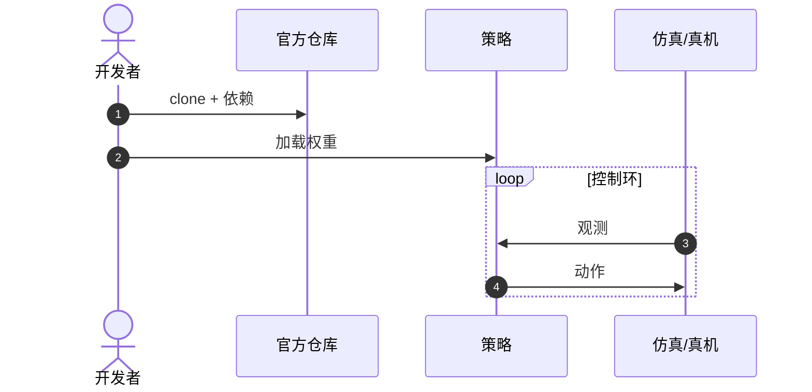

# RDT-1B（Robotics Diffusion Transformer）

**RDT-1B（Robotics Diffusion Transformer）**（[arXiv:2410.07864](https://arxiv.org/abs/2410.07864)，[代码](https://github.com/thu-ml/RoboticsDiffusionTransformer)）收录于 Lumina [Embodied-AI-Guide 微信专辑](../../wiki/overview/embodied-ai-guide-wechat-album-curator.md)。本页为独立详情节点；实验数字以原文为准。

## 一句话定义

**十亿级扩散 Transformer 面向双臂操作。**

## 英文缩写速查

| 缩写 | 英文全称 | 简要说明 |
|------|----------|----------|
| VLA | Vision-Language-Action | 视觉–语言–动作策略 |
| LLM | Large Language Model | 大语言模型 |
| IL | Imitation Learning | 模仿学习 |
| BC | Behavior Cloning | 行为克隆 |

## 核心信息

| 项 | 内容 |
|----|------|
| **机构** | 清华大学（THU） |
| **arXiv** | [2410.07864](https://arxiv.org/abs/2410.07864) |
| **开源** | **已开源** |

## 结论

RDT-1B 把扩散+Transformer+双臂推到基础模型尺度。

- 双臂数据配方是上限
- 官方仓含训练脚本
- 与 ACT/DP 小模型对照 scaling

## 源码运行时序图

官方仓库提供训练/推理入口；节点对齐 README。

## 关联页面

- [paper-pi0](./paper-pi0.md)
- [paper-cogact](./paper-cogact.md)
- [bimanual-manipulation](../tasks/bimanual-manipulation.md)

## 参考来源

- [wechat_lumina_vla_survey_part1_2026-09-20.md](../../sources/blogs/wechat_lumina_vla_survey_part1_2026-09-20.md)

## 推荐继续阅读

- [arXiv:2410.07864](https://arxiv.org/abs/2410.07864)
