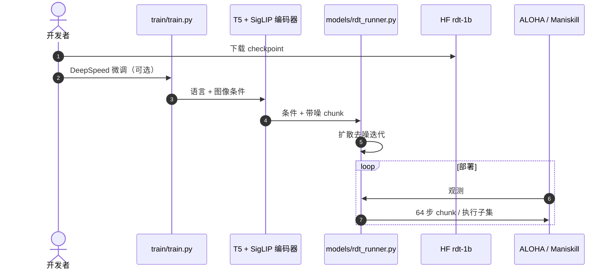

# RDT-1B（Robotics Diffusion Transformer）

**RDT-1B**（*a Diffusion Foundation Model for Bimanual Manipulation*，[arXiv:2410.07864](https://arxiv.org/abs/2410.07864)，[项目页](https://rdt-robotics.github.io/rdt-robotics/)，[代码](https://github.com/thu-ml/RoboticsDiffusionTransformer)，[HF rdt-1b](https://huggingface.co/robotics-diffusion-transformer/rdt-1b)）由 **清华大学** 等提出。阅读顺序见 [扩散 → DiT → Flow 纵深路线](../../roadmap/depth-robotics-diffusion-dit-flow.md) 第 ③ 步。

## 一句话定义

**在统一 action 空间里，用 1.2B 扩散 Transformer 对语言+多相机+本体条件去噪出未来 64 步动作 chunk。**

## 英文缩写速查

| 缩写 | 英文全称 | 简要说明 |
|------|----------|----------|
| RDT | Robotics Diffusion Transformer | 本文基础模型族 |
| VLA | Vision-Language-Action | 视觉–语言–动作策略 |
| DP | Diffusion Policy | chunk 级 DDPM 动作生成范式 |
| IL | Imitation Learning | 模仿学习 |
| BC | Behavior Cloning | 行为克隆 |

## 核心信息

| 项 | 内容 |
|----|------|
| **机构** | 清华大学（THU） |
| **arXiv** | [2410.07864](https://arxiv.org/abs/2410.07864) |
| **输入** | 语言 + 最多 **3** 路 RGB + 低维本体；扩散步 \(k\) |
| **输出** | 去噪 **64** 步 action chunk（跨单臂/双臂/关节/EEF/移动底统一嵌入） |
| **规模** | **1.2B** 参数；**1M+** episode 预训练；**6K+** ALOHA 双臂微调 |
| **开源** | **已开源** — `train/train.py`、Maniskill 评测、`scripts/agilex_inference.py` |

## 实验与评测

- **本页为索引级节点**（Lumina Embodied-AI-Guide 微信专辑）：正文固化定位与开源边界，**未转存原文实验表**。
- **回原文须核对的证据**：本页结论已点明「双臂数据配方是上限」——回原文须核对数据规模 / 配方与成功率的 **scaling 关系**，而非单点成功率；官方仓含训练脚本，可自行复跑验证。
- **读法：** 先对齐本体、任务集与成功判定，再读任何数字；勿把专辑摘要当实验结论。

## 与其他工作对比

| 维度 | 读法 |
|------|------|
| **对照工作** | 与 ACT / Diffusion Policy 等小模型对照 scaling：参数与数据同时放大后，收益是否仍在延续 |
| **横比口径** | scaling 结论绑定该双臂平台与数据配方；换本体后 scaling 曲线须重测，斜率不可外推。 |
| **开源状态** | **已开源** — 复现前以项目页 / 官方仓实际链接为准 |

## 结论

RDT-1B 把扩散+Transformer+双臂推到基础模型尺度。

- 双臂数据配方是上限
- 官方仓含训练脚本
- 与 ACT/DP 小模型对照 scaling

## 源码运行时序图

```mermaid
sequenceDiagram
    autonumber
    actor Dev as 开发者
    participant Train as train/train.py
    participant Enc as T5 + SigLIP 编码器
    participant RDT as models/rdt_runner.py
    participant HF as HF rdt-1b
    participant Robot as ALOHA / Maniskill
    Dev->>HF: 下载 checkpoint
    Dev->>Train: DeepSpeed 微调（可选）
    Train->>Enc: 语言 + 图像条件
    Enc->>RDT: 条件 + 带噪 chunk
    RDT->>RDT: 扩散去噪迭代
    loop 部署
        Robot->>RDT: 观测
        RDT->>Robot: 64 步 chunk / 执行子集
    end
```

## 关联页面

- [paper-pi0](./paper-pi0.md)
- [paper-cogact](./paper-cogact.md)
- [bimanual-manipulation](../tasks/bimanual-manipulation.md)

## 参考来源

- [rdt_1b_arxiv_2410_07864.md](../../sources/papers/rdt_1b_arxiv_2410_07864.md)
- [rdt-robotics-github-io.md](../../sources/sites/rdt-robotics-github-io.md)
- [thu_ml_robotics_diffusion_transformer.md](../../sources/repos/thu_ml_robotics_diffusion_transformer.md)
- [wechat_lumina_vla_survey_part1_2026-09-20.md](../../sources/blogs/wechat_lumina_vla_survey_part1_2026-09-20.md)

## 推荐继续阅读

- [arXiv:2410.07864](https://arxiv.org/abs/2410.07864)
