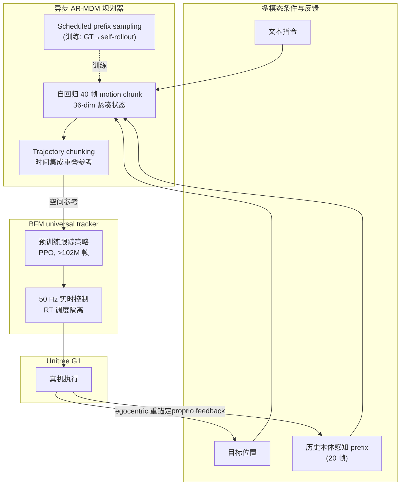

# ReactiveBFM

**ReactiveBFM** 是港中大与上海人工智能实验室提出的 **闭环全身运动规划–控制** 框架（arXiv:2606.30362，[项目页](https://xiao-chen.tech/reactivebfm)）：在 [BFM](./paper-behavior-foundation-model-humanoid.md) / [SONIC](../methods/sonic-motion-tracking.md) 类 **通用跟踪控制器** 之上，接入 **根据本体感知持续重规划** 的 **自回归运动扩散规划器（AR-MDM）**，使行为基础模型从「开环执行预定义参考」升级为 **对环境偏移与跟踪误差具有恢复能力的 reactive WBC**。

## 英文缩写速查

| 缩写 | 英文全称 | 简要说明 |
|------|----------|----------|
| BFM | Behavior Foundation Model | 提供低层 universal tracking 先验 |
| WBC | Whole-Body Control | 人形全身协调控制目标层 |
| AR-MDM | Auto-Regressive Motion Diffusion Model | 在线自回归运动扩散规划器 |
| MDM | Motion Diffusion Model | 扩散式运动生成骨干 |
| MPJPE | Mean Per-Joint Position Error | 关节位置跟踪误差指标 |

## 为什么重要

- **指出 BFM 栈的关键缺口**：现有 BFM / universal tracker **只跟踪给定参考**；与 TextOp、DART 等规划器 **开环级联** 时，微小跟踪偏差就会使规划器脱离训练分布，**累积 exposure bias** 递归放大——这不是换更强 tracker 能单独解决的 **系统架构问题**。
- **闭环规划在真机落地**：相较 CLoSD、DartControl 等仅在仿真验证的闭环尝试，ReactiveBFM 在 **Unitree G1** 上展示 **文本条件全身技能、流式多轮指令、零样本移动目标到达** 与 **暴力扰动恢复**，把「生成式规划 + BFM 执行」推进到 **可部署闭环**。
- **工程时延方案可复用**：自回归规划天然低于 50 Hz 控制频率；论文用 **事件驱动异步重规划 + trajectory chunking 时间集成 + TensorRT**（规划 19.3 ms / 控制 5.9 ms）保证 **无抖动、不被推理抢占** 的实时环——对任何人形 **规划–控制分层** 系统都有参考价值。
- **训练侧直接针对 exposure bias**：**Scheduled prefix sampling curriculum**（teacher forcing → self-rollout + prefix 噪声）迫使规划器从 **不完美物理状态** 学 error-recovery，是闭环生成模型训练的 **明确可迁移 recipe**。

## 流程总览

## 核心机制（归纳）

### 1）Reactive Whole-Body Motion Planner（AR-MDM）

- **状态表示**：每帧 $x_i=[p_i, q_i, \theta_i]\in\mathbb{R}^{36}$（根平移、四元数、29 DoF 关节角），刻意 **去掉** 接触标志、全局速度等冗余，缩小闭环误差空间。
- **生成形式**：在长度 $L$ 滑动窗口上，扩散模型 $\mathbf{G}$ 从噪声 motion chunk 预测干净参考 $\hat{\mathbf{X}}_0$；条件 $\mathbf{c}$ 含文本、目标位置与前窗 prefix 轨迹。
- **Scheduled prefix sampling**：训练从 teacher forcing 起步，线性衰减 ground-truth prefix 使用率，转入 **自回归 self-rollout**；并对 prefix 加高斯噪声，模拟真机跟踪偏差。
- **平滑与多模态切换**：除 MSE 外加 **速度/加速度 temporal loss**；对文本与目标独立 **condition dropout**，学无条件 motion prior，支持 **流式中途改指令** 而不重置机器人。
- **数据管线**：100STYLE、AMASS-HumanML3D、Kungfu 经仿真 **物理校正**（去脚滑、自穿透）；合成 10k PhysHSI 静态到达轨迹；合计 **37.14 h** 验证数据。

### 2）闭环系统：异步重规划与真机部署

- **异步触发**：未执行参考帧 $< N_{buf}=10$ 时，后台线程用最新 proprioception 非阻塞重规划；控制器进程 **实时 CPU 优先级**，保证 50 Hz 环不被规划抢占。
- **Trajectory chunking**：对重叠异步预测做 **时间集成**（位置/旋转混合），消除重规划边界抖动。
- **零样本移动目标**：训练仅静态到达；推理每步将当前根姿态设为原点、目标变换到 **egocentric 坐标**，把动态跟踪分解为静态到达子序列，同时靠 AR prefix 保留动量。**10 次真机试验 90% 成功**，连续 **>40 s**。
- **硬件**：Unitree G1 + 板载外 **RTX 4090**；移动目标由 **HTC Vive Ultimate Tracker** Wi-Fi 广播全局位姿。

### 3）BFM Universal Tracking Controller

- 与 [SONIC](../methods/sonic-motion-tracking.md)、[BFM](./paper-behavior-foundation-model-humanoid.md) 同族的 **预训练跟踪策略**：>1.02 亿帧、50 FPS 重定向数据、PPO + 强全局跟踪 reward + 域随机化。
- 角色是 **高频执行引擎**，闭环鲁棒性 **不仅来自 tracker**，更来自规划层持续用真实状态 **闭合误差环**。

## 主要量化结果

### Sim-to-sim（躯干/骨盆 100N、0.1s 随机扰动）

| 方法 | 成功率 ↑ | 跌倒率 ↓ | $E^r_{MPJPE}$ ↓ | 重规划平滑度 ↓ | 存活时间 ↑ |
|------|----------|----------|-----------------|----------------|------------|
| DART+GMR+SONIC（开环） | 51.0% | 12.5% | 46.2 mm | — | — |
| TextOp+SONIC（开环） | 64.5% | 23.5% | 40.1 mm | — | — |
| ReactiveBFM（开环消融） | 75.2% | 4.3% | 36.5 mm | — | — |
| TextOp+SONIC（闭环） | 76.4% | 14.7% | 42.3 mm | 128.5 mm | 27.8 s |
| **ReactiveBFM（闭环）** | **93.1%** | **2.0%** | **34.6 mm** | **96.9 mm** | **29.8 s** |

- 闭环 ReactiveBFM 较最佳开环级联 baseline **成功率 +28.6%**；去掉 self-rollout 跌至 70.5%，印证 **prefix curriculum** 对闭环不可或缺。

### 真机亮点

- **零样本动态目标到达**：无动态目标训练数据，90% 成功率。
- **流式文本交互**：长时程行走、功夫、太极等 **中途切换文本指令** 无需重置。
- **扰动恢复**：踢击、3 kg 球击打、强制反向旋转、拖拽失衡等场景下 **在线重规划恢复**。

## 结论

**BFM/universal tracker 只解决「跟得住参考」；扰动下要恢复，必须把规划器与本体反馈闭合成环，并针对 exposure bias 做训练。**

1. **开环级联是系统病** — DART/TextOp+SONIC 扰动成功率仅 **51.0% / 64.5%**；微小跟踪偏差使规划脱离训练分布并递归放大，换更强 tracker 不够。
2. **闭环主数字** — ReactiveBFM 闭环成功率 **93.1%**、跌倒 **2.0%**、\(E^r_{\mathrm{MPJPE}}\) **34.6 mm**；相对最佳开环级联约 **+28.6 pt**。
3. **Scheduled prefix sampling 不可省** — 去掉 self-rollout 成功率跌至 **70.5%**；课程迫使规划器从不完美物理状态学 error-recovery。
4. **部署工程三件套** — 异步重规划（缓冲 \(N_{\mathrm{buf}}=10\)）+ trajectory chunking 时间集成 + TensorRT（规划 19.3 ms / 控制 5.9 ms），对齐 50 Hz 且不被推理抢占。
5. **真机能力边界** — 零样本移动目标 **10 次试验 90%**（>40 s）；支持流式改文本指令与踢击/3 kg 球等扰动恢复；训练仅静态到达，动态靠 egocentric 重锚定。
6. **不是新 BFM 预训练** — 低层沿用 BFM/SONIC 族（>1.02 亿帧）；贡献在 AR-MDM 规划–控制闭环；无相机/触觉，接触丰富交互未建模，真机需外置 GPU + Vive Tracker。

## 与其他工作的关系

- **相对 [BFM](./paper-behavior-foundation-model-humanoid.md)**：BFM 解决 **多控制接口的统一低层生成**；ReactiveBFM 解决 **「谁在线产生参考」**——把 BFM 从开环跟踪器升格为 **闭环栈的执行层**。
- **相对 [SONIC](../methods/sonic-motion-tracking.md)**：SONIC 强调 **规模化 tracking 预训练**；ReactiveBFM 直接采用同族 tracker，贡献在 **上层闭环 AR 规划 + 训练/部署工程**。
- **相对 [ScaleBFM](./paper-scaling-bfm-humanoid.md)**：同 Shanghai AI Lab 栈与 G1 真机文化；ScaleBFM 专注 **低层 BFM scaling 与 Humanoid Transformer**，ReactiveBFM 在其 tracker 类能力之上叠 **闭环运动规划**。
- **相对 TextOp / DART / Kimodo + SONIC 开环级联**：同类「文本/运动生成 + tracker」，但 ReactiveBFM **闭合 proprioceptive 反馈环**，扰动下成功率差距显著。
- **相对 CLoSD、DartControl**：同为闭环递归规划，但 ReactiveBFM 强调 **真机部署、异步时延、exposure bias 课程** 三件套同时成立。

## 常见误区或局限

- **不是新 BFM 预训练范式**：低层 tracker 沿用既有 BFM/SONIC 路线；论文核心在 **规划–控制闭环系统** 与 **AR-MDM 训练策略**。
- **仍非 VLA**：条件为 **文本 + 紧凑目标 + 运动学状态**，无相机/触觉；loco-manipulation 等 **接触丰富人–物交互** 未显式建模（论文 Limitations）。
- **算力与传感依赖**：真机需 **外置 GPU + Vive Tracker** 等外设；与纯 onboard 部署尚有距离。

## 关联页面

- [Behavior Foundation Model](../concepts/behavior-foundation-model.md)
- [BFM（Behavior Foundation Model for Humanoid Robots）](./paper-behavior-foundation-model-humanoid.md)
- [ScaleBFM（BFM scaling 配方）](./paper-scaling-bfm-humanoid.md)
- [Whole-Body Control](../concepts/whole-body-control.md)
- [SONIC（规模化运动跟踪）](../methods/sonic-motion-tracking.md)
- [Curriculum Learning](../concepts/curriculum-learning.md)
- [Domain Randomization](../concepts/domain-randomization.md)
- [Unitree G1](./unitree-g1.md)
- [AMASS](./amass.md)

## 参考来源

- [sources/papers/reactivebfm_arxiv_2606_30362.md](../../sources/papers/reactivebfm_arxiv_2606_30362.md)
- Chen, Zeng, Niu, Wang, Li, Wang, Xu, Chen, Zhong, Ding, Li, Pang, Wang, Xue, Wang. *ReactiveBFM: Reactive Closed-Loop Motion Planning Towards Universal Humanoid Whole-Body Control*. arXiv:2606.30362, 2026. <https://arxiv.org/abs/2606.30362>
- [ReactiveBFM 项目页](https://xiao-chen.tech/reactivebfm)

## 推荐继续阅读

- [BFM 项目页](https://bfm4humanoid.github.io/) — 低层 CVAE-BFM 对照
- [SONIC 方法页](../methods/sonic-motion-tracking.md) — universal tracking 预训练背景
- [Behavior Foundation Model 概念页](../concepts/behavior-foundation-model.md) — BFM 层次化控制 taxonomy
- [A Survey of Behavior Foundation Model（arXiv:2506.20487）](https://arxiv.org/abs/2506.20487) — BFM 综述全文
