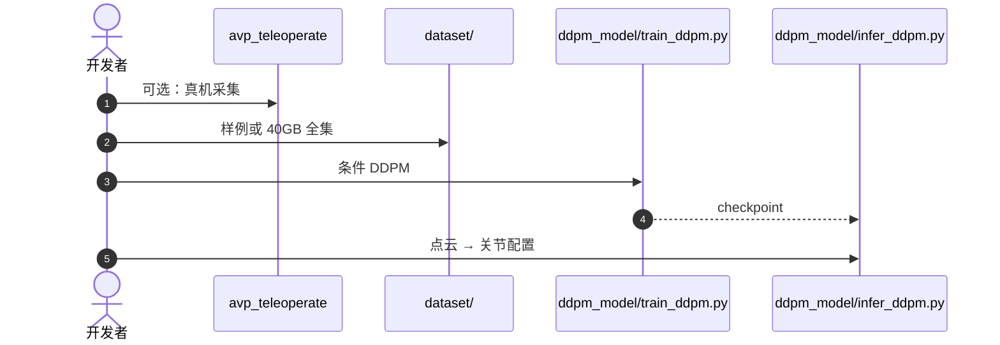

# 真机双臂灵巧抓取：单视角也要协作接触

**真机双臂灵巧抓取**（*Real-World Cooperative Bimanual Dexterous Grasp of Large Objects from Single-View Observations*；[arXiv:2608.10383](https://arxiv.org/abs/2608.10383)，[代码](https://github.com/zhangdana483/real_bi_dex_grasp)）面向大物体协作抓取：缺完整 3D 模型，又要两臂同时接触稳定。IROS 2026。

## 一句话定义

**从单视角分割点云生成双臂关节级抓取，再用规划与力信号在线细化，而不是先重建再离线搜抓取。**

## 英文缩写速查

| 缩写 | 英文全称 | 简要说明 |
|------|----------|----------|
| DDPM | Denoising Diffusion Probabilistic Model | 关节配置生成器 |
| EEF | End-Effector | 执行与力传感所在 |
| SAM | Segment Anything | 仓内点云/框辅助分割 |
| DoF | Degrees of Freedom | 双臂+灵巧手关节空间 |
| IROS | IEEE/RSJ International Conference on Intelligent Robots and Systems | 发表会议 |

## 为什么重要

- 大物体双手抓取很难在仿真里用完整 mesh 交差；真机往往只有一只相机。
- 生成抓取后必须规划可达并用力闭环，否则「看起来能抓住」会滑。
- 代码含遥操作采集与 DDPM 训练脚本，比纯项目页更接近复现。

## 核心信息

| 项 | 内容 |
|----|------|
| **会议** | IROS 2026 |
| **开源** | **已开源**（训练/推理可辨识；全集网盘） |

## 核心原理

### 方法栈

多模态数据集（关节角、视觉、力）→ 分割点云条件的 DDPM 出双臂关节配置 → 运动规划执行 → 力信号在线细化。降低对完整物体模型的依赖。

### 流程总览

## 源码运行时序图

官方仓 [zhangdana483/real_bi_dex_grasp](https://github.com/zhangdana483/real_bi_dex_grasp)（归档见 [sources/repos/real-bi-dex-grasp.md](../../sources/repos/real-bi-dex-grasp.md)）：

- **最短复现：** 读 `description.txt` → 用 `dataset/` 样例跑 `infer_ddpm.py`。
- **许可：** 代码 Apache-2.0；数据非商用。

## 工程实践

| 项 | 建议 |
|----|------|
| 先推理 | 空跑训练前先确认点云特征脚本 `ply2feat.py` |
| 力细化 | 不要关掉在线修正去报「生成成功率」 |
| 未见物体 | 论文卖点是跨几何/位姿；评测要分 ID/OOD |

## 实验与评测

摘要：双臂真机在未见物体、变化几何与位姿上成功率高，消融确认生成器、规划与力细化的贡献。未在摘要给百分比——引用前读论文表，不要用公众号转述。

## 与其他工作对比

相对仿真双臂抓取：本页强调真机单视角。相对 [顶层布料分割](./paper-top-layer-fabric-seg.md)：薄层感知 vs 大物体协作接触。相对抓取位姿估计单臂：输出是 **双臂关节配置** 不是一个 6D 抓取框。

## 结论

**大物体双臂抓取的可用接口是「单视角点云 → 关节配置 → 力细化」，不是完整 mesh。**

1. **生成器只是一步** — 没有规划与力环仍会滑。
2. **样例 ≠ 全集** — 训练数字需要 40GB 网盘。
3. **遥操作栈可复用** — 采集目录基于 Unitree 开源。
4. **摘要无表** — 写材料时回到 PDF。

## 局限与风险

- 机构标签未在 arXiv 摘要页列出，图谱机构徽标可能不全。
- 百度网盘对部分环境不友好。
- 单视角对严重自遮挡大物体仍可能缺第二接触面。

## 关联页面

- [Bimanual Manipulation](../tasks/bimanual-manipulation.md)
- [抓取位姿估计](../methods/grasp-pose-estimation.md)
- [顶层布料分割](./paper-top-layer-fabric-seg.md)
- [Contact-Rich Manipulation](../concepts/contact-rich-manipulation.md)

## 参考来源

- [论文摘录](../../sources/papers/real_bi_dex_grasp_arxiv_2608_10383.md)
- [官方仓归档](../../sources/repos/real-bi-dex-grasp.md)
- [具身智能小站 10 篇盘点（2026-08-18）](../../sources/blogs/wechat_embodied_station_contact_predict_adapt_10_papers_2026-08-18.md)

## 推荐继续阅读

- [zhangdana483/real_bi_dex_grasp](https://github.com/zhangdana483/real_bi_dex_grasp)
- [arXiv:2608.10383](https://arxiv.org/abs/2608.10383)
