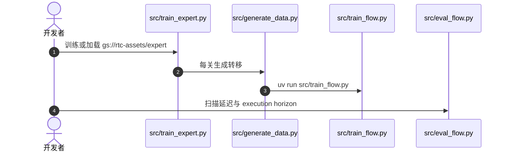

# Real-Time Chunking：边执行边补下一段动作

**Real-Time Chunking（RTC）**（*Real-Time Execution of Action Chunking Flow Policies*，[arXiv:2506.07339](https://arxiv.org/abs/2506.07339)，[项目页](https://www.pi.website/research/real_time_chunking)，[仿真代码](https://github.com/Physical-Intelligence/real-time-chunking-kinetix)）由 **物理智能（Physical Intelligence）** 与 **加州大学伯克利分校（UC Berkeley）** 提出。它不重训模型，只在推理时约束新 chunk，使大 VLA 可以在机器人还在动的时候算出下一段动作。

## 一句话定义

> **新 chunk 里来不及执行的前几步锁死成上一 chunk 的剩余动作，其余步再按流模型补全。**

## 英文缩写速查

| 缩写 | 英文全称 | 简要说明 |
|------|----------|----------|
| RTC | Real-Time Chunking | 本文的异步 chunk 衔接 |
| TE | Temporal Ensembling | ACT 的跨 chunk 平均，高延迟下会失效 |
| VLA | Vision-Language-Action | 被套用的 flow 或 diffusion 策略 |

## 为什么重要

π₀、π₀-FAST、π₀.₅ 的定量评测当时采用同步执行：一段 chunk 做完，停下等推理，再启动下一段。停顿不在训练数据里，也会限制模型变大。直接把相邻 chunk 做时间平均，在延迟升高后会生成危险加速度。RTC 把问题写成扩散 / 流模型已经会做的 inpainting。

## 核心原理

π 系动作为 50 步、约 1 秒。若推理占掉 3 个控制周期，新 chunk 的前 3 步已经过时，必须等于上一 chunk 里将被执行的值。再往后与旧 chunk 重叠的步只作部分约束，让策略还能根据新观测改主意。其余步自由生成。算法加在任何 flow 或 diffusion VLA 的采样过程上，训练配方不变。

2025-12-08 的后续 **[Training-Time RTC](./paper-training-time-real-time-chunking.md)**（[arXiv:2512.05964](https://arxiv.org/abs/2512.05964)）把延迟写进训练。博客说 π\*₀.₆ 的咖啡演示用的是这一版。

## 评测

项目页用子步骤完成比例除以时间定义吞吐，在 6 个真机任务、每点 10 条轨迹上比较 RTC、同步推理和两种密度的时间集成。注入 +100 ms 与 +200 ms 后，RTC 的平均吞吐基本持平，时间集成在这两个延迟上失败。作者还用去掉停顿后的控制器步数说明：RTC 往往更早推进，而不是只靠取消暂停看起来更快。精确任务包括划火柴和插网线。移动操作示例延迟合计约 139 ms（模型 97 ms，网络 21 ms）。

## 结论

**大 VLA 要实时执行，先解决 chunk 边界的一致性；时间平均不是高延迟下的安全替代。**

- 推理期 RTC 不改权重，可套在已有 flow / diffusion 策略上
- 同步停顿会把策略带离训练分布，延迟实验比「看起来流畅」更说明问题
- 仿真复现走 Kinetix 仓；真机 π 栈没有同等入口
- 训练期 RTC 是另一篇论文，咖啡演示不要和 2025-06 的纯推理版混为一谈

## 与其他工作对比

| 对照 | 差异读法 |
|------|----------|
| 时间集成（ACT，见 [Action Chunking](../methods/action-chunking.md)） | 相邻 chunk 做时间平均；本页注入 +100 / +200 ms 延迟后失败 |
| 同步推理 | 每段 chunk 执行完停下等推理；停顿不在训练分布里 |
| [Training-Time RTC](./paper-training-time-real-time-chunking.md) | 训练 prefix 条件化，推理零 inpainting；π\*₀.₆ 咖啡演示 |
| [REMAC](./paper-remac.md) | 训练期 masked chunk + 修 intra-chunk 不一致；推理无额外延迟 |
| [FutureRTC](./paper-futurertc.md) | 冻结 VLA + adapter 预测执行时刻 \((z,s)\) |
| [WAM 实时异步部署实证](./paper-wam-realtime-async.md) | 在 WAM 上对照 sync / async / blend / infer / train：推理期方案压不住高延迟区，训练期方案综合最好，可与本页纯推理 RTC 对读 |

## 源码运行时序图

仿真路径对齐 [real-time-chunking-kinetix](https://github.com/Physical-Intelligence/real-time-chunking-kinetix)。真机 inpainting 不在该仓。

Training-time 对照：把模型配置 `simulated_delay` 设为 5，再用 `train_flow.py` 对 `gs://rtc-assets/bc/` 里的检查点微调 8 个 epoch，然后同样走 `eval_flow.py`。

## 工程实践（生态入口）

| 入口 | 适用 |
|------|------|
| [real-time-chunking-kinetix](https://github.com/Physical-Intelligence/real-time-chunking-kinetix) | 官方 Kinetix 仿真 + training-time 微调 |
| [LeRobot RTC 文档](https://huggingface.co/docs/lerobot/rtc) | π0 / π0.5 / SmolVLA：`RTCConfig`、`lerobot-rollout --inference.type=rtc` |
| [openpi-rtc](../../sources/repos/openpi-rtc.md) | 社区 openpi + ALOHA `guided_inference` |
| [openpi](../../sources/repos/openpi.md) | 官方 π 栈（**不含** RTC 为一等公民入口） |

异步推理解决 **空转**；RTC 解决 **chunk 边界**——LeRobot 文档建议 **两者叠加**。

## 局限与风险

- 部分开源。`expert/` 约 60GiB，且不包含 π₀ 真机策略。
- 吞吐定义依赖作者划分的子步骤，不能换成别的任务后直接比数字。
- 冻结前缀过长时，策略对新观测的反应会变迟；延迟估计若偏了，锁定的动作就和真实执行对不上。

## 关联页面

- [Action Chunking](../methods/action-chunking.md)
- [π₀](../methods/π0-policy.md)
- [Training-Time RTC](./paper-training-time-real-time-chunking.md)
- [REMAC](./paper-remac.md)
- [FutureRTC](./paper-futurertc.md)
- [LeRobot](./lerobot.md)
- [π\*₀.₆ / RECAP](./paper-rcl-2511-14759-0-6-a-vla-that-learns-from-experience.md)
- [异步 WAM 部署](./paper-wam-realtime-async.md)

## 参考来源

- [real_time_chunking_arxiv_2506_07339](../../sources/papers/real_time_chunking_arxiv_2506_07339.md)
- [real-time-chunking-kinetix](../../sources/repos/real-time-chunking-kinetix.md)
- [openpi-rtc](../../sources/repos/openpi-rtc.md)
- [lerobot-rtc-docs](../../sources/sites/lerobot-rtc-docs.md)

## 推荐继续阅读

- [arXiv:2506.07339](https://arxiv.org/abs/2506.07339)
- [Training-Time RTC](./paper-training-time-real-time-chunking.md)（[arXiv:2512.05964](https://arxiv.org/abs/2512.05964)）
- [Hugging Face LeRobot RTC](https://huggingface.co/docs/lerobot/rtc)
