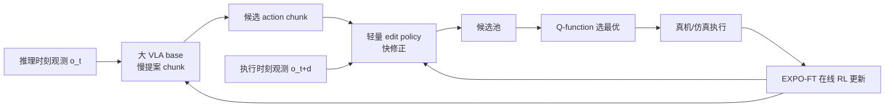

# Real-Time EXPO-FT：实时残差 RL 修正 VLA

**Real-Time EXPO-FT**（*Reinforcement Learning for Real-Time Vision-Language-Action Policies*，[arXiv:2609.18207](https://arxiv.org/abs/2609.18207)，[项目页](https://pd-perry.github.io/real-time-expo-ft/)）由 **斯坦福大学** Perry Dong、Kuo-Han Hung、Dorsa Sadigh 与 Chelsea Finn 提出：在 **EXPO-FT** 样本高效 VLA RL 框架上，把 **慢速大 VLA chunk 生成** 与 **轻量 edit policy 快速修正** 解耦，并用 **Q-function** 在线选最优 action 候选，使 RL fine-tuning 与 **异步/延迟感知** 真机控制同环。

## 一句话定义

**大 VLA 负责慢提案、小编辑器负责按执行时刻观测快改、Q 值负责选 chunk——把 EXPO-FT 的可靠性增益接到 RTC 世界的 stale-observation 现实里。**

## 英文缩写速查

| 缩写 | 英文全称 | 简要说明 |
|------|----------|----------|
| VLA | Vision-Language-Action | 预训练视觉—语言—动作大策略 |
| RL | Reinforcement Learning | 在线 fine-tune 超越模仿分布 |
| EXPO-FT | EXPLoration-augmented Policy Optimization FT | 样本高效 VLA RL 基座框架 |
| RTC | Real-Time Chunking | 异步 chunk 执行与重叠推理 |
| Q | Action-Value Function | 候选 chunk 在线选择 |

## 为什么重要

- **延迟是可靠性杀手：** 大 VLA 推理期间环境已变；执行时观测与推理观测不一致 → 分布偏移。
- **RTC 不够：** 异步 chunk 保平滑，但纯模仿 **无法** 主动越出训练分布提高成功率。
- **三件套闭合：** slow base + fast edit + Q selection，把 **RL 改进** 与 **实时执行** 绑在同一框架。
- **样本极省：** 四动态真机任务 **在线数据上限 10 分钟**、无人工干预，平均 **42%→97%**。

## 核心信息

| 项 | 内容 |
|----|------|
| **机构** | 斯坦福大学（Stanford University） |
| **基座** | EXPO-FT + 大 pretrained VLA |
| **仿真** | Kinetix：**10/10** 环境 delayed policy 最佳（含 delayed / non-delayed 对照） |
| **真机任务** | object passing、ball balancing、table soccer kicking、dynamic object picking |
| **开源** | **待发布** — 项目页 Code 为占位（2026-09-17） |

## 核心原理

1. **Slow action candidate generation：** 大 VLA base policy 提案 action chunk（慢，因模型规模）。
2. **Fast reactive action edits：** chunk 生成完成时环境已更新；**edit policy** 用 **执行时刻最新观测** 变换动作，保持最大反应性。
3. **Q-value chunk selection：** VLA 提案 + edit 修正后，**Q-function** 在线选最优候选 chunk。

### 流程总览

## 源码运行时序图

**不适用** — 截至 **2026-09-17** 无官方 GitHub；项目页 Code 链为 `#` 占位。

## 实验与评测

| 设定 | 结果 | 读法 |
|------|------|------|
| Kinetix 仿真 | **10/10** 环境上 delayed 策略最佳（含 delayed / non-delayed 对照） | 覆盖全部测试环境，说明增益来自 **延迟建模** 而非单环境调参 |
| 四项动态真机任务 | 平均 **42% → 97%** | object passing / ball balancing / table soccer kicking / dynamic object picking |
| 在线数据预算 | 每任务 **≤10 分钟**、无人工干预 | 样本效率是本文最强的工程卖点 |
| RTC 消融 | 项目页分 **w/ RTC** 与 **w/o RTC** 报告 | 动态任务上两者差距大；静态任务差距会被掩盖 |
| 视频判据 | 演示为 **1× wall-clock** | 非加速剪辑，可作为实时性的粗验证 |

代码 **待发布**（项目页 Code 为 `#` 占位，2026-09-17），edit policy 结构、Q 头与 EXPO-FT 的耦合细节暂不可审计。

## 与其他工作对比

| 对照对象 | 差异 |
|----------|------|
| 纯 RTC（异步 chunk 执行） | 保住了动作平滑，但纯模仿 **无法** 越出训练分布提升成功率；本文在 RTC 世界里加了 RL 改进 |
| 纯 EXPO-FT（无延迟建模） | 样本高效但假设观测新鲜；本文补上 **执行时刻观测** 的快编辑与 Q 选择 |
| [SmoothRL](./paper-smoothrl.md) | 同样在异步环内做在线 RL，但走 \(\nabla_a Q\) 路线；本文走 **EXPO-FT + edit policy + Q 选择** 的三段分工 |
| [WAM 实时异步部署](./paper-wam-realtime-async.md) | 同属 chunk 延迟工程族，但拆的是 **融合策略**；本文聚焦 VLA + RL + 延迟三者同环 |
| 直接把 VLA 做小做快 | 牺牲通用先验换延迟；本文保留大 VLA 慢路径，用 **轻量 edit** 补反应性 |

## 工程实践

| 项 | 建议 |
|----|------|
| 与 SmoothRL 并读 | [SmoothRL](./paper-smoothrl.md) 在异步环内用 \(\nabla_a Q\)；本文走 **EXPO-FT + edit + Q 选择** |
| 与 WAM-async 并读 | [WAM 实时异步](./paper-wam-realtime-async.md) 拆融合策略；本文聚焦 **VLA + RL + 延迟** |
| RTC 评测 | 项目页分 **w/ RTC** 与 **w/o RTC** 报告 — 动态任务两者差距大 |
| 数据预算 | 真机在线 RL **≤10 min** 仍可达 **97%** 量级 — 适合快速部署迭代 |
| 视频判据 | 演示强调 **1× wall-clock**，非加速剪辑 |

## 局限与风险

- **代码未发布：** 复现 edit policy 结构、Q 头与 EXPO-FT 耦合细节暂不可审计。
- **任务域：** 四动态 manipulation；是否泛化到 loco-manip / 长 horizon 待验证。
- **算力与 base VLA：** 仍依赖大 VLA 慢路径；edit 再快也需等 base 提案周期。

## 关联页面

- [VLA 方法](../methods/vla.md)
- [Action Chunking](../methods/action-chunking.md)
- [SmoothRL](./paper-smoothrl.md) — 异步 VLA 在线 RL 对照
- [WAM 实时异步部署](./paper-wam-realtime-async.md) — chunk 延迟工程族

## 结论

**Real-Time EXPO-FT 把「VLA 行为先验 + RL 可靠性 + 延迟感知执行」合成一条可 fine-tune 的实时管线，是动态 manipulation 部署值得跟踪的 RL-on-VLA 路线。**

- **问题定义准：** stale observation 不是小噪声，是可靠性主因之一。
- **结构可解释：** 慢生成 / 快编辑 / Q 选择职责分离，便于 ablate 与部署替换。
- **仿真+真机双验证：** Kinetix 全覆盖 + 四动态真机 **42%→97%**。
- **样本效率高：** 10 分钟级在线数据 — 工程友好。
- **复现待 code：** 截至入库日 **待发布**。

## 参考来源

- [Real-Time EXPO-FT 论文归档](../../sources/papers/real_time_expo_ft_arxiv_2609_18207.md)
- [Real-Time EXPO-FT 项目页](../../sources/sites/real-time-expo-ft.md)
- [具身小站 9 篇盘点](../../sources/blogs/wechat_embodied_station_9_papers_perception_action_transfer_2026-09-17.md)

## 推荐继续阅读

- [arXiv:2609.18207 PDF](https://arxiv.org/pdf/2609.18207)
- [项目页 1× 真机 rollouts](https://pd-perry.github.io/real-time-expo-ft/)
