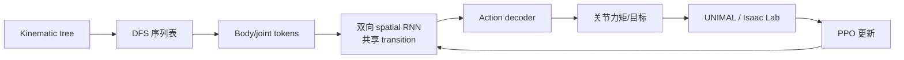
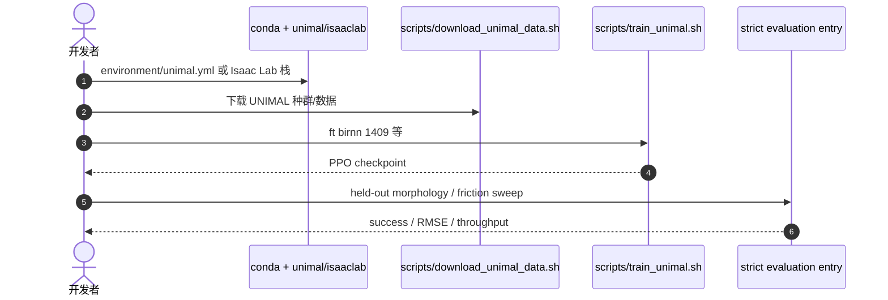

# RecMorph：跨形态共享控制策略

**RecMorph**（*Topology-Guided Spatial Recurrence for Generalized Morphology Control*，[arXiv:2609.18359](https://arxiv.org/abs/2609.18359)，[GitHub](https://github.com/quanruirao/RecMorph)）提出 **topology-guided spatial recurrent** 架构：对 kinematic tree 做 **深度优先遍历** 得到形态衍生 token 序列，沿序用 **共享双向 transition** 渐进变换 limb 信息再解码 action，在 **固定模型宽深** 下实现 **线性 token 复杂度** 的跨 limb 通信与全身协调。

## 一句话定义

**把机器人 kinematic tree 排成一条 DFS 序列，用双向 RNN 沿拓扑序做 limb 级信息变换——一条共享策略就能控 UNIMAL 多变形态，也能迁到 Go1/Go2/ANYmal 四足。**

## 英文缩写速查

| 缩写 | 英文全称 | 简要说明 |
|------|----------|----------|
| GMC | Generalized Morphology Control | 单策略控制多种 body morphology |
| UNIMAL | UNIversal ANimal | 程序化形态 MuJoCo 基准 |
| DFS | Depth-First Search | 将 kinematic tree 转为有序 token 序列 |
| BiRNN | Bidirectional Recurrent Neural Network | 主模型 RecMorph-BiRNN |
| PPO | Proximal Policy Optimization | UNIMAL / Isaac Lab 训练算法 |
| RMSE | Root Mean Square Error | 速度跟踪误差指标 |

## 为什么重要

- **通信三需求一次答：** cross-limb 变换、全身协调、随 body size **线性** 扩展 — 现有 GNN/Transformer 通信往往只满足部分。
- **UNIMAL + 真机四足双验证：** 不仅 procedural body；还迁到 **Go1/Go2/ANYmal-B/C** 共享策略。
- **吞吐与精度兼得：** FT 任务 **推理吞吐最高**；Isaac Lab nominal velocity RMSE 较 specialist MLP **↓43.5%**。
- **已开源可复现：** UNIMAL + Isaac Lab 双栈脚本与文档齐全。

## 核心信息

| 项 | 内容 |
|----|------|
| **代码** | [quanruirao/RecMorph](https://github.com/quanruirao/RecMorph) — **已开源** |
| **主模型** | RecMorph-BiRNN（另有 BiLSTM / BiGRU / BiMamba2 变体） |
| **UNIMAL** | Flat Terrain、Incline、Exploration、Varied Terrain、Obstacle |
| **Isaac Lab** | Go1、Go2、ANYmal-B、ANYmal-C 共享 controller |
| **物理试验** | Go1/Go2 **40** trials **零 fall** |

## 核心原理

1. **Tokenization：** 每个 body/joint 为 token；**DFS** 遍历 kinematic tree → 保拓扑的 limb 序列。
2. **Spatial recurrence：** 共享 **双向** transition 沿序列 transport & transform limb 信息。
3. **稳定化：** residual preservation、RMS normalization、input-dependent channel modulation。
4. **解码：** 统一 actor/critic head + PPO；与 BiLSTM/BiGRU/BiMamba2 共用 tokenization 与管线。

### 流程总览

## 源码运行时序图

节点对齐 [`sources/repos/recmorph.md`](../../sources/repos/recmorph.md) README。

- **UNIMAL 最短路径：** `conda env create -f environment/unimal.yml` → `pip install -e unimal` → `bash scripts/train_unimal.sh ft birnn 1409`。
- **Isaac Lab 路径：** 见 `isaaclab/recmorph_locomotion/` 与仓库 docs。

## 工程实践

| 项 | 建议 |
|----|------|
| 形态泛化 | 支持至 **30 limb** unseen body；FT 上 **mean final training performance 最强** |
| sim2real 读法 | Go1/Go2 **40** 物理 trial 零 fall — 但仍是 locomotion 子集，非全身 manipulation |
| 与 Any2Any 并读 | [Any2Any](./paper-any2any-cross-embodiment-wbt.md) 做人形 WBT 迁移；RecMorph 做 **形态 token 序列通信** |
| 变体选择 | BiRNN 为主结果；BiMamba2 等同 pipeline 便于 ablate recurrence 族 |

## 局限与风险

- **双栈依赖重：** UNIMAL（MuJoCo-py 老栈）与 Isaac Lab 0.41.3 环境分离维护。
- **任务域：** 以 locomotion 为主；未覆盖 dexterous manipulation / VLA。
- **UNIMAL→四足迁移：** 有实证，但 friction/动力学 sweep 仍需按文档严格评测。

## 关联页面

- [跨具身策略迁移选型](../queries/cross-embodiment-transfer-strategy.md)
- [Locomotion 任务](../tasks/locomotion.md)
- [X-Sim 跨具身](../entities/paper-sa-2505-07096-x-sim-cross-embodiment-learning-via-real-to-sim.md)

## 结论

**RecMorph 说明：广义形态控制的高效通信可以用「拓扑序 + 空间 RNN」在固定宽深下完成，且能从 UNIMAL  procedural body 迁到四足真机平台。**

- **架构简洁：** DFS 序 + 双向 recurrence，线性 token 复杂度。
- **UNIMAL 强：** 五任务 mean final performance 与 FT 吞吐领先评估对照。
- **四足共享策略有效：** macro-average 最佳 + RMSE **↓43.5%** vs specialist MLP。
- **物理验证：** Go1/Go2 40 trials 零 fall。
- **已开源：** UNIMAL + Isaac Lab 双路径可复现。

## 参考来源

- [RecMorph 论文归档](../../sources/papers/recmorph_arxiv_2609_18359.md)
- [RecMorph 仓库归档](../../sources/repos/recmorph.md)

## 推荐继续阅读

- [arXiv:2609.18359 PDF](https://arxiv.org/pdf/2609.18359)
- [RecMorph GitHub README](https://github.com/quanruirao/RecMorph)
