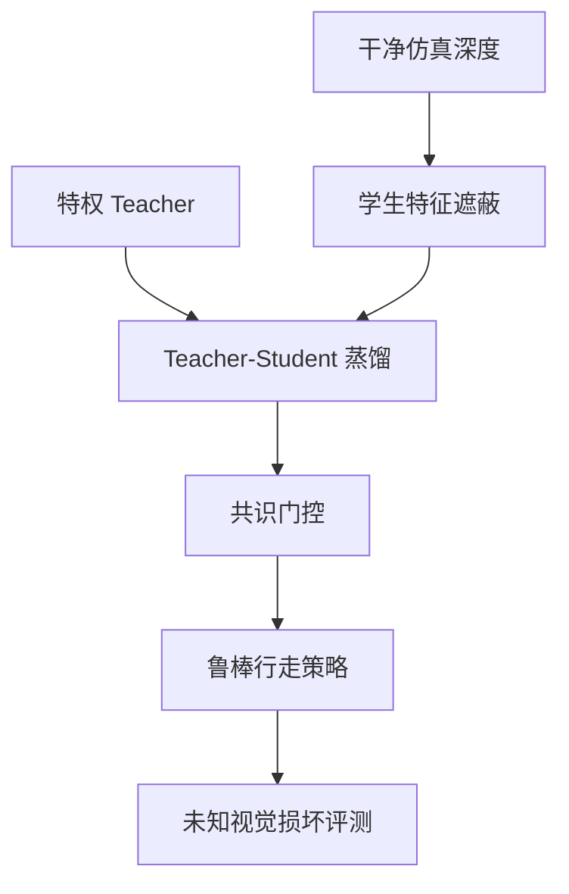

# REDACT（arXiv:2609.25450）

**REDACT**（*REDACT: Robust Perceptive Locomotion under Unseen Visual Corruption*，[arXiv:2609.25450](https://arxiv.org/abs/2609.25450)）来自 [senlanke 具身运控lab 周更盘点](../../sources/blogs/wechat_senlanke_weekly_humanoid_quadruped_2026-09-21_25.md)（2026-09-21–25）。

## 一句话定义

**Teacher–Student + 特征遮蔽 + 共识门控：仅用干净仿真深度训练，迁移到未知视觉损坏与森林场景。**

## 英文缩写速查

| 缩写 | 英文全称 | 简要说明 |
|------|----------|----------|
| RL | Reinforcement Learning | 强化学习 |
| WBC | Whole-Body Control | 全身控制 |
| MPC | Model Predictive Control | 模型预测控制 |

## 为什么重要

- 真机深度常遇训练未覆盖的损坏；单纯数据增强无法覆盖未知 corruption。

## 流程总览

以下按本页已归纳的机制与资料绘制，表示模块或阅读路径关系。

## 核心机制

| 项 | 内容 |
|----|------|
| **arXiv** | [2609.25450](https://arxiv.org/abs/2609.25450) |
| **研究实现** | **未公开**：项目仓只有网站、论文、图像和演示视频；未提供训练 / 推理代码 |
| **方法摘要** | Teacher–Student；continual feature masking；conformal-calibrated consensus gating on depth features. |

## 源码运行时序图

**不适用**（截至 2026-10-04，官方仓库只托管项目网站、论文、图片和演示视频，没有可运行的算法训练或部署入口）。

## 实验与评测

- 结构化环境与森林场景迁移（以 PDF 为准）。
- 读法：先对齐任务设定、传感器与成功定义，再解读 headline 数字。

## 与其他工作对比

| 维度 | 读法 |
|------|------|
| **同周对照** | 见对应 [周更盘点](../../sources/blogs/wechat_senlanke_weekly_humanoid_quadruped_2026-09-21_25.md) 映射表，勿跨任务直接比 SR |
| **开源状态** | 项目页和演示素材公开；研究算法实现未公开，且网站仓库未声明许可证 |

## 结论

**REDACT 把「哪些深度特征仍可信」做成可部署门控，适合未知视觉损坏下的感知 locomotion。**

1. 项目页提供方法图、实验材料和技术细节；网站源码仓不等于算法实现仓。
2. 指标须连同实验条件解读（仿真/真机、平台、成功阈值）。
3. 官方仓库未声明许可证，也没有公开训练 / 推理实现；复现前要先取得代码与数据授权条件。

## 关联页面

- [humanoid-locomotion](../tasks/humanoid-locomotion.md)
- [reinforcement-learning](../methods/reinforcement-learning.md)
- [sim2real](../concepts/sim2real.md)

## 参考来源

- [redact-robust-perceptive-locomotion_arxiv_2609_25450.md](../../sources/papers/redact-robust-perceptive-locomotion_arxiv_2609_25450.md)
- [wechat_senlanke_weekly_humanoid_quadruped_2026-09-21_25.md](../../sources/blogs/wechat_senlanke_weekly_humanoid_quadruped_2026-09-21_25.md)
- [arXiv:2609.25450](https://arxiv.org/abs/2609.25450)

## 推荐继续阅读

- [arXiv PDF](https://arxiv.org/pdf/2609.25450)
- [REDACT 项目页](https://gatjungk.github.io/REDACT/)
- [REDACT 项目网站源码](https://github.com/gatjungk/REDACT)
