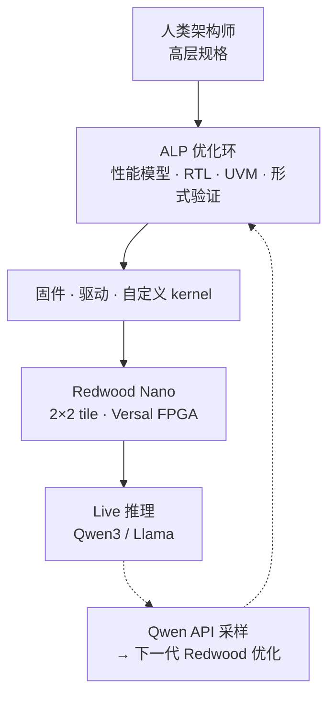

# Redwood（Architect Labs AI 加速器）

> **命名消歧：** 本页为 **Architect Labs** 的定制 **AI 推理加速器**（[arXiv:2608.26418](https://arxiv.org/abs/2608.26418)），与 [1X World Model / Redwood 评测引擎](./paper-1xwm-redwood-world-model.md)（1X Technologies 动作条件视频世界模型）**无关**。

**Redwood**（*Redwood: A Frontier AI Accelerator Designed, Verified, and Deployed from Scratch in 2 Weeks by AI*，[博文](https://architectlabs.com/blog/redwood)）由 **Architect Labs** 发布：其 **Architect Labs Platform（ALP）** 把传统顺序芯片流收成单一优化环，从两名人类架构师的高层规格出发，在 **两周内零人工介入** 自主生成性能模型、RTL、UVM、形式证明、固件、驱动与自定义 compute kernel，并完成 FPGA 部署。

## 一句话定义

**面向 physical AI 单 batch、超低延迟、低功耗 decode 的 tile 空间数据流加速器——用 AI 端到端设计硅片与软件栈，把「workload 变了再改架构」的周期压到周级。**

## 英文缩写速查

| 缩写 | 英文全称 | 简要说明 |
|------|----------|----------|
| ALP | Architect Labs Platform | 端到端 AI 芯片设计平台 |
| RTL | Register-Transfer Level | 硬件寄存器传输级设计 |
| UVM | Universal Verification Methodology | 商用 SoC 验证方法学 |
| GEMM | General Matrix Multiply | 通用矩阵乘 |
| GEMV | General Matrix-Vector Multiply | 通用矩阵–向量乘 |
| NoC | Network-on-Chip | 片上互连网络 |
| FPGA | Field-Programmable Gate Array | 可编程逻辑，Redwood Nano 当前载体 |

## 为什么重要

- **机器人机载推理瓶颈：** 人形/四足机载 VLA 与感知常在 [Jetson](./jetson-orin-nx.md) 级功耗预算内跑 decode；Redwood 宣称在 **同工艺级投影** 相对 Jetson Orin Nano 有 **3.4× perf/W**，若量产验证，将改变「机载只能跑小模型」的默认假设。
- **设计周期范式：** 规格变更 **48 h** 内重验证并 redeploy FPGA，适合 physical AI 模型迭代快于传统 tapeout 周期的矛盾。
- **递归闭环示范：** Qwen3 跑在 Redwood 上作为 API，采样发现 timing/kernel 优化并反馈下一代——与机器人「模型–硬件共演化」叙事同构，但发生在硅片层。

## 核心信息

| 项 | 内容 |
|----|------|
| **机构** | Architect Labs（架构实验室，Architect Labs） |
| **目标 workload** | Single-batch、低功耗、超低延迟 **physical AI** 推理（Llama、Qwen 等） |
| **形态** | Redwood（全规模）/ **Redwood Nano**（2×2 tile 超低功耗 FPGA 版） |
| **当前实测** | Versal VPK180 @ 250 MHz；**Qwen3-0.6B** 端到端 **12.1 tok/s**（含 host I/O） |
| **ASIC 投影** | Samsung 8 nm（Orin Nano 工艺级）：**1.75×** 吞吐、**1.9×** 更低功耗 → **3.4× perf/W** vs 实测 Jetson 基线 |
| **开源** | **未开源** — ALP、RTL、固件、内核均无公开仓库（截至 2026-09-07 项目页核查） |

## 核心原理

### Tile 微架构

- **N×M mesh** 同质 tile + 周边 DMA；credit-based NoC 支持 broadcast / multicast / per-link 流控。
- **每 tile：** RISC-V 控制核 + **矩阵引擎**（INT8 MAC、systolic GEMM/GEMV）→ **向量引擎**（多 lane SIMD、转置、FP 激活）+ **512 KB** 本地存储。
- **算子共设计：** Softmax 采用 FlashAttention-4 风格仿真，复用 SIMD 而非专用大块电路；控制前端与计算后端分时钟域，kernel 执行时可关断控制逻辑。
- **系统集成：** 外部存储仅经模块化 DMA + **AXI4**；可嵌更大 SoC、retarget ACE/CHI，或独立 chiplet。

### 流程总览

## 源码运行时序图

**不适用** — Architect Labs 未公开 ALP、RTL、固件或 kernel 仓库；Redwood Nano 仅在公司 FPGA 演示与论文/博文叙述中可引用，读者无法复现端到端 bring-up。若未来发布官方代码，应按 `sources/repos/` 归档并补全本节时序图。

## 工程实践

| 项 | 建议 |
|----|------|
| **选型读法** | 把 Redwood 当作 **physical AI 机载 decode 专用 ASIC 路线** 的标杆叙述，而非今日可采购 SKU |
| **对照基线** | 论文以 **Jetson Orin Nano + 同模型** 为能效对照；机器人栈选型仍见 [Jetson 生态](./nvidia-jetson.md) 与 [推理运行时对比](../comparisons/onnxruntime-vs-mnn-vs-tensorrt.md) |
| **延迟预算** | 单 batch 超低延迟定位与 [控制/推理频率解耦](../concepts/control-inference-frequency-decoupling.md) 中「慢模型 + 快执行环」一致——适合机载 policy/VLA decode，不替代 kHz 力矩环 |
| **验证态度** | 当前数字以 **FPGA 实测 + ASIC 投影** 为主；团队宣称推进 TSMC tapeout，量产硅仍为最终 ground truth |
| **命名** | 文献检索「Redwood」时务必加 **Architect Labs / accelerator**，避免误入 [1XWM](./paper-1xwm-redwood-world-model.md) |

## 实验与评测

- **Redwood Nano（FPGA）：** 2×2 tile，250 MHz，Qwen3-0.6B 端到端 **12.1 tok/s**（含 prompt 上传与逐 token 流式回 host）。
- **投影（Samsung 8 nm）：** 相对实测 Jetson Orin Nano：**1.75× decode 吞吐**、**1.9× 更低功耗**、**~3.4× perf/W**；面积效率相对 Jetson **约一个数量级**（博文口径）。
- **设计质量：** SoC 级各块 **≥95%** code/functional coverage；首版 RTL 仿真到 FPGA **零 bug**（公司宣称）。
- **设计速度：** 规格以下 **100%** 自动生成；架构迭代 **≤48 h** redeploy；峰值 **115 commits/日**。

## 结论

**Redwood 把「AI 设计 AI 芯片」从叙事推进到可演示的 physical AI 推理载体，但公开证据仍以 FPGA + 投影为主，且全程闭源。**

1. **工作负载锚点清晰** — single-batch、低功耗、超低延迟 decode，对准机载 VLA/小模型而非 datacenter batch。
2. **微架构可读** — tile 空间数据流 + Transformer 算子共设计（FlashAttention 风格 softmax），编译器承担调度，mesh 保持简单互连。
3. **能效叙事有对照** — 3.4× perf/W vs Jetson Orin Nano 需等 ASIC 硅验证；FPGA 12.1 tok/s 是当下唯一第三方可引用的实测点。
4. **设计流程才是主贡献** — 两周 RTL→FPGA、48 h 规格迭代，比峰值 TOPS 更可能影响 custom silicon 供给。
5. **递归自改进仍早期** — Qwen 在 Redwood 上发现 kernel/timing 优化，但「设计 frontier 模型的 AI」与「能部署在 Redwood 上的模型」之间仍有规模鸿沟。
6. **工程可复现性为零** — 无开源仓；选型与对标只能引用论文/博文，不能当 Jetson 替代品直接集成。
7. **与 1X Redwood 无关** — 检索与知识图谱链接时务必区分实体，避免评测 WM 与推理 NPU 混页。

## 与其他工作对比

### 机载 decode 算力的几条路

| 路线 | 代表 | 今天能否用上 | 生态 / 迁移成本 | 能效证据强度 |
|------|------|--------------|-----------------|--------------|
| **定制数据流加速器** | **本文 Redwood** | **否** — FPGA 演示，无 SKU、无 RTL、无驱动 | 未知：**无公开编译器 / ONNX / TensorRT 兼容叙事** | **最弱**：FPGA 实测 12.1 tok/s + **ASIC 工艺投影**，非第三方 bench |
| 通用边缘 GPU SoC | [Jetson Orin NX](./jetson-orin-nx.md) / [Jetson 家族](./nvidia-jetson.md) | **是**，可采购 | 成熟：CUDA / TensorRT / 现成机器人栈 | 强：本文自己拿它当基线 |
| 软件侧榨性能 | [ONNX Runtime vs MNN vs TensorRT](../comparisons/onnxruntime-vs-mnn-vs-tensorrt.md) | **是**，零硬件成本 | 低 | 可自测 |
| 卸载到云 | [边缘–云端协同](../concepts/edge-cloud-robotics.md) | 是 | 中（要处理网络抖动） | 视链路 |

**选型结论：** 今天要给机器人挑机载推理，候选是 **Jetson + 运行时调优 + 必要时云卸载**；Redwood **不是可替代项**，把它读成「定制硅路线的标杆叙述」而非采购选项。3.4× perf/W 要等 **量产硅 + 第三方复测** 才算数——投影不是测量。

### 真正的差异化在流程，不在峰值

| 维度 | 传统 custom silicon | Redwood / ALP 宣称 |
|------|---------------------|--------------------|
| 规格 → RTL → 验证 | 数月～数年，多团队 | **2 周**，规格以下 100% 自动生成 |
| 规格变更后重验证 | 数周 | **≤48 h** redeploy FPGA |
| 覆盖率 / 首版质量 | 人工迭代 | 各块 **≥95%** coverage，首版 RTL 到 FPGA **零 bug**（公司自述） |

**这才是本文最有可能改变供给的部分：** 若 workload 变化快于 tapeout 周期（physical AI 的常态），能把架构迭代压到周级本身就是竞争力——**但以上全部为公司自述，无第三方审计**。

**命名消歧再提醒：** 检索时务必写「Redwood **Architect Labs / accelerator**」，与 [1X Redwood 世界模型](./paper-1xwm-redwood-world-model.md) 是完全无关的两个实体。

## 局限与风险

- **未开源、未量产：** 无 RTL/固件/权重；ALP 为商业闭源平台。
- **投影 vs 硅：** ASIC 数字来自内部性能模型 + 工艺投影，非第三方 bench。
- **生态空白：** 无公开驱动、编译器文档或 ONNX/TensorRT 兼容叙事；迁移成本未知。
- **命名冲突：** 与 1X「Redwood World Model」同名，跨团队沟通易误解。

## 关联页面

- [Jetson Orin NX](./jetson-orin-nx.md) — 机器人机载边缘算力对照
- [NVIDIA Jetson](./nvidia-jetson.md) — Orin 家族选型
- [边缘–云端协同](../concepts/edge-cloud-robotics.md) — 机载推理在系统栈中的位置
- [控制/推理频率解耦](../concepts/control-inference-frequency-decoupling.md) — 低频 decode 与高频控制环
- [ONNX Runtime vs MNN vs TensorRT](../comparisons/onnxruntime-vs-mnn-vs-tensorrt.md) — 现有机载推理栈
- [1XWM / Redwood 世界模型](./paper-1xwm-redwood-world-model.md) — **不同实体**，仅供消歧

## 参考来源

- [Redwood 论文归档](../../sources/papers/redwood_arxiv_2608_26418.md)
- [Architect Labs Redwood 博文](../../sources/blogs/architectlabs_redwood.md)
- [Architect Labs Redwood 项目页](../../sources/sites/architectlabs-redwood.md)

## 推荐继续阅读

- [arXiv:2608.26418](https://arxiv.org/abs/2608.26418) — 论文全文
- [Introducing Redwood（官方博文）](https://architectlabs.com/blog/redwood) — 架构图与 ALP 流程
- [Architect Labs 主页](https://architectlabs.com) — 公司与 ALP 定位
