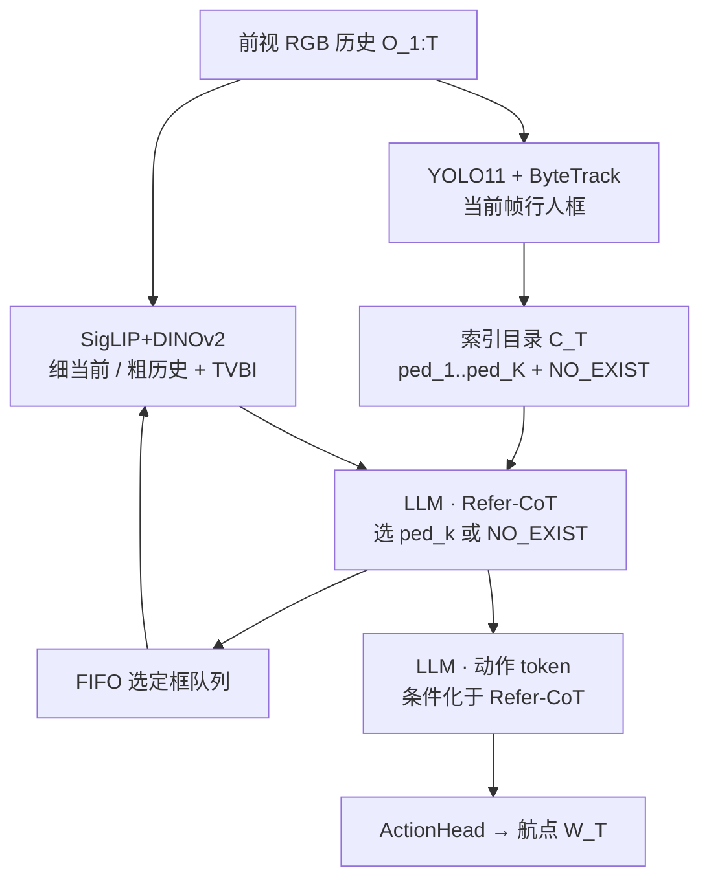
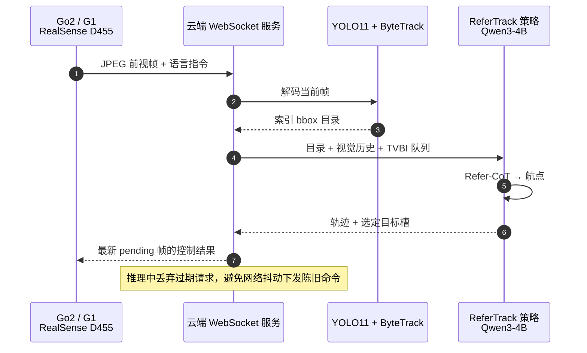

# ReferTrack（Referring Then Tracking · arXiv:2607.20061）

**ReferTrack**（*Referring Then Tracking for Embodied Visual Tracking*，[arXiv:2607.20061](https://arxiv.org/abs/2607.20061)，[项目页](https://medlartea.github.io/referTrack/)，[代码仓](https://github.com/MedlarTea/referTrack)）由 **南方科技大学 RCV Laboratory、腾讯 Robotics X、北京大学、福田实验室** 提出：用单台前视相机完成语言指定的行人跟随，把目标识别写成**图像空间索引 bbox 选择**，再条件化解码跟踪航点。

## 一句话定义

**先 referring、再 tracking：用一个 Refer-CoT token 从当前检测目录里点名要跟的人（或声明不存在），再用 TVBI 把历史选定框几何灌进视觉历史，最后出 egocentric 航点。**

## 英文缩写速查

| 缩写 | 英文全称 | 简要说明 |
|------|----------|----------|
| EVT | Embodied Visual Tracking | 机载视觉 + 自然语言条件下持续跟随动态目标 |
| VLA | Vision-Language-Action | 统一视觉、语言与动作的端到端策略 |
| CoT | Chain-of-Thought | 动作前的显式推理步；本文为单 token Refer-CoT |
| TVBI | Temporal-Viewpoint-Bbox Indicator | 在 TVI 上叠加目标 bbox 几何的历史指示 token |
| TVI | Temporal-Viewpoint Indicator | NavFoM 风格的时空索引 token（不含 bbox） |
| SR / TR / CR | Success / Tracking / Collision Rate | EVT-Bench 主指标（成功率 / 跟踪率 / 碰撞率） |
| STT / DT / AT | Single-Target / Distracted / Ambiguity Tracking | EVT-Bench 三切分 |
| SFT | Supervised Fine-Tuning | 本文仅用 SFT，无 RL 精修 |

## 为什么重要

- **把 EVT 识别瓶颈对齐到 VLM 擅长的 grounding 接口：** TrackVLA++ 等在抽象空间 latent / 极坐标上做 CoT，难监督且与检测框弱对齐；ReferTrack 把「跟谁」收成对索引框的多选题（含 `<NO_EXIST>`）。
- **单相机也能打识别密集切分：** 4B 骨干、仅 SFT，在 DT/AT 上相对单视角 TrackVLA++ 大幅抬升，甚至匹敌或超过若干多相机报告结果——提示**显式图像空间 referring 可补偿有限 FoV**，不必先堆相机或上 RL。
- **工程读点清晰：** 检测用现成 YOLO11+ByteTrack；训练接口与 Refer-QA 共享目录格式，可用 ReID 合成数据补 grounding；真机环是云端 WebSocket + 单前视 RealSense。

## 核心信息

| 项 | 内容 |
|----|------|
| **机构** | 南方科技大学（RCV Laboratory）；腾讯 Robotics X；北京大学；福田实验室 |
| **骨干** | Qwen3-4B；视觉 SigLIP + DINOv2；ActionHead 解 egocentric 航点 \((x,y,\theta)\) |
| **检测目录** | YOLO11 + ByteTrack；top-\(K\) 按框面积；固定虚拟槽 `<NO_EXIST>` |
| **数据** | EVT-Bench / Habitat 3.0 专家轨迹 **1.3M** + SYNTH-PEDES 合成 Refer-QA **1.3M**（1:1） |
| **训练** | 两阶段 SFT；\(\mathcal{L}=\alpha\mathcal{L}_{\text{traj}}+\mathcal{L}_{\text{refer}}+\mathcal{L}_{\text{text}}\)，\(\alpha=10\) |
| **真机** | Unitree Go2 / G1；Intel RealSense D455；云端推理约 **10.6 Hz** |
| **开源** | **宣称将开源 / 占位仓**（截至 2026-08-12：无训练/评测/权重；见 [`sources/repos/refertrack.md`](../../sources/repos/refertrack.md)） |

## 核心原理

### Referring-then-tracking

1. **编码前视历史：** 当前帧细粒度视觉 token + 滑窗粗历史；帧组之间插入指示 token。
2. **建候选目录 \(\mathcal{C}_T\)：** 当前帧行人框索引为 \(\langle ped_1\rangle\ldots\langle ped_K\rangle\)，外加 `<NO_EXIST>`。
3. **Refer-CoT：** LLM 先输出单个选择 token \(E_T^{\text{refer}}\)（CE 监督）。
4. **条件化动作：** 以 \(E_T^{\text{refer}}\) 为前缀再出动作 token，MLP 解 \(M\) 个航点。
5. **FIFO bbox 队列：** 把本步选定框压入长度 \(H-1\) 的队列，供下一步历史 **TVBI** 使用。

TVBI 形式：\(E_{\text{TVBI}}(t)=E_{\text{TVI}}(t)+\mathcal{P}_{\text{bbox}}(b_t)\)。目标缺失时用全零框作哨兵。**当前帧细 token 故意不加 bbox**，只靠历史 TVBI + 原图做 referring，避免「偷看当前框」捷径。

### 流程总览

## 源码运行时序图

**不适用（截至 2026-08-12）。** 官方仓 [MedlarTea/referTrack](https://github.com/MedlarTea/referTrack) 仅有 README、`assets/` 与 `method.pdf`；README TODO 未勾选 checkpoint/评测、数据集、训练代码与 data engine，**无可辨识可运行入口**。核查明细见 [`sources/repos/refertrack.md`](../../sources/repos/refertrack.md)。代码发布后应补本节并与实际脚本路径对齐。

下图仅按**论文部署描述**还原云端推理环，节点为论文模块名而非仓库路径，**不可当作复现入口**：

## 工程实践

| 项 | 建议 |
|----|------|
| 选型场景 | 单前视、语言指定行人跟随；识别（干扰/歧义）比「再加相机」更痛时优先考虑 referring 接口 |
| 检测前端 | 论文默认 YOLO11+ByteTrack；目录容量 \(K\) 不够时按框面积截断——小目标/远距易被挤掉 |
| 缺失目标 | 必须保留 `<NO_EXIST>`；历史缺失用全零框哨兵，勿与有效框混用 |
| 训练配比 | 导航轨迹与 Refer-QA **1:1**；Refer-QA 可用与 TrackVLA 族相同的 SYNTH-PEDES 源以公平对照 |
| 损失权重 | 轨迹 MSE 权重 \(\alpha=10\)，避免 referring CE 淹没控制监督 |
| 部署 | 论文：策略跑远程 GPU；机器人只推流 RGB；环路约 **10.6 Hz**；服务端只保留最新 pending 帧 |
| 复现预期 | **当前无可运行开源实现**；论文写基于 OpenTrackVLA 改造——待官方 release 前勿按「已开源」选型 |

## 实验与评测

**EVT-Bench 单前视（Table 1，SR / TR / CR）：**

| 方法 | Size | RL | STT | DT | AT |
|------|------|----|-----|----|----|
| TrackVLA (single) | 7B | – | 85.1 / 78.6 / 1.7 | 57.6 / 63.2 / 5.8 | 50.2 / 63.7 / 17.1 |
| TrackVLA++ (single) | 7B | – | 86.0 / 81.0 / 2.10 | 66.5 / 68.8 / 4.71 | 51.2 / 63.4 / 15.9 |
| VLingNav (single) | 7B | ✓ | 88.4 / 81.2 / 2.1 | 67.7 / 73.5 / 5.5 | – |
| **ReferTrack** | **4B** | – | **89.4 / 92.5 / 1.6** | **73.3 / 81.8 / 7.6** | **74.1 / 85.7 / 7.7** |

相对单视角 TrackVLA++：DT **+6.8 SR / +13.0 TR**；AT **+22.9 SR / +22.3 TR**。作者强调识别密集切分上可匹敌若干多相机基线。

**DT 消融（Table 2）：**

| 变体 | SR | TR | CR |
|------|-----|-----|-----|
| ReferTrack（YOLO11-X） | 73.3 | 81.8 | 7.6 |
| TVBI + GT bbox（绕过 Refer-CoT） | 81.5 | 84.7 | 3.6 |
| 去 TVBI | 70.4 | 80.8 | 7.5 |
| 去 Refer-CoT & TVBI | 55.7 | 71.4 | 9.4 |

Oracle TVBI 接近专家策略 SR 85.1，说明 **DT 主瓶颈仍在识别而非规划**；Refer-CoT 是增益主源，TVBI 提供额外稳定。

**真机：** Go2 杂乱障碍跟随（窄 FoV 仅见下半身仍可稳）；G1 多人干扰下选对目标。定性，无公开定量真机表。

## 结论

**ReferTrack 证明：在单前视 EVT 上，把「跟谁」收成可监督的图像空间索引选择，比把推理堆进抽象空间 CoT 或先上多相机/RL，更能打识别密集场景。**

1. **主增益来自 referring 接口，不是更大模型：** 4B + 纯 SFT 即可在 STT/DT/AT 单视角全面领先 7B TrackVLA++。
2. **识别仍是 DT 天花板：** GT bbox 喂 TVBI 可把 SR 推到 81.5（接近专家 85.1）；工程上可并行加强检测/ReID，而不必先改规划头。
3. **TVBI 是稳跟踪的增益项，不是主开关：** 单独去掉约 −2.9 SR；与 Refer-CoT 同去则崩到 55.7。
4. **`<NO_EXIST>` + 当前帧不注 bbox** 是防捷径的关键设计，复现时不要「优化掉」。
5. **选型边界：** 适合语言指定行人跟随；CR 在 DT/AT 并非最优，碰撞敏感部署仍需额外避障层。
6. **复现现状：** 官方仓截至入库日为占位，不能按已开源管线排期。

## 与其他工作对比

| 对照 | 差异读法 |
|------|----------|
| TrackVLA / TrackVLA++ | 同 EVT-Bench 主线；后者用空间感知 / 极坐标式 CoT；ReferTrack 改为**索引 bbox 选择**并加 TVBI 几何记忆 |
| [Qwen-RobotNav](./qwen-robot-nav.md) | 通才导航权重亦报 EVT-Bench tracking；协议与观测可控轴不同，数字不可直接横比 |
| [NaVILA](./paper-notebook-navila-legged-robot-vision-language-action-model.md) | 腿式 VLN VLA + 低层 locomotion；目标是指令导航而非持续行人 referring |
| [DA-Nav](./paper-da-nav.md) / [TravExplorer](./paper-travexplorer.md) | 城市/探索向语言导航；无 EVT 式动态行人索引跟踪设定 |
| NavFoM TVI | ReferTrack 的 TVBI 在 TVI 上叠加**被选目标 bbox**，把通用时空索引变成目标条件记忆 |

## 局限与风险

- **开源占位：** 训练/评测/数据/权重均未发布；项目页有 Code 链不等于可复现。
- **CR 代价：** DT/AT 上碰撞率高于部分多相机或 RL 方法（如 CoMaTrack）；SR 高≠部署安全。
- **检测前端绑定：** 目录质量受 YOLO11+ByteTrack 与 \(K\) 截断限制；极端拥挤/小目标会直接伤 Refer-CoT。
- **真机证据为定性：** 无公开真机长程 SR；云端 10.6 Hz 依赖稳定链路。
- **专家数据自建：** 训练轨迹来自 Habitat oracle 控制器，分布与真机社会导航仍有 gap。

## 关联页面

- [视觉–语言导航](../tasks/vision-language-navigation.md) — 语言条件导航/跟踪任务族入口
- [Qwen-RobotNav](./qwen-robot-nav.md) — 同 EVT-Bench 语境的通才导航对照
- [VLA](../methods/vla.md) — 视觉–语言–动作方法纵览
- [NaVILA](./paper-notebook-navila-legged-robot-vision-language-action-model.md) — 腿式导航 VLA + 真机
- [DA-Nav](./paper-da-nav.md) / [TravExplorer](./paper-travexplorer.md) — 户外/探索导航对照

## 参考来源

- [refertrack_arxiv_2607_20061.md](../../sources/papers/refertrack_arxiv_2607_20061.md) — 论文摘录与开源核查
- [medlartea-refertrack.md](../../sources/sites/medlartea-refertrack.md) — 项目页归档
- [refertrack.md](../../sources/repos/refertrack.md) — GitHub 占位仓核查
- [arXiv:2607.20061](https://arxiv.org/abs/2607.20061) — 原文（Submitted 2026-07-22）
- [项目页](https://medlartea.github.io/referTrack/)
- [MedlarTea/referTrack](https://github.com/MedlarTea/referTrack)

## 推荐继续阅读

- [ReferTrack 项目页](https://medlartea.github.io/referTrack/)
- [演示视频](https://youtu.be/CP7h-tWWABU)
- [OpenTrackVLA（论文声明的实现基座）](https://github.com/om-ai-lab/OpenTrackVLA)
- [TrackVLA++（arXiv:2510.07134）](https://arxiv.org/abs/2510.07134) — 空间感知 CoT 对照
- [NavFoM / Embodied Navigation Foundation Model](https://arxiv.org/abs/2509.12129) — TVI 前身
