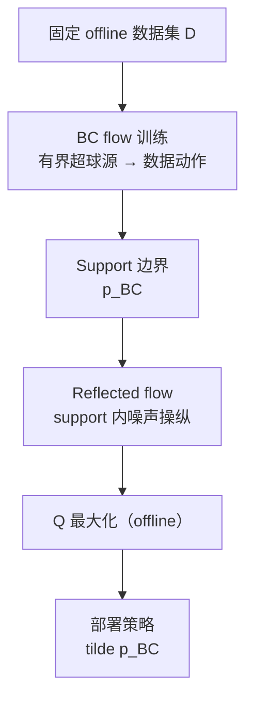
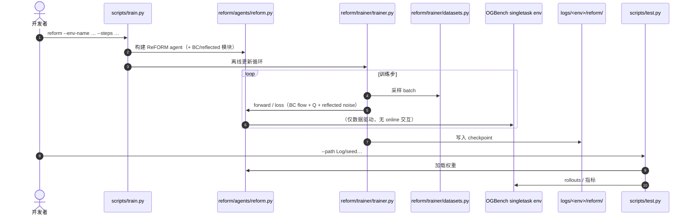

# ReFORM：Support 约束的 Reflected Flow Offline RL

**ReFORM**（*Reflected Flows for On-support Offline RL via Noise Manipulation*，**ICLR 2026**，[OpenReview](https://openreview.net/forum?id=YvFsyRReeN)，[PDF](https://openreview.net/pdf?id=YvFsyRReeN)，[项目页](https://mit-realm.github.io/reform/)，[代码](https://github.com/MIT-REALM/reform)）由 **麻省理工（MIT）REALM**（联合 Boston University、MIT Lincoln Laboratory 作者）提出：在 **flow 动作策略** 上 **按构造满足 support 约束**——先 **BC flow** 将有界源 \(q_\mathrm{BC}=\mathcal U(\mathcal B_l^d)\) 映射到数据集动作分布，再学 **reflected flow** 在 **BC support 内** 操纵噪声以 **最大化 Q**，从而缓解 **OOD Q 误差** 又保留 **多模态**，且 **不依赖** 对行为策略的 **统计距离正则权重**。

## 一句话定义

**用「有界源 BC flow = support 边界」+「support 内 reflected 噪声 = Q 改进」把 offline RL 的保守性写进生成过程，而不是写进可调的距离惩罚项。**

## 英文缩写速查

| 缩写 | 英文全称 | 简要说明 |
|------|----------|----------|
| ReFORM | Reflected Flows for On-support Offline RL via Noise Manipulation | 本文方法 |
| RL | Reinforcement Learning | 强化学习 |
| BC | Behavioral Cloning | 行为克隆；本文 BC flow 刻画 support |
| OOD | Out-of-Distribution | 分布外动作；offline RL 中 Q  bootstrap 失效来源 |
| FQL | Flow Q-Learning | OGBench 系 flow offline RL 强基线之一 |
| IFQL | Implicit Flow Q-Learning | Flow 版 IDQL 基线 |
| DSRL | Diffusion Steering via Reinforcement Learning | 扩散 steering offline RL 基线 |
| IQM | Interquantile Mean | 项目页报告的归一化分数稳健汇总 |
| OGBench | Offline Goal-Conditioned Benchmark | 本文使用其 **singletask** 子集共 40 任务 |

## 为什么重要

- **正则权重痛点：** 许多 offline RL 方法靠 **CQL/IQL/TD3+BC 式距离或保守 Q** 防 OOD，但 **逐任务调参** 且 **仍可能 OOD**；ReFORM 把约束放进 **有界 flow 源 + support 内噪声**，论文强调 **一套超参跑满 40 任务**。
- **Flow 表达力 + 安全改进：** 与 [Sergey Levine：表达力更强的连续动作策略](../overview/sergey-levine-diffusion-expressive-policies.md) 的叙事一致——**生成式动作头** 服务 offline RL；ReFORM 回答「**如何不在 Q 最大化时跑出 support**」。
- **工程可对照：** 官方 [MIT-REALM/reform](https://github.com/MIT-REALM/reform) 同仓实现 **FQL / IFQL / DSRL**，便于在 **OGBench singletask** 上复现 profile 主张。

## 核心信息

| 字段 | 内容 |
|------|------|
| **机构** | 麻省理工（MIT）REALM；Boston University；MIT Lincoln Laboratory（部分作者） |
| **Venue** | ICLR 2026 |
| **OpenReview** | [YvFsyRReeN](https://openreview.net/forum?id=YvFsyRReeN) |
| **Benchmark** | [OGBench](https://seohong.me/projects/ogbench/) — antmaze-large、cube-single、cube-double、scene；**singletask**；clean / noisy 共 **40 任务** |
| **基线** | BC、DSRL、IFQL、FQL（S/M/L 等不同保守强度） |
| **开源（2026-09-30）** | **已开源** — [MIT-REALM/reform](https://github.com/MIT-REALM/reform)（Jax，`pip install -e .`） |

## 核心原理

### 两阶段 flow

| 模块 | 作用 | 直觉 |
|------|------|------|
| **BC flow 策略** | \(q_\mathrm{BC}=\mathcal U(\mathcal B_l^d)\) → \(p_\mathrm{BC}\approx\) 数据集动作 | **有界源** 使目标分布 **携带行为 support** |
| **Reflected flow 噪声** | 生成 \(\tilde q_\mathrm{BC}\)，使 \(\tilde p_\mathrm{BC}\) **仍在 support 内** 且 **Q 更大** | **改进策略** 而不 **外推 Q** |

项目页对比图强调：在相同 flow 结构基线中，仅 ReFORM 能在 **support（红）内** 采样 **多模态、高 Q** 动作。

### 与距离正则路线的差异

| 路线 | 机制 | ReFORM 视角 |
|------|------|-------------|
| TD3+BC / CQL 等 | 惩罚偏离数据或 OOD Q | 改进幅度受 **正则系数** 限制 |
| ReFORM | Support **构造性** 满足 | 论文主张 **无需** 调 **行为策略统计距离** 权重 |

### 流程总览

## 源码运行时序图

官方栈见 [sources/repos/reform_mit_realm.md](../../sources/repos/reform_mit_realm.md)：

## 工程实践

| 项 | 建议 |
|----|------|
| **何时考虑 ReFORM** | 已在 **OGBench / 连续控制 offline** 上使用 **flow / 扩散策略**，且 **距离正则调参** 成本高；需要 **多模态动作** |
| **环境命名** | 必须使用 OGBench **`singletask`** 环境（README 明确 **非 goal-conditioned**） |
| **超参** | 论文主结果 **跨环境共用** 同一套（训练步数、`--q-agg` 等少数例外见 README） |
| **对照实验** | 同仓 `fql` / `ifql` / `dsrl` 与论文 hand-tuned 设定对齐 |
| **机器人侧读法** | 本文为 **基准级 offline RL**（loco + manipulation 仿真任务），非真机系统；选型时对照 [Online vs Offline RL](../comparisons/online-vs-offline-rl.md) |

## 对比

| 方法 | 动作表示 | OOD / 保守机制 | 调参负担（论文叙事） |
|------|----------|----------------|----------------------|
| TD3+BC / CQL / IQL | 通常单峰或 MLP | 距离或保守 Q | 任务相关 |
| FQL / IFQL / DSRL | Flow / 扩散 | 统计距离或 steering 超参 | 论文基线 **hand-tuned** |
| **ReFORM** | BC flow + reflected noise | **Support 构造** | **跨 40 任务固定超参** |

## 实验与评测

- **任务：** 四类环境 × 多 task id × clean/noisy → **40 任务**（项目页 Tasks）。
- **指标：** 跨算法 min–max **归一化回报**；**performance profile**（达到 ≥τ 的概率）与 **IQM** 柱状图。
- **主结论（项目页）：** clean 集 profile **整体高于** hand-tuned flow 基线；noisy 集 **绝大多数 τ** 仍占优，**τ≈0.9** 附近与 **FQL(S)** 在误差带内接近。

## 结论

**ReFORM 的可迁移结论是：把 support 写进 flow 的源分布与 reflected 噪声，有机会同时拿到「多模态 Q 改进」和「少调保守正则」——但证据目前绑在 OGBench singletask 仿真，尚未覆盖真机或视觉策略。**

1. **真影响：support-by-construction** — 用 **BC flow + 有界源** 定义 support，**reflected noise** 在 support 内做 Q 改进，绕开 **统计距离正则** 的主调参轴。
2. **真影响：固定超参 profile** — 40 任务 **同一套超参** vs 基线 **逐任务 hand-tune**；适合作为「flow offline RL 是否值得换结构」的 **强对照点**。
3. **真影响：多模态在 support 内** — 项目页可视化强调相对 FQL/DSRL/IFQL，**高 Q 且多模态** 且不越 support。
4. **次要代价：极高 τ 段** — noisy 集 **τ≈0.9** 与 FQL(S) 接近，说明 **极端尾部** 未必全面碾压最保守 flow 变体。
5. **部署读法：** **Jax + OGBench** 实验栈；迁移到 **高维视觉人形** 需另证 support 估计与 flow 代价。
6. **工程读法：** [MIT-REALM/reform](https://github.com/MIT-REALM/reform) **已开源**；复现从 `scripts/train.py reform` + README 论文命令列表开始。

## 局限与风险

- **Benchmark 域：** 结论来自 **OGBench 离线控制**，与 [Behavioral Cloning Mysteries](../concepts/behavioral-cloning-mysteries.md) 讨论的 **窄分布 BC 现象** 不同设定；外推到人形 **视觉–动作** 需谨慎。
- **Support 假设：** 方法依赖 **BC flow 能忠实覆盖行为 support**；数据极窄或非平稳时 support 估计仍可能失败。
- **计算：** Flow 训练/推理成本高于单峰高斯策略；是否值得取决于任务 **多模态程度** 与 **调参预算**。

## 关联页面

- [Online RL vs Offline RL](../comparisons/online-vs-offline-rl.md)
- [Reinforcement Learning](../methods/reinforcement-learning.md)
- [Diffusion Policy](../methods/diffusion-policy.md)
- [Probability Flow](../formalizations/probability-flow.md)
- [Sergey Levine：表达力更强的连续动作策略](../overview/sergey-levine-diffusion-expressive-policies.md)

## 参考来源

- [reform_iclr_2026.md](../../sources/papers/reform_iclr_2026.md) — 论文摘录与 BibTeX
- [reform-mit-realm-github-io.md](../../sources/sites/reform-mit-realm-github-io.md) — 项目页与开源核查
- [reform_mit_realm.md](../../sources/repos/reform_mit_realm.md) — 官方 Jax 仓库结构

## 推荐继续阅读

- [ReFORM 项目页](https://mit-realm.github.io/reform/)
- [Flow Q-Learning（FQL）](https://seohong.me/projects/fql/)
- [OGBench](https://seohong.me/projects/ogbench/)
- [OpenReview 论坛帖](https://openreview.net/forum?id=YvFsyRReeN)
