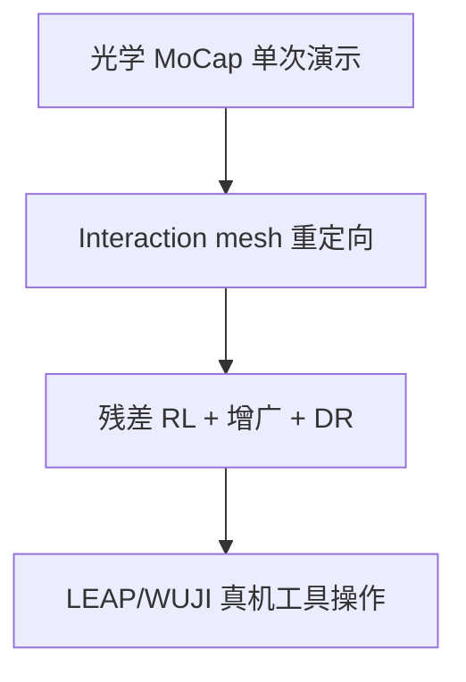

# REGRIND

**REGRIND**（*A Minimalist Retargeting-Guided Reinforcement Learning Recipe for Dexterous Manipulation*，arXiv:[2607.11874](https://arxiv.org/abs/2607.11874)，[项目页](https://www.yunhaifeng.com/REGRIND/)，[GitHub](https://github.com/yunhaif/regrind)）是 Cornell + Amazon FAR 提出的 **灵巧 contact-rich 操作** 极简学习管线。方法细节见 [REGRIND（重定向引导灵巧操作 RL）](../methods/regrind-retargeting-guided-rl.md)。

## 一句话定义

用 **光学 MoCap 单次人手–物体演示**，经 **交互保留重定向** 与 **残差 RL 物体关键点跟踪**，在 **LEAP / WUJI** 灵巧手上学习剪刀、螺丝刀等 **工具操作**，并 **零样本** 部署真机。

## 英文缩写速查

| 缩写 | 英文全称 | 简要说明 |
|------|----------|----------|
| REGRIND | REtargeting-Guided ReINforcement learning for Dexterous manipulation | 论文方法名 |
| RL | Reinforcement Learning | 仿真残差策略学习 |
| MoCap | Motion Capture | 光学动捕提供手与物体位姿 |
| RSI | Reference State Initialization | 参考轨迹上的探索重启分布 |
| DR | Domain Randomization | 仿真参数随机化 |
| MANO | hand Model with Articulated and Non-rigid deformations | 21 点手部模型 |

## 为什么重要

- **把 WBT「重定向 + RL」配方推到工具操作：** 验证 **interaction-preserving retargeting** 对 contact-rich 灵巧任务 downstream RL 的必要性。
- **单演示 + 开源：** 代码与重定向轨迹公开；相对 teleop 数据采集成本更低。
- **sim2real 经验总结：** 系统实验表明 manipulation 比 locomotion **更依赖** 接触建模、观测设计与系统辨识。

## 方法概要

| 模块 | 作用 |
|------|------|
| MoCap 演示 | MANO + 物体位姿（ARCTIC 剪刀 / 自采螺丝刀） |
| Interaction mesh 重定向 | OmniRetarget 同族 Laplacian 优化（Drake + MOSEK） |
| 残差 RL | 物体关键点跟踪 + RSI + 训练时 SE(3) 增广 |
| 真机 | UR5e + LEAP(16-DoF) / WUJI(20-DoF)；MoCap 馈物体状态 |

### 流程总览

## 实验与评测

- **平台：** UR5e + LEAP / WUJI；四任务：剪刀/螺丝刀 × 两灵巧手。
- **仿真（Table 1）：** REGRIND SR **98.7–99.8%**；DexMachina scissors **0–22%**；SPIDER **0%**（不适合 residual RL 初始化）。
- **真机（Table 2）：** LEAP 剪刀 **9/10**、螺丝刀 **10/10**；WUJI 螺丝刀 **9/10**；WUJI 剪刀 **0/10**。
- **初态泛化（Table 3）：** ±5 cm / ±30° 扰动下性能与演示初态接近。

## 与其他工作对比

| 方法 | 重定向 | 下游 | 剪刀/螺丝刀真机 |
|------|--------|------|-----------------|
| Mink IK + RL | 纯 IK | 同配方 RL | 多数失败 |
| DexMachina | functional IK + 仿真投影 | RL | scissors 真机 **0/10** |
| SPIDER | 物理采样 MPC | 开环/MPC | SR **0%**（论文设置） |
| **REGRIND** | **interaction mesh** | **残差 RL + 增广** | **9–10/10**（除 WUJI-Scissors） |

## 核心信息

| 字段 | 内容 |
|------|------|
| 机构 | 康奈尔大学（Cornell University）；亚马逊 FAR（Amazon FAR） |
| 作者 | Yunhai Feng, Natalie Leung, Jiaxuan Wang, Lujie Yang, Haozhi Qi, Preston Culbertson |
| arXiv | [2607.11874](https://arxiv.org/abs/2607.11874) |
| 项目页 | <https://www.yunhaifeng.com/REGRIND/> |
| 代码 | <https://github.com/yunhaif/regrind>（MIT） |

## 局限

- 真机依赖 **MoCap 物体位姿**；vision 蒸馏待完成。
- 需 **系统辨识**；WUJI-Scissors 暴露 mesh 与非反驱电机问题。

## 关联页面

- [REGRIND（重定向引导灵巧操作 RL）](../methods/regrind-retargeting-guided-rl.md)
- [TopoRetarget（交互保留灵巧重定向）](../methods/toporetarget-interaction-preserving-dexterous-retargeting.md)
- [SPIDER（物理感知采样式灵巧重定向）](../methods/spider-physics-informed-dexterous-retargeting.md)
- [OmniRetarget](./paper-hrl-stack-03-omniretarget.md)
- [Manipulation（操作）](../tasks/manipulation.md)

## 推荐继续阅读

- arXiv HTML 全文：<https://arxiv.org/html/2607.11874>
- 项目视频：<https://www.yunhaifeng.com/REGRIND/>

## 参考来源

- [regrind_arxiv_2607_11874](../../sources/papers/regrind_arxiv_2607_11874.md)
- [regrind-project-yunhaifeng](../../sources/sites/regrind-project-yunhaifeng.md)
- [regrind（GitHub）](../../sources/repos/regrind.md)
