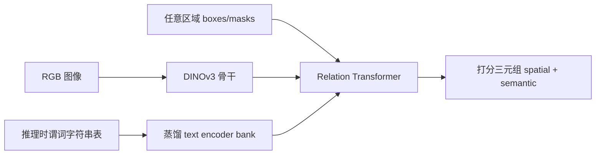
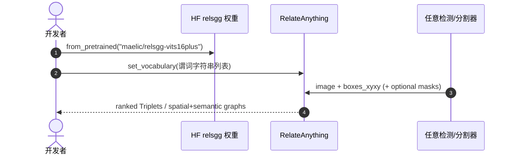

# RelateAnything：实时开放词汇关系预测

**RelateAnything**（*Real-Time Open-Vocabulary Relation Prediction From Any Inputs*，[arXiv:2609.12552](https://arxiv.org/abs/2609.12552)，[项目页](https://maelic.github.io/RelateAnythingProject/)，[代码](https://github.com/Maelic/RelateAnything)）由 **Maëlic Neau** 提出：把 **关系预测** 做成与开放词汇检测/可提示分割同构的接口——**图像 + 任意来源区域 + 推理时谓词字符串表** → 打分 `<subject, predicate, object>` 三元组，**全程不使用物体类别标签**。

## 一句话定义

**RelateAnything = 关系层的「开放词汇模块」：区域从哪来、谓词列表写什么，都在推理时决定，53M 参数 A40 上约 20 ms/帧。**

## 英文缩写速查

| 缩写 | 英文全称 | 简要说明 |
|------|----------|----------|
| SGG | Scene Graph Generation | 场景图生成（主体-谓词-客体三元组） |
| OV | Open-Vocabulary | 开放词汇，推理时指定类别/谓词表 |
| VLM | Vision-Language Model | 视觉-语言模型（RA-4M 标注器） |
| PU | Positive-Unlabeled | 正例-未标注学习（万级谓词监督） |
| ONNX | Open Neural Network Exchange | 浏览器/CPU 部署格式 |

## 为什么重要

- **补齐感知栈缺口：** 检测/分割已把 taxonomy 外置，关系预测仍绑 VG150 的 50 谓词 + 物体类别条件；RelateAnything 让 **关系头可插拔** 到 YOLOE、FastSAM 等任意区域源。
- **监督 + 评测一体发布：** [RA-4M](https://huggingface.co/datasets/maelic/RA-4M)（474k 图、4.3M 关系、10k+ 自由文本谓词 + 几何校验）与 **OV-SGG-Bench** 六轴协议，直接回应「标准 recall 其实在测 corpus 一致」的批评。
- **机器人语义地图触点：** 与 [ConceptGraphs](./paper-conceptgraphs-open-vocabulary-3d-scene.md) 等 **开放词汇 3D 场景图**、[RoboSpatial](./robospatial.md) **egocentric 空间关系**、[PointArena](./pointarena.md) **语言引导 pointing** 可组成「区域 → 关系 → 规划/QA」链。

## 核心信息

| 项 | 内容 |
|----|------|
| **机构** | 独立研究者（Maëlic Neau） |
| **参数量** | 53M（推荐 `relsgg-vits16plus`，DINOv3 ViT-S/16+） |
| **延迟** | ~20 ms/frame（A40，batch=1，全 19,103 谓词表） |
| **开源** | **已开源** [Maelic/RelateAnything](https://github.com/Maelic/RelateAnything)；HF 权重 + RA-4M + OV-SGG-Bench + [浏览器 demo](https://maelic.github.io/RelateAnythingProject/demo/) |

### 流程总览

### 方法要点

- **输入解耦：** 仅像素 + box 坐标；**无** object class label；换检测器/分割器不需重训关系模型。
- **谓词即输入：** 无 predicate classifier；视觉 pair embedding 与 text bank 做 cosine，换词汇 = 替换 embedding 矩阵行。
- **RA-4M 构建：** Gemma 4 (26B) 对 **编号 box marker** 三 pass 标注 + SAM 2.1 mask；**确定性几何 gate** 拒绝与 box 几何矛盾的关系（约 11.3%）。
- **万级词汇训练：** batch-local InfoNCE + 同义词组正例；蒸馏 text encoder 加 **antonym-repulsion**（缓解 above/below cosine≈0.95）。

## 评测

| 协议 | 读法 |
|------|------|
| **OV-SGG-Bench 六轴 composite** | RelateAnything **40.1** vs OvSGTR **11.8**（跨数据集，训练集未贡献测试图） |
| A1 Transfer | mean recall 为 OvSGTR 同级 **2.3–3.5×**；稀有谓词 **5–21×** |
| A2 Precision | 唯一看 **人工裁决负例** 的轴；测 confident FP |
| A4 Deployment | 共享检测器上的 detection-mode 图 |
| A6 Spatial | SpatialSense 对抗空间关系 |
| 对照 | 相对 **ROBIN-3B**（3B VLM SGG）在多数 recall 指标领先，参数量 **<2%** |

论文强调：**in-domain 增益约高估 cross-dataset 转移 5×**； leaderboard 常用 recall 可被 **不看像素的频率表** 击败——读数须看协议与 shared triplet mass。

## 对比

| 维度 | 经典 SGG（VG150/PSG） | OvSGTR | RelateAnything |
|------|----------------------|--------|----------------|
| 谓词词汇 | 固定 50–56 | 开放但常绑物体类 | 推理时字符串表（19k+） |
| 物体标签 | 条件于预测/GT 类 | 需要 | **从不输入** |
| 区域源 | 固定检测器 | 耦合 | **任意** |
| 规模 | 数百 M–B 级常见 | 较大 | **53M，20 ms** |

## 工程实践

| 项 | 说明 |
|----|------|
| 安装 | `pip install -e ".[hub]"`（Python 3.12+） |
| 默认模型 | `maelic/relsgg-vits16plus` |
| 换谓词 | `model.set_vocabulary(["tethered to", ...])` |
| 双图输出 | `decompose=True` → spatial + semantic 两图一次 forward |
| 部署 | ONNX 浏览器 demo；`pip install -e ".[deploy]"` |

## 局限与风险

- **区域质量上限：** A4 轴表明 detection-mode 性能受检测器 pair-recall 天花板约束。
- **VLM 标注偏差：** RA-4M 虽有几何 gate，仍继承 VLM 语义偏见；9.03 relations/image 密度高但需按任务验证。
- **评测复杂度：** 六轴 composite 比单一 recall 可信，但 A5 graph-quality 依赖 VLM judge，存在偏好短图倾向（论文已披露）。
- **与 pointing benchmark 分工：** [PointArena](./pointarena.md) 测 **语言→点**；RelateAnything 测 **区域对→关系**，互补而非替代。

## 结论

**RelateAnything 把关系预测从「绑死 50 谓词 + 物体类」推进到与开放词汇检测同构的 **可插拔模块**，并以 RA-4M + OV-SGG-Bench 提供可复现监督与更诚实的跨数据集读法。**

- 53M / 20 ms 使关系头可进 **实时感知环**（导航、监控、操作前场景理解）
- **无 object label** 设计允许 FastSAM 等 **类无关区域** 直接接关系图
- 推理时谓词表 = **任务定制关系 ontology**，无需为每个 domain 重训 classifier
- RA-4M 几何校验是 machine-annotated relation corpus 的 **可借鉴范式**
- 读 leaderboard 时必须区分 **in-domain vs cross-dataset**（约 5× 高估）
- 代码、权重、数据、浏览器 demo **均已发布**，Apache-2.0

## 源码运行时序图

## 关联页面

- [ConceptGraphs 开放词汇 3D 场景图](./paper-conceptgraphs-open-vocabulary-3d-scene.md)
- [RoboSpatial](./robospatial.md)
- [PointArena](./pointarena.md)
- [3D 空间 VQA](../concepts/3d-spatial-vqa.md)
- [空间推理 benchmark 地图](../overview/spatial-reasoning-benchmarks-technology-map.md)
- [具身大模型评测基准选型闭环](../queries/embodied-eval-benchmark-selection-loop.md) — 本页归其 ① 认知评测层：开放词汇场景图关系预测，关系 recall 高 ≠ 策略可消费的 3D 语义
- [机器人视觉感知栈选型闭环](../queries/robot-perception-stack-selection-loop.md) — 本页归其 ③ 2D→3D 提升与语义建图层：场景图给出关系语义，仍需提升到无歧义 3D 才可被策略消费

## 参考来源

- [relateanything_arxiv_2609_12552.md](../../sources/papers/relateanything_arxiv_2609_12552.md)
- [relateanything-project.md](../../sources/sites/relateanything-project.md)
- [maelic-relateanything.md](../../sources/repos/maelic-relateanything.md)

## 推荐继续阅读

- [RelateAnything 项目页与 demo](https://maelic.github.io/RelateAnythingProject/)
- [GitHub Maelic/RelateAnything](https://github.com/Maelic/RelateAnything)
- [HF RelateAnything 模型合集](https://huggingface.co/collections/maelic/relateanything)
- [RA-4M 数据集](https://huggingface.co/datasets/maelic/RA-4M)
