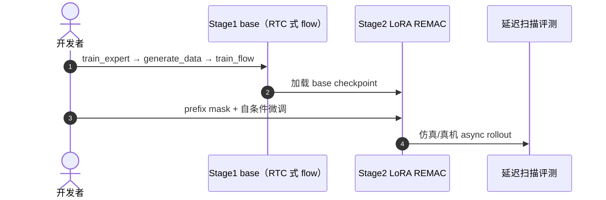

# REMAC（Masked Action Chunking · arXiv:2601.20130）

**REMAC**（*Real-Time Robot Execution with Masked Action Chunking*，[arXiv:2601.20130](https://arxiv.org/abs/2601.20130)，[项目页](https://remac-async.github.io/)，[代码](https://github.com/hatchetProject/REMAC)）由 **伊利诺伊大学芝加哥分校（UIC）**、**中佛罗里达大学（UCF）**、**思科研究（Cisco Research）** 等提出：**训练期** 让 flow VLA 适应异步执行，同时显式处理 **chunk 内感知–动作错位（intra-chunk inconsistency）** 与 **chunk 边界不连续（inter-chunk discontinuity）**。

## 一句话定义

> **用 delay 条件 mask 只监督「还会被执行」的后缀，并用自条件课程 + 推理 prefix-preserving 去噪，让同一策略在全 delay 谱上仍稳——推理不比 base 更慢。**

## 英文缩写速查

| 缩写 | 英文全称 | 简要说明 |
|------|----------|----------|
| REMAC | Real-Time Execution with Masked Action Chunking | 本文框架 |
| RTC | Real-Time Chunking | 推理期 inpainting 对照 |
| VLA | Vision-Language-Action | 预训练 flow 策略 |
| TE | Temporal Ensembling | ACT 式跨 chunk 平均 |
| BID | Bidirectional Decoding | 多样本选优解码对照 |

## 为什么重要

- **问题分解比「只修边界」更完整：** [RTC](./paper-real-time-chunking.md) 等强调 overlap / inpainting；REMAC 指出 delay 下 **前缀动作来自旧观测**，单 chunk 内已在 OOD。
- **零推理税：** 相对 inference-time RTC **不增加** 去噪步或 VJP；与 test-time 方法 **可叠加**（论文报告组合增益）。
- **工程可跑：** [hatchetProject/REMAC](https://github.com/hatchetProject/REMAC) 提供 Kinetix 两阶段（base → LoRA REMAC）脚本。

## 核心信息

| 项 | 内容 |
|----|------|
| **机构** | UIC；UCF；Cisco Research |
| **会议** | ICLR 2026 |
| **开源** | **已开源**（仿真管线；真机视频在项目页） |

## 核心原理

### Intra-chunk：Prefix Masking

- 对 flow 目标 \(\hat u_\tau\) 与 GT \(u_\tau\)，用 \(m_d^\tau=\mathbb{1}[\tau\ge d]\) 限制 loss 到 **可执行后缀**；\(d\sim\mathcal{U}\{0,\ldots,P-1\}\) 覆盖 delay。
- 避免在训练里过度拟合 **已承诺但观测已过期** 的前缀步。

### Self-conditioned Curriculum

- 训练输入由 GT chunk 与 **预训练策略预测** 按 Bernoulli(\(\sigma\)) 混合；\(\sigma\) 从 1 退火到 0，模拟 test-time 前缀先验而不每步 rollout。

### Inter-chunk：Prefix-preserving Sampling

- 推理去噪 **冻结** 已执行前缀，与 RTC 类「硬 prefix」一致但来自 **训练目标** 而非 inpainting 引导。

## 评测

- **12** 个 Kinetix 仿真任务 + **3** 组真机（项目页含 +0 / +150 ms 注入 delay 视频）。
- 报告：更高 completion、更快 wall-clock、delay 扫描下成功率更平；[FutureRTC](./paper-futurertc.md) 表格中 REMAC 作为 training-time 强基线。

## 结论

**异步 chunk 要稳，既要修边界，也要修 chunk 内「观测晚了、动作还在按旧图走」——REMAC 用 mask + 自条件在训练里一次性付账。**

- 推理延迟与冻结 VLA 相同，适合作为 **异步部署的默认微调头**
- 可与 inference-time RTC 并用，但需自行验证叠加超参
- 真机细节以项目页视频为准；仓内以 Kinetix 为主入口
- 与 [Training-Time RTC](./paper-training-time-real-time-chunking.md) 同属训练适配，但 REMAC 强调 **intra-chunk mask** 而非 PI prefix flow 条件化

## 源码运行时序图

## 局限与风险

- 需要 **第二阶段微调**（LoRA）；不像纯 inference-time RTC 那样零训练即插。
- 与 VLASH / T-RTC / FutureRTC 等同屏对比时，注意各方法 **是否改 base 权重、是否加 adapter**。
- UCF 等机构 tag 未全量进 [`institutions.json`](../../schema/institutions.json)；正文以机构表为准。

## 关联页面

- [Real-Time Chunking](./paper-real-time-chunking.md)
- [Training-Time RTC](./paper-training-time-real-time-chunking.md)
- [FutureRTC](./paper-futurertc.md)
- [Action Chunking](../methods/action-chunking.md)

## 参考来源

- [remac_arxiv_2601_20130](../../sources/papers/remac_arxiv_2601_20130.md)
- [remac-async-github-io](../../sources/sites/remac-async-github-io.md)
- [remac 仓库归档](../../sources/repos/remac.md)

## 推荐继续阅读

- [arXiv:2601.20130](https://arxiv.org/abs/2601.20130)
- [REMAC 项目页](https://remac-async.github.io/)
