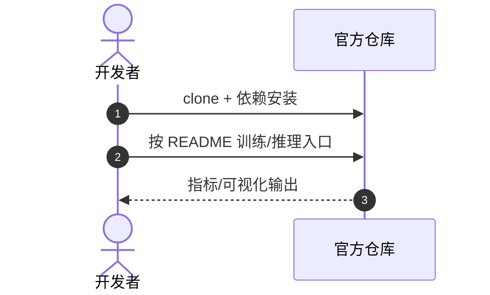

# ReMoMask-2

**ReMoMask-2**（*Latent Retrieval-Augmented Masked Motion Generation*，[arXiv:2609.08365](https://arxiv.org/abs/2609.08365)，[项目/代码](https://github.com/AIGeeksGroup/ReMoMask-2)）— 详见 [具身智能小站 10 篇盘点（2026-09-09）](../../sources/blogs/wechat_embodied_station_visual_focus_10_papers_2026-09-09.md)。

## 一句话定义

文本到动作生成常把检索库和生成器潜空间分开——ReMoMask-2 在 masked motion 生成器的潜变量里直接做 retrieval-augmented 生成。

## 英文缩写速查

| 缩写 | 英文全称 | 简要说明 |
|------|----------|----------|
| ReMoMask-2 | Retrieval-augmented Masked Motion Gen v2 | 本文框架 |
| T2M | Text-to-Motion | 文本条件动作生成 |
| RAG | Retrieval-Augmented Generation | 检索增强生成 |
| VAE | Variational Autoencoder | 动作潜空间量化 |

## 为什么重要

- 检索库建在生成器 pre-quantization latent，而非外部动作空间
- 轻量 text projector 对齐查询

## 核心信息

| 项 | 内容 |
|----|------|
| **arXiv** | [2609.08365](https://arxiv.org/abs/2609.08365) |
| **开源** | **已开源** |
| **项目/代码** | [https://github.com/AIGeeksGroup/ReMoMask-2](https://github.com/AIGeeksGroup/ReMoMask-2) |

## 核心原理

- 检索库建在生成器 pre-quantization latent，而非外部动作空间
- 轻量 text projector 对齐查询
- GitHub + 项目页已公开

## 源码运行时序图

官方仓 [https://github.com/AIGeeksGroup/ReMoMask-2](https://github.com/AIGeeksGroup/ReMoMask-2)（归档见 [remomask-2.md](../../sources/repos/remomask-2.md) 若已建）：

- **最短复现：** 以 README 训练/评测脚本为准。

## 实验与评测

- 指标与设置以原文 PDF / 项目页为准；上文 Highlights 来自公众号归纳 + 项目页摘要。
- 横向对照见 [视觉聚焦与数据效率 10 篇技术地图](../overview/visual-focus-data-efficiency-10-papers-technology-map.md)。

## 与其他工作对比

> 下表只做**定位对照**，不做跨设定横比：本页 Highlights 来自公众号归纳 + 项目页摘要（见参考来源），未逐条核对原文实验表，与下列各页不共享同一评测协议。

| 对照 | 差异读法 |
|------|----------|
| **外部动作空间检索的 RAG-T2M**（含 ReMoMask 一代，本文要改的默认做法） | 差别在**检索库建在哪一层**：检索发生在原始/外部动作空间时，取回的片段要再编码进生成器潜空间，中间隔着一次表示转换；ReMoMask-2 把库直接建在生成器**预量化潜空间**里，取回来的东西与生成器同构，靠轻量 text projector 把文本查询投到同一空间 |
| [扩散式动作生成](../methods/diffusion-motion-generation.md) | 主要的生成范式对照：扩散逐步去噪，masked motion 生成按掩码并行填充，后者推理步数少；检索增强对两者都可加，但潜空间同构这条只在有离散/量化潜变量的框架里成立 |
| [GenMo](../methods/genmo.md) / [HY-Motion-1](../methods/hy-motion-1.md) | 库内同类文本到动作生成路线；读法提醒：T2M 指标（FID、R-Precision、MM-Dist）在各自设定下报，**不可直接横比**，选型看是否需要检索库可控与可更新 |
| [运动重定向流水线](../concepts/motion-retargeting-pipeline.md) | 落地边界：T2M 输出的是**人体动作**，接到机器人还要过重定向与物理可行性检查；文本条件生成得再好也不保证目标本体能执行 |
| [运动数据质量](../concepts/motion-data-quality.md) | 检索增强的隐含依赖：生成质量的上限由**检索库里的动作质量**决定，库脏则检索出的先验也脏，这一环不由模型结构解决 |

## 结论

**ReMoMask-2 的可迁移主张已写入 Highlights；部署前以原文实验设定与开源边界为准。**

1. **真影响：** 见核心原理 bullets。
2. **次要代价：** 预印本/待开源项需独立复现验证。
3. **部署读法：** 已开源 — 先读 README 或项目页再接真机/智能体栈。

## 关联页面

- [视觉聚焦与数据效率 10 篇技术地图](../overview/visual-focus-data-efficiency-10-papers-technology-map.md)
- [模仿学习](../methods/imitation-learning.md)
- [扩散式动作生成](../methods/diffusion-motion-generation.md) — 生成范式对照
- [GenMo](../methods/genmo.md) / [HY-Motion-1](../methods/hy-motion-1.md) — 库内同类 T2M 路线
- [运动重定向流水线](../concepts/motion-retargeting-pipeline.md) — 人体动作到机器人的落地边界
- [运动数据质量](../concepts/motion-data-quality.md) — 检索库质量即生成上限

## 参考来源

- [remomask_2_arxiv_2609_08365.md](../../sources/papers/remomask_2_arxiv_2609_08365.md)
- [具身智能小站 10 篇盘点（2026-09-09）](../../sources/blogs/wechat_embodied_station_visual_focus_10_papers_2026-09-09.md)
- [arXiv:2609.08365](https://arxiv.org/abs/2609.08365)

## 推荐继续阅读

- [原文 PDF](https://arxiv.org/pdf/2609.08365)
- [项目/代码](https://github.com/AIGeeksGroup/ReMoMask-2)
