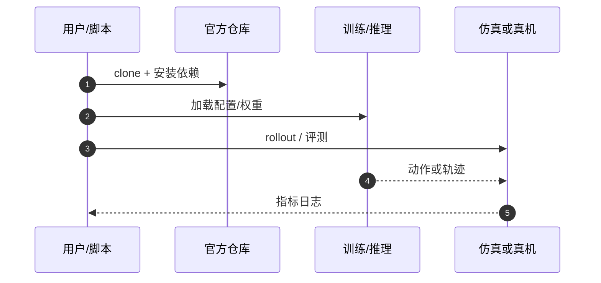

# Remote Surfaces（arXiv:2609.27938）

**Remote Surfaces at Your Fingertips: Electrovibration-Based Tactile Feedback for Robot Teleoperation via Touchscreen Interfaces**（[代码](https://github.com/kenanalperen/Remote-Surfaces-at-Your-Fingertips)，[项目页](https://github.com/kenanalperen/Remote-Surfaces-at-Your-Fingertips.git)，[arXiv:2609.27938](https://arxiv.org/abs/2609.27938)）来自 [具身智能小站 · 13 篇盘点](../../sources/blogs/wechat_embodied_13_papers_forgetmimic_2026-09-24.md)（2026-09-24）。

## 一句话定义

**电振动触觉把远程刚性接触映射到触摸屏，改善遥操作响应时间与临场感（N=21 用户研究）。**

## 英文缩写速查

| 缩写 | 英文全称 | 简要说明 |
|------|----------|----------|
| VLA | Vision-Language-Action | 视觉–语言–动作策略 |
| RL | Reinforcement Learning | 强化学习 |
| TO | Trajectory Optimization | 轨迹优化 |
| HITL | Human-in-the-Loop | 人在回路 |

## 为什么重要

- 力反馈遥操作受稳定性/延迟制约；纯视觉增加认知负担。
- 纳入 [13 篇技术地图](../overview/embodied-13-papers-technology-map.md) 阅读坐标。
- 开源结论（步骤 2.5，2026-09-24）：**已开源**。

## 核心机制

| 项 | 内容 |
|----|------|
| **arXiv** | [2609.27938](https://arxiv.org/abs/2609.27938) |
| **开源** | **已开源** |
| **要点** | 远程接触事件驱动触摸屏 electrovibration 模式；对比纯视觉/无力反馈基线。 |
| **文内指标** | N=**21** 用户：响应时间与临场感改善（具体量表以 PDF 为准）。 |

## 源码运行时序图

## 实验与评测

- N=**21** 用户：响应时间与临场感改善（具体量表以 PDF 为准）。
- **读法：** 公众号归纳；逐项 baseline 与协议以 arXiv PDF 为准。

## 与其他工作对比

- 横向索引见 [13 篇技术地图](../overview/embodied-13-papers-technology-map.md)。

## 结论

**轻量触觉通道可补视觉遥操作** — 核维护等安全关键场景值得试点。

1. 开源边界：**已开源** — 以项目页/仓库实际链接为准（入库日 2026-09-24）。
2. 核心机制：远程接触事件驱动触摸屏 electrovibration 模式；对比纯视觉/无力反馈基线。…
3. 部署前核对任务协议与硬件条件，勿直接横比公众号摘录数字。

## 关联页面

- [Manipulation](../tasks/manipulation.md)
- [Teleoperation](../tasks/teleoperation.md)
- [Vision Language Navigation](../tasks/vision-language-navigation.md)
- [Embodied 13 Papers Technology Map](../overview/embodied-13-papers-technology-map.md)

## 参考来源

- [13 篇盘点（公众号）](../../sources/blogs/wechat_embodied_13_papers_forgetmimic_2026-09-24.md)
- [Remote Surfaces at Your Fingertips: Electrovibration-Based Tactile Feedback for Robot Teleoperation via Touchscreen Interfaces](../../sources/papers/remote-surfaces-electrovibration_arxiv_2609_27938.md)

## 推荐继续阅读

- [arXiv:2609.27938](https://arxiv.org/abs/2609.27938) — 原文
