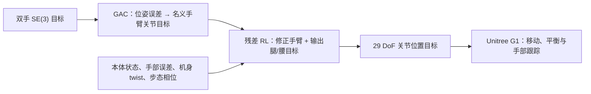

# ResGAC：全身人形控制中的精确 SE(3) 末端执行器跟踪

**ResGAC**（Joohwan Seo 等，UC Berkeley / Amazon FAR / CMU，arXiv:[2610.09479](https://arxiv.org/abs/2610.09479)，[项目页](https://resgac.github.io/ResGAC-website/)）结合几何导纳控制的名义末端跟踪动作与残差强化学习：控制器负责手臂位姿误差反馈，策略补偿动态误差并协调其余全身关节，使 Unitree G1 在站立、基座移动和行走扰动下仍能精确跟随双手 SE(3) 目标。

## 英文缩写速查

| 缩写 | 英文全称 | 简要说明 |
|------|----------|----------|
| SE(3) | Special Euclidean group in 3D | 三维位置与方向组成的刚体位姿空间 |
| GAC | Geometric Admittance Control | 将末端位姿误差映射成名义手臂关节目标 |
| RL | Reinforcement Learning | 学习手臂残差与腿/腰协调目标 |
| EEF | End Effector | 末端执行器；本文主要指双手 |
| H0 | Ground-attached Heading Frame | 保留平面位置/偏航，剔除 pelvis roll/pitch/heave 的地面航向坐标系 |

## 方法：名义几何控制 + 有界残差 + 全身协调

- **GAC 名义动作：**由浮动基座下的几何位姿误差反馈产生手臂目标，使用阻尼伪逆与零空间项处理运动学映射。
- **残差策略：**手臂目标上叠加受限残差；腿/腰 15 个关节目标由策略直接输出。G1 共 29 DoF，其中手臂 14 DoF。
- **策略观测：**包括速度命令、关节状态/速度、投影重力、机身角速度、GAC 动作、末端位姿误差、机身 twist、最近动作及步态相位。critic 可看仿真 pelvis 线速度特权量，部署 actor 不需要该量。
- **部署接口：**50 Hz 策略输出关节位置目标，由低层 PD 执行。

### H0 解决什么问题

世界固定目标直接变换进 pelvis 坐标系时，躯干 roll、pitch、heave 会传到手部参考。H0 保留水平位置与偏航、去除这三类变化，可减弱行走时一部分参考扰动。实验显示 roll 传递与手部 z 误差改善明显，但 pitch 基本不变；H0 不是完整扰动隔离器。

## 真机结果

| 场景 | 结果 | 解读 |
|------|------:|------|
| 站立 setpoint | 6.5 mm / 1.37° MAE | 留出轨迹跟踪优于所测基线 |
| 站立 pick-and-place | 6.6 mm / 1.67° MAE | 手部精度用于操作轨迹 |
| Peg-in-hole | 18/20（90%）；SONIC v1.1 为 10/20（50%） | 25 mm 销、35 mm 孔；失败涉及注册误差与 OptiTrack 遮挡 |
| 移动基座世界系跟踪 | 8.8 mm / 2.69°；E2E RL 为 30 mm / 13.75° | 基座运动时维持位置/方向精度 |
| 行走静态手保持 | H0 roll 传递比 0.790（无 H0 为 0.958）；z MAE 12.6 mm（无 H0 为 22.5 mm） | pitch 传递未改善（0.964 vs 0.954） |

这些结果来自特定硬件、轨迹与标记系统，不应外推为所有动态接触任务的成功率。插孔仅 20 次，且依赖 OptiTrack 注册；评测也未证明可完全抵消身体运动。

## 结论

- 末端目标明确且已有可靠几何控制器时，可由传统控制承担名义跟踪，让 RL 聚焦移动、接触与未建模动态。
- 该方法不只是给手臂加残差：手臂围绕 GAC 修正，腿/腰由策略直接协调，输出统一为关节位置目标。
- 世界系适合外部固定目标；H0 减少部分躯干姿态进入手部参考，但不能假定其对每个方向都同样有效。
- 扩展验证应覆盖注册/遮挡、不同步态相位、接触力与连续移动基座，并报告多次试验和失败模式。

## 工程实践与开源状态

项目补充材料给出 Isaac Sim / Holosoma、FastSAC、4096 并行环境、单张 L40S 约 16 小时训练、50 Hz actor 和 Pinocchio 部署信息，课程由站立逐步扩展到行走轨迹。截至 2026-10-10 未见公开代码仓库；因此不附代码入口或源码运行流程图。这些参数是作者报告的配置摘要，不代表已有完整可复现实装。

## 关联页面

- [Loco-Manipulation（移动操作）](../tasks/loco-manipulation.md)
- [Residual Policy Learning（残差策略学习）](../methods/residual-policy-learning.md)
- [Whole-Body Tracking Pipeline](../concepts/whole-body-tracking-pipeline.md)
- [Unitree G1](./unitree-g1.md)

## 参考来源

- Seo et al., [Precise SE(3) End-Effector Tracking in Whole-Body Humanoid Control](https://arxiv.org/abs/2610.09479), arXiv:2610.09479, 2026.
- [ResGAC project page](https://resgac.github.io/ResGAC-website/) and [supplementary details](https://resgac.github.io/ResGAC-website/details.html), accessed 2026-10-10.

## 推荐继续阅读

- [arXiv HTML 全文](https://arxiv.org/html/2610.09479v1)：控制结构、观测与对照实验。
- [项目实验详情](https://resgac.github.io/ResGAC-website/details.html)：训练配置、补充曲线与视频。
- [Loco-Manipulation 任务综述](../tasks/loco-manipulation.md)：对照残差、分层控制与 VLA 路线。
