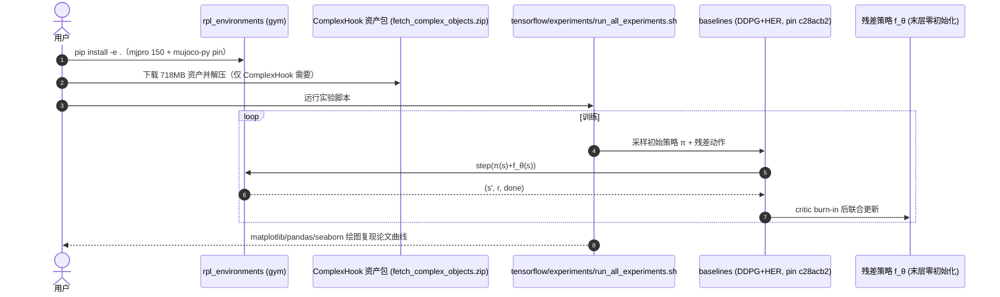

# Residual Policy Learning（RPL，Silver et al. 2018）

**Residual Policy Learning**（Tom Silver、Kelsey Allen 共同一作，Josh Tenenbaum、Leslie Kaelbling；MIT CSAIL，2018，[arXiv:1812.06298](https://arxiv.org/abs/1812.06298)，[项目页](https://k-r-allen.github.io/residual-policy-learning/)，[代码](https://github.com/k-r-allen/residual-policy-learning)）正式命名了残差策略学习：给定一个**不可微**的初始策略 $\pi$，学习残差 $f_\theta$ 使 $\pi_\theta(s)=\pi(s)+f_\theta(s)$。在 6 个 MuJoCo 操作任务上，RPL 一致且大幅改进初始策略，并完成纯 RL 无法解决的长视野稀疏奖励任务（NoisyHook 收敛约 0.8 成功率，DDPG+HER 从零完全失败）。

## 英文缩写速查

| 缩写 | 英文全称 | 简要说明 |
|------|----------|----------|
| RPL | Residual Policy Learning | 本文提出的残差策略学习框架 |
| DDPG | Deep Deterministic Policy Gradient | 实验统一使用的 actor-critic 连续控制算法 |
| HER | Hindsight Experience Replay | 稀疏二元奖励下的目标重标定回放，与 DDPG 联用 |
| MPC | Model Predictive Control | 初始策略来源之一（DiscreteMPCPush、CachedPETS） |
| PETS | Probabilistic Ensembles with Trajectory Sampling | MBRLPusher 任务中学习转移模型的 MPC 基线 |
| POMDP | Partially Observable MDP | NoisyHook 观测噪声下的建模；用历史帧近似处理 |
| MBRL | Model-Based Reinforcement Learning | 与 RPL 结合：CachedPETS 做 base，残差兼取 MBRL 数据效率与 MFRL 渐近性能 |

## 为什么重要

- **Residual 家族的正式命名与形式化**：提出 **Residual MDP** $M^{(\pi)}$（转移 $T^{(\pi)}(s,a,s')=T(s,\pi(s)+a,s')$），把「在 base 上学残差」转化为普通 MDP 上的标准 RL，任何连续动作算法均可套用。
- **base 形态的系统覆盖**：人工反应式策略、离散 MPC、**学习模型的 MPC（CachedPETS）** 三类初始策略；四类药物失效模式——模型失配（SlipperyPush 摩擦 5× 减小）、控制器失准（增益过调振荡）、传感器噪声（NoisyHook）、结构不确定（ComplexHook 100 种物体 + 随机凸包）——逐一验证。
- **RL 完全失败任务的解法**：NoisyHook/ComplexHook 长视野 + 稀疏奖励下 DDPG+HER 从零从未成功，RPL 收敛约 0.8——「base 提供成功轨迹雏形，RL 只需局部修正」。
- **可复现性**：环境（`rpl_environments`）与训练脚本完整开源，成为后续工作（ReSkill 等）的任务基准。

## 核心原理（方法）

### Residual MDP 与训练

- 初始策略 $\pi$ 与环境 MDP 诱导残差 MDP；$f_\theta$ 参数化为 3×256 MLP，**末层置零**使初始 $f_\theta(s)=\vec 0$（性能不差于 base）。
- **Critic burn-in**：先冻结 actor 只训 critic，待 critic loss 低于阈值 $\beta=1.0$ 再联合训练，避免差 critic 带坏好 base。
- **POMDP 近似**：NoisyHook 用历史长度 1（当前帧 + 上一帧特征取平均）替代循环策略。

### 六个任务与初始策略

| 任务 | 失效模式注入 | 初始策略 | 初始成功率 |
|------|--------------|----------|------------|
| Push | 无（基线） | DiscreteMPCPush | ≈0.5 |
| SlipperyPush | 滑动摩擦 1.0→0.18 | ReactivePush | ≈0.45 |
| PickAndPlace | 增益过调振荡 | ReactivePickAndPlace | ≈0.5 |
| NoisyHook | 观测高斯噪声 σ²=0.025 | ReactiveHook | ≈0.15 |
| ComplexHook | 100 物体 + 桌面凸包 | ReactiveHook | ≈0.55 |
| MBRLPusher | 学习模型 + 动作缓存 | CachedPETS | 接近 PETS |

## 实验与评测

- **数据效率**：PickAndPlace 上 RPL 约 **10×** 少于从零 DDPG+HER 的样本收敛到 1.0；Push/SlipperyPush 收敛前性能显著占优。
- **从零失败任务**：NoisyHook（RPL ≈0.8；DDPG+HER 0；Expert Explore 5M 步后才起步）与 ComplexHook（RPL ≈0.8；从零 0）。
- **MBRL 结合**：RPL 在 CachedPETS 上超过原 PETS 均值，且比 DDPG+HER 收敛快——**无需领域知识**的通用组合。
- **消融（Expert Explore）**：仅用 base 做探索的基线介于两者之间 → RPL 优势 = 探索偏置 + 参数化/初始化 + 残差问题本身更易，三者叠加。

## 源码运行时序图

官方仓库 [k-r-allen/residual-policy-learning](https://github.com/k-r-allen/residual-policy-learning)：环境包 `rpl_environments`（mujoco-py 150）+ 基于 OpenAI baselines 的 TF1 实验脚本。一次完整复现：

- **最短复现路径**：先用 `gym.make("SlipperyPush-v0")` 验证环境安装，再跑 `run_all_experiments.sh`；TF1 + mujoco-py 150 时代栈需容器化或老环境。

## 结论

**有好但不完美的 base 时，「末层零初始化残差 + critic burn-in + 任意连续 RL」是改进不可微策略的最小可靠配方；长视野稀疏奖励下它能让从零 RL 不可能的任务变得可解。**

1. **Residual MDP 是关键抽象** — 把 base 固化进转移函数后，残差训练就是普通 RL；算法选型（DDPG/TD3/PPO）与 base 解耦。
2. **三件套缺一不可** — 末层零初始化（保底）、critic burn-in（防退化）、探索偏置（样本效率）；Expert Explore 消融证明三者叠加才完整。
3. **优势来自三部分** — 论文归因：初始化、探索、残差问题本身更易；NoisyHook 中前两者弱时第三者主导。
4. **MBRL+RPL 组合最省心** — CachedPETS 做 base 无需领域知识，残差兼取 MBRL 数据效率与 MFRL 渐近性能，可作为新项目默认起手式。
5. **复现成本提示** — 代码为 TF1/mjpro150 时代栈；环境资产 718MB 独立下载；新研究建议参考任务定义而非直接运行老代码。

## 常见误区或局限

- **早期性能塌陷**：critic burn-in 阈值 $\beta$ 过大时训练初期成功率会先跌后升（论文 Figure 3 可见），属预期现象但需监控。
- **结构化不确定靠「顺从策略」**：ComplexHook 状态不含物体/凸包信息，RPL 学到的是对大多数对象有效的 conformant policy，成功率上限约 0.8 而非 1.0。
- **历史帧近似 POMDP**：NoisyHook 只用 1 帧历史；更强部分可观测需要真正的循环/信念状态方法。
- **仿真验证**：全部实验在 MuJoCo；真机证据需看同期 [Residual RL（Johannink）](./paper-residual-rl-robot-control.md)。

## 与其他工作对比

| 维度 | RPL | [Residual RL（Johannink）](./paper-residual-rl-robot-control.md) | Expert Explore | 从零 DDPG+HER |
|------|-----|------------------------------------------------------------------|----------------|----------------|
| base 用法 | 行为叠加 + 训练 | 行为叠加 + 训练 | 仅探索 | 无 |
| 长视野稀疏奖励 | **可解** | 未测试 | 基本失败 | 失败 |
| 数据效率 | 最高 | 高（真机） | 中 | 低 |
| 算法 | DDPG+HER | TD3 | DDPG+HER | DDPG+HER |
| 代码 | 已开源 | 未开源 | — | — |

后续演化：[RSA](./paper-residual-policy-shared-autonomy.md) 把 base 换成人；[ReSkill](./paper-reskill-residual-skill-policies.md) 把 base 换成技能空间；[Multi-Modal ARRL](./paper-multimodal-legged-arrl.md) 把 base 参数也交给优化器自动训练。

## 关联页面

- [Residual Policy Learning 方法页](../methods/residual-policy-learning.md)
- [Residual RL（Johannink）](./paper-residual-rl-robot-control.md)
- [ReSkill](./paper-reskill-residual-skill-policies.md)
- [Residual Shared Autonomy](./paper-residual-policy-shared-autonomy.md)
- [Reinforcement Learning](../methods/reinforcement-learning.md)

## 推荐继续阅读

- 项目页：<https://k-r-allen.github.io/residual-policy-learning/>
- 代码：<https://github.com/k-r-allen/residual-policy-learning>
- HER 原始论文：<https://arxiv.org/abs/1707.01495>

## 参考来源

- [Residual Policy / Residual RL 论文精读清单摘录](../../sources/personal/residual-policy-reading-list.md)
- [RPL 项目页归档](../../sources/sites/residual-policy-learning-github-io.md)
- [RPL 代码仓库归档](../../sources/repos/residual-policy-learning.md)
- Silver et al., *Residual Policy Learning*, arXiv:1812.06298, 2018. <https://arxiv.org/abs/1812.06298>
