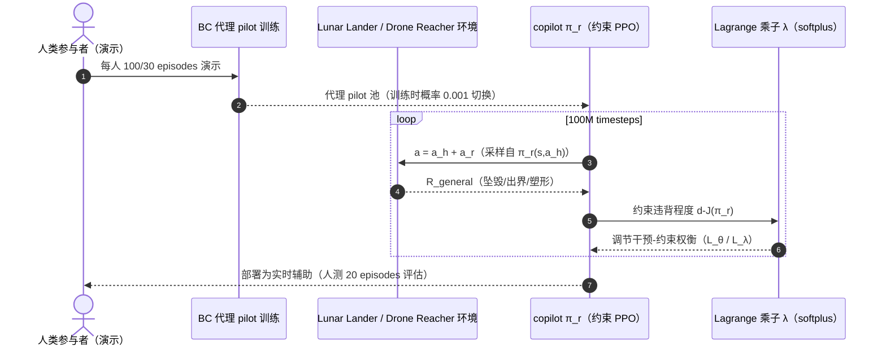

# Residual Policy Learning for Shared Autonomy（RSA，ICRA 2020）

**Residual Policy Learning for Shared Autonomy**（Charles Schaff、Matthew R. Walter，Toyota Technological Institute at Chicago，ICRA 2020，[arXiv:2004.05097](https://arxiv.org/abs/2004.05097)，[项目页](https://ttic.uchicago.edu/~cbschaff/rsa/)，[代码](https://github.com/cbschaff/rsa)）把 Residual Policy 的 base 从控制器换成**人**：$a=a_h+a_r$，智能体（copilot）学习对人的动作做**最小干预**的加性修正，仅在需要满足「不坠毁、不出界」等**目标无关约束**时介入。无需知道环境动力学、目标空间或人的意图，即可在连续控制任务中显著提升新手操作成功率。

## 英文缩写速查

| 缩写 | 英文全称 | 简要说明 |
|------|----------|----------|
| RSA | Residual Shared Autonomy | 本文框架：人 + 残差 copilot 的共享自治 |
| PPO | Proximal Policy Optimization | copilot 训练算法（约束版，Lagrangian） |
| CMDP | Constrained MDP | 约束 MDP：残差幅值最小化 s.t. 目标无关回报超阈值 |
| BC | Behavioral Cloning | 由真人演示训练代理 pilot（surrogate human）的方法 |
| TD3 | Twin Delayed DDPG | 训练 Lunar Lander 最优 pilot（再加 lag/noise 致残）的算法 |
| DoF | Degrees of Freedom | Drone Reacher 为 6-DoF 四旋翼 |
| POMDP | Partially Observable MDP | 目标未知时的共享自治建模；目标无关约束将其化简为 CMDP |

## 为什么重要

- **Residual 家族边界的拓展**：证明 base policy **不一定是算法**——可以是人的控制输入。人的高层意图（去哪、做什么）保留，机器补偿低层控制缺陷（稳定、约束满足），是「人-机优势互补」的形式化。
- **共享自治假设的最小化**：以往方法需已知目标空间 / 环境动力学 / 人的策略或演示；RSA 只假设存在一个**目标无关**奖励 $\mathcal R_{general}$（如「不坠毁」），把 POMDP 目标推断问题化简为 CMDP。
- **「最小干预」的显式优化**：残差幅值 $\|a_r\|$ 进目标函数（而非仅正则项），用 Lagrangian 联合优化——人的控制权最大化是可证的设计目标，对应共享控制文献的 minimal-intervention 原则。
- **真的人测**：16 名参与者、安慰剂对照、双任务泛化（Lander→Reacher，copilot 不知任务切换）、5 点 Likert 定性评分——比绝大多数共享自治论文的评估都扎实。

## 核心原理（方法）

### 约束残差目标

$$\pi_r^*=\arg\min_{\pi_r}\;\mathbb E\big[\|a_r\|\big]\quad\text{s.t.}\quad J(\pi_r)=\mathbb E\Big[\sum_t\gamma^t\mathcal R_{general}(s_t,a_h^t+a_r^t)\Big]>d$$

Lagrangian 形式下用**约束 PPO** 联合优化策略参数 $\theta$ 与乘子 $\lambda$（softplus 保证非负）：

$$L_\theta(\theta,\lambda)=\tfrac{1}{1+\lambda}\mathbb E\|a_r\|+\tfrac{\lambda}{1+\lambda}L_{PPO}(\pi_r^\theta)$$

- **平凡解规避**：「保持静止即可不坠毁」类退化解被 $\|a_r\|$ 最小化项排除——copilot 必须**在人行动的前提下**满足约束。
- **残差策略条件于人的动作**：$a_r\sim\pi_r(s,a_h)$——copilot 看着人当下输入再决定修正（比只看 $s$ 更早介入危险操作）。
- **100K 步 value warm-up**：初期 copilot 输出零，先学代理 pilot 的价值函数（与 Silver RPL critic burn-in 同源）。

### 代理人类 pilot

真人在环训练样本太贵 → 对 9（Lander）/ 14（Drone）名参与者各自 BC 出**会犯人类错误的**代理 pilot，训练 copilot 时以概率 0.001 逐步随机切换。关键发现：**训练 pilot 与测试 pilot 的相似度决定 copilot 效果**——BC 模仿 pilot 训练的 copilot 对真人最稳；laggy/noisy 等结构性人模型不够「像人」。

## 实验与评测

- **Lunar Lander（仿真 pilot，Table I）**：noisy copilot 对 laggy/noisy pilot 成功率 **0.828/0.866**（无辅助 0.389/0.199），坠毁率 0.073/0.036（无辅助 0.567/0.794）；只有 imitation copilot 能完全防 imitation pilot 坠毁。
- **Drone Reacher（Table II）**：noisy copilot 对 noisy pilot 成功率 0.917（无辅助 0.772）；imitation copilot 把 imitation pilot 坠毁率从 0.900 压到 **0.001**。
- **人测（16 人，Lander + Reacher）**：copilot 下 Lander 平均成功率约 **90%**；Welch t 检验最大 $p=1.02\times10^{-5}$；定性（helpful/trustworthy/collaborative 等）均显著优于安慰剂（$p$ 低至 $10^{-23}$ 量级）；**未对任何个体微调**。
- **Drone 人测（16 人）**：11/16 坠毁率显著改善、7/16 成功率显著提升；观察到的代价是 copilot 倾向过度稳定化 → 超时增多。
- **对照 Reddy et al.**：对方需任务奖励函数且按人微调；RSA 均不需要（非严格对比：动作空间离散 vs 连续、机体抗坠设置不同）。

## 源码运行时序图

官方仓库 [cbschaff/rsa](https://github.com/cbschaff/rsa)（论文描述："Code for the paper Residual Policy Learning for Shared Autonomy"）：

- **复现要点**：人测数据不随仓发布；需先按仓库流程训练 BC 代理 pilot 再训 copilot；100K 步 warm-up 期间 copilot 输出零。

## 结论

**共享自治里，「人 = base policy」让残差框架从控制器补全变成控制权分配工具：目标无关约束交给机器，目标相关决策留给人；Lagrangian 残差幅值最小化是「最小干预」的可执行写法。**

1. **残差条件于人的动作是关键设计** — $\pi_r(s,a_h)$ 看到人的原始输入，比纯状态条件更早纠正危险操作。
2. **训练 pilot 要像人** — BC 模仿代理（会犯人类错误）训出的 copilot 对真人最有效；laggy/noisy 结构性人模型不够（只有 imitation copilot 防住 imitation pilot 坠毁）。
3. **目标无关 ≠ 任务无关** — copilot 在 Reacher 上零样本泛化（训练时只有 Lander 约束），因为约束（不坠毁）与目标（去哪）解耦。
4. **过度稳定是真实代价** — Drone 人测中 copilot 为保稳定牺牲任务进度（超时增多）；λ 的权衡在部署前需按任务校。
5. **引用锚点** — Lander 人测约 90% 成功率、 imitation copilot 把 Drone imitation pilot 坠毁率 0.900→0.001，是该文最有代表性的两组数字。

## 常见误区或局限

- **训练依赖人类模型**：人模型工程本身困难（人会适应辅助而改行为）；copilot 对训练/测试 pilot 差异敏感，鲁棒通用人模型是未来工作。
- **model-free 样本复杂度**：100M timesteps 级训练；真机应用需借 sim-to-real（论文明示未做真机）。
- **单约束设置**：实验把多约束压成一个 $\mathcal R_{general}$ 阈值约束；真正多约束 CMDP 未验证。
- **仿真环境简单**：Lander/Drone 为玩具域；向驾驶、操作等真实场景迁移未验证。

## 与其他工作对比

| 维度 | RSA | Reddy et al.（共享自治基线） | [经典 RPL](./paper-residual-policy-learning.md) | Policy Blending |
|------|-----|-------------------------------|--------------------------------------------------|------------------|
| base | **人** | 人（+任务反馈） | 人工控制器/MPC | 人（仲裁函数混合） |
| 目标知识 | 不需要 | 需要任务奖励 | 不需要 | 需要目标推断 |
| 干预原则 | 残差幅值最小化（CMDP） | 距最优动作 ε 内最近 | — | 混合系数 |
| 动作空间 | 连续 | 离散 | 连续 | 连续 |
| 按人微调 | 无 | 有 | — | — |

## 关联页面

- [Residual Policy Learning 方法页](../methods/residual-policy-learning.md)
- [Residual Policy Learning（Silver）](./paper-residual-policy-learning.md)
- [Teleoperation](../tasks/teleoperation.md)
- [NestDex](./paper-nestdex.md) — 采数期 copilot；部署卸内层（对照 RSA 把 copilot 留在控制环）
- [Reinforcement Learning](../methods/reinforcement-learning.md)

## 推荐继续阅读

- 项目页：<https://ttic.uchicago.edu/~cbschaff/rsa/>
- 代码：<https://github.com/cbschaff/rsa>
- Reddy et al.（共享自治对照）：<https://arxiv.org/abs/1804.10154>

## 参考来源

- [Residual Policy / Residual RL 论文精读清单摘录](../../sources/personal/residual-policy-reading-list.md)
- [RSA 项目页归档](../../sources/sites/rsa-ttic.md)
- [RSA 代码仓库归档](../../sources/repos/rsa-shared-autonomy.md)
- Schaff & Walter, *Residual Policy Learning for Shared Autonomy*, ICRA 2020. <https://arxiv.org/abs/2004.05097>
