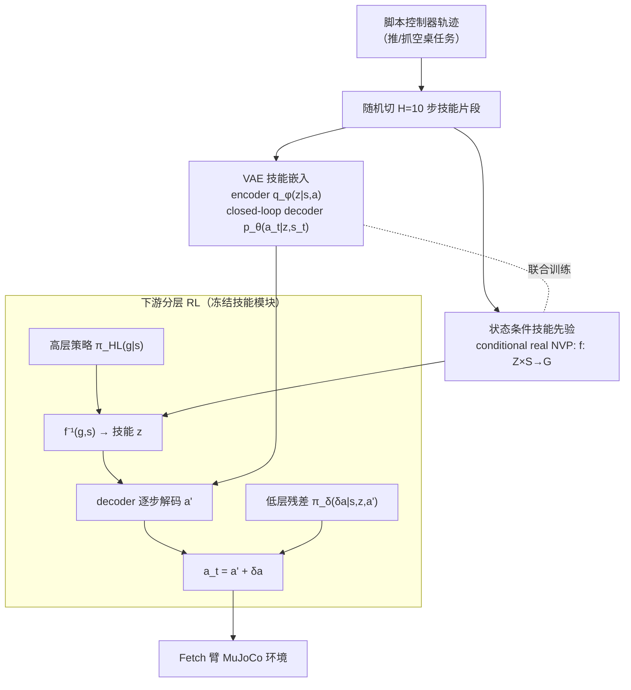
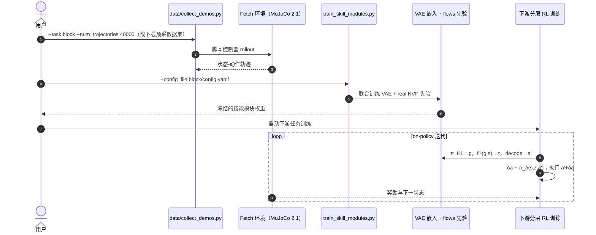

# Residual Skill Policies（ReSkill，CoRL 2022）

**Residual Skill Policies: Learning an Adaptable Skill-based Action Space for Reinforcement Learning for Robotics**（Krishan Rana, Ming Xu, Brendan Tidd, Michael Milford, Niko Sünderhauf；QUT Centre for Robotics / CSIRO Data61，CoRL 2022，[arXiv:2211.02231](https://arxiv.org/abs/2211.02231)，[项目页](https://krishanrana.github.io/reskill/)，[代码](https://github.com/krishanrana/reskill)）把 Residual 思想搬进**技能空间**：高层策略在状态条件技能先验引导下采样技能 latent，技能解码器产生基础动作，**低层残差策略**在原子动作层做细粒度修正，使从普通脚本控制器提取的技能能适配**训练中没见过**的任务变体（障碍、物体变化、摩擦变化）。

## 英文缩写速查

| 缩写 | 英文全称 | 简要说明 |
|------|----------|----------|
| ReSkill | Residual Skill Policies | 本文框架：技能先验 + 低层残差策略 |
| VAE | Variational Autoencoder | 技能嵌入模块（encoder 处理状态-动作序列，closed-loop decoder 逐步重建原子动作） |
| real NVP | real-valued Non-Volume Preserving transformations | normalizing flows 实现，建模状态条件技能先验 $p(z\mid s_0)$ |
| HRL | Hierarchical Reinforcement Learning | 分层 RL：高层选技能（1 Hz 级）、低层执行（H Hz 级） |
| SPiRL | Skill Prior RL | 对比基线：高斯技能先验 + KL 正则 |
| PaRRot | Priors as Regularized Residual Optimization Tools（ Singh et al.） | 对比基线：flows 动作先验，单步动作级 |
| HAC | Hierarchical Actor-Critic | 对比基线：两层分层 RL |
| BC | Behavioral Cloning | 对比基线：行为克隆 + RL 微调 |
| DoF | Degrees of Freedom | Fetch 7 自由度机械臂 |

## 为什么重要

- **指出 skill-based RL 的两个结构性痛点**：(i) 技能空间巨大且多模态，随机采样探索效率低；(ii) 下游任务一旦偏离技能提取分布，固定技能空间**直接无解**（「cripple the RL agent」）。ReSkill 对两痛点各给出一个组件。
- **残差恢复原子动作空间访问**：低层残差 $\delta a$ 让 agent 不被技能空间的表达能力锁死，缓解 skill-based RL 的 generality–sample-efficiency 权衡——这是「Residual 思想 + 分层 RL」的标准联姻。
- **技能数据来源降级**：不再需要专家且完备的演示集——普通**脚本控制器**（便宜、现成）的轨迹即可提取技能，残差负责补齐技能库未覆盖的部分。
- **与经典 RPL 的直接传承**：四个下游任务全部改编自 [Silver et al. RPL](./paper-residual-policy-learning.md) 的官方环境族，且每个都带技能提取时未见的物理/动力学变体。

## 核心原理（方法）

### 三模块结构

- **技能先验解决探索**：条件密度多模态（相关技能在 latent 空间不聚集），高斯先验不够用 → real NVP 双射映射 $f^{-1}(g,s)\sim p(z|s)$，agent 直接采样相关技能；双射性保证全技能空间仍可达。
- **残差解决适配**：$\delta a\sim\pi_\delta(\delta a|s,z,a')$ 以状态 + 所选技能 + 解码动作提议为条件，$a_t=a'+\delta a$；高低层**联合 on-policy 训练**（低层非平稳 → 用 on-policy 算法）。
- **实现**：latent $\mathcal Z\cong\mathbb R^4$，技能长度 $H{=}10$；VAE encoder 1 层 LSTM(128)+MLP；flows 4 个 affine coupling layers；状态 19 维（block 任务）/ 43 维（hook 任务），动作 4 维（EE 速度 + 夹爪）。

## 实验与评测

- **任务**：FetchPyramidStack / FetchCleanUp / FetchSlipperyPush / FetchComplexHook（均带技能提取时未见变体；数据采自 `FetchPlaceMultiGoal-v0` / `FetchHook-v0`）。
- **主结果（Figure 5，5 seeds）**：ReSkill 在 4 任务上**样本效率与最终性能均超全部基线**；SAC/PPO/HAC 在稀疏奖励下完全学不到；BC+微调次优且高方差；SPiRL 加速但终性能受限（无技能适配）。
- **消融（Figure 6）**：No Skill Prior → 难任务（Stack）探索崩溃；No Residual → 最终回报显著下降（但仍快于 SPiRL 收敛，因先验可直接采样而 SPiRL 靠 KL 间接偏置需 burn-in）。
- **局限（作者自述）**：仍需数千环境样本 → 未能上真机；先验对训练集外的有用技能采样概率低；VAE+flows 双模块可并一为条件 VAE。

## 源码运行时序图

官方仓库 [krishanrana/reskill](https://github.com/krishanrana/reskill)（**MIT**，PyTorch）：

- **最短复现路径**：`conda env create -f environment.yml && pip install -e .` → 下载预采数据集 → `train_skill_modules.py` → 下游 RL（命令见 README）。

## 结论

**技能空间打底时，「flows 状态条件先验」管探索效率、「低层残差」管任务适配，两者合一方能同时赢样本效率与最终性能；只取其一都会在难任务上露短。**

1. **先验 vs 残差的分工由消融钉死** — No Prior 在 Stack 上探索崩溃（先验=能不能学会）；No Residual 终性能下滑（残差=学得多好）。
2. **可采样先验 > KL 正则先验** — real NVP 直接采样相关技能，免去 SPiRL 的正则 burn-in；多模态条件密度是 Gaussian 先验表达不了的。
3. **脚本控制器即可当技能源** — 不需要专家演示；base 质量下限进一步降低，残差兜底适配。
4. **联合训练要 on-policy** — 低层残差造成非平稳，off-policy 复用旧数据会偏；论文局限节也把「换 SAC 提样本效率」列为需慎重处理的未来方向。
5. **环境即 RPL 基准** — 四个下游任务改编自 Silver RPL 官方环境；做技能学习研究可直接复用该任务族与 [k-r-allen 环境](https://github.com/k-r-allen/residual-policy-learning)对照。

## 常见误区或局限

- **未上真机**：收敛仍需数千样本，真机演示缺失；样本效率是相对于 RL 基线而言，不是绝对少。
- **先验覆盖边界**：训练数据与下游任务严重失配时，有用技能几乎不会被采到（双射保证非零概率但概率极低）；残差能补多少未系统评估。
- **冻结技能模块**：技能空间本身不随下游任务更新，表达上限在离线阶段已锁死。
- **双模块复杂度**：VAE + flows 需联合训练两组网络，调参成本高于单生成模型方案。

## 与其他工作对比

| 维度 | ReSkill | SPiRL | PaRRot | BC + 微调 | 经典 RPL |
|------|---------|-------|--------|-----------|----------|
| 动作空间 | 技能空间 + 原子残差 | 技能空间 | 单步动作先验 | 原子动作 | 原子动作（base+残差） |
| 探索引导 | flows 直接采样 | KL 正则（间接） | flows（单步级） | 无 | base 行为偏置 |
| 任务变体适配 | **残差细修** | 无 | 弱 | 微调全网络 | 残差细修 |
| 技能来源 | 脚本控制器 | 演示 | 演示 | 演示 | 手工控制器 |
| 终性能 | 最高 | 受限 | 中 | 中（高方差） | 高 |

## 关联页面

- [Residual Policy Learning 方法页](../methods/residual-policy-learning.md)
- [Residual Policy Learning（Silver）](./paper-residual-policy-learning.md)
- [Foundation Policy](../concepts/foundation-policy.md)
- [Reinforcement Learning](../methods/reinforcement-learning.md)
- [Manipulation](../tasks/manipulation.md)

## 推荐继续阅读

- 项目页：<https://krishanrana.github.io/reskill/>
- 代码（MIT）：<https://github.com/krishanrana/reskill>
- SPiRL（对比基线）：<https://arxiv.org/abs/2011.03944>

## 参考来源

- [Residual Policy / Residual RL 论文精读清单摘录](../../sources/personal/residual-policy-reading-list.md)
- [ReSkill 项目页归档](../../sources/sites/reskill-github-io.md)
- [ReSkill 代码仓库归档](../../sources/repos/reskill.md)
- Rana et al., *Residual Skill Policies*, CoRL 2022. <https://arxiv.org/abs/2211.02231>
