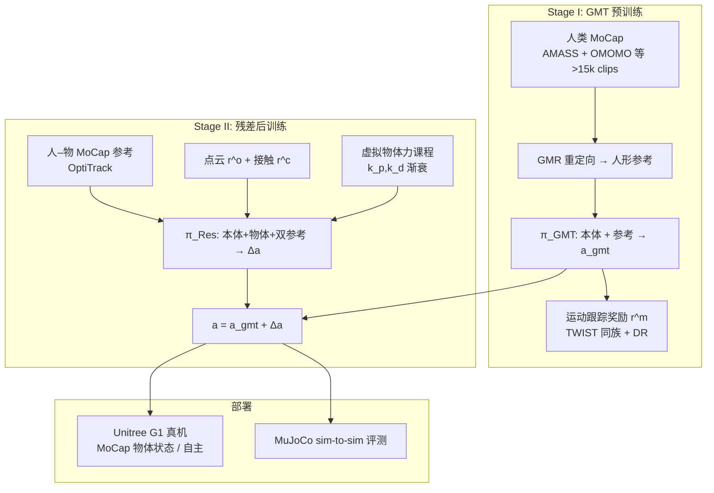

# ResMimic（GMT → 人形全身 Loco-Manipulation 残差学习）

**ResMimic**（*From General Motion Tracking to Humanoid Whole-body Loco-Manipulation via Residual Learning*，Amazon FAR / USC / Stanford / Berkeley / CMU，arXiv:[2510.05070](https://arxiv.org/abs/2510.05070)，[项目页](https://resmimic.github.io/)）提出 **预训练–后训练式残差框架**：先用 **仅人类 MoCap** 训练 **通用运动跟踪（GMT）** 策略作为全身运动先验，再为每个 loco-manipulation 任务训练 **轻量残差策略**，在物体参考条件下修正 GMT 输出，实现 **精确、表达力强、全身接触丰富** 的人形 loco-manipulation。在 **Unitree G1** 真机与 MuJoCo sim-to-sim 上相对 **GMT 直出、从头 PPO、GMT 微调** 基线取得显著增益。

## 英文缩写速查

| 缩写 | 英文全称 | 简要说明 |
|------|----------|----------|
| GMT | General Motion Tracking | 大规模人类动作上的任务无关全身跟踪先验 |
| MDP | Markov Decision Process | 目标条件序贯决策建模框架 |
| PPO | Proximal Policy Optimization | 两阶段均采用的 on-policy 策略梯度算法 |
| MoCap | Motion Capture | OptiTrack 同步采集人–物参考轨迹 |
| GMR | General Motion Retargeting | 人体动作 → 人形参考的 kinematic 重定向 |
| SR | Success Rate | 物体跟踪误差与平衡约束下的任务成功率 |
| Sim2Sim | Simulation to Simulation | IsaacGym 训练 → MuJoCo 评测的跨仿真迁移 |

## 为什么重要

- **把「foundation pretrain → post-train」搬进人形全身控制：** 多样人类动作可由 GMT 模仿，但 **物体中心 loco-manipulation** 只需 **任务特定修正**；残差分解避免每条任务重学平衡与步态。
- **否定「GMT 够用」与「每条任务从零奖励工程」两个极端：** 论文显示 GMT 直出均值 SR 仅 **10%**，从头训练 sim-to-sim **0%**；ResMimic 在 **统一奖励配方** 下达 **92.5%** 均值 SR。
- **工程上可复用的三件稳定器：** **点云物体跟踪奖励**（免位姿权重调参）、**链节接触奖励**（躯干/髋/臂）、**虚拟物体力课程**（重物体与噪声参考早期不崩）。
- **真机证据完整：** G1 上 **跪姿抬箱、背载、蹲起托举、搬椅**；**4.5–5.5 kg** 载荷；随机物体初姿、连续 MoCap 与 **外力扰动** 均有演示。

## 流程总览

## 核心机制（归纳）

### 两阶段残差动作合成

- **GMT：** $a^{\mathrm{gmt}}_t=\pi_{\mathrm{GMT}}(s^r_t,\hat{s}^r_t)$，仅依赖 **本体 + 人类参考**（含 **未来参考窗** $t{-}10:t{+}10$）。
- **残差：** $\Delta a^{\mathrm{res}}_t=\pi_{\mathrm{Res}}(s^r_t,s^o_t,\hat{s}^r_t,\hat{s}^o_t)$；**末层小增益初始化** 使训练初 $\Delta a\approx 0$。
- **合成：** $a_t=a^{\mathrm{gmt}}_t+\Delta a^{\mathrm{res}}_t$ → **PD 跟踪**；优化 $\mathbb{E}[\sum\gamma^{t-1}(r^m_t+r^o_t)]$ 并叠加接触项。

### 物体与接触奖励（统一跨任务）

| 组件 | 形式 | 设计意图 |
|------|------|----------|
| **点云跟踪** $r^o$ | mesh 采样 $N$ 点，指数距离和 | 平移/旋转统一度量，**无需任务调权重** |
| **接触** $r^c$ | 参考 oracle 接触 × 力幅指数 | 引导 **躯干/髋/臂** 全身接触（脚除外） |
| **早停** | 物体偏离；必需接触丢 **>10 帧** | 防止无效状态刷分 |

### 虚拟物体力课程

- 早期对物体施加 **PD 虚拟力/力矩** 拉回参考，缓解 **重定向穿透** 与 **大质量物体** 导致的「推飞箱子、策略退缩」。
- 增益 **渐衰**，迫使后期策略 **自主完成** 交互。

### 四评测任务

| 任务 | 考察点 |
|------|--------|
| **Kneel** | 单膝跪地 + 抬箱；大幅下肢表达 |
| **Carry** | 箱子背上；负载分布变化下平衡 |
| **Squat** | 蹲起 + 臂/躯干托举；接触丰富 |
| **Chair** | 不规则重椅；实例泛化 |

## 实验要点（MuJoCo sim-to-sim，Table I 摘要）

| 方法 | 均值 SR ↑ | 均值 Iter ↓ | 备注 |
|------|-----------|-------------|------|
| GMT 直出（Base） | 10% | — | 关节跟踪尚可，**无物体信息** |
| Train from Scratch | 0% | 4500 | IsaacGym 部分成功，**MuJoCo 全崩** |
| GMT Fine-tune | 7.5% | 2400 | 难显式条件于物体状态 |
| **ResMimic** | **92.5%** | **1300** | 四任务均显著领先 |

- **残差可视化（项目页）：** 腕关节 **delta 动作幅度更大**，与「物体交互主要由残差承担」一致。
- **真机：** MoCap 物体状态、随机初姿 11 次试验、连续跪姿抬箱、扰动恢复等（见 [项目页](https://resmimic.github.io/)）。

## 常见误区或局限

- **物体状态假设：** 训练与部分真机演示依赖 **参考/ MoCap 级物体轨迹**；与 **纯视觉估计物体位姿** 的部署仍有 gap。
- **任务级残差：** 每个新 loco-manipulation 技能仍需 **Stage II 残差训练**（虽共享 GMT 与奖励模板，但不是单策略零样本泛化所有物体任务）。
- **重定向伪影：** 虚拟力课程缓解但 **不能消除** embodiment gap；与 [OmniRetarget](./paper-hrl-stack-03-omniretarget.md) 的 **交互保留重定向** 可互补。
- **仿真栈：** 训练在 **IsaacGym**；论文主表为 **sim-to-sim**；真机为案例验证，未给出与 MuJoCo 同等规模的系统 benchmark 表。

## 与其他工作对比

| 路线 | 先验 | 物体建模 | 全身接触 | 典型局限 |
|------|------|----------|----------|----------|
| **GMT / TWIST 直出** | 人类 MoCap tracking | 无 | 弱 | 不能完成 manipulation |
| **分阶段 loco-manip [10]** | 每阶段独立策略 | 任务定制 | 有限 | 难扩展、表达力受限 |
| **轨迹优化参考 [11]** | 任务专用参考 | 位姿差奖励 | 多仅手部 | 数据管线重 |
| **VideoMimic** | 视频 + 静态场景重建 | 环境上下文 | 静态环境 | 非动态物体操控 |
| **ResMimic** | **GMT + 残差** | 点云 + 接触 + 虚拟力 | **强** | 需 per-task 残差；物体状态 |

与 [holosoma](./holosoma.md)：**holosoma/OmniRetarget** 侧重 **交互保留参考数据生成**；ResMimic 侧重 **已有 GMT 后如何高效接上物体交互**——同一 Amazon FAR 技术线的 **上下游** 关系。

## 关联页面

- [Loco-Manipulation](../tasks/loco-manipulation.md)
- [Whole-Body Tracking Pipeline](../concepts/whole-body-tracking-pipeline.md)
- [Motion Retargeting](../concepts/motion-retargeting.md)
- [Reinforcement Learning](../methods/reinforcement-learning.md)
- [TWIST](./paper-twist.md)
- [OmniRetarget](./paper-hrl-stack-03-omniretarget.md)
- [holosoma](./holosoma.md)
- [VideoMimic](./videomimic.md)

## 推荐继续阅读

- 项目页：<https://resmimic.github.io/>
- 代码：<https://github.com/amazon-far/ResMimic>
- TWIST：<https://yanjieze.com/TWIST/>
- holosoma：<https://github.com/amazon-far/holosoma>

## 参考来源

- [ResMimic 论文摘录](../../sources/papers/resmimic_arxiv_2510_05070.md)
- [ResMimic 项目页归档](../../sources/sites/resmimic-github-io.md)
- [ResMimic 代码仓库归档](../../sources/repos/resmimic.md)
- Zhao et al., *ResMimic: From General Motion Tracking to Humanoid Whole-body Loco-Manipulation via Residual Learning*, arXiv:2510.05070, 2025. <https://arxiv.org/abs/2510.05070>
