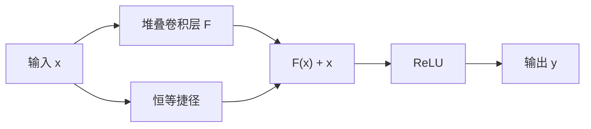

---

type: entity
tags:
  - paper
  - computer-vision
  - backbone
  - cnn
  - classification
  - perception
status: complete
updated: 2026-06-06
arxiv: "1512.03385"
venue: "CVPR 2016"
code: https://github.com/KaimingHe/deep-residual-networks
related:
  - ../concepts/vision-backbones.md
  - ../concepts/deep-learning-foundations.md
  - ../methods/object-detection.md
  - ./paper-yolo-unified-realtime-detection.md
sources:
  - ../../sources/papers/resnet_arxiv_1512_03385.md
  - ../../sources/papers/vision_backbone_detection_classics.md
summary: "ResNet（arXiv:1512.03385，CVPR 2016）用残差映射与恒等捷径连接解决极深 CNN 的退化问题，使 152 层网络可训练并在 ImageNet/COCO 上成为后续视觉与机器人感知骨干的默认底座。"
tags: [paper, computer-vision, backbone, cnn, classification, perception, microsoft]

---

# ResNet（Deep Residual Learning for Image Recognition）

**ResNet**（Residual Network）是 Kaiming He 等提出的 **深度残差学习** 框架（arXiv:1512.03385，CVPR 2016 Best Paper）。其核心思想是让堆叠层学习 **残差函数** $\mathcal{F}(\mathbf{x}) = \mathcal{H}(\mathbf{x}) - \mathbf{x}$，通过 **捷径连接（shortcut）** 实现 $\mathbf{y} = \mathcal{F}(\mathbf{x}) + \mathbf{x}$，从而缓解单纯加深网络时的 **退化（degradation）** 现象，使 **百层量级** CNN 在 ImageNet 上稳定训练并取得 **当时最优分类精度**。

## 一句话定义

**用无参恒等捷径把深层网络 reformulate 成「学扰动」而非「学完整映射」，从而训得动极深 CNN，并作为检测/分割/机器人视觉编码器的通用骨干。**

## 英文缩写速查

| 缩写 | 英文全称 | 简要说明 |
|------|----------|----------|
| CNN | Convolutional Neural Network | 卷积神经网络，处理图像/深度感知 |
| BN | Batch Normalization | 批归一化，极深网络训练的标准配套 |
| FLOPs | Floating Point Operations | 浮点运算量，衡量网络计算复杂度 |
| FPN | Feature Pyramid Network | 多尺度特征金字塔，检测常用 neck |
| ImageNet | ImageNet Large Scale Visual Recognition Challenge | 大规模图像分类基准数据集 |

## 为什么重要

- **优化瓶颈被正视：** 论文证明更深 plain net 的 **训练误差反而升高** 并非过拟合，而是 **当前优化器难以拟合恒等映射**；残差形式把最优解预条件到「接近零映射」。
- **深度真正带来收益：** ResNet-152 在 ImageNet 上 top-5 **4.49%**（单模型），集成 **3.57%**；同一表征在 COCO 检测上 **相对提升 28%**。
- **机器人感知间接底座：** 后续 **Faster R-CNN + ResNet-FPN**、触觉 CNN、视觉 RL 学生网络（如 ResNet 视觉编码）均建立在此表征深度之上；与 [YOLO v1](./paper-yolo-unified-realtime-detection.md) 的「实时检测」形成 **深度 vs 延迟** 互补。

## 核心结构

| 模块 | 作用 |
|------|------|
| **残差块（basic block）** | 两个 3×3 卷积 + ReLU；输出与输入 **逐元素相加** 后再激活 |
| **Bottleneck 块** | 1×1 降维 → 3×3 → 1×1 升维；ResNet-50/101/152 标配，控制 FLOPs |
| **恒等捷径（option A）** | 维度不变时 **零参数** 捷径；升维时零填充（A）或 1×1 投影（B） |
| **Plain 基线** | 遵循 VGG 式 3×3 堆叠规则，用于消融证明退化与残差收益 |

### 残差学习数据流

## 方法栈

见上文 **核心结构** 与残差学习数据流；完整架构表与训练细节以原文 Table 1 为准（[参考来源](#参考来源)）。

## 实验与评测

- ImageNet val：**ResNet-152** top-5 **4.49%**（单模型），集成 test **3.57%**（ILSVRC 2015 分类第一）。
- CIFAR-10：成功训练 **100+ 层** 乃至探索 **1000 层** 模型。
- COCO 检测：极深表征带来约 **28% 相对提升**；同一骨干支撑 2015 检测/定位/分割多项第一。

## 与其他工作对比

- 相对 **plain net**：同深度残差网 **训练误差更低、验证精度更高**（34 层对比见论文 Table 2）。
- 相对 **Highway Networks**：恒等捷径 **无门控、无额外参数**，且已验证 **100+ 层** 精度增益。
- 相对 **VGG**：同精度下 **FLOPs 更低**（34 层 baseline 仅 VGG-19 的约 18%）。

## 常见误区或局限

- **误区：「残差 = 解决梯度消失。」** 论文在 BN 已稳定梯度的设定下仍观察到退化，更强调 **优化难度与恒等映射可学性**；残差是 reformulation，不单是梯度技巧。
- **误区：「越深永远越好。」** 极深非 bottleneck 结构算力昂贵；工程上需在 **深度、宽度、分辨率** 间权衡（见 [视觉骨干](../concepts/vision-backbones.md)）。
- **局限：** 原始工作聚焦 **2D 图像分类**；3D 点云、时序触觉等需改编块结构（如 1D ResNet、稀疏卷积）。

## 关联页面

- [视觉骨干（概念）](../concepts/vision-backbones.md)
- [深度学习基础](../concepts/deep-learning-foundations.md)
- [目标检测（方法）](../methods/object-detection.md)
- [YOLO v1（论文实体）](./paper-yolo-unified-realtime-detection.md)

## 参考来源

- [ResNet 论文摘录（arXiv:1512.03385）](../../sources/papers/resnet_arxiv_1512_03385.md)
- [经典视觉骨干与检测文献簇](../../sources/papers/vision_backbone_detection_classics.md)

## 推荐继续阅读

- 论文 PDF：<https://arxiv.org/pdf/1512.03385.pdf>
- 官方 Caffe 实现：<https://github.com/KaimingHe/deep-residual-networks>
- [Highway Networks](https://arxiv.org/abs/1505.00387)（同期门控捷径对照）
