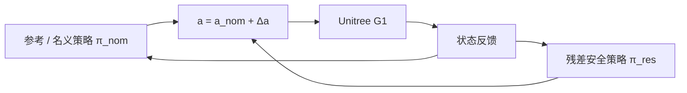

# ResSafe：G1 残差安全过滤

**ResSafe**（*Learning Safety Filtering with Residual Reinforcement Learning for Humanoids*，[arXiv:2609.15988](https://arxiv.org/abs/2609.15988)，[项目页](https://sciautonomy.github.io/ResSafe_Web/)）由 **加州大学伯克利分校（UC Berkeley）** 等提出：在 **Unitree G1** 上用 **残差强化学习** 实现 **隐式安全过滤** — 名义策略只追任务性能，残差策略学安全修正，改善 performance–safety–robustness 帕累托前沿。

## 一句话定义

**不要把安全、性能、鲁棒性塞进同一个 reward 里调权重；让名义策略专心做任务，残差策略当最后一层安全修正。**

## 英文缩写速查

| 缩写 | 英文全称 | 简要说明 |
|------|----------|----------|
| ResSafe | Residual Safety filtering | 本文残差安全过滤框架 |
| RL | Reinforcement Learning | 名义与残差两阶段策略学习 |
| WBC | Whole-Body Control | G1 29-DoF 全身控制语境 |
| MDP | Markov Decision Process | 名义/残差可视为分层控制接口 |

## 为什么重要

- **单策略多目标调参地狱：** 性能、安全、鲁棒 reward 互相竞争；ResSafe **解耦** 后各自训练。
- **隐式 vs 显式安全过滤：** 学习型安全过滤若只编码半空间约束，泛化差；残差策略可学 **更接近安全动作本身** 的修正。
- **G1 高维实证：** n=58、m=29；**Isaac Gym** 仿真 + **真机** 极端平衡与 **随机载荷**；可跨不同 reference checkpoint 泛化。
- **与残差谱系对齐：** 见 [Residual Policy Learning](../methods/residual-policy-learning.md) — ResSafe 把残差专门用于 **安全** 而非动力学补偿。

## 核心信息

| 项 | 内容 |
|----|------|
| **机构** | UC Berkeley（通讯 `qugch@berkeley.edu`）；部分 UCLA 作者 |
| **平台** | Unitree G1；仿真 Isaac Gym |
| **任务** | 极端平衡、载荷扰动、参考跟踪 |
| **开源** | 项目页 **Code (Coming Soon)** — 截至 2026-09-16 **待发布** |

## 流程总览

名义策略输出任务动作；残差策略输出 **安全修正** Δa；联合执行。训练上 residual RL 需在高维空间 **足够探索** 才能学到可泛化过滤器（论文 §4.2）。

## 源码运行时序图

**不适用（待发布）** — 项目页标注 **Code (Coming Soon)**。若开源，预期路径：加载 reference checkpoint → 训练/部署残差安全策略 → G1 真机或 Isaac Gym 闭环。

## 实验与评测

- **对照：** 名义参考策略、学习型安全过滤基线、单策略多 reward 训练。
- **场景：** 随机载荷下的平衡运动；项目页 Figure 1 展示成功序列 vs 基线跌倒。
- **结论方向：** 相对基线 **更安全**，跟踪性能仅有 **小幅度** 退化；仿真与硬件一致趋势。

## 与其他工作对比

| 路线 | 关系 |
|------|------|
| [Safety Filter](../concepts/safety-filter.md) | 概念层「最后一层修正」；ResSafe 用 **学习残差** 而非 CBF/QP 解析过滤 |
| [Safe RL](../methods/safe-rl.md) | CMDP 累积代价 vs 瞬时跌倒；ResSafe 针对 **瞬时失稳** |
| [ResMimic](./paper-resmimic.md) | 同为 G1 残差，但 ResMimic 补 **跟踪/操作**，ResSafe 补 **安全** |
| [FMP](./paper-fmp-motion-priors.md) | 同 G1 时间窗；FMP 改 **运动先验奖励**，正交问题 |

## 局限与风险

- **代码未发布：** 只能读论文/视频，不能复现训练细节。
- **reference 依赖：** 安全残差绑定特定名义策略 checkpoint；换 reference 需验证泛化（论文声称可跨 checkpoint，仍须实测）。
- **不是证书安全：** 残差过滤器无 CBF 式可证明不变集 — 部署仍需硬件急停与限位。

## 结论

**ResSafe 把「安全过滤」从 reward 调参问题转成残差学习问题，在 G1 极端平衡上给出更好的安全–性能折中，但工程落地要等官方代码。**

1. **先解耦再谈 filter** — 名义策略别同时背性能与安全 multi-objective。
2. **读载荷扰动实验** — 真机价值在鲁棒性，不在仿真高分 alone。
3. **与显式 CBF 分工** — 需要证书时用 [Safety Filter](../concepts/safety-filter.md)；需要数据驱动修正时看 ResSafe。
4. **跟进 Code 链接** — Coming Soon 状态入库日为 2026-09-16。
5. **残差谱系定位** — 列入 [Residual Policy Learning](../methods/residual-policy-learning.md) 的「安全修正」支路。

## 关联页面

- [Residual Policy Learning](../methods/residual-policy-learning.md)
- [Safety Filter](../concepts/safety-filter.md)
- [Unitree G1](./unitree-g1.md)
- [Safe RL](../methods/safe-rl.md)

## 推荐继续阅读

- [ResSafe 项目页](https://sciautonomy.github.io/ResSafe_Web/) — 真机视频
- [arXiv:2609.15988](https://arxiv.org/abs/2609.15988)

## 参考来源

- [ResSafe 论文摘录](../../sources/papers/ressafe_arxiv_2609_15988.md)
- [ResSafe 项目页归档](../../sources/sites/ressafe-sciautonomy.md)
