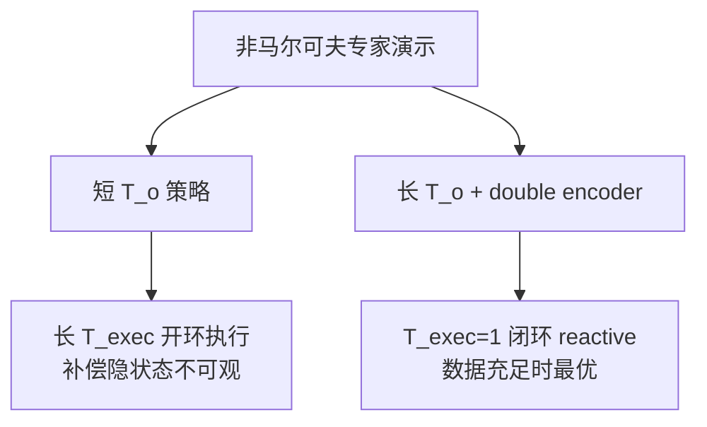

# Revisiting Open-Loop Execution（长上下文 reactive 策略）

**Revisiting Open-Loop Execution in Robotics: Toward Reactive, Higher-Performing Policies**（[arXiv:2608.15938](https://arxiv.org/abs/2608.15938)，[项目页](https://revisiting-open-loop-action-chunking.github.io/)，MIT / UC Berkeley）系统研究 **action chunking 的 open-loop 执行前缀**（execution horizon \(T_{\mathrm{exec}}\)）：为何业界默认需要 **0.5–1 s** 开环执行，以及如何用 **更长观测上下文** 恢复反应性。

## 一句话定义

**长 open-loop 执行主要是在帮只有 1–2 帧历史的策略模仿非马尔可夫专家；给够上下文后，最 reactive 的闭环策略反而最好。**

## 英文缩写速查

| 缩写 | 英文全称 | 简要说明 |
|------|----------|----------|
| BC | Behavior Cloning | 监督式模仿学习 |
| DP | Diffusion Policy | 本文主策略族（U-Net + 扩散） |
| \(T_{\mathrm{exec}}\) | Execution Horizon | 每次查询后开环执行的动作步数 |
| \(T_o\) | Observation / Context Length | 策略条件化的历史帧数 |
| \(T_p\) | Prediction Horizon | 每次预测的 action chunk 长度 |
| DAgger | Dataset Aggregation | 复合误差干预（HG-DAgger 变体） |
| RDE | Randomized Delay Ensemble | 对照论文 [Why AC](../entities/paper-why-action-chunking-improves-bc.md) 的部署技巧 |

## 为什么重要

- **重新排序因果叙事：** 相对「降复合误差 / 吸收延迟 / 动作平滑」三件套，本文用对照实验认为 **专家非马尔可夫性 + 策略短记忆** 是 success-horizon 曲线形状的主因；复合误差 **重要但通常更弱**。
- **与 CoRL 2026 Why AC 形成互补轴：** Why AC 拆 **chunk 训练 vs Delay/RDE 部署**；本文拆 **execution horizon vs context length**——共同指向：**不必死守长 open-loop 播放**。
- **给出工程方向：** **加长 \(T_o\)** + **double encoder** 可在多任务上让 \(T_{\mathrm{exec}}^*\rightarrow 1\)（完全 reactive），且数据规模充足时超过短上下文长执行策略。
- **真机验证：** 双 ARX-5 精密操作（分药、装袋）支持仿真结论外推。

## 核心信息

| 项 | 内容 |
|----|------|
| **机构** | 麻省理工学院（MIT）；加州大学伯克利分校（UC Berkeley） |
| **策略** | Diffusion Policy（仿真多任务）；真机用 DINOv3 编码器 |
| **评测** | FurnitureSimOneLeg、GearInsertion、PushT-D、Kitchen；SinglePillDispense、SlipIntoBaggie |
| **开源** | 项目页 + arXiv **已发布**；主代码仓 **未挂链**；§4 自动化专家策略称将公开 |

## 核心原理

### 被检验的三类解释

| 解释 | 本文读法 |
|------|----------|
| **专家非马尔可夫性** | 人类演示含隐式记忆/暂停/模式边界；短 \(T_o\) 策略需长 \(T_{\mathrm{exec}}\) 补偿 → **主因** |
| **复合误差** | HG-DAgger 可缓解但仍需非平凡 \(T_{\mathrm{exec}}\)（除非同时加长上下文） |
| **推理延迟 / 平滑** | 仿真零延迟设定下长 \(T_{\mathrm{exec}}\) 仍有益 → 不能单独用延迟解释 |

### Double encoder（长上下文训练技巧）

- **\(E_L\)**：编码全部 \(T_o\) 帧；**\(E_S\)**：仅最近 \(T_s\) 帧（常 \(T_s=2\)）。
- 最近帧 **双路径表示** + 短程 dropout → 稳定长上下文 Diffusion Policy 训练。

### 流程总览

## 实验要点（索引级）

| 轴 | 报告口径 |
|----|----------|
| **success-horizon 曲线** | 非马尔可夫专家 + 短 \(T_o\) → 倒 U 形，最优 \(T_{\mathrm{exec}}>1\) |
| **加长 \(T_o\)** | 逐步压低最优 \(T_{\mathrm{exec}}\)；足够长时 **\(T_{\mathrm{exec}}=1\) 最佳** |
| **复合误差 vs 非马尔可夫** | 同设定下后者对曲线形状影响更强 |
| **真机** | 长上下文 reactive 超过短上下文长执行 |

## 结论

**Action chunking 的价值不必绑定在长 open-loop 执行上——关键是策略能否观测到专家隐状态；长上下文 reactive 是更 principled 的终点。**

- **Execution horizon 是短记忆的补丁** — 1–2 帧上下文普遍不足拟合人类暂停与决策边界。
- **复合误差不是唯一故事** — DAgger 类干预不足以单独解释为何仿真零延迟仍需开环。
- **加长上下文可消除开环收益** — \(T_o\) 8–20 帧区间在多任务让 reactive 策略追上并超过长执行。
- **Double encoder 是实用训练配方** — 分离即时控制与长程推断表征，减轻长上下文训练不稳定。
- **与 Why AC 对照** — Why AC：同一 \(\hat\pi_k\) 用 RDE 复现 chunk 收益；本文：同一 chunk 策略在够长 \(T_o\) 下 **不必长开环执行**。

## 工程实践与开源状态

| 项 | 状态 |
|----|------|
| **论文 / 项目页** | [arXiv:2608.15938](https://arxiv.org/abs/2608.15938)、[项目页](https://revisiting-open-loop-action-chunking.github.io/) |
| **完整策略代码** | **未开源**（项目页无 GitHub） |
| **专家策略代码** | 论文称将 release §4 自动化 Markov/非 Markov 专家 |
| **源码运行时序图** | **不适用** |

## 常见误区或局限

- **误区：** 认为本文否定 action chunking **预测**；否定的是 **长 open-loop 执行必要性**（预测长序列仍可保留）。
- **局限：** 长上下文训练数据需求更高；double encoder 机制未完全理论化；与工业 VLA 默认 1–2 帧历史的迁移成本未充分评测。

## 与其他页面的关系

- [Action Chunking](../methods/action-chunking.md) — 方法 hub（将补交叉引用）
- [Why Action Chunking Improves BC](./paper-why-action-chunking-improves-bc.md) — 并发机制论文
- [Diffusion Policy](../methods/diffusion-policy.md) — 主实验载体
- [VLA 真机部署指南](../queries/vla-deployment-guide.md) — 反应性 vs 延迟缓冲
- [AutoIntervene](./paper-autointervene.md) — chunk 执行期干预对照

## 推荐继续阅读

- [论文（arXiv:2608.15938）](https://arxiv.org/abs/2608.15938)
- [项目页](https://revisiting-open-loop-action-chunking.github.io/)
- [Why Action Chunking Improves BC](./paper-why-action-chunking-improves-bc.md)

## 参考来源

- [Revisiting Open-Loop 论文归档](../../sources/papers/revisiting_open_loop_action_chunking_arxiv_2608_15938.md)
- [项目页归档](../../sources/sites/revisiting-open-loop-action-chunking.md)
