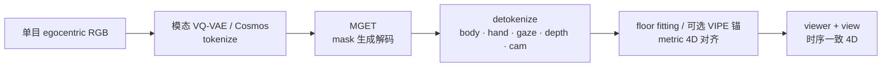
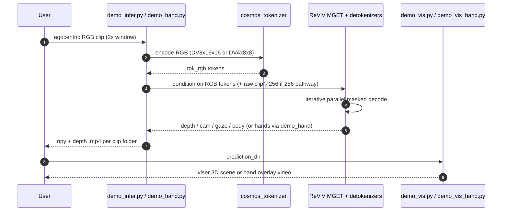

# ReViV

**ReViV**（*Reconstructing the Viewer and the View in 4D from Monocular Egocentric Video*，[ECCV 2026](https://arxiv.org/abs/2607.17790)）提出首个 **单目 egocentric RGB → 统一 4D 重建** 框架：同时估计 wearer 的 **全身、双手、注视** 与场景的 **深度、相机轨迹**，并在共享 metric 坐标系中对齐 viewer 与 view。

## 一句话定义

**用 Masked Generative Egocentric Transformer（MGET）对 RGB/深度/相机/注视/全身/双手做统一离散 token 建模，从一段可穿戴前视视频一次前向解码时序一致的「人 + 场景」4D 状态，无需 SLAM 或外接手部模块。**

## 英文缩写速查

| 缩写 | 英文全称 | 简要说明 |
|------|----------|----------|
| MGET | Masked Generative Egocentric Transformer | 多模态 mask 生成式 egocentric Transformer |
| VQ-VAE | Vector Quantized Variational Autoencoder | 将连续信号离散化为 token 序列 |
| MPJPE | Mean Per Joint Position Error | 关节位置平均误差 |
| PA-MPJPE | Procrustes-Aligned MPJPE | 逐帧 Procrustes 对齐后的 MPJPE |
| ATE | Absolute Trajectory Error | 相机轨迹绝对平移误差 |
| ADT | Aria Digital Twin | Meta 第一人称数字孪生评测集 |

## 为什么重要

- **机器人遥操作与示教：** 单目眼镜/头戴相机即可同时得到操作者手部位姿、注视与场景几何，为 [Macrodata 手部动作管线](../methods/macrodata-egocentric-hand-action.md) 类下游提供 **无需 VIPE+Dyn-HaMR 串联** 的统一前端。
- **打破 scene/body 割裂：** 相对 [EgoM2P](./paper-sa-2506-07886-egom2p-egocentric-multimodal-multitask-pretraini.md) 的 scene-centric 多任务，ReViV 把 **全身与双手 kinematics** 纳入同一联合分布，利用跨模态监督弥补 egocentric 自遮挡。
- **速度可部署：** 单 clip **~0.7 s** 推理，比扩散式 EgoAllo（~101 s）快两个数量级，比 Dyn-HaMR（~280 s）快三个数量级，适合长视频批处理与在线原型。

## 核心信息

| 项 | 内容 |
|----|------|
| **机构** | 苏黎世联邦理工学院（ETH Zürich）· 代尔夫特理工大学（Delft University of Technology）· 微软（Microsoft） |
| **输入** | 单目 egocentric RGB 视频（推理默认 2 s / 60 帧窗口） |
| **输出** | 全身 21 关节、双手 MANO 系关节、2D 注视、仿射不变深度 + 相机轨迹；floor fitting 对齐 metric 4D |
| **骨干** | 模态专属 VQ-VAE + T5 式 12E/12D MGET（~400M 参数）+ 辅助 ViT 保留像素细节 |
| **预训练** | **7B unique tokens**，优化 **~500B training tokens**；数据含 Ego-Exo4D、HoloAssist、HOT3D、ARCTIC、TACO、H2O、EgoGen、Nymeria 等 |
| **开源** | **代码已开源**（Apache 2.0）；**权重已发布**（Sample Code License，**非商用**）；训练数据不随仓分发 |

## 核心原理

### 问题形式化

观测 \(\mathcal{X}=\{\mathbf{x}_{\text{rgb}}\}\)，重建 \(\mathcal{Y}=\{\mathbf{y}_{\text{hand}},\mathbf{y}_{\text{body}},\mathbf{y}_{\text{gaze}},\mathbf{y}_{\text{depth}},\mathbf{y}_{\text{cam}}\}\)。直接回归 \(f:\mathcal{X}\to\mathcal{Y}\) 在严重自遮挡下病态；ReViV 学习联合分布 \(p(\mathcal{X},\mathcal{Y})\)，推理时从 \(p(\mathcal{Y}\mid\mathcal{X})\) 采样/解码。

### 统一离散表示

- **Viewer：** gaze、hand、body 各自 transformer VQ-VAE（球面量化 + EMA codebook）；手用 **相机系**，身用 **重力对齐世界系**。
- **View：** RGB/depth 用 [NVIDIA Cosmos](https://github.com/NVIDIA/Cosmos) tokenizer；camera/gaze tokenizer 在 EgoM2P 基础上于 7B 数据重训。
- 全模态 token 拼接为 \(\mathbf{Z}\)，MGET 随机 mask 子集，用交叉熵预测被 mask token——同时学 **模态内时序** 与 **跨模态相关**。

### 流程总览

### 数据引擎

在 [EgoM2P](./paper-sa-2506-07886-egom2p-egocentric-multimodal-multitask-pretraini.md) 4B token 场景基础上扩展手/身标注，并用 [Video Depth Anything](https://github.com/DepthAnything/Video-Depth-Anything) 生成时序深度伪标签，总 unique tokens **4B → 7B**。

## 源码运行时序图

官方仓库 [lvsean/reviv4d](https://github.com/lvsean/reviv4d) 推理主路径（`demo_infer.py` + `demo_hand.py`）：

**复现要点：** 先 `download_cosmos_tokenizer.py`（HF gated）；`REVIV_CKPT_ROOT` 指向 `metric_depth/` 或 `reviv_500b/` 整套权重；手部与全身可分脚本跑，可视化见 `demo_vis.py` / `demo_vis_hand.py`。

## 工程实践

| 项 | 建议 |
|----|------|
| **环境** | `conda env create -f environment.yaml` → `reviv`；CUDA 12.4 + Python 3.12 |
| **权重选型** | `metric_depth/`：512×512 **metric** depth + 全身/相机/注视/手；`reviv_500b/`：256 relative depth，训练规模更大 |
| **许可边界** | 代码 Apache 2.0；**权重非商用** — 产品化需另谈授权 |
| **数据** | 仓库不含训练集；`README_DATA.md` 描述 clip 与 WebDataset 布局 |
| **与旧管线对照** | 可替代「VIPE 相机 + EgoAllo/UniEgoMotion 身 + HaMeR/Dyn-HaMR 手」串联；[WiLoR](../methods/wilor.md) 仍是常用单帧手检测前端，但 ReViV 强调 **时序联合先验** |
| **局限** | 深度弱于继承 UniDepth 的 EgoMono4D；离散量化损失高频几何细节 |

## 实验与评测

**协议：** 2 s clip；视频模态 30→8 FPS、256²；ADT 等 held-out 集评测（训练未含 ADT 全身 GT）。

| 任务 | 关键结果（ReViV，RGB only） | 对照 |
|------|---------------------------|------|
| **全身（ADT）** | PA-MPJPE **88.6**，Similarity **0.751**，FID **0.442**，**0.7 s** | 优于 VIPE+GT 相机的 EgoAllo/UniEgoMotion |
| **手部（四集）** | HoloAssist PA **10.5**；ARCTIC PA **13.7**；TACO PA **9.4**；**0.7 s** | 全面优于 HaMeR/Dyn-HaMR（72–280 s） |
| **相机（ADT）** | ATE **0.015**，RTE **0.009**，RRE **1.279**，**0.7 s** | 端到端优于 EgoM2P；ATE 次于 VIPE bundle adjustment |
| **注视（ADT）** | MSE **0.0211** | 低于 EgoM2P **0.0311** |
| **深度（ADT）** | Abs Rel **0.265**，δ₁.₂₅ **56.5%** | 优于 EgoM2P；次于 EgoMono4D（**0.150**）但快 **20×+** |

## 结论

**ReViV 把 egocentric「场景感知 + 不可见身体运动」收成单一 feed-forward 生成模型，在其自报的对照集上同时拿到速度与多任务精度优势（截至 2026-09 归档口径），但深度精度与商用许可仍有限制。**

1. **单 RGB 输入即够** — 无需预计算 SLAM/点云/外接手部模块，降低可穿戴采集门槛。
2. **联合分布是关键** — 消融显示 task-specific body 专家与 1-to-1 mask 均显著掉点；跨模态 mask ensemble 学到可迁移先验。
3. **全身+手+注视三项齐头** — ADT 与 ARCTIC 等集上 PA-MPJPE、FID、Similarity 全面领先论文自选的扩散/优化基线（EgoAllo、UniEgoMotion、HaMeR、Dyn-HaMR）；这是**对照组内**的领先，不是对全领域的断言。
4. **推理速度可批处理** — ~0.7 s/clip 使长 egocentric 日志处理可行，适合示教数据矿机前端。
5. **深度仍是短板** — 无 depth expert 初始化 + Cosmos 量化误差；高精度 metric 场景几何仍需 EgoMono4D 类专家或后处理。
6. **权重非商用** — 代码可改，但 polybox 权重许可限制产品部署；训练需自行凑 7B token 级数据管线。
7. **承袭 EgoM2P/4M** — 工程上是对 [EgoM2P](./paper-sa-2506-07886-egom2p-egocentric-multimodal-multitask-pretraini.md) 的 **viewer 侧扩展**，而非替代其条件视频生成能力。

## 与其他工作对比

egocentric 4D 重建这条线上，各家切的「输出集合」不同——先看要什么，再看谁快：

| 工作 | 输出集合 | 推理形态 | 速度（论文自报） | 开源 / 许可 |
|------|----------|----------|------------------|-------------|
| **ReViV** | **全身 + 双手 + 注视 + 深度 + 相机**（共享 metric 系） | 单次前向 MGET（2 s clip） | **~0.7 s/clip** | 代码 **Apache 2.0**；权重 **非商用** |
| [MINT](./paper-mint-ego-world-space-camera-hand-motion.md) | **世界系相机 + 双手 MANO + 存在性**（无全身） | 单次前向（32 帧滑窗） | 单 GPU 前向，需 **≥24 GB** VRAM | 权重 + 训练码 + 标注已开源 |
| [EgoM2P](./paper-sa-2506-07886-egom2p-egocentric-multimodal-multitask-pretraini.md) | scene-centric 多模态（含条件视频生成） | 单次前向 | — | ReViV 是其 **viewer 侧扩展**，非替代 |
| EgoAllo / UniEgoMotion | 全身 | 扩散 + 需预计算相机（VIPE） | ~101 s | — |
| HaMeR / Dyn-HaMR | 双手 | 优化 / 逐帧 + TTO | 72–280 s | — |
| [WiLoR](../methods/wilor.md) | 单帧双手 | 逐帧检测重建 | 快 | 常用前端基线 |
| EgoMono4D | 深度 | 连续回归专家 | 比 ReViV 慢 **20×+** | 深度 Abs Rel **0.150** 优于 ReViV 的 0.265 |
| VIPE | 相机 | Bundle adjustment | 慢 | ATE 优于 ReViV 端到端；ReViV 无可见地面时可用它作锚 |

**⚠️ 不要横向照抄数字：** ReViV 与 MINT 都在 ARCTIC / HOT3D 上报手部误差，但 **不可直接比大小**——(1) 指标变体不同（ReViV 报 **PA**，MINT 报 **PA-MPJPE-p**）；(2) **训练集重叠情况不同**：ARCTIC / HOT3D 在 ReViV 的预训练数据清单里，而 MINT 是把它们当 **零样本** 集评的。要判高下须回到同一协议下重跑。

**选型读法：**

- 要 **全身 + 注视**，或要一个模型吃下所有模态 → ReViV（但商用受权重许可限制）。
- 只要 **世界系相机 + 双手**、且要 **可商用可自训** → MINT。
- 要 **高精度 metric 深度** 或 **最准相机轨迹** → 仍需 EgoMono4D / VIPE 类专家，ReViV 的对应通道是「够快够用」而非最准。

## 局限与风险

- **离散 token 权衡：** 密集深度回归略逊于连续专家模型（论文 Limitations 节）。
- **窗口长度：** 默认 2 s clip，长程一致性依赖滑窗与后处理，非全局 BA。
- **metric 对齐：** 无可见地面时需可选 VIPE 锚；纯相对深度路径 (`reviv_500b`) 与 metric 套装不可混用 detokenizer。
- **数据合规：** 权重训练混合多数据集，再分发与商用受各数据许可与 Sample Code License 双重约束。

## 关联页面

- [EgoM2P](./paper-sa-2506-07886-egom2p-egocentric-multimodal-multitask-pretraini.md) — 前序 egocentric 多模态预训练（scene-centric）
- [Macrodata egocentric hand action](../methods/macrodata-egocentric-hand-action.md) — Dyn-HaMR / HaWoR 工程管线对照
- [WiLoR](../methods/wilor.md) — 单帧手部重建强基线
- [遥操作](../tasks/teleoperation.md) — 第一人称示教采集
- [操作](../tasks/manipulation.md) — 手–物交互任务语境
- [MINT](./paper-mint-ego-world-space-camera-hand-motion.md) — 同期 egocentric 世界系相机 + 双手前馈模型（无全身，权重可商用）

## 参考来源

- [ReViV 论文归档](../../sources/papers/reviv4d_arxiv_2607_17790.md)
- [ReViV 项目页](../../sources/sites/reviv4d.md)
- [ReViV 官方仓库](../../sources/repos/reviv4d.md)

## 推荐继续阅读

- [arXiv:2607.17790](https://arxiv.org/abs/2607.17790) — 论文全文
- [ReViV 项目页](https://reviv4d.github.io/) — 定性视频与架构图
- [GitHub: lvsean/reviv4d](https://github.com/lvsean/reviv4d) — 推理 demo 与 checkpoint 说明
- [EgoM2P 原文](https://arxiv.org/abs/2506.07886) — scene-centric 多任务前序工作
