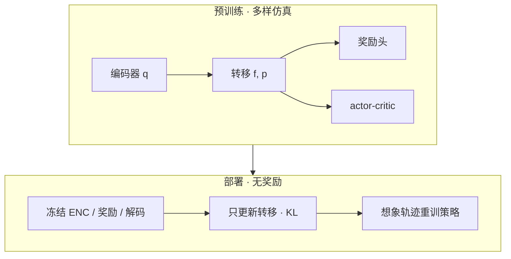
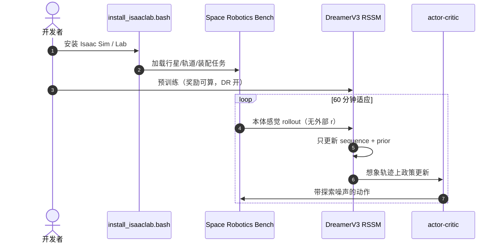

# 无奖励持续适应：太空机器人的潜奖励景观

**Reward-Free Continual Adaptation for Resilient Space Robots**（[arXiv:2608.23452](https://arxiv.org/abs/2608.23452)，[代码](https://github.com/AndrejOrsula/space_robotics_bench)）由 **卢森堡大学（University of Luxembourg）** 提出：面对无法在轨计算奖励的硬件退化，先在多样仿真预训练潜状态世界模型，部署后冻结观察编码器与奖励预测器，只通过无监督 rollout 更新转移动态，再在想象中重训策略。

## 一句话定义

**当真实奖励不可观测时，保留预训练的潜奖励结构、只校准动态模型，是一条可运行的在轨适应路径——但 RSSM 会在长期更新中漂移。**

## 英文缩写速查

| 缩写 | 英文全称 | 简要说明 |
|------|----------|----------|
| RSSM | Recurrent State-Space Model | DreamerV3 的序列+随机潜动态 |
| SRB | Space Robotics Bench | 本文实验宿主，Isaac Lab 地外套件 |
| KL | Kullback–Leibler divergence | 适应阶段仅优化 prior vs posterior |
| DR | Domain Randomization | 预训练重力/惯量/摩擦/扰动随机化 |

## 为什么重要

- ** Curiosity 轮损是真实先例：** 地外系统必须在通信延迟下自行适应，不能假设奖励可算。
- **持续 RL 的隐藏假设：** 大多数在线方法默认有 \(r_t\)；开挖体积、微重力位姿跟踪在真机都难构成可靠奖励。
- **工程分离：** 编码器/奖励头冻结，把「任务目标」和「坏掉的身体」拆开。

## 核心信息

| 项 | 内容 |
|----|------|
| **机构** | 卢森堡大学（University of Luxembourg） |
| **骨干** | DreamerV3 RSSM + 想象 actor-critic |
| **适应窗** | 单环境 60 分钟（90k / 36k / 180k step，按控制频率） |
| **开源** | **已开源** — SRB + `scripts/dreamerv3.yaml` |

## 流程总览

## 源码运行时序图

关键复现路径：以 [space_robotics_bench](https://github.com/AndrejOrsula/space_robotics_bench) 为入口，文档站安装后使用 `scripts/dreamerv3.yaml` 超参；论文适应配方是该 Bench 上的世界模型微调，不是独立 pip 包。

## 实验与评测读法

三任务均在 SRB / Isaac Lab，形态故障在适应前未建模：

| 任务 | 故障 | 控制频率 |
|------|------|----------|
| 行星穿越 | 锁死右前轮转向+驱动 | 25 Hz |
| 轨道导航 | 三共位偏轴推进器全失效 | 10 Hz |
| 螺丝装配 | 法兰 15° 轴向弯曲 | 50 Hz |

对照：零样本（预训练策略）灾难性失败；从头重训是样本无效率上界；**有特权奖励的适应**接近该上界；**无奖励适应**有快速初期恢复，随后波动并衰减（轨道与装配更明显）。作者将衰减归因于冻结奖励头 + 持续改转移导致潜空间离开预训练奖励景观。

## 结论

**潜世界模型确实能在无新奖励时启动故障恢复；长期稳定仍需要限制动态更新范围，而不是无限微调 RSSM 核心。**

1. **真影响：** 把奖励结构冻在 latent，比试图在轨估计开挖量/位姿奖励更现实。
2. **读曲线：** 前半段恢复有效，后半段衰减是方法边界，不是「再训久一点」。
3. **部署：** 论文是仿真-only，未过 sim2real；在轨算力也远高于星载模块。
4. **对照 RAFT：** RAFT 把特权放在 critic、部署零故障传感；本页把特权放在预训练奖励头、部署零奖励。

## 与其他工作对比

| 对比轴 | 本方法 | 标准持续 RL | [RAFT](./paper-raft-thruster-fault.md) |
|--------|--------|-------------|--------------------------------------|
| 部署期奖励 | 不需要 | 需要 | 需要（仿真任务奖励） |
| 故障信息 | 无显式 \(D_{gt}\) | 各异 | critic 训练时可见 |
| 宿主 | SRB DreamerV3 | 各异 | Isaac Lab PPO |

## 工程实践

| 项 | 说明 |
|----|------|
| 学习率 | 世界模型 \(4\times10^{-5}\to4\times10^{-6}\) 以防遗忘 |
| 探索 | 归一化动作加 \(\mathcal{N}(0,0.02)\) |
| 终止头 | 本文冻结（终止条件不变时） |

## 局限与风险

- 后期衰减未解；作者建议局部 latent adapter。
- 仿真绕过 sim2real。
- 适应优化量对星载功耗不现实。

## 关联页面

- [DreamerV3](./paper-shenlan-wm-13-dreamerv3.md) — RSSM 骨干
- [Space Mining](./paper-space-mining-with-robotics.md) — 地外自主基础设施
- [RAFT](./paper-raft-thruster-fault.md) — 同机构推进器容错
- [开源 7 篇系统结构地图](../overview/open-source-7-papers-system-structure-technology-map.md)

## 参考来源

- [论文摘录](../../sources/papers/reward_free_continual_adaptation_space_arxiv_2608_23452.md)
- [SRB 文档站](../../sources/sites/space-robotics-bench.md)
- [SRB 仓库](../../sources/repos/space_robotics_bench.md)
- [具身智能小站 7 篇盘点](../../sources/blogs/wechat_embodied_station_7_papers_vla_intent_space_2026-08-26.md)

## 推荐继续阅读

- [arXiv:2608.23452](https://arxiv.org/abs/2608.23452)
- [SRB 文档](https://AndrejOrsula.github.io/space_robotics_bench)
- [DreamerV3 Nature 文](https://arxiv.org/abs/2301.04104)
