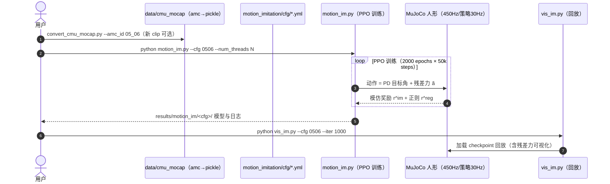

# Residual Force Control（RFC，NeurIPS 2020）

**Residual Force Control for Agile Human Behavior Imitation and Extended Motion Synthesis**（Ye Yuan、Kris Kitani，CMU，NeurIPS 2020，[arXiv:2006.07364](https://arxiv.org/abs/2006.07364)，[项目页](https://www.ye-yuan.com/rfc)，[代码](https://github.com/Khrylx/RFC)）把 Residual 思想从「关节动作修正」扩展到「**动力学修正**」：在动作空间中加入作用于人形角色的**外部残差力**，作为可学习的时变动力学补偿，解决人体 MoCap 数据对仿真角色**物理不可行**的根本问题。芭蕾 pirouette/arabesque/jeté 等 DeepMimic 无法复现的动作被首次攻下；配合 CVAE 运动策略的 dual-policy 框架实现 Human3.6M 无限时动作合成。

## 英文缩写速查

| 缩写 | 英文全称 | 简要说明 |
|------|----------|----------|
| RFC | Residual Force Control | 本文方法：动作空间中加入外部残差力 |
| DoF | Degrees of Freedom | 模仿用 38 DoF/20 刚体人形（CMU subject 8 骨架）；Human3.6M 用 52 DoF |
| PD | Proportional-Derivative | 关节力矩由 stable PD 控制器从目标角计算，策略输出 PD 目标角 |
| PPO | Proximal Policy Optimization | 训练算法（2000 epochs × 50k steps，约 1 天/策略） |
| CVAE | Conditional Variational Autoencoder | dual-policy 中运动策略 $\kappa_\psi$ 的生成模型（30 步过去 → 60 步未来） |
| MoCap | Motion Capture | CMU mocap（单动作模仿）与 Human3.6M（长时合成）数据源 |
| ELBO | Evidence Lower Bound | CVAE 训练目标 |

## 为什么重要

- **指出动作模仿失败的根因是「动力学失配」而非「策略不够强」**：真实人体动作对仿真角色可能**物理不可行**——再强的策略也无法产生模型不允许的运动；RFC 用可学习的时变外力扩展动力学本身，使更大范围的人类动作变得「可允许」。
- **与 DeepMimic 直接对位**：同一 MuJoCo/PPO/PD 栈，唯一差别是残差力与正则项；8 组动作上**收敛更快且最终回报更高**，芭蕾三动作 DeepMimic 失败而 RFC 成功——残差收益的干净对照实验。
- **残差思想的另一空间**：经典 RPL 修动作，RFC 修**力**；为后续仿真特权补偿（ASAP delta 模型、ResMimic 虚拟力课程）提供了概念先例。
- **长时动作合成**：dual-policy（运动 CVAE 预测 + RFC 跟踪）是首个从 Human3.6M 大规模数据学习并生成多样长时动作的人形控制方法，无需任务引导或用户输入。

## 核心原理（方法）

### RFC 动力学增广

多刚体运动方程右侧加入残差力项：

$$\boldsymbol{B}(\boldsymbol{q})\ddot{\boldsymbol{q}}+\boldsymbol{C}\dot{\boldsymbol{q}}+\boldsymbol{g}=\begin{bmatrix}\boldsymbol{0}\\ \boldsymbol{\tau}\end{bmatrix}+\sum_i \boldsymbol{J}^T_{\boldsymbol{v}_i}\boldsymbol{h}_i+\sum_{j=1}^{M}\boldsymbol{J}^T_{\boldsymbol{e}_j}\boldsymbol{\xi}_j$$

复合策略 $\widetilde{\pi}_\theta$ 分解为原控制策略 $\widetilde{\pi}_{\theta_1}(a|s)$ 与残差力策略 $\widetilde{\pi}_{\theta_2}(\widetilde{a}|s)$；零残差时严格退化为原动力学，因此 RFC 是原框架的**严格推广**。两种实现：

| 变体 | 修正动作 $\widetilde a$ | 优点 | 代价 |
|------|--------------------------|------|------|
| **RFC-Explicit** | $M$ 组力向量 $\xi_j$ + 局部作用点 $e_j$（如髋/足） | 可解释（可视化蓝色力箭头） | 需指定力数量与作用体、算 Jacobian |
| **RFC-Implicit** | 直接输出根部残差力矩 $\eta_r$（仅 **+6 维**） | 高效、无数量/作用点假设 | 不可解释 |

**正则奖励** $r^{reg}$：惩罚力幅值、把作用点拉回刚体原点——只在必要时调用残差力，使新动力学 $\mathcal T'$ 贴近原动力学。

### Dual-Policy 长时合成

1. **运动策略** $\kappa_\psi$（CVAE）：过去 $p{=}30$ 步 + 潜变量 $z$ → 未来 $f{=}60$ 步多模态运动；
2. **RFC 控制策略**：把 $\kappa_\psi$ 自回归生成（$n{=}5$ 段）的运动当参考模仿，状态含 $(x,\hat x,z)$；**加性动作** $u=\hat q_{nr}+\delta u$——参考关节角做 base、策略只学残差角（又一个 base+残差实例）；
3. 测试时两策略滚动协作 → **无限时**物理可行多模态动作。

## 实验与评测

- **单动作模仿（8 组 CMU mocap）**：芭蕾×3、backflip、cartwheel、jump kick、side flip、handspring；RFC-Explicit/Implicit 均**收敛快于 DeepMimic 且最终回报更高**（3 seeds，回报只计模仿奖励）；DeepMimic 无法复现芭蕾动作。
- **运动合成（Table 1）**：Human3.6M（Mix / Cross 两种协议）与 EgoMocap 上，RFC dual-policy 在 2s 预测双指标上一致优于 EgoPose 等基线；甚至能合成**物理环境未建模椅子**的坐姿（残差力提供缺失支撑力）。
- **消融（Table 2）**：去掉残差力（ResForce）或加性动作（AddAct）性能均下降，验证两组件各自贡献。
- **实现**：MuJoCo 450 Hz 仿真 / 30 Hz 策略；PPO 2000 epochs×50k steps；20 核 + RTX 2080 Ti 约 1 天/策略。

## 源码运行时序图

官方仓库 [Khrylx/RFC](https://github.com/Khrylx/RFC)（**非商用许可**）：随仓附带 CMU mocap 预处理数据与 8 组预训练模型。

- **最短验证路径**：直接用随仓预训练模型跑 `vis_im.py`；重训芭蕾用 `0506/0507/0513` 配置。

## 结论

**动作模仿的天花板往往来自「动力学失配」而非策略容量；把残差写成可学习的外力（并配正则），就能让角色做出模型原本物理不允许的动作——但这是仿真特权，不是真机控制方案。**

1. **两变体按需求选** — 要可解释力箭头用 Explicit（力+作用点）；要效率用 Implicit（根部 +6 维、免 Jacobian）；论文显示二者性能相当。
2. **正则项是安全阀** — 力幅值与作用点正则使残差「按需调用」、新动力学贴近原动力学；去掉后动作质量下降（消融）。
3. **加性动作是第二个残差** — dual-policy 中 $u=\hat q_{nr}+\delta u$ 用运动策略输出做 base；与 RFC 并列贡献（AddAct 消融）。
4. **DeepMimic 对照干净** — 同栈仅差残差力：8/8 动作收敛更快、芭蕾从失败到成功；引用 RFC 时应同时引用这个对照设置。
5. **真机引用要谨慎** — 作者明示外力不存在于真实机器人；可借鉴的是「warm-up 加速训练」与「残差力幅值指导机体设计」两个方向。
6. **代码可直接验证** — 非商用许可；预训练模型 + pickle 数据随仓，`vis_im.py` 5 分钟可见效果。

## 常见误区或局限

- **只适用于仿真域**（动画、动作合成、位姿估计）：外力无法作用于真实机器人骨盆/肢体，论文局限节明示；引用为真机方案是误读。
- **残差力可能学到「作弊」动力学**：正则不足时角色靠外力而非自身力矩完成动作，损害物理真实性。
- **人形模型与数据绑定**：38/52/59 DoF 三种角色分别绑定 CMU/Human3.6M/EgoMocap；迁移到新角色需重建模型与重定向数据。
- **长时合成质量依赖运动策略**：$\kappa_\psi$ 预测漂移时控制策略会被带偏（训练用 5 段自回归缓解但未根除）。

## 与其他工作对比

| 维度 | RFC | [DeepMimic](../methods/deepmimic.md) | [RuN](./paper-notebook-run-residual-policy-for-natural-humanoid-locomot.md) | [ResMimic](./paper-resmimic.md) |
|------|-----|--------------------------------------|------------------------------------------------------------------------------|----------------------------------|
| 残差空间 | **外力/力矩** | 无残差 | 关节目标 | 关节动作 |
| 补偿对象 | 人↔角色动力学失配 | — | CMG 先验的开环性 | GMT 先验缺物体感知 |
| 真机可用 | 否（仿真特权） | 否（角色动画） | 是（G1） | 是（G1） |
| 长时合成 | dual-policy 无限时 | 单片段 | 速度命令连续 | 任务片段 |
| 代码 | 已开源（非商用） | 开源（第三方复现多） | 未开源 | 已开源 |

## 关联页面

- [Residual Policy Learning 方法页](../methods/residual-policy-learning.md)
- [DeepMimic](../methods/deepmimic.md)
- [Imitation Learning](../methods/imitation-learning.md)
- [Whole-Body Tracking Pipeline](../concepts/whole-body-tracking-pipeline.md)
- [RuN](./paper-notebook-run-residual-policy-for-natural-humanoid-locomot.md)
- [MimicKit](./mimickit.md)

## 推荐继续阅读

- 项目页与演示视频：<https://www.ye-yuan.com/rfc>
- 代码：<https://github.com/Khrylx/RFC>
- 补充视频：<https://youtu.be/XuzH1u78o1Y>

## 参考来源

- [Residual Policy / Residual RL 论文精读清单摘录](../../sources/personal/residual-policy-reading-list.md)
- [RFC 项目页归档](../../sources/sites/rfc-ye-yuan.md)
- [RFC 代码仓库归档](../../sources/repos/rfc-residual-force-control.md)
- Yuan & Kitani, *Residual Force Control for Agile Human Behavior Imitation and Extended Motion Synthesis*, NeurIPS 2020. <https://arxiv.org/abs/2006.07364>
