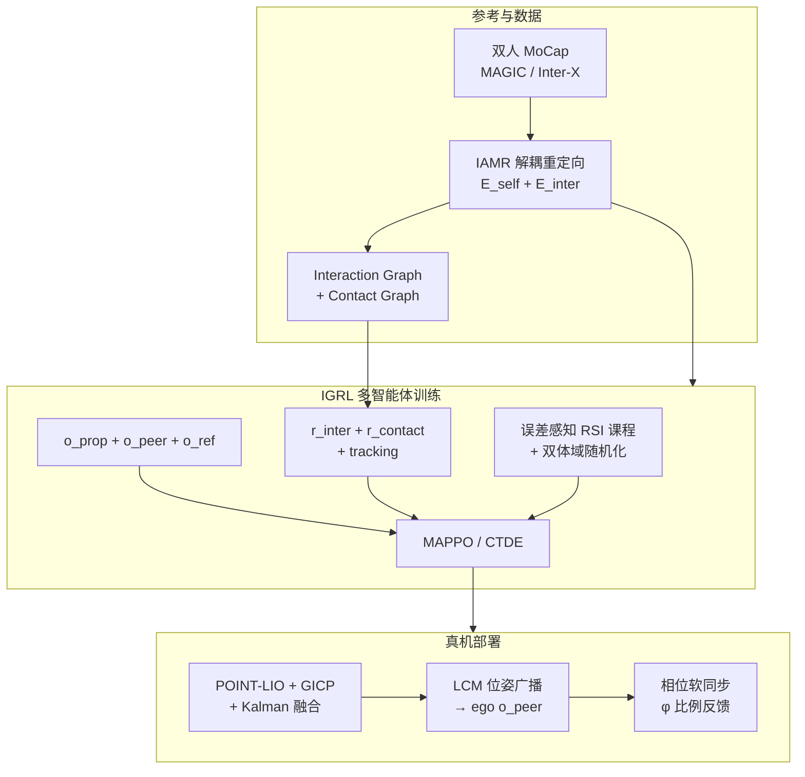

# Rhythm（Learning Interactive Whole-Body Control for Dual Humanoids）

**Rhythm** 是面向 **双 humanoid 物理耦合全身交互** 的系统论文（arXiv:2603.02856）：在 **两台 Unitree G1** 真机上首次报告 **拥抱、共舞、问候、肩并肩** 等 **富接触 / 长时域** 交互行为的 **稳健 sim2real**。框架由 **IAMR**（交互感知重定向）、**IGRL**（图奖励多智能体 RL）与 **真机部署栈**（LiDAR 融合定位 + 机间相位同步）三段紧密衔接。

## 英文缩写速查

| 缩写 | 英文全称 | 简要说明 |
|------|----------|----------|
| IAMR | Interaction-Aware Motion Retargeting | 解耦自运动与交互几何的双人重定向模块 |
| IGRL | Interaction-Guided Reinforcement Learning | 以图结构奖励学习耦合动力学的多智能体 RL |
| MAGIC | Multi-Humanoid Geometric Interaction Dataset | 约 3 小时双人交互 MoCap + IAMR 重定向参考 |
| MAPPO | Multi-Agent Proximal Policy Optimization | CTDE 范式下的 on-policy 多智能体 PPO |
| CTDE | Centralized Training with Decentralized Execution | 训练用全局信息、部署仅局部观测 |
| WBT | Whole-Body Tracking | 按参考轨迹训练全身跟踪策略 |
| G1 | Unitree G1 Humanoid | 论文真机验证平台 |
| Sim2Real | Simulation to Real | 仿真策略迁移真机 |
| MoCap | Motion Capture | MAGIC 等交互参考的采集来源 |
| LCM | Lightweight Communications and Marshalling | 机间位姿与相位广播 |

## 为什么重要

- **填补真机双机交互空白**：多数多体工作停在仿真或 **人–机 / 人–物**；Rhythm 强调 **两台主动 humanoid 的物理耦合**，且 **真机闭环** 而非仅 physics avatar。
- **重定向层直面 kinematic conflict**：异构双人 MoCap → 同构双机时，**个体流形** 与 **统一交互流形** 不可同时满足；IAMR 的 **拓扑分区 + 距离衰减弹簧** 给出可工程复用的解耦配方，并导出 **交互图 / 接触图** 供下游奖励对齐。
- **策略层显式建模伙伴**：IGRL 用 **peer 相对位姿观测** 与 **继承 IAMR 权重的图奖励**，避免把双 agent 当孤立 tracker；与 [AssistMimic](./paper-assistmimic.md) 的 assistive MARL 形成 **「真机双机社交交互」vs「仿真护理力交换」** 的互补阅读轴。
- **开放数据**：**MAGIC** 覆盖协调、亲密、接触、仪式、竞争五类，paired raw + retargeted，降低后续双机交互研究的数据门槛。

## 流程总览

## 核心机制（归纳）

### IAMR：解耦重定向与拓扑先验

- **问题**：$\mathcal{M}_{ind}$ 保自运动但破坏相对几何（「空手握手」）；$\mathcal{M}_{uni}$ 保交互但致脚浮等 **形态不兼容**。
- **做法**：Interaction Mesh 边集分为 $\mathcal{E}_{self}$ / $\mathcal{E}_{inter}$；最小化 $E_{self}+E_{inter}$，后者刚度 $\omega_{ij}=\omega_{max}e^{-\gamma d_{ij}}$ **近距变硬、远距变软**。
- **产物**：除关节轨迹外，提取 **跨体交互图** 与 **碰撞检测接触图**，作为 IGRL 奖励的 **拓扑监督**。
- **基线对比（论文 Table I）**：相对 GMR / OmniRetarget(OR) / 双体 OR 扩展(DOR)，IAMR 在 **Intensive Contact** 上 **IPR=0**，Contact F1 与下游 DSR 更均衡。

### IGRL：耦合动力学策略

- **范式**：MA-MDP + **MAPPO**；观测含 **本体**、**伙伴 ego 系相对 root**、**未来参考**；1D-CNN 编码历史 + MLP 解码动作。
- **图奖励**：
  - $r_{inter}$：交互边距离对齐参考，权重继承 IAMR 的 $\omega_{ij}$；
  - $r_{contact}$：接触状态一致 + 力幅正则，抑制穿透与非接触虚假力。
- **训练技巧**：多目标 **adaptive RSI**（早期偏稳定、后期偏 tracking/交互精度）；**延迟噪声 peer 观测** 与初始位姿扰动模拟无线链路。

### 真机部署

- **定位**：POINT-LIO 高频里程计 + GICP 地图配准 + Kalman 融合，支撑动态全身运动下的全局位姿。
- **观测重建**：LCM 广播全局 $\{P,R\}$，各机转 ego 系得到与仿真一致的 $o_{peer}$。
- **时间对齐**：以 motion phase $\phi$ 为进度变量，**软同步** $\dot{\phi}_{ego}=1+k(\phi_{peer}-\phi_{ego})$，避免硬重置带来的动作跳变。

## 常见误区或局限

- **双机同构前提**：框架针对 **两台 G1 级同构人形**；异构双机或人–机混合需重新设计观测与接触图。
- **基础设施依赖**：真机需要 **预建地图 LiDAR 定位** 与 **可靠机间通信**；非结构化野外场景的定位与同步仍是瓶颈。
- **与 AssistMimic 勿混淆**：AssistMimic 聚焦 **护理 assistive 力交换** 且在 **仿真 avatar** 主验证；Rhythm 聚焦 **对称双机社交/协调交互** 且 **真机为主证据**——问题设定、奖励与部署栈不同。
- **代码/数据发布节奏**：论文声明 MAGIC 将公开； ingest 时项目页 **未挂独立 GitHub**，实现细节以 arXiv 与附录为准。

## 与其他工作对比

| 路线 | 交互对象 | 重定向 | 策略 | 真机证据 |
|------|----------|--------|------|----------|
| **单人 GMT / BeyondMimic 系** | 无伙伴 | GMR 等单 agent | 孤立 tracking | 单 G1 广泛 |
| **OmniRetarget / DOR** | 人–物或双体扩展 | Interaction mesh | 多为单 agent tracking | 以仿真为主 |
| **AssistMimic** | 双 avatar 护理 | 动态 hand retargeting | MARL + PHC prior | 仿真 SR 为主 |
| **Rhythm** | **双 G1 对称交互** | **IAMR 解耦** | **MAPPO + 图奖励** | **双机真机拥抱/共舞** |

## 关联页面

- [Multi-Agent Reinforcement Learning (MARL)](../methods/marl.md)
- [Whole-Body Tracking Pipeline](../concepts/whole-body-tracking-pipeline.md)
- [Motion Retargeting Pipeline](../concepts/motion-retargeting-pipeline.md)
- [AssistMimic](./paper-assistmimic.md) — 双人 assistive MARL tracking（仿真主证据）
- [PHC](./paper-bfm-22-phc.md) — 单人 tracking prior 族；Rhythm 走 **双 agent 图奖励** 而非 PHC 零填充扩展
- [GMR](../methods/motion-retargeting-gmr.md) — IAMR 重定向基线之一
- [Sim2Real](../concepts/sim2real.md)
- [Unitree G1](./unitree-g1.md)

## 推荐继续阅读

- Inter-X 数据集（论文 Inter-X 鲁棒性评测）：<https://github.com/Inter-X-Generation/Inter-X>
- 项目页演示视频：<https://hoshi-no-ai.github.io/Rhythm/>

## 实验与评测

- **重定向**：IPR、MPD、IEE、Contact F1、下游 DSR；IAMR 在 MAGIC 三类物理分组与 Inter-X 上整体领先 GMR/OR/DOR。
- **策略 ablation**：去 peer obs、interaction reward、contact reward 均显著损伤成功率。
- **真机**：项目页展示协调舞蹈、富接触问候/拥抱/肩并肩及扰动鲁棒性；定量真机表见 **原文 PDF** 与 [参考来源](#参考来源)。

## 参考来源

- [Rhythm 论文摘录](../../sources/papers/rhythm_arxiv_2603_02856.md)
- [Rhythm 项目页归档](../../sources/sites/hoshi-no-ai-rhythm-github-io.md)
- Chen et al., *Rhythm: Learning Interactive Whole-Body Control for Dual Humanoids*, arXiv:2603.02856, 2026. <https://arxiv.org/abs/2603.02856>
