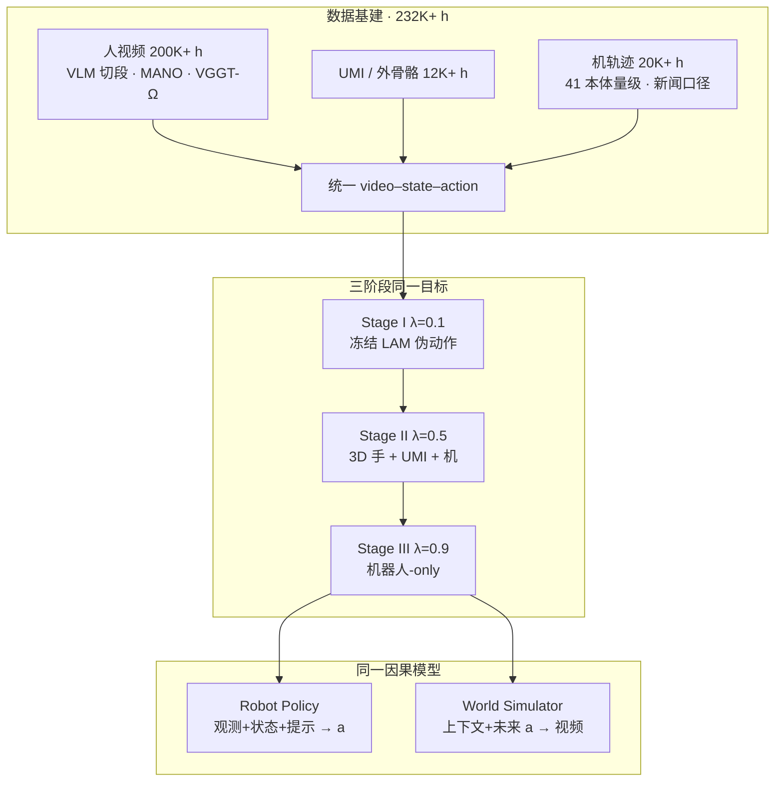

# Riemann-1.0（全因果自回归 World Action Model）

**Riemann-1.0**（*Riemann-1.0: An Embodied World Action Model for Physical AI*，黎曼动力技术报告，[项目页](https://riemann-dynamics.github.io/Riemann-1.0-Website)，[PDF](https://riemann-dynamics.github.io/Riemann-1.0-Website/paper/Riemann-1.0.pdf)）把机器人交互写成 **动作优先** 的因果自回归序列：先从历史观测/状态/动作预测当前 action chunk，再以该动作条件化未来视觉 latent。同一套 **Wan VAE + 共享 Action/Video DiT** 既当闭环策略，也当动作条件世界仿真器；用 **232K+ 小时** 人视频 / UMI / 机器人轨迹做三阶段渐进预训练。

| 机构 | 黎曼动力（Riemann Dynamics）；母公司昆仑万维（Kunlun Wanwei） |
|------|--------------------------------------------------------------|
| 类型 | 公司技术报告（**无 arXiv**） |
| 真机平台 | **天机 Marvin** 双臂 |
| 预训练数据 | **232K+ h**（人视频约 86% / UMI·外骨骼约 5% / 机轨迹约 9%） |
| 开源 | **确认未开源**（2026-08-29） |

## 一句话定义

**用「先动作、后视觉后果」的全因果自回归，把异构具身经验收成同一个可执行策略 + 动作条件仿真器，而不是联合去噪、视频优先或视频/动作分塔。**

## 英文缩写速查

| 缩写 | 英文全称 | 简要说明 |
|------|----------|----------|
| WAM | World Action Model | 联合未来观测与可执行动作的具身策略族 |
| LAM | Latent Action Model | Stage I 冻结的 32 维伪动作标注器（VIPRA 系） |
| DiT | Diffusion Transformer | 共享的动作–视频骨干 |
| PSR | Progress Success Rate | 按中间里程碑计的过程成功率 |
| UMI | Universal Manipulation Interface | 手持夹爪示教，桥接人–机动作空间 |
| VAE | Variational Autoencoder | Wan 视觉压缩；LAM 也是帧对 VAE |

## 为什么重要

- **把 WAM 族谱钉到「因果顺序」：** 作者明确对照 [DreamZero](./paper-notebook-dreamzero-world-action-models-are-zero-shot-poli.md) 联合去噪、[LingBot-VA](./paper-sa-2601-21998-lingbot-va-causal-video-action-world-model-for-g.md) 视频优先、[Fast-WAM](../concepts/world-action-models.md) 分塔——Riemann 的主张是 **动作必须先于对应视觉后果**，才能同时当策略和仿真器。
- **人视频规模落在产业中档：** **200K+ h** ego 人视频远小于 [Dyna-2](./dyna-2.md) 的 1M h，但配方更「对齐导向」：LAM 伪动作 → 3D 手/UMI 真动作 → 机器人-only，而不是「预训练零机器人数据」。
- **真增量不在饱和榜：** LIBERO **99.0**、RoboTwin **94.3** 与 [ABot-M0.5](./paper-abot-m05-mobile-manipulation-wam.md) / [WorldScape Policy 2.0](./paper-worldscape-policy-2.md) 同档；拉开差距的是 **RoboCasa365 62.6%（+8.4）** 与厨房整理真机 **90% vs G0.5 35%**。

## 流程总览

## 核心方法

### 全因果分解（式 1）

\[
p(a_{1:T},z_{1:T}\mid z_0,s_0,c)=\prod_{t=1}^{T}
p(a_t\mid z_{<t},s_{<t},a_{<t},c)\,
p(z_t\mid z_{<t},s_{<t},a_{\le t},c)
\]

- **策略模式：** 去噪 \(a_t\) 后执行，把环境返回的真观测编成 \(z_t\) 写入 KV cache。
- **仿真模式：** 同一 \(a_t\)（策略头 / 候选计划 / 回放）条件化 latent 头，解码未来 RGB。
- **状态不生成：** \(s_t\) 只从环境或记录注入，避免再学一套本体动力学。

### 架构接口

| 模块 | 作用 |
|------|------|
| **Wan VAE + 3D patch** | 多视角画布 → 视觉 latent；每 latent 对齐 **16** 步低层动作 |
| **T5 提示** | `embodiment / views / task` 进 cross-attn |
| **本体 ID** | 选动作/状态投影与头；变维动作 **pad + validity mask**，不硬并到同一物理空间 |
| **CaPE** | 坐标感知位置编码（视觉 frame/h/w，状态/动作时间槽） |
| **结构化因果 mask** | clean 只看历史 clean；noisy 不看未来 clean，防观测泄漏 |
| **双 flow-matching 头** | \(\mathcal{L}=(1-\lambda)\mathcal{L}_z+\lambda\mathcal{L}_a\) |

### 三阶段 λ 课程

| 阶段 | λ | 数据 | 意图 |
|------|---|------|------|
| LAM-Action Bootstrap | 0.1 | 无标签人视频 + 冻结 32-d LAM | 视觉动力学为主 |
| Trajectory-Grounded Alignment | 0.5 | 3D 手 + UMI + 机轨迹 | 对齐真动作空间 |
| Robot-Policy Enhancement | 0.9 | 高质量机器人-only | 可执行控制 |
| 后训练 | 0.95 | 四任务合成一个 generalist | 真机适配 |

LAM 是帧对 VAE：未来帧 prompt token 出 \(\mu,\log\sigma^2\)，解码器 **看不到** \(x_{t+1}\)，迫使 32 维码解释视觉转移；标注时用后验均值，避免采样噪声。

## 实验与评测

### 真机（天机 Marvin，Table 1）

| 模型 | 积木 SR | 厨房 SR | 叠衣 SR | 桌面 SR | 均 SR / PSR |
|------|---------|---------|---------|---------|-------------|
| DreamZero* | 15.0 | 15.0 | 15.0 | 15.0 | 15.0 / 20.6 |
| τ₀-WM | 15.0 | 15.0 | 15.0 | 20.0 | 16.3 / 32.0 |
| π₀.₅ | 40.0 | 20.0 | 45.0 | 40.0 | 36.3 / 60.7 |
| LingBot-VA | 40.0 | 20.0 | 80.0 | 40.0 | 45.0 / 65.4 |
| [G0.5](./paper-galaxea-g05.md) | 80.0 | **35.0** | 85.0 | 80.0 | 70.0 / 80.2 |
| **Riemann-1.0** | **85.0** | **90.0** | **85.0** | **80.0** | **85.0 / 94.4** |

DreamZero* 是作者用官方开源实现 + **自有大规模操作数据** 训的 5B 复现，**不是** 原论文数字。

Held-out（每任务 10 trial）：组合泛化 **65%**，OOD（魔方入盒 / 毛巾入盆）**85%**，总体 **75%**。

### 仿真

| 基准 | Riemann-1.0 | 文中次强 | 读法 |
|------|-------------|---------|------|
| RoboCasa365 Target-50 | **62.6** | ABot-M0.5 54.2 | 主增量；Composite ±11 pp |
| RoboTwin 2.0 | **94.3** | ABot-M0.5 94.1 | 饱和榜，+0.2 不宜当突破 |
| LIBERO | **99.0** | Being-H0.5 / G0.5 98.9 | 同样饱和 |

后训练数据量正文不一致：§4.2「每任务 **3 小时**」，§5.1.1「每任务 **15 条**」。读真机表时同时记下，不要合成。

## 与其他工作对比

| 工作 | 因果顺序 | 人视频角色 | 开源 | 对照点 |
|------|----------|------------|------|--------|
| Riemann-1.0 | **动作 → 视觉后果** | LAM 伪动作 + 3D 手对齐 | **否** | 本页 |
| [Dyna-2](./dyna-2.md) | Joint，推理可 action-only | ≥1M h，**预训练零机器人** | 否 | 缩放律 vs 对齐课程 |
| [ABot-M0.5](./paper-abot-m05-mobile-manipulation-wam.md) | Video → latent action → a | 偏机器人/OXE | 部分 | RoboCasa365 直接对手 |
| [LingBot-VA](./paper-sa-2601-21998-lingbot-va-causal-video-action-world-model-for-g.md) | **视频优先** 再动作 | 视频生成先验 | 有仓 | 作者点名的延迟来源 |
| [G0.5](./paper-galaxea-g05.md) | AR VLA（非 WAM） | 跨本体 RVQ | **是** | 真机次强开源对照 |
| [WorldScape 2.0](./paper-worldscape-policy-2.md) | Joint + 事件记忆 | ManipEvent-5M | 否 | 同报 RoboTwin 94.3 |

相对 GIGA-World-Policy，作者强调 **预训练就用动作–视频因果目标**，而不是先吃通用视频生成再适配策略。

## 工程实践

| 项 | 读法 |
|----|------|
| 选型 | 若目标是 **「一个 ckpt 既出动作又能滚动作条件视频」**，本页是闭源参照；要复现栈转 [DreamWAM](./paper-dreamwam.md) / [DiT4DiT](./paper-dit4dit-video-action-model.md) |
| 变维本体 | pad + mask，**不要**把异构动作硬投影到同一物理空间 |
| 后训练 | 四任务合成一个 generalist，λ→0.95；项目页强调 **无 DAgger** |
| 长程 cache | 滑窗满后重置，最近一帧作新 context |
| 开源边界 | 源码运行时序图 **不适用** |

## 源码运行时序图

**不适用** — 截至 2026-08-29，项目页仅 Paper PDF；GitHub 组织只有官网静态站与无关的 Matrix-Game 3.5，无可辨识训练 / 推理入口。

## 局限与风险

- **确认未开源 / 无 arXiv：** 定量全部来自公司 PDF 与项目页；语料、清洗与评测协议不可审计。
- **无消融表：** 人视频小时数、λ 课程、因果顺序 vs 联合去噪，均无定量拆解。新闻里「加人视频 48.2→62.6」**未出现在 PDF**，勿当论文结果引用。
- **真机 n 小：** held-out 每任务 10 trial；厨房 90% 相对 G0.5 35% 的落差很大，但缺第三方复现。
- **饱和榜易误读：** LIBERO / RoboTwin 的 0.1–0.2 pp 不足以支撑「全面 SOTA」叙事。
- **后训练样本量自相矛盾：** 3 小时 vs 15 条。
- **「41 本体」** 出自新闻稿，PDF 只写 wide range；入库不把它写成论文数字。

## 结论

**Riemann-1.0 的可操作主张是「因果顺序 + 人→UMI→机课程」，不是又一张接近满分的 LIBERO/RoboTwin 表。**

1. **真影响指标** 是 RoboCasa365 Composite 与厨房长程 SR，不是 LIBERO 99.0。
2. **动作优先** 是它和 LingBot-VA / DreamZero 的分界；复述时先画式 1，再谈 DiT。
3. **人视频在这里是对齐原料**（LAM + 3D 手），不是 Dyna-2 那种「零机器人预训练缩放律」。
4. 工程上按 **闭源参照** 读：可指导数据课程与双接口产品形态，不能当基线复现。
5. 下一步观察：是否上 arXiv、是否放出评测协议/子集、消融是否补上。

## 关联页面

- [World Action Models](../concepts/world-action-models.md) — Joint / Cascaded 边界与本页「动作优先」坐标
- [VLA](../methods/vla.md) — π₀.₅ / G0.5 等反应式对照
- [Generative World Models](../methods/generative-world-models.md) — Wan VAE / 视频先验
- [Manipulation](../tasks/manipulation.md) — 桌面与家务操作任务
- [Dyna-2](./dyna-2.md) — 更大档人视频、闭源 WAM 产业对照
- [ABot-M0.5](./paper-abot-m05-mobile-manipulation-wam.md) — RoboCasa365 / RoboTwin 直接对手
- [G0.5](./paper-galaxea-g05.md) — 真机次强开源 VLA
- [τ₀-WM](./tau0-world-model.md) — 联合视频–动作 + 测试时仿真
- [WAM 纵深路线](../../roadmap/depth-wam.md) — Stage 3 学习入口

## 参考来源

- [Riemann-1.0 论文摘录](../../sources/papers/riemann_1_0.md)
- [Riemann-1.0 项目页归档](../../sources/sites/riemann-1-0-website.md)
- [官网静态仓归档](../../sources/repos/riemann-1-0-website.md)

## 推荐继续阅读

- [Riemann-1.0 项目页](https://riemann-dynamics.github.io/Riemann-1.0-Website)（含 PDF 与真机/仿真视频）
- [ABot-M0.5（arXiv:2607.00678）](https://arxiv.org/abs/2607.00678) — RoboCasa365 对照
- [G0.5 技术报告](https://opengalaxea.github.io/G05/) — 真机开源对照
- Wang et al., *World Action Models* — [arXiv:2605.12090](https://arxiv.org/abs/2605.12090)
