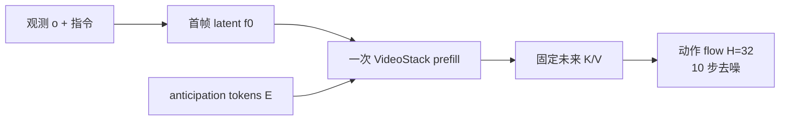

# Rift：免视频 Rollout 的未来条件 WAM

**Rift**（*Keep the Future, Drop the Rollout: Rift for World Action Models*，[arXiv:2608.11521](https://arxiv.org/abs/2608.11521)）由 **澳大利亚国立大学** 团队（Chushan Zhang / Jinguang Tong / Xuesong Li / Yikai Wang / Hongdong Li）提出：先用成对闭环干预问清「动作专家到底读未来 cache 的什么」，再把 **迭代视频生成** 换成 **一次 anticipation-token prefill**。保留 Fast-WAM-Joint 的未来读接口，丢掉测试期视频扩散与 VAE 解码。

## 一句话定义

**WAM 要的是位置上的未来表征，不是去噪轨迹；一次写满 K/V cache，就不必在部署时滚视频。**

## 英文缩写速查

| 缩写 | 英文全称 | 简要说明 |
|------|----------|----------|
| Rift | Rollout-free Imagination via Future Tokens | 本文：anticipation token 一次填充未来 cache |
| WAM | World Action Model | 联合未来预测与动作生成的策略 |
| K/V cache | Key/Value attention cache | 视频专家在未来时空位置上留给动作专家的接口 |
| EE-ADE | End-Effector Average Displacement Error | 相对未修改策略的末端轨迹漂移（厘米） |
| Fast-WAM | Fast World Action Model | 本文骨干与 current-only / Joint / IDM 对照族 |
| PFD | Privileged Foresight Distillation | 把未来校正蒸进 current-only 路径的对照 |

## 为什么重要

- **把延迟税拆开：** Fast-WAM 去掉未来读，Joint/IDM/LingBot-VA 用 rollout 换 3.3×–9.6× 延迟。Rift 证明中间态存在：显式未来读 + **1.1×** current-only 墙钟。
- **干预比探针硬：** mask / 打乱 / 重放直接改执行轨迹。Mask 把成功率从 98.4% 砸到 **9.7%**；final-clean 重放只偏 **1.7–1.9 cm**。
- **和异步部署互补：** [WAM 实时异步](./paper-wam-realtime-async.md) 管 chunk 怎么切；Rift 管 **要不要先滚一段视频** 才能给动作专家条件。
- **开源边界：** 截至 **2026-08-14** 无项目页、无官方仓。

## 核心信息

| 字段 | 内容 |
|------|------|
| 作者 | Chushan Zhang, Jinguang Tong, Xuesong Li, Yikai Wang, Hongdong Li |
| 机构 | 澳大利亚国立大学（ANU） |
| 出处 | arXiv:2608.11521（2026-08） |
| 骨干 | Wan2.2-5B Fast-WAM；动作专家 1B，合计约 6B；\(H=32\) |
| 接口尺寸 | LIBERO \(m=196\)；RoboTwin \(m=240\) 满对齐 anticipation |
| 开源（截至 2026-08-14） | **确认未开源** |

## 方法与核心结构

### 干预：消费侧

视频 token 不能 attend 动作，所以记录的未来 cache 与动作无关。在固定观测、语言和随机种子下：

| 干预 | 含义 | Joint 上的读法 |
|------|------|----------------|
| Mask | 去掉未来读 | ADE 18.7 cm，SR 9.7% — 不是装饰 |
| 空间打乱 / 时间对调 | 值还在，位置错 | ADE 相近，SR 65.2% vs 0.7% — 位置绑定 |
| Final-clean 重放 | 每步都用最后一份干净 K/V | ADE 1.9 cm，SR 97.9% — **轨迹不需要** |

这只说明 **用** 一份固定 cache 就够，不说明 **不用 rollout 也能造出** 这份 cache。

### Rift：生产侧

把未来位置换成可学习 token \(E\)，一次 `CachePrefill([f_0;E])` 写出 \(\mathcal{C}_\phi\)，动作流全程复用。训练保留原生视频 loss，另加部署对齐的动作 flow、条件 FM（避免 L2 平均掉多模态未来）和 stopgrad 探针。

### 流程总览

部署路径没有视频 denoising、没有 VAE decode。辅助 FM/探针只在训练或可选 shadow 预警里出现。

## 源码运行时序图

**不适用**（截至 2026-08-14）：论文未提供官方实现。对照骨干仍是 [FastWAM](https://github.com/yuantianyuan01/FastWAM)，不能当成 Rift 可运行包。放出后应补：首帧 VAE → anticipation prefill → 固定 cache → 动作 flow → 不下发视频。

## 工程实践

| 项 | 建议 / 论文设定 |
|----|----------------|
| 何时用 Rift 思路 | 已有 Joint WAM，延迟被视频 rollout 吃掉，又不愿退回 current-only |
| 何时不用 | 还没有能工作的未来读接口；或必须在测试时看视频诊断 |
| 对齐 | \(m\) 用满时空格点最好；很小的 \(m\) 已超过 Fast-WAM，但峰值在满对齐 |
| 监督 | 条件 FM 略优于直接 L2（98.8 vs 98.37），部署成本相同 |
| 延迟口径 | 247.9 ms/chunk 含 prefill + 动作去噪，**不含** 诊断头 |
| 预警 | L2–FM 分歧可做 CUSUM；失败平均提前 210 步，但不是策略的一部分 |
| 复现 | 今日只能读表；不要把 FastWAM 仓当成已实现 Rift |

## 实验与评测

| 设定 | Rift | 对照读法 |
|------|------|----------|
| LIBERO 40 任务 | **98.8±0.17%** / **247.9 ms** | Joint 98.4% / 780 ms；Fast-WAM 96.8% / 236 ms |
| LIBERO-Plus | **81.1%** | 相对 IDM **+9.7 pt**；不训练扫 10,030 变体 |
| RoboTwin 2.0 | **92.9 / 92.6** | 评测集最高；PFD 92.5/92.1 |
| Final-clean 干预 | Joint ADE 1.9 cm | 消费侧充分性，不是生产侧证明 |

## 结论

**延迟该砍在「造 cache 的过程」，不该砍在「动作还读不读未来」。**

1. **真影响：未来读是因果的** — mask 与错位把闭环执行打坏，不是探针能解码那么弱。
2. **真影响：干净 cache 可冻结** — Joint/Cosmos-2 不必跟着去噪轨迹走。
3. **真影响：一次 prefill 够用** — LIBERO 与 rollout 同档成功率，延迟回到 1.1× current-only。
4. **次要代价：训练仍要视频路** — 部署免 rollout ≠ 训练免动力学监督。
5. **部署读法：** 若你的 WAM 已是 IDM（本来就读一份干净未来），收益在「别用视频扩散造那份未来」；若是 Joint，还可少掉逐步 cache 更新。
6. **工程读法：无代码** — 数字可引用，栈不可复现。

## 与其他工作对比

| 对照 | 差异读法 |
|------|----------|
| Fast-WAM / PFD | 部署去掉或蒸馏未来读；Rift **留下接口**，只换生产者 |
| [DreamWAM](./paper-dreamwam.md) | 改未来**内容**（beyond-RGB 教师）；Rift 改未来**怎么写进 cache** |
| [Flex-π](./paper-flex-pi.md) | 多流算力柔性（关视频分支）；Rift 仍给动作专家完整未来位置接口 |
| [DSWAM](./paper-dswam-dual-system-wam.md) | 训练用视频、推理直出动作；Rift 推理仍 **读** 未来位置，只是不滚像素 |
| [WAM 异步部署](./paper-wam-realtime-async.md) | 切 chunk 的时间对齐；Rift 是 chunk 内部还要不要视频 denoising |
| [G0.5](./paper-galaxea-g05.md) | 纯 AR VLA，无未来 cache；RoboTwin 上 G0.5 93.3 vs Rift 92.8，问题不同 |

## 局限与风险

- 干预在四套 WAM / LIBERO 上；跨模型幅度只作描述。
- Shuffle/噪声是 OOD 编辑，必须和 frozen-present、final-clean 一起读。
- 完整 cache 干预没有拆开 key 与 value 的各自贡献。
- 辅助预警会漏「很自信但错」的未来。
- **无官方代码与权重。**

## 关联页面

- [World Action Models](../concepts/world-action-models.md) — 联合未来–动作范式
- [WAM 动作后果分类 01](../overview/wm-action-consequence-category-01-wam-action-prediction.md) — 部署层邻近坐标
- [DreamWAM](./paper-dreamwam.md) — 改未来定义的 Joint 近邻
- [WAM 实时异步部署](./paper-wam-realtime-async.md) — chunk 融合对照
- [Flex-π](./paper-flex-pi.md) — 关视频换延迟的另一条轴
- [DSWAM](./paper-dswam-dual-system-wam.md) — 训练学世界、推理不想象
- [VLA 真机部署指南](../queries/vla-deployment-guide.md) — 延迟清单；本文是 WAM 视频税
- [LIBERO](./libero-benchmark.md) — 主评测协议
- [RoboTwin 2.0](./robotwin.md) — 双臂 OOD 场景
- [Manipulation](../tasks/manipulation.md) — 桌面操作语境
- [生成式世界模型](../methods/generative-world-models.md) — Fast-WAM / 视频骨干

## 参考来源

- [rift_wam_arxiv_2608_11521.md](../../sources/papers/rift_wam_arxiv_2608_11521.md)
- Zhang, Tong, Li, Wang, Li — <https://arxiv.org/abs/2608.11521>

## 推荐继续阅读

- Yuan et al., *Fast-WAM* — <https://arxiv.org/abs/2603.16666> · 仓 <https://github.com/yuantianyuan01/FastWAM>
- Fang et al., *Privileged Foresight Distillation* — <https://arxiv.org/abs/2604.25859>
- [DreamWAM](./paper-dreamwam.md) 项目页 — <https://hustvl.github.io/DreamWAM/>
- 同团队 EvoScene-VLA — <https://arxiv.org/abs/2605.21862>
