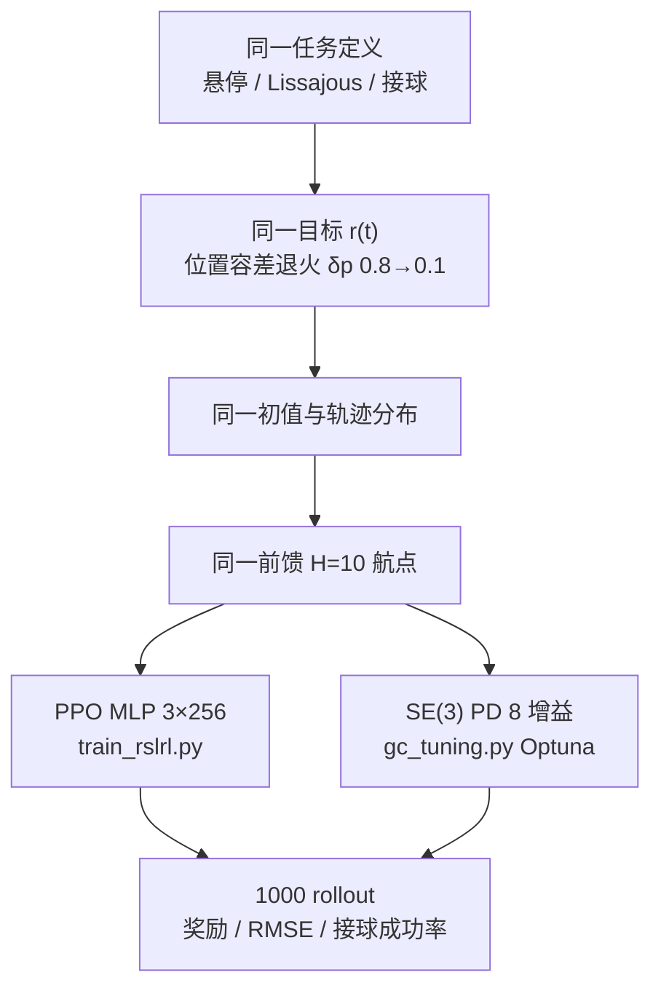
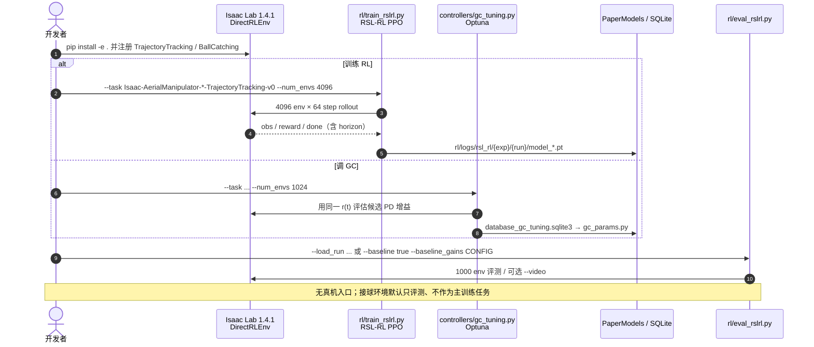

# RL vs GC：对称比较四旋翼轨迹跟踪里的学习控制与几何控制

**RL vs GC**（论文 *Leveling the Playing Field: Carefully Comparing Classical and Learned Controllers for Quadrotor Trajectory Tracking*，[arXiv:2506.17832](https://arxiv.org/abs/2506.17832)，[RSS 2025](https://pratikkunapuli.github.io/rl-vs-gc/)，[代码](https://github.com/PratikKunapuli/rl-vs-gc)）由 **宾夕法尼亚大学 GRASP Lab**（Kunapuli / Welde / Jayaraman / Kumar）提出：把「强化学习是否已经全面超过几何控制」拆成**可复现的对称协议**，并在四旋翼与固定臂空中机械臂上给出 best-in-class 对照。

## 一句话定义

**先前「RL 碾压 GC」的差距，很大一部分来自目标函数、任务数据和前馈参考只给了学习侧；对称之后两类控制器接近，GC 赢稳态、RL 赢瞬态与不确定性。**

## 英文缩写速查

| 缩写 | 英文全称 | 简要说明 |
|------|----------|----------|
| GC | Geometric Control | 本文的 \(SE(3)\) 级联几何跟踪器（亦称 DFBC） |
| RL | Reinforcement Learning | 本文用 RSL-RL PPO 学推力–力矩策略 |
| DFBC | Differential-Flatness Based Control | 利用四旋翼微分平坦性的解析跟踪控制 |
| PPO | Proximal Policy Optimization | 本文 on-policy 训练算法 |
| RSS | Robotics: Science and Systems | 论文发表会议（2025） |
| DR | Domain Randomization | 质量/惯量/推重比随机化；本文用来对照两类控制器 |
| COM | Center of Mass | GC 默认控制点；固定臂末端跟踪时仍观测 COM |
| RMSE | Root Mean Square Error | 位置/偏航跟踪误差；对初值扰动与回合长度敏感 |

## 为什么重要

- **跨社区对比常被惯例污染：** 学习侧默认「有奖励、有同分布数据、有未来航点」；解析侧常手调悬停增益、固件 PID、省略前馈。把这些不对称当成「方法本身」会高估 RL。
- **选型可读：** 慢/准跟踪不必先上神经网络；接球、大扰动、模型不确定时 RL 的瞬态与 DR 优势才明显。
- **工程可跑：** [PratikKunapuli/rl-vs-gc](https://github.com/PratikKunapuli/rl-vs-gc) 给出 Isaac Lab 环境、Optuna 调 GC、PPO 训练与论文 checkpoint，适合当空中跟踪的公平基线试验台（相对 [gym-pybullet-drones](./gym-pybullet-drones.md) 更贴 RSS 论文设定）。

## 核心信息

| 项 | 内容 |
|----|------|
| **机构** | 宾夕法尼亚大学（UPenn）GRASP Lab |
| **平台** | 四旋翼；固定臂 0-DoF 空中机械臂；Brushless Crazyflie 变体 |
| **栈** | Isaac Sim 4.2.0.2 + Isaac Lab 1.4.1；DirectRLEnv；RSL-RL PPO；物理 100 Hz、控制 50 Hz |
| **训练预算** | 4096 并行环境 × 2 亿步 ≈ 30 min（RTX A5000，约 175k steps/s） |
| **开源** | **已开源**：[PratikKunapuli/rl-vs-gc](https://github.com/PratikKunapuli/rl-vs-gc)；含 PaperModels checkpoint。仓库截至入库日 **未声明 SPDX 许可证**。评测 **纯仿真**，无真机部署脚本 |

## 核心原理

### 三条必须对称的轴

| 轴 | 不对称时常见做法 | 本文纠正 |
|----|------------------|----------|
| 任务目标 | RL 优化式 (3) 奖励；GC 手调「看起来稳」 | 两边用同一 \(r(t)\)；GC 用 Optuna 调 8 个 PD 增益 |
| 任务数据 | RL 在 Lissajous 上训；GC 在悬停上调完再评跟踪 | 在**评测任务同一分布**上优化/训练 |
| 前馈参考 | GC 省略 \(\ddot p_d,\omega_d,\dot\omega_d\) 或用积分环；RL 观测未来航点 | 两边都给 **H=10** 未来位置+偏航；GC 用有限差分近似高阶导数 |

GC 位置环（论文式 4）把参考加速度直接加进期望加速度：

\[
\ddot{\boldsymbol{p}}_{des}=-K_{p}(\boldsymbol{p}-\boldsymbol{p}_{d})-K_{v}(\boldsymbol{v}-\boldsymbol{v}_{d})-mg\boldsymbol{z}_{\mathcal{W}}+\ddot{\boldsymbol{p}}_{d}.
\]

去掉 \(\ddot{\boldsymbol{p}}_{d}\) 等于让解析控制器在敏捷跟踪里「看不见未来」。RL 观测是体坐标误差 \(\mathbb{R}^{21}\)（位置、姿态矩阵、重力、线速度、角速度）再拼 horizon；动作 4 维推力+力矩。

### 流程总览

## 源码运行时序图

官方仓 [PratikKunapuli/rl-vs-gc](https://github.com/PratikKunapuli/rl-vs-gc)（归档见 [sources/repos/rl-vs-gc.md](../../sources/repos/rl-vs-gc.md)）提供 DirectRLEnv、RSL-RL 训练与 GC Optuna 调参：

- **最短复现路径：** 按 README 装 IsaacSim 4.2 + Isaac Lab 1.4 → `pip install -e .` → `eval_rslrl.py` 加载 `PaperModels` 的 `AM_0DOF_RL_Opt_Lissajous_FF`，或 `--baseline true` 跑预置 GC 增益。
- **从零训练：** `train_rslrl.py` 用 Hydra 设 Lissajous 幅值/频率与 `env.trajectory_horizon`；GC 对应 `gc_tuning.py`。
- **许可证：** 仓内无 `LICENSE`，二次分发前需向作者确认。

## 工程实践

| 项 | 建议 |
|----|------|
| 比方法前先比协议 | 检查基线是否在**同一奖励、同一轨迹族、同一前馈**上优化；手调悬停 GC 不能当 agile tracking 的 SOTA 解析基线 |
| 指标别只报 RMSE | RMSE 放大初值扰动与短回合；同时看稳态是否到 0、以及下游任务（接球成功率） |
| GC 调参 | 对称轴匹配后滚转/俯仰增益共用，剩 8 维；Optuna + 环境奖励，不要只用固件默认 |
| RL 训练 | 位置容差退火对「既要快靠近、又不要大稳态误差」关键；horizon=0 会明显伤 Lissajous |
| Sim2Real 读法 | DR 与一阶电机模型对 RL 是一等公民；GC 参数少、动力学写死，DR/电机饱和帮不上同等忙 |
| 仿真器选型 | 要公平 GC↔RL 用本仓 Isaac Lab；要轻量课程/消融用 [gym-pybullet-drones](./gym-pybullet-drones.md)；要视觉敏捷用 [Flightmare](./flightmare.md) |

## 实验与评测

全部为仿真、每格约 1000 条 rollout（接球为 100×5 次机会）。最大奖励 15.0。

**Lissajous best-in-class（论文 Table IV）：**

| 本体 | 控制器 | 平均奖励 | 位置 RMSE (m) | 偏航 RMSE (rad) |
|------|--------|----------|---------------|-----------------|
| 四旋翼 | RL-Opt-Liss-FF | 14.196 ± 0.48 | 0.119 ± 0.05 | 0.274 ± 0.15 |
| 四旋翼 | GC-Opt-Liss-FF | 13.447 ± 1.61 | 0.158 ± 0.20 | 0.483 ± 0.29 |
| 空中机械臂 | RL-Opt-Liss-FF | 13.621 ± 1.28 | 0.118 ± 0.05 | 0.487 ± 0.26 |
| 空中机械臂 | GC-Opt-Liss-FF | 13.792 ± 1.28 | 0.136 ± 0.10 | 0.405 ± 0.29 |

误差曲线：GC 收敛到近似 0；RL 更快压下大初值误差，但留下稳态偏置。空中机械臂上 **GC 奖励略高**，说明「GC 只能控 COM、末端一定更差」不成立——对称优化后解析律仍能跟上末端参考。

**接球（Table V，成功率 vs 允许时间）：** TTC=0.79 s 时 RL-EE 0.65、RL-COM 0.72、GC 0.30；TTC≈2 s 时三者都 ≈0.97–1.0。RL-COM 仍明显快于 GC，说明瓶颈更像是 **级联结构的瞬态**，而不只是「没看到末端」。

**域随机化（Table VI，评 20% 质量/惯量/推重比）：** RL-0/20/40 奖励约 13.3–13.6；GC-0/20/40 约 11.8–12.2，且 GC-40 更差。

**真实电机（Table VII，一阶延迟+饱和+分配）：** RL-Simple → 奖励 2.94（过拟合 bang-bang）；RL-Realistic 13.05。GC-Simple 12.71 vs GC-Realistic 12.60，解析律对未建模电机没那么崩，也学不到电机补偿。

## 结论

**对称协议下，四旋翼轨迹跟踪没有「RL 全面取代 GC」；文献里的大差距多半是基线残废，而不是方法上限。**

1. **先对称再比：** 目标函数、任务分布、前馈航点三项缺一，GC 就会被写成弱基线。
2. **稳态 vs 瞬态：** GC 渐近误差到 0；RL 更快进入邻域但常有偏置——RMSE 单独不能当总判。
3. **敏捷任务选 RL：** 接球这种「必须尽快到位」的设定上，RL（即使只看 COM）明显好于 GC。
4. **慢/准跟踪不必弃 GC：** 空中机械臂 Lissajous 上对称 GC 的奖励可以略高于 RL。
5. **不确定性与执行器：** DR 与电机动力学是 RL 的主场；刚体上训的 RL 迁到有电机延迟的仿真会直接垮。
6. **读论文声明时：** 若解析基线是固件 PID、悬停手调、或无前馈，不要把「RL 更好」外推成控制律类别的结论。
7. **部署缺口：** 本工作验证在仿真；真机仍需按 [Sim2Real](../concepts/sim2real.md) 另做电机/延迟/辨识，不能把 Table IV 当飞控固件数字。

## 与其他工作对比

| 对照 | 差异读法 |
|------|----------|
| [MPC vs RL](../comparisons/mpc-vs-rl.md) | 足式/人形常比在线优化 vs 策略；本页比的是 **解析几何律 vs model-free PPO**，MPC 不在对照集里 |
| [WBC vs RL](../comparisons/wbc-vs-rl.md) | 人形融合栈主线；空中对应物是 PX4/几何内环 + 学习外环，协议教训可迁移：「别用手调内环当学习 SOTA 的陪衬」 |
| DATT / Learning-to-Fly-in-Seconds / Sim2MultiReal 等（论文 Table I） | 本文指出其 GC 侧常缺目标优化、跟踪数据或前馈；不是否定那些 RL 系统本身 |
| [gym-pybullet-drones](./gym-pybullet-drones.md) | 轻量 Gym 基准；本仓是 **Isaac Lab 公平对比试验台**，并带解析 GC 实现 |
| [Flightmare](./flightmare.md) | 视觉/高并行敏捷飞行；本工作几乎不碰视觉，专攻状态反馈跟踪协议 |
| [MIGHTY](./paper-mighty-hermite-spline-trajectory-planning.md) | 规划层（Hermite NLP）；本页是跟踪层控制器对比，规划输出仍要接 GC/RL/PX4 |

## 局限与风险

- **没有真机数字：** DR 与电机一阶模型只是 sim2real 代理；论文自己把硬件评测列为主要局限。
- **未逐篇复现旧实验：** 纠正的是协议类别，不是把 Kaufmann / Huang / Eschmann 的精确设定重跑一遍。
- **本体窄：** 四旋翼与 0-DoF 固定臂；结论外推到多自由度空中机械臂或腿式时要重做对称实验。
- **GC 结构先验：** 级联 \(SE(3)\) 律不是所有解析控制器；INDI / NMPC 公平对比仍缺。
- **许可证未声明：** 代码可跑，但二次闭源/商用分发缺 SPDX，需联系作者。

## 关联页面

- [RL vs 几何控制（对比页）](../comparisons/rl-vs-geometric-control.md) — 把三条不对称收成选型清单
- [MPC vs RL](../comparisons/mpc-vs-rl.md) — 另一条「模型控制 vs 学习」轴
- [WBC vs RL](../comparisons/wbc-vs-rl.md) — 人形侧的同类陷阱
- [多旋翼仿真—规划—飞控栈](../overview/multirotor-simulation-planning-control-stack.md)
- [Isaac Lab](./isaac-lab.md) — 本工作的训练仿真
- [gym-pybullet-drones](./gym-pybullet-drones.md) / [Flightmare](./flightmare.md) — 其他空中 RL 环境
- [Reinforcement Learning](../methods/reinforcement-learning.md)
- [Sim2Real](../concepts/sim2real.md) / [Domain Randomization](../concepts/domain-randomization.md)

## 参考来源

- [leveling_playing_field_rl_vs_gc_arxiv_2506_17832.md](../../sources/papers/leveling_playing_field_rl_vs_gc_arxiv_2506_17832.md) — 论文摘录与开源核查
- [pratikkunapuli-rl-vs-gc.md](../../sources/sites/pratikkunapuli-rl-vs-gc.md) — 项目页归档
- [rl-vs-gc.md](../../sources/repos/rl-vs-gc.md) — GitHub 仓库归档
- [arXiv:2506.17832](https://arxiv.org/abs/2506.17832) — 原文
- [项目页](https://pratikkunapuli.github.io/rl-vs-gc/)
- [PratikKunapuli/rl-vs-gc](https://github.com/PratikKunapuli/rl-vs-gc)

## 推荐继续阅读

- [项目页（视频与文献不对称表）](https://pratikkunapuli.github.io/rl-vs-gc/)
- [GitHub 复现仓](https://github.com/PratikKunapuli/rl-vs-gc)
- Lee, Leok, McClamroch, *Geometric tracking control of a quadrotor UAV on SE(3)* (CDC 2010) — 本文 GC 的经典来源
- Kaufmann et al., *Champion-level drone racing using deep reinforcement learning* (Nature 2023) — 「RL 已是空中 SOTA」叙事的代表；读本页时用来校准对比是否对称
