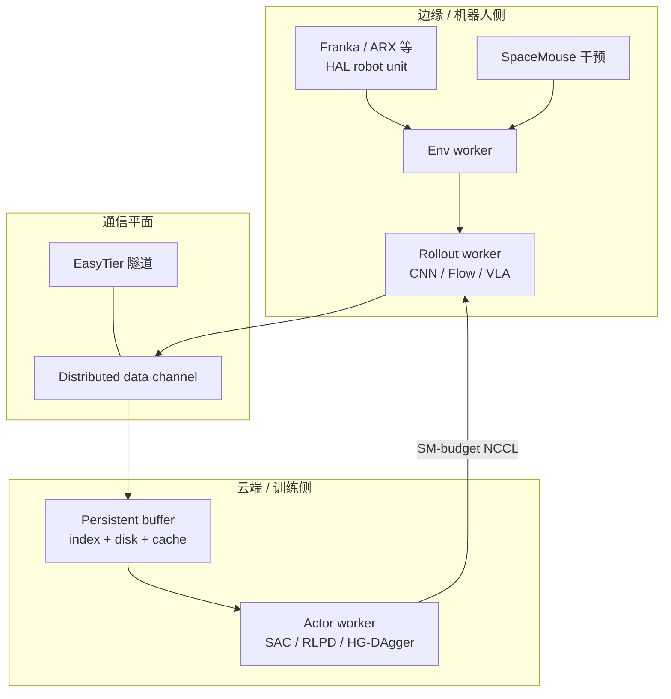
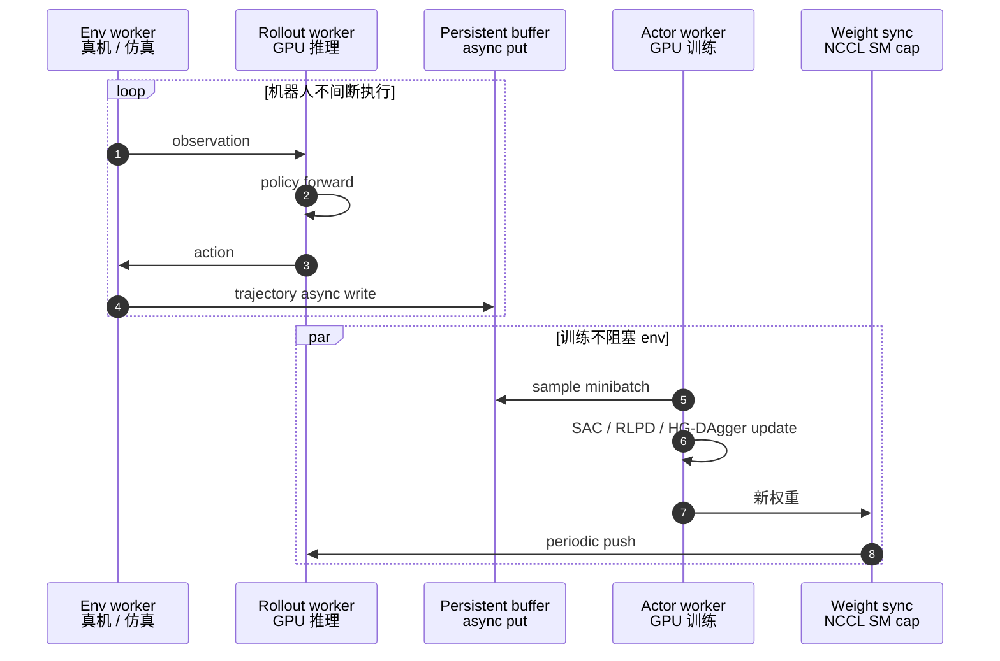

# RLinf-USER：真机在线策略学习统一系统

**RLinf-USER**（*A Unified and Extensible System for Real-World Online Policy Learning in Embodied AI*，[arXiv:2602.07837](https://arxiv.org/abs/2602.07837)，[RLinf 出版物页](https://rlinf.readthedocs.io/en/latest/rst_source/resources/publications/rlinf_user.html)，[代码 RLinf/RLinf](https://github.com/RLinf/RLinf)；**RSS 2026**）提出 **USER**（**U**nified and extensible **S**yst**E**m for real-world online policy lea**R**ning）：把真机在线学习当作 **系统问题**——物理执行、跨域通信与优化 **解耦**，在 **CNN / Flow / π₀·π₀.₅ VLA** 上统一承载 **SAC、RLPD、SAC-Flow、HG-DAgger** 与多种奖励源（规则、人类、学习 reward model）。

## 一句话定义

**把机器人和 GPU 都当成可发现、可绑定的硬件单元，用全异步数据飞轮 + 持久化 replay，在 cloud–edge 拓扑上持续跑真机 RL/模仿而不让机械臂等训练。**

## 英文缩写速查

| 缩写 | 英文全称 | 简要说明 |
|------|----------|----------|
| USER | Unified and extensible SystEm for real-world online policy leaRning | 本文系统名（嵌在 RLinf-USER 标题中） |
| HAL | Hardware Abstraction Layer | 统一注册/发现/调度 GPU 与物理机器人 |
| VLA | Vision-Language-Action | 大模型策略（如 π₀）；云端全参训练 + 边缘 rollout |
| RLPD | RL with Prior Data | 先验 demo 与在线 rollout 混采的 RL 基线 |
| HG-DAgger | Human-Gated DAgger | 人保证 episode 成功的在线干预模仿 |
| NCCL | NVIDIA Collective Communications Library | GPU 间权重同步；USER 可 **SM 预算** 限流 |

## 核心信息

| 字段 | 内容 |
|------|------|
| **机构** | 清华大学、无问芯穹、北京理工大学、浙江大学、北京大学、中关村学院、跨步智能、上海 AI 实验室等 |
| **通讯** | Chao Yu、Yu Wang |
| **arXiv** | [2602.07837](https://arxiv.org/abs/2602.07837) |
| **venue** | RSS 2026（[RLinf README 公告](https://github.com/RLinf/RLinf)） |
| **开源** | **已开源** — 实现合入 [RLinf/RLinf](https://github.com/RLinf/RLinf)；真机示例见 [Embodied Examples](https://rlinf.readthedocs.io/en/latest/rst_source/examples/embodied/index.html) |
| **典型硬件** | Franka Panda、Intel RealSense；RTX 4090（CNN/Flow）、4×A100（π₀）；边缘 NUC + SpaceMouse |

## 为什么重要

- **Tab. I 对照里 rare 全开：** 相对 **SERL**（单臂、小模型）、**SOP**（未开源）、**Qt-Opt**（未开源），USER 在 **真机 + 多机 + 异构机 + 大模型 + 开源** 五维同时成立——适合作为 **真机在线系统选型** 的默认引用。
- **云–边 VLA 不是「把 SERL 搬上云」：** 跨域 **分布式 data channel** 在实测中把跨城 episode 生成从 **~69 s 降到 ~22 s**（约 **3×**，Tab. IV），针对 **观测/动作跨域回传** 而非仅算法。
- **异步是数据效率杠杆：** π₀ + HG-DAgger 异步相对同步 **训练周期 ~5.7×**、episode 生成 **~1.2×**（Tab. V）；CNN + SAC 训练周期 **~4.6×**——大模型上差距更明显。
- **与 RLinf 算法栈互补：** 同仓 **[STEAM](./paper-steam-advantage-modeling.md)** 等走 **离线 advantage + CFGRL**；USER 管 **在线 env/rollout/actor 运行时**——部署闭环常两者都要，但职责不同。
- **生态位：** **[RLark](./rlark.md)** 偏 **K8s/kcp 跨集群 CRD**；USER 论文栈为 **Ray + EasyTier 隧道**——同属 RLinf 组织，选型看现有运维体系。

## 系统架构（核心结构）

| 层 | 组件 | 作用 |
|----|------|------|
| **HAL** | Hardware unit、Node group、HAL checker | GPU/机器人/外设 **统一发现与 rank 绑定** |
| **通信** | EasyTier 隧道、Ray 控制面、Distributed channel | 跨 NAT/VLAN **Pod 级连通**；数据 **分片本地化** |
| **同步** | SM-budgeted NCCL | 权重同步 **不占满 SM**，保护 rollout 延迟 |
| **学习** | Env / Rollout / Reward / Actor workers | **全异步**；teleop 干预写入 demo buffer |
| **存储** | Persistent cache-aware buffer | 磁盘轨迹 + 内存 FIFO cache；**crash recovery** 与跨 policy 版本复用 |

### 流程总览

## 源码运行时序图

对齐 [RLinf/RLinf](https://github.com/RLinf/RLinf) **真机在线** 抽象（env / rollout / actor worker + Ray 集群）；具体脚本以 [HG-DAgger for Franka](https://rlinf.readthedocs.io/en/latest/rst_source/examples/embodied/hg-dagger.html) 等文档为准。

## 实验要点

> 数字以 [arXiv:2602.07837](https://arxiv.org/abs/2602.07837) 与 [RLinf-USER 文档页](https://rlinf.readthedocs.io/en/latest/rst_source/resources/publications/rlinf_user.html) 为准。

| 维度 | 结果摘要 |
|------|----------|
| **任务** | Peg Insertion、Charger、Cap Tightening、Pick-and-Place、Table Clean-up（Figure 8） |
| **小策略 RL** | Peg/Charger 上 RLPD/SAC/SAC-Flow **~2000 s 墙钟** 近满分；Cap/Pick 收敛速度因任务难度不同 |
| **π₀ HG-DAgger** | Pick-and-Place **~30 min、~200 online samples** 叙述 **96%**；干预步数随训练下降 |
| **π₀ 成功率（Tab. III）** | Pick-and-Place **39/60 → 58/60**；Table Clean-up **9/20 → 16/20** |
| **多机** | **4×Franka**、两站点相距 **3 km**，peg-insertion **~2600 s** 全员 100% |
| **异构** | Franka + ARX 联合 CNN+SAC，多色按钮任务 **~2 h** 收敛 |
| **通信** | 跨域 distributed channel **~3×** episode 生成加速（Tab. IV） |
| **异步** | π₀ HG-DAgger 训练周期 **~5.7×** vs 同步（Tab. V） |

## 结论

**真机在线策略学习要先把机器人、GPU 和跨域网络放进同一套可调度、可恢复的系统里，再谈算法换线——USER 用 HAL + 异步飞轮 + 持久 buffer 把这件事做成可扩展开源基座。**

1. **系统优先于单点算法** — 物理世界不能加速；**env 持续跑、actor 异步学** 比同步 pipeline 更能吃满数据时间。
2. **HAL 是多机/异构的前提** — 四 Franka 跨站点与 Franka+ARX 联合训练依赖 **统一 rank 绑定**，而非每平台 fork 一套脚本。
3. **云–边要优化数据路径** — 分布式 channel 针对 **观测/动作跨域**；跨城 **~3×** episode 时间说明瓶颈在通信而非算力。
4. **大模型更吃异步** — π₀ HG-DAgger **训练周期 ~5.7×**；部署 VLA 在线微调应默认 **async + SM 限流同步**。
5. **Buffer 要持久** — 长程 VLA、policy 版本迭代与断网恢复需要 **磁盘索引 + 内存 cache**，不是纯 Reverb 式 RAM。
6. **奖励/策略/算法可插拔** — 同一 pipeline 跑 **规则 RLPD、人类稀疏奖励、ResNet18 reward model** 与 **π₀ HG-DAgger**。
7. **工程入口是 RLinf 主仓** — 与 **[STEAM](./paper-steam-advantage-modeling.md)** 离线管线、[RLark](./rlark.md) K8s 编排并列索引，勿混为单一「策略权重库」。

## 常见误区或局限

- **误区：** 把 USER 当成新算法论文——贡献在 **HAL、通信、buffer、异步**；SAC/RLPD/HG-DAgger 为 **可插拔模块**。
- **误区：** 认为 RLinf = USER——RLinf 还包含 **仿真 GRPO、STEAM、Harness/RPent** 等；USER 专指 **真机在线系统架构**（见 [RLinf 归档](../../sources/repos/rlinf.md)）。
- **误区：** 与 **[RLark](./rlark.md)** 二选一——USER 论文实现走 **Ray + EasyTier**；RLark 走 **kcp/CRD**；同属生态、部署模型不同。
- **局限：** 实验以 **Franka 桌面操纵** 为主；人形、移动基座、极端安全认证场景需自行扩展 HAL checker。
- **局限：** 全异步 + 大 VLA **权重同步频率** 与 **off-policy 滞后** 仍需按任务调参（论文给出 profiling，非一键最优）。

## 与其他工作对比

| 系统 | 真机 | 多机 | 异构 | 大模型 | 开源 |
|------|------|------|------|--------|------|
| SERL | ✔ | ✘ | ✘ | ✘ | ✔ |
| SOP | ✔ | ✔ | ✘ | ✔ | ✘ |
| Qt-Opt | ✔ | ✔ | ✘ | ✘ | ✘ |
| **USER** | ✔ | ✔ | ✔ | ✔ | ✔ |

（来源：论文 Tab. I；SERL 详见 [RCL 索引](./paper-rcl-2401-16013-serl-a-software-suite-for-sample-efficient-robot.md)。）

| 对照 | 差异 |
|------|------|
| **[STEAM](./paper-steam-advantage-modeling.md)** | **离线** 帧 advantage + CFGRL；USER 管 **在线** rollout/训练循环 |
| **[HIL-HARC](./paper-hil-harc.md)** | 算法向 CTDE + critic 分解；**代码未开源**；USER 偏 **系统栈** |
| **[ROVE](./paper-rove-humanoid-vla-intervention.md)** | 人形 **干预语义 + OVE**；USER 提供 **通用真机在线 runtime** |
| **[LeHome](./paper-lehome-learning-to-fold.md)** | 竞赛 **异步 AWR+RECAP** 配方；可跑在 RLinf 系基础设施上 |

## 关联页面

- [RLinf 仓库归档](../../sources/repos/rlinf.md) — 安装、Docker、真机示例索引
- [RLark](./rlark.md) — 跨集群 K8s 编排（同组织）
- [APXInf](./apxinf.md) — 训练后 **端侧 π₀.₅ 推理**
- [VLA 开源复现景观 2025](../overview/vla-open-source-repro-landscape-2025.md) — RLinf 栈与真机 RL 入口
- [在线 vs 离线 RL](../comparisons/online-vs-offline-rl.md) — 范式坐标
- [具身数据飞轮最小闭环](../concepts/embodied-data-flywheel-minimal-closed-loop.md) — 采集–训练–部署判据
- [Teleoperation](../tasks/teleoperation.md) — HG-DAgger / 干预语境
- [Manipulation](../tasks/manipulation.md) — 五任务实验背景

## 推荐继续阅读

- 论文 PDF：[arXiv:2602.07837](https://arxiv.org/pdf/2602.07837)
- RLinf-USER 文档：<https://rlinf.readthedocs.io/en/latest/rst_source/resources/publications/rlinf_user.html>
- HG-DAgger 真机示例：<https://rlinf.readthedocs.io/en/latest/rst_source/examples/embodied/hg-dagger.html>
- RSS 2026 论文页：<https://roboticsconference.org/program/papers/37/>

## 参考来源

- [RLinf-USER 论文摘录](../../sources/papers/rlinf_user_arxiv_2602_07837.md)
- [RLinf-USER 出版物页归档](../../sources/sites/rlinf-user-publication.md)
- [RLinf 仓库归档](../../sources/repos/rlinf.md)
