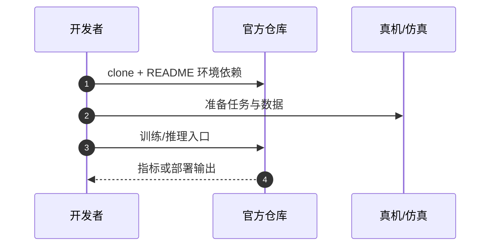

# RLinf-VLA（arXiv:2510.06710）

**RLinf-VLA**（*RLinf-VLA: A Unified and Efficient Framework for Reinforcement Learning of Vision-Language-Action Models*，[arXiv:2510.06710](https://arxiv.org/abs/2510.06710)）收录于 [多模空间 · 一周 VLA 研究趋势简析（2026.08.10–08.16）第二篇](../../sources/blogs/wechat_duomo_vla_weekly_trends_2026-08-10_part2.md) **架构模块** 段。

## 一句话定义

**统一 VLA+RL 训练平台：多模型、算法与仿真环境共用接口，并协同调度仿真、推理与训练算力；RSS 2026 算法侧技术报告。**

## 英文缩写速查

| 缩写 | 英文全称 | 简要说明 |
|------|----------|----------|
| VLA | Vision-Language-Action | 视觉–语言–动作策略 |
| VLM | Vision-Language Model | 视觉–语言多模态模型 |
| RL | Reinforcement Learning | 强化学习 |
| CoT | Chain-of-Thought | 链式推理 |

## 为什么重要

- VLA 强化学习研究分散、难公平对比；RLinf-VLA 提供统一接入与资源编排。
- 策展机构：清华大学；北京中关村学院；无问芯穹；北京大学；加州大学伯克利分校；哈尔滨工业大学；中国科学院自动化研究所
- 开源结论：**已开源**（步骤 2.5，2026-10-01）。

## 核心机制

| 项 | 内容 |
|----|------|
| **arXiv** | [2510.06710](https://arxiv.org/abs/2510.06710) |
| **开源** | **已开源** |
| **文内评测** | LIBERO、ManiSkill、RoboTwin；单臂实机 |

## 源码运行时序图

节点对齐 [`sources/repos/rlinf-vla.md`](../../sources/repos/rlinf-vla.md) 与 README 入口。

## 实验与评测

- **文内口径：** LIBERO、ManiSkill、RoboTwin；单臂实机
- **读法：** 本页为 [公众号策展](../../sources/blogs/wechat_duomo_vla_weekly_trends_2026-08-10_part2.md) 摘要；逐项指标以 **原文 PDF** 为准。

## 与其他工作对比

| 对照 | 差异读法 |
|------|----------|
| [第二篇技术地图](../overview/vla-weekly-trends-2026-08-10-part2-technology-map.md) | 同批 15 篇横向索引；本文属 **架构模块** |
| [VLA 方法页](../methods/vla.md) | 单篇机制细节以原文为准 |

## 结论

**RLinf-VLA 适合作为本期「架构模块」路线的快速索引页。**

1. 核心贡献：统一 VLA+RL 训练平台：多模型、算法与仿真环境共用接口，并协同调度仿真、推理与训练算力；RSS 2026 算法侧技术报告。
2. 开源结论：**已开源** — 以项目页/仓库实际链接为准。
3. 横向对照见 [第二篇技术地图](../overview/vla-weekly-trends-2026-08-10-part2-technology-map.md)。

## 关联页面

- [VLA（Vision-Language-Action）](../methods/vla.md)
- [一周 VLA 趋势技术地图（第二篇）](../overview/vla-weekly-trends-2026-08-10-part2-technology-map.md)

## 参考来源

- [wechat_duomo_vla_weekly_trends_2026-08-10_part2.md](../../sources/blogs/wechat_duomo_vla_weekly_trends_2026-08-10_part2.md)
- [arXiv:2510.06710](https://arxiv.org/abs/2510.06710)

## 推荐继续阅读

- [VLA 方法页](../methods/vla.md)
- [arXiv PDF](https://arxiv.org/pdf/2510.06710)
