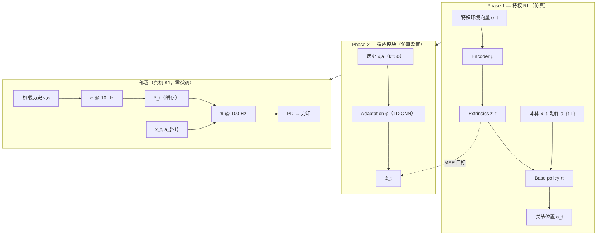

---

type: entity
tags:
  - quadruped
  - reinforcement-learning
  - locomotion
  - sim2real
  - privileged-training
  - online-adaptation
status: complete
updated: 2026-07-01
arxiv: "2107.04034"
venue: "RSS 2021"
related:
  - ../concepts/privileged-training.md
  - ../concepts/sim2real.md
  - ../concepts/domain-randomization.md
  - ../tasks/locomotion.md
  - ../queries/sim2real-gap-reduction.md
  - ./unitree.md
  - ./extreme-parkour.md
sources:
  - ../../sources/papers/rma_arxiv_2107_04034.md
  - ../../sources/sites/rma-legged-robots-github-io.md
  - ../../sources/repos/antonilo_rl_locomotion.md
summary: "RMA（RSS 2021）：特权环境 extrinsics 训练 base policy，历史本体–动作监督训练 adaptation module；A1 异步 10/100 Hz 零微调部署，秒级适应变地形与载荷。"
tags: [quadruped, reinforcement-learning, locomotion, sim2real, privileged-training, online-adaptation, berkeley, cmu]

---

# RMA: Rapid Motor Adaptation for Legged Robots

**RMA**（Kumar et al., [arXiv:2107.04034](https://arxiv.org/abs/2107.04034)，**RSS 2021**）提出 **快速运动自适应**：在仿真中学会 **base policy $\pi$** 与 **adaptation module $\phi$**，部署时仅用 **过去约 0.5 s 的本体–动作历史** 在线估计环境 extrinsics $\hat{z}_t$，使四足在 **变地形、变载荷、磨损** 等场景下 **不到一秒** 调整步态。官方材料：[项目页](https://ashish-kmr.github.io/rma-legged-robots/)、[Raisim 训练代码（antonilo/rl_locomotion）](https://github.com/antonilo/rl_locomotion)。

## 一句话定义

**Phase 1 用特权环境向量 $e_t$ 编码为 $z_t$ 训练 $\pi$；Phase 2 用 on-policy 历史监督训练 $\phi$ 预测 $\hat{z}_t$——部署时 $\phi$@10 Hz + $\pi$@100 Hz 异步运行，无需真机 fine-tuning。**

## 英文缩写速查

| 缩写 | 英文全称 | 简要说明 |
|------|----------|----------|
| RMA | Rapid Motor Adaptation | 从历史轨迹隐式估计环境 extrinsics 的快速在线自适应 |
| Sim2Real | Simulation to Real | 仿真训练、真机部署的迁移主线 |
| RL | Reinforcement Learning | Phase 1 base policy 用 PPO 等 model-free RL |
| PD | Proportional–Derivative | 策略输出关节位置 setpoint，底层 PD 出力矩 |
| DR | Domain Randomization | 训练随机化质量、摩擦、电机强度等 |
| PPO | Proximal Policy Optimization | 论文采用的 on-policy 策略梯度算法 |
| CMS | Cross-Modal Supervision | ICRA 2023 视觉 locomotion；本仓库代码亦服务该扩展 |

## 为什么重要

- **在线适应范式标杆：** 相对「每换新场景先采 4–8 min 真机数据再优化 latent」（Peng et al.），RMA 用 **单条历史轨迹 <1 s** 即可调整——对低成本四足 **安全探索** 至关重要。
- **特权蒸馏的清晰两阶段：** $e_t$（17 维物理参数）→ $\mu$ 编码 $z_t$（8 维）→ $\pi$；部署时 $\phi$ 直接从 $(x,a)$ 历史回归 $z_t$，**不必辨识完整物理参数**。
- **工程可部署：** **异步双频**（10/100 Hz）适配 A1 级 onboard 算力；**无参考轨迹 / 足端生成器**，仅靠生物力学奖励 + 分形地形即可 sim2real。
- **后续工作母题：** Extreme Parkour 的 ROA、privileged scandots 蒸馏、CMS 视觉扩展等均明确继承 RMA 结构。

## 核心结构

| 模块 | 输入 | 输出 | 训练 |
|------|------|------|------|
| **Encoder $\mu$** | 特权 $e_t$（摩擦、质量、电机强度等） | Extrinsics $z_t\in\mathbb{R}^8$ | 与 $\pi$ **联合 PPO** |
| **Base policy $\pi$** | $x_t$, $a_{t-1}$, $z_t$ | 关节位置 $a_t\in\mathbb{R}^{12}$ | Phase 1 RL |
| **Adaptation $\phi$** | 历史 $x_{t-50:t-1}$, $a_{t-50:t-1}$ | $\hat{z}_t$ | Phase 2 **MSE** + **on-policy** rollout |
| **底层控制** | $a_t$ setpoint | 力矩 | 固定 **PD**（A1 原厂接口） |

### 流程总览

## 方法要点（提炼）

- **Extrinsics 而非全参数辨识：** $z_t$ 是 $e_t$ 的低维非线性投影；$\hat{z}_t$ 只需让 $\pi$ 输出「正确」动作，**不要求与真值物理参数一一对应**。
- **On-policy 训练 $\phi$：** 若只用「专家」$\pi(z_t{=}\mu(e_t))$ 轨迹，$\phi$ 对部署偏差脆弱；用 **随机初始化 $\phi$** rollout 的 on-policy 数据迭代至收敛（类似 DAgger 精神）。
- **奖励与课程：** 生物力学项（功、触地冲击、足端滑移等）+ 前进速度上限 0.35 m/s；惩罚系数 **课程递增**；地形难度固定随机采样（分形生成器）。
- **与域随机化关系：** DR 覆盖训练分布，**$\phi$ 负责在分布内/边界快速插值**；不同于「一味 DR 换鲁棒性牺牲最优」的纯保守策略。

## 实验与评测（摘要）

| 设定 | 结果要点 |
|------|----------|
| **平台** | Unitree **A1**（12 kg），仿真训练 → **无 fine-tuning** 实机 |
| **OOD 地形** | 岩石、油滑塑料、泡沫床垫、植被、楼梯、沙地等（见[项目页视频](https://ashish-kmr.github.io/rma-legged-robots/)） |
| **消融** | **w/o adaptation** 在变形地面与重载荷下明显劣于完整 RMA；厂商 A1 控制器在 uneven foam 等场景失败 |
| **载荷** | 完整 RMA 可背负至 **~12 kg**（自重同级）；无适应模块约 **8 kg** 即难以前进 |
| **油滑分析** | $\hat{z}$ 前两维在滑移事件时显著变化；**90%** 成功率 |

## 代码与复现

| 资源 | 说明 |
|------|------|
| [antonilo/rl_locomotion](https://github.com/antonilo/rl_locomotion) | **RaiSim** + `raisimGymTorch`；`rsg_a1_task` 环境；~4K iter 训练；亦用于 **CMS（ICRA 2023）** 特权阶段 |
| [vision_locomotion](https://github.com/antonilo/vision_locomotion) | 同作者 **真机视觉** 部署栈（与本文代码分工） |
| Isaac / legged_gym 生态 | 后续 Extreme Parkour 等走 **Isaac Gym** 栈，但 **ROA / 历史估计** 思路同源 |

## 与其他工作对比

| 工作 | 与 RMA 的差异 |
|------|----------------|
| [Learning to Walk in Minutes](../entities/paper-anymal-walk-minutes-parallel-drl.md) | Teacher–Student **行为克隆**；学生用 proprioception 模仿高度图 teacher |
| Peng et al. 2018 在线 latent 优化 | 需 **数分钟** 真机 rollout；RMA **<1 s** 历史即可 |
| Lee et al. Science Robotics 2020 | 依赖 **预定义轨迹生成器** + 手工领域知识；RMA **无参考轨迹** |
| [Extreme Parkour](./extreme-parkour.md) | **ROA + 深度蒸馏** 扩展 RMA 到 **感知跑酷**；Phase 2 用 DAgger 而非纯 MSE |

## 参考来源

- [RMA 论文 ingest 档案](../../sources/papers/rma_arxiv_2107_04034.md)
- [RMA 项目页归档](../../sources/sites/rma-legged-robots-github-io.md)
- [antonilo/rl_locomotion 代码归档](../../sources/repos/antonilo_rl_locomotion.md)
- Kumar et al., *RMA: Rapid Motor Adaptation for Legged Robots*, RSS 2021 — [arXiv:2107.04034](https://arxiv.org/abs/2107.04034)

## 关联页面

- [Privileged Training](../concepts/privileged-training.md) — RMA 是特权训练 + 适应模块的经典实例
- [Sim2Real](../concepts/sim2real.md) — 在线适应缩小动力学与地形 gap
- [Locomotion](../tasks/locomotion.md) — 四足盲走 / 自适应行走任务谱系
- [Sim2Real gap 缩小 query](../queries/sim2real-gap-reduction.md) — RMA 列为在线适应路线
- [Extreme Parkour](./extreme-parkour.md) — RMA 式历史估计用于跑酷 Teacher
- [Unitree](./unitree.md) — A1 硬件平台

## 推荐继续阅读

- [RMA 方法视频](https://youtu.be/qKF6dr_S-wQ)
- [CMS：Learning Visual Locomotion with Cross-Modal Supervision](https://antonilo.github.io/vision_locomotion/) — RMA 代码栈上的视觉扩展
- Fu et al., *Coupling Vision and Proprioception for Navigation of Legged Robots* — 同组视觉 + 本体导航
