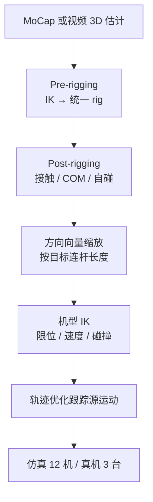
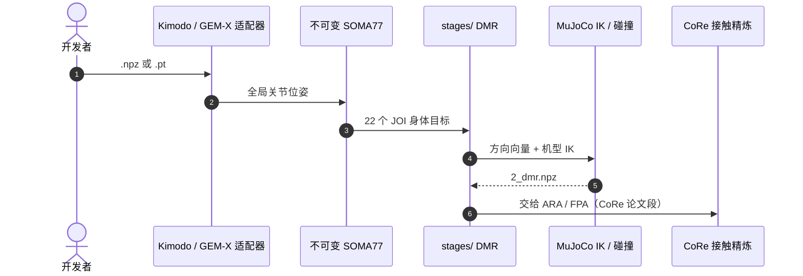

# RMR（优化式 Rig 统一的人形重定向）

**RMR**（项目页标题 *Robust Robot Motion Retargeting*；论文 *Robust and Expressive Humanoid Motion Retargeting via Optimization-Based Rig Unification*，[IROS 2025](https://doi.org/10.1109/IROS60139.2025.11246607)，[项目页](https://tmjeong1103.github.io/RMR/)）由 **高丽大学（Korea University）** 联合 CINAMON、**彩虹机器人（Rainbow Robotics）**、**纳沃实验室（NAVER LABS）**、**伊利诺伊大学厄巴纳-香槟分校（UIUC）** 提出：先把异构人体运动统一到带物理属性的 **canonical rig**，再按机型用方向向量与 IK 重定向，目标是噪声源也能出稳定、可表达的上身运动。

## 一句话定义

**先把各种人体骨架收成一把「标准骨头」，再按机器人连杆长度把方向向量缩放过去——而不是为每台机器人重写一套映射。**

## 英文缩写速查

| 缩写 | 英文全称 | 简要说明 |
|------|----------|----------|
| RMR | Robust Motion Retargeting | 本页项目简称；论文强调 rig unification |
| JOI | Joints of Interest | 统一 rig 与目标机器人之间的关键关节对应 |
| IK | Inverse Kinematics | 方向向量目标姿态后的关节求解 |
| MoCap | Motion Capture | 干净源；对照噪声视频估计 |
| COM | Center of Mass | Post-rigging 阶段的质心对齐 |
| DMR | Direction-based Motion Retargeting | CoRe 软件中对应本方法的阶段名 |

## 为什么重要

- **源骨架不统一是工程税：** MoCap、SMPL 系、单目估计各有拓扑；RMR 把「先统一、再映射」写成可复用两段。
- **明确吃噪声：** 不只服务干净动捕，项目页用 RGB 视频估计演示实时闭环。
- **解释 CoRe 的 DMR：** [CoRe 软件](./core-retarget.md) 的第二段制品来自本文，而不是另起一套几何 IK。

## 核心信息

| 项 | 内容 |
|----|------|
| **机构** | 高丽大学（Korea University）；CINAMON；彩虹机器人（Rainbow Robotics）；纳沃实验室（NAVER LABS）；伊利诺伊大学厄巴纳-香槟分校（UIUC） |
| **会议** | IROS 2025，Hangzhou，pp. 21619–21626 |
| **评测** | 仿真 12 机；真机 AMBIDEX、THORMANG、JF2 |
| **开源** | **无独立仓库**；可运行实现并入 [CoRe v0.1.0 DMR](./core-retarget.md) |
| **预印本** | 截至 2026-08-15 **无 arXiv** |

## 核心原理 / 方法栈

- **Pre-rigging：** 各人体骨架 IK 到预定义 common rig；rig 带刚体、质量与惯量，用来修自碰和噪声姿态。
- **Post-rigging：** 强制足–地接触、对齐 COM、抹掉不可执行伪影。
- **灵活重定向：** 选 JOI → 按连杆长度缩放方向向量 → IK → 再优化，使轨迹贴近源运动且满足机型物理限。

## 源码运行时序图

RMR **没有**独立训练/推理仓。官方可辨识入口是 CoRe 的 DMR 阶段（`2_dmr.npz`），节点对齐 [`sources/repos/core_retarget.md`](../../sources/repos/core_retarget.md)：

- **最短复现：** `core-retarget run <soma> --robot g1`，检查 `2_dmr.npz` 与终档差异即可看到「仅 DMR」与「DMR+接触精炼」的边界。
- **机型缺口：** 论文真机 AMBIDEX / THORMANG / JF2 **不在** v0.1.0 捆绑 11 机表内。

## 工程实践

| 项 | 读法 |
|----|------|
| 何时用 | 多源人体骨架要进同一机器人资产库；或视频估计噪声大 |
| 与 CoRe 论文 | RMR 管 **统一 + 映射**；[CoRe](./paper-core.md) 管 **接触精炼 + RL** |
| 与 GMR | 都是运动学重定向；RMR 多一步 canonical rig，GMR 格式覆盖更广 |
| 真机范围 | 项目页强调 **足固定上身表达**，不要当成全身动态行走论文 |
| 复现 | 用 CoRe 软件；不要找已不存在的独立 RMR GitHub |

## 实验与评测

项目页（非 IEEE 全文表）：

- **仿真 12 台** 不同运动学人形，方向向量 + IK 可切换。
- **真机 3 台：** AMBIDEX、THORMANG、JF2；MoCap 与噪声 RGB 估计均可 **无额外调参**。
- **实时闭环：** 相机 → 3D 估计 → common-rigging → 重定向 → 真机。
- **AMBIDEX 舞蹈：** NAVER 1784 拍摄，强调无碰撞的平滑上身。

量化误差表待 IEEE / 预印本补录。

## 结论

**跨源稳定性来自「统一 rig + 物理修补」，跨机型来自「方向向量按连杆缩放」；这是 CoRe 软件的前端，不是全身动力学跟踪方案。**

1. **真影响：canonical rig** — 把骨架差异和噪声挡在机器人 IK 之前。
2. **真影响：方向向量** — 同一套 JOI 逻辑切机型，而不是每台机器人一套关键点权重。
3. **真影响：噪声源可部署** — 视频估计不必先洗成干净 MoCap。
4. **次要代价：上身 / 足固定叙事** — 下肢动态行走不是本文主证据。
5. **部署读法：走 CoRe DMR** — 要 11 台商用人形用软件；要 AMBIDEX 级机型需自接模型。
6. **工程读法：没有独立仓** — 引用论文用 IEEE；跑代码用 CoRe。

## 与其他工作对比

| 对照 | 差异读法 |
|------|----------|
| [GMR](../methods/motion-retargeting-gmr.md) | 直接任务空间 IK；RMR 先统一 rig |
| [SOMA Retargeter](./soma-retargeter.md) | NVIDIA 已在 SOMA 上统一人体；RMR 的 common rig 是另一套、带质量惯量的优化 rig |
| [robot_retargeter](./robot-retargeter.md) | SMPL-X / CSV + mink；无论文级 common-rigging 叙事 |
| [CoRe 论文](./paper-core.md) | 后续接触优化 + RL；RMR 停在可执行运动学轨迹 |
| [SPARK](./paper-spark-skeleton-aligned-retargeting.md) | 校准的是 **human URDF ↔ 机器人**；RMR 校准的是 **人体骨架 ↔ canonical rig** |

## 局限与风险

- **无独立开源、无预印本：** 超参与 12 机名单以 IEEE 为准。
- **软件机型 ≠ 论文机型：** 不要假设 v0.1.0 能复现 AMBIDEX 真机实验。
- **不是动力学可行化：** 接触在 post-rigging 是几何/质心层，对照 [KDMR](./paper-kdmr.md) / [DSMS](./paper-shooting-for-contact.md)。
- **上身偏置：** 下肢 locomotion 跟踪应看 CoRe 论文或 GMR→WBT 栈。

## 关联页面

- [CoRe 软件](./core-retarget.md) / [CoRe 论文](./paper-core.md)
- [Motion Retargeting](../concepts/motion-retargeting.md) / [Pipeline](../concepts/motion-retargeting-pipeline.md)
- [GMR](../methods/motion-retargeting-gmr.md)
- [SOMA Retargeter](./soma-retargeter.md) / [robot_retargeter](./robot-retargeter.md)

## 参考来源

- [RMR IROS 2025 论文归档](../../sources/papers/rmr_iros_2025.md)
- [RMR 项目页归档](../../sources/sites/rmr-page.md)
- [CoRe 仓库归档](../../sources/repos/core_retarget.md)

## 推荐继续阅读

- 项目页：<https://tmjeong1103.github.io/RMR/>
- IEEE：<https://doi.org/10.1109/IROS60139.2025.11246607>
- CoRe 实现：<https://github.com/tmjeong1103/CoRe>
