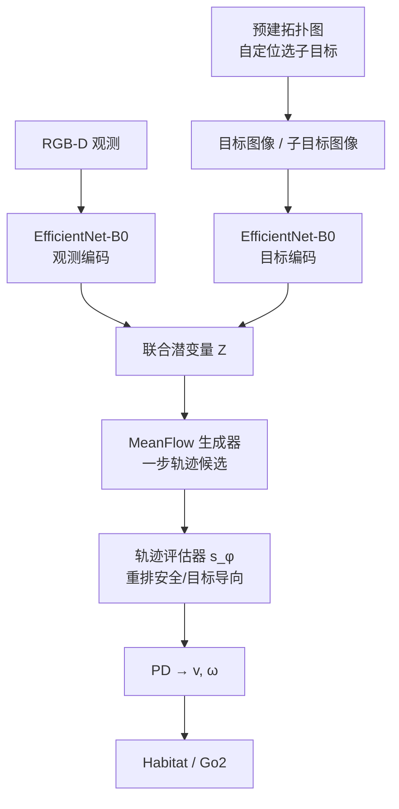

# RoamFlow

**RoamFlow**（*Reinforcement-Aligned One-Step Action MeanFlow Policy for Image-Goal Navigation*，南洋理工大学 NTU，arXiv:2606.29934）面向 **image-goal 导航**：用 **MeanFlow** 预测轨迹区间的 **平均速度场**，实现 **一步（少步）轨迹生成**，避免扩散多步去噪与常规 flow 数值积分的延迟；并以 **专家模仿 → Habitat PPO** 两阶段把生成策略对齐成功到达与避碰目标，再用轻量 **轨迹评估器** 从多样本候选中选安全路径。Habitat 与 **Unitree Go2（Jetson Orin NX）** 真机均有评测。

## 英文缩写速查

| 缩写 | 英文全称 | 简要说明 |
|------|----------|----------|
| RoamFlow | Reinforcement-Aligned One-Step Action MeanFlow | 本文框架：MeanFlow 一步轨迹 + IL→RL |
| MeanFlow | Mean Flow / average velocity field | 预测区间平均速度，支持少步传输 |
| CFM | Conditional Flow Matching | FlowNav 等对照的条件流匹配路线 |
| SR / SPL | Success Rate / Success weighted by Path Length | Habitat 导航主指标 |
| CR | Collision Rate | 至少碰撞一次的 episode 比例 |
| IL / RL | Imitation / Reinforcement Learning | 两阶段：专家初始化 → PPO 精炼 |
| PPO | Proximal Policy Optimization | Habitat 中的策略细调算法 |

## 核心信息

| 字段 | 内容 |
|------|------|
| 机构 | 南洋理工大学（Nanyang Technological University）；通讯 Mir Feroskhan |
| 任务 | **Image-goal navigation**（目标仅为目标图像，非自然语言） |
| 仿真 | **Habitat**；Gibson 训练；MP3D 跨域零微调 |
| 感知 / 动作 | RGB-D（90° FoV）；连续 \((v_t,\omega_t)\)；PD 跟踪 waypoint |
| 真机 | Unitree **Go2** + Jetson Orin NX 16GB + RealSense D435i；ROS1；环 **10 Hz** |
| 开源 | **确认未开源**（截至 2026-08-05：无项目页、无官方仓） |

## 为什么重要

- **生成导航的「速度–质量」折中：** 相对多步扩散（NoMaD 等）与需积分的 CFM（FlowNav），MeanFlow 直接建模 **区间位移/平均速度**，一步生成仍保持高 SR/SPL；Table I 推理约 **20 ms**，远低于 NavDP 的 ~61 ms。
- **显式用 RL 对齐任务目标：** 多数生成导航停在模仿；RoamFlow 用 Habitat 交互奖励（成功 / 逐步惩罚 / 碰撞）修正专家次优与分布偏移——消融显示去掉 RL 后 Gibson SR 从 68.7 降到 **51.3**。
- **部署闭环完整：** 拓扑图选子目标图像 → 多样本轨迹 → 评估器筛选 → PD；真机 Go2 上 20 runs **SR 1.00**、C/run **0.10**、推理 **37.2 ms**。
- **与开源复现栈对照：** [NoMaD](./paper-notebook-nomad-goal-masked-diffusion-policies-for-navigat.md)、[NavDP](./paper-notebook-navdp-learning-sim-to-real-navigation-diffusion.md) 已开源可跑；RoamFlow **暂不可复现**，阅读时对齐 Table I 指标与 MeanFlow 叙事即可，勿当作入门复现栈。

## 流程总览

## 核心机制（方法）

### 1）MeanFlow 轨迹生成

- 传统 CFM 学习瞬时速度场，推理仍需多步积分；MeanFlow 预测 **区间级平均速度 / 归一化位移**，使少步甚至一步传输可行。
- 观测与目标图像分别经 EfficientNet-B0 编码后线性投影融合，条件化生成多条候选轨迹。

### 2）两阶段训练（IL → RL）

| 阶段 | 作用 |
|------|------|
| IL | Hybrid A* 专家轨迹 + RGB-D；稳定初始化避碰与跟踪先验（约 20 h） |
| RL | Habitat PPO；成功 +5、step −0.01、碰撞 −0.1；探索噪声 σ∈[0.08,0.14]（约 30 h） |

额外混入 GoStanford / SCAND 等真机数据（GoStanford 深度由 Depth Anything V2 补全）以缩小 sim2real 间隙。

### 3）轨迹评估器

- 不改变底层生成器，只对多样本候选重排，执行估计风险更低的一条；相对随机选择降低 CR 并提升 SR/SPL。

## 源码运行时序图

**不适用**（确认未开源：截至 2026-08-05 无官方仓库或可运行 README 入口）。

## 工程实践

| 项 | 要点 |
|----|------|
| 仿真协议 | 预建拓扑图 + 统一目标图像；Stop 成功阈 \(1\,\mathrm{m}/30^\circ\) |
| 指标 | SR、SPL、CR、推理时延 (ms) |
| 真机栈 | ROS1 Noetic；D435i RGB-D；Orin NX 机载；整环 **10 Hz**，推理 <100 ms |
| 开源状态 | **未开源**；对照复现请走 NoMaD / NavDP |
| 任务边界 | **Image-goal**，不是语言 VLN；局部规划依赖拓扑图设定 |

## 实验与评测

### Habitat（Table I，均在 Gibson 训练）

| Method | Gibson SR↑ | SPL↑ | CR↓ | Time↓ | MP3D SR↑ | SPL↑ | Time↓ |
|--------|------------|------|-----|-------|----------|------|-------|
| NoMaD | 43.1 | 29.4 | 17.3 | 49.1 | 34.8 | 19.7 | 49.4 |
| FlowNav | 50.7 | 34.1 | 16.1 | 47.7 | 35.1 | 24.1 | 46.1 |
| NavDP | 59.3 | 47.5 | 11.6 | 61.1 | 48.1 | 34.1 | 62.5 |
| **RoamFlow** | **68.7** | **61.9** | **10.9** | **19.6** | **56.1** | **47.1** | **19.1** |

### 消融（Table II，Gibson）

| 设定 | SR↑ | SPL↑ | CR↓ |
|------|-----|------|-----|
| w/o IL | 13.2 | 11.2 | 61.3 |
| w/o RL | 51.3 | 47.5 | 25.9 |
| Random selection | 60.7 | 50.2 | 17.5 |
| **Full** | **68.7** | **61.9** | **10.9** |

### 真机（Table III，20 runs / 三场景）

| Method | SR↑ | C/run↓ | Time↓ |
|--------|-----|--------|-------|
| NoMaD (+Depth) | 0.75 | 0.50 | 91.1 |
| FlowNav | 0.90 | 0.25 | 89.5 |
| FlowNav + Distill | 0.80 | 0.35 | 38.6 |
| **RoamFlow** | **1.00** | **0.10** | **37.2** |

## 结论

**RoamFlow 的真正贡献是把「生成轨迹的实时性」从蒸馏压缩改成 MeanFlow 原生少步，再用 IL→RL 与轨迹评估器把质量拉回任务指标——而不是再堆一个多步扩散导航网络。**

1. **读 Table I 先看时延列** — ~20 ms 与 NavDP ~61 ms、NoMaD ~49 ms 同表，才是相对蒸馏基线（损质量换速度）的差异点。
2. **RL 不是锦上添花** — 无 RL 时 Gibson SR 51.3；完整 68.7，说明模仿先验不足以对齐成功/避碰。
3. **评估器是部署安全阀** — 随机选轨迹 CR 17.5 → 完整 10.9；生成多样本 + 重排比单样本贪心更稳。
4. **真机规模要心里有数** — 20 runs / 三场景 SR 1.00 有说服力，但仍是小样本场景集，不宜外推任意建筑。
5. **复现边界** — 未开源；需要 MeanFlow 导航栈时先跑 [NoMaD](./paper-notebook-nomad-goal-masked-diffusion-policies-for-navigat.md) / [NavDP](./paper-notebook-navdp-learning-sim-to-real-navigation-diffusion.md)，本文作指标与方法对照。

## 局限与风险

- **确认未开源**，无法核对 MeanFlow 实现细节与拓扑图构建脚本。
- **依赖预建拓扑图** 做子目标选择；与纯 mapless 设定不完全同分布（文内已说明将部分 mapless 基线适配为局部规划器）。
- **Image-goal ≠ VLN：** 无自然语言指令；与 [视觉–语言导航](../tasks/vision-language-navigation.md) 任务定义不同。
- **真机样本有限**（20 runs），且场景未公开清单。

## 与其他工作对比

| 维度 | RoamFlow | NoMaD | NavDP | NavWAM |
|------|----------|-------|-------|--------|
| 核心 | MeanFlow 一步 + IL→RL | Goal-mask 扩散 | 扩散 + 特权 critic | Cosmos WAM 联合去噪 |
| 推理 | ~20 ms（仿真） | 多步采样 | 多步 + 筛选 | 单次扩散 policy |
| 开源 | **无** | 是 | 是 | Coming soon |
| 真机 | Go2 Orin NX | 多机器人 | 多本体 | Diablo |

## 关联页面

- [NoMaD](./paper-notebook-nomad-goal-masked-diffusion-policies-for-navigat.md) — Table I 扩散基线；开源复现入口
- [NavDP](./paper-notebook-navdp-learning-sim-to-real-navigation-diffusion.md) — Table I 最强生成对照之一
- [NavWAM](./paper-navwam-goal-conditioned-visual-navigation-wam.md) — image-goal 世界动作模型对照
- [Habitat-Sim](./habitat-sim.md) — 仿真评测栈
- [Jetson Orin NX](./jetson-orin-nx.md) — 真机算力板
- [视觉–语言导航](../tasks/vision-language-navigation.md) — 语言 VLN 任务边界（对照 image-goal）
- [VLN 开源复现四范式](../overview/vln-open-source-repro-paradigms.md) — 可跑通栈（本文未入清单）
- [导航 Paper Notebooks 分类](../overview/paper-notebook-category-08-navigation.md)

## 参考来源

- [roamflow_arxiv_2606_29934.md](../../sources/papers/roamflow_arxiv_2606_29934.md) — 论文策展归档
- 论文：<https://arxiv.org/abs/2606.29934>

## 推荐继续阅读

- [arXiv:2606.29934](https://arxiv.org/abs/2606.29934)
- [NoMaD（开源扩散对照）](./paper-notebook-nomad-goal-masked-diffusion-policies-for-navigat.md)
- [NavDP（开源 sim2real 扩散对照）](./paper-notebook-navdp-learning-sim-to-real-navigation-diffusion.md)
- [NavWAM（image-goal WAM 对照）](./paper-navwam-goal-conditioned-visual-navigation-wam.md)
- [VLN 开源复现四范式](../overview/vln-open-source-repro-paradigms.md)
