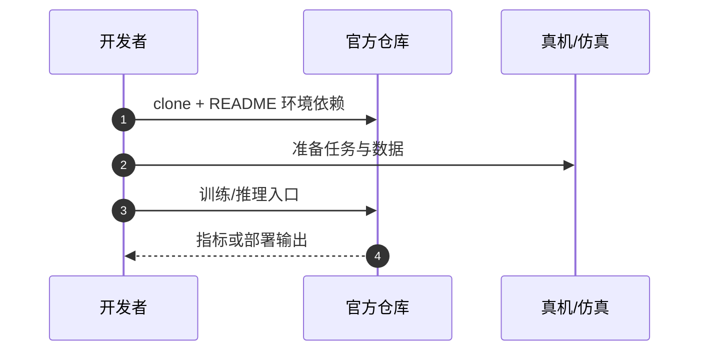

# RoboHarness（SJTU）（arXiv:2603.24060）

**RoboHarness（SJTU）**（*RoboHarness: A Memory-Augmented Policy Harness for Vision-Language-Action Model Robustness via In-Context Adaptation*，[arXiv:2603.24060](https://arxiv.org/abs/2603.24060)）收录于 [多模空间 · 一周 VLA 研究趋势简析（2026.08.10–08.16）第二篇](../../sources/blogs/wechat_duomo_vla_weekly_trends_2026-08-10_part2.md) **长程记忆/类 Agent** 段。

## 一句话定义

**不微调原 VLA：双记忆检索、多模态 LLM 分析失败并协调工具干预，离线整理轨迹为经验，提升长流程任务成功率。**

## 英文缩写速查

| 缩写 | 英文全称 | 简要说明 |
|------|----------|----------|
| VLA | Vision-Language-Action | 视觉–语言–动作策略 |
| VLM | Vision-Language Model | 视觉–语言多模态模型 |
| RL | Reinforcement Learning | 强化学习 |
| CoT | Chain-of-Thought | 链式推理 |

## 为什么重要

- 长程任务需模型外记忆与失败恢复；与 arXiv:2607.18060 异构策略 RoboHarness 不同 arXiv。
- 策展机构：上海交通大学；Shanghai Syslong Information Technology Co., Ltd.
- 开源结论：**已开源**（步骤 2.5，2026-10-01）。

## 核心机制

| 项 | 内容 |
|----|------|
| **arXiv** | [2603.24060](https://arxiv.org/abs/2603.24060) |
| **开源** | **已开源** |
| **文内评测** | LIBERO-PRO、LIBERO-RoboHarness（自建） |

## 源码运行时序图

节点对齐 [`sources/repos/robo-harness-memory-ic-adaptation.md`](../../sources/repos/robo-harness-memory-ic-adaptation.md) 与 README 入口。

## 实验与评测

- **文内口径：** LIBERO-PRO、LIBERO-RoboHarness（自建）
- **读法：** 本页为 [公众号策展](../../sources/blogs/wechat_duomo_vla_weekly_trends_2026-08-10_part2.md) 摘要；逐项指标以 **原文 PDF** 为准。

## 与其他工作对比

| 对照 | 差异读法 |
|------|----------|
| [第二篇技术地图](../overview/vla-weekly-trends-2026-08-10-part2-technology-map.md) | 同批 15 篇横向索引；本文属 **长程记忆/类 Agent** |
| [VLA 方法页](../methods/vla.md) | 单篇机制细节以原文为准 |

## 结论

**RoboHarness（SJTU） 适合作为本期「长程记忆/类 Agent」路线的快速索引页。**

1. 核心贡献：不微调原 VLA：双记忆检索、多模态 LLM 分析失败并协调工具干预，离线整理轨迹为经验，提升长流程任务成功率。
2. 开源结论：**已开源** — 以项目页/仓库实际链接为准。
3. 横向对照见 [第二篇技术地图](../overview/vla-weekly-trends-2026-08-10-part2-technology-map.md)。

## 关联页面

- [VLA（Vision-Language-Action）](../methods/vla.md)
- [一周 VLA 趋势技术地图（第二篇）](../overview/vla-weekly-trends-2026-08-10-part2-technology-map.md)

## 参考来源

- [wechat_duomo_vla_weekly_trends_2026-08-10_part2.md](../../sources/blogs/wechat_duomo_vla_weekly_trends_2026-08-10_part2.md)
- [arXiv:2603.24060](https://arxiv.org/abs/2603.24060)

## 推荐继续阅读

- [VLA 方法页](../methods/vla.md)
- [arXiv PDF](https://arxiv.org/pdf/2603.24060)
