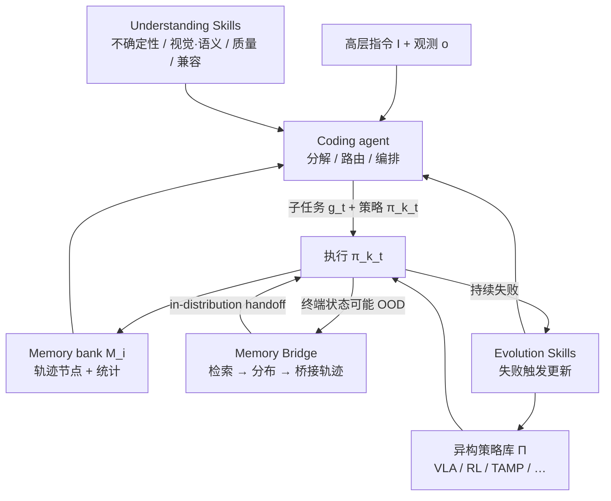

# RoboHarness（异构策略编排 · arXiv:2607.18060）

**RoboHarness**（*Memory-Driven Orchestration of Heterogeneous Robot Policies for Long-Horizon Planning*，[arXiv:2607.18060](https://arxiv.org/abs/2607.18060)，[项目页](https://www.robo-harness.com/)，[代码仓](https://github.com/markli1hoshipu/RoboHarness)；华为诺亚方舟实验室 / UBC / 多伦多大学 / 麦吉尔大学 / 2012 Labs）提出 **策略无关** 的 agentic harness：把独立开发的机器人控制系统封装为可调用 skills，用多模态执行记忆与在线证据刻画 **动态能力边界**，并在策略交接处用 **Memory Bridge** 把机器人引导到下一策略的 in-distribution 区域——**无需联合重训或共享动作表示**。

## 一句话定义

**不是再训一个万能 VLA，而是让今天各有所长的异构策略（VLA / RL / TAMP…）按当前上下文被正确拆解、路由，并在交接处被 Memory Bridge 接住。**

## 英文缩写速查

| 缩写 | 英文全称 | 简要说明 |
|------|----------|----------|
| VLA | Vision-Language-Action | 语义与开放词汇操作策略族之一；仿真中用 π₀.₅ 与 OpenVLA-OFT |
| TAMP | Task and Motion Planning | 符号任务 + 几何运动规划；真机拼装主执行器 |
| Memory Bridge | Memory Bridge | 检索轨迹 → 估下一策略状态分布 → 生成桥接轨迹的交接模块 |
| LIBERO-LoHo | LIBERO Long-Horizon | 平均时程约 4× 原 LIBERO 的零样本长时程基准 |
| GRPO | Group Relative Policy Optimization | OpenVLA-OFT 在 LIBERO-90 上的 RL 后训练算法 |
| PDDL | Planning Domain Definition Language | TAMP 符号域与问题描述语言 |

## 核心信息

| 字段 | 内容 |
|------|------|
| **机构** | 华为（Huawei Noah’s Ark Lab）；英属哥伦比亚大学（UBC）；多伦多大学（University of Toronto）；麦吉尔大学（McGill）；二零一二实验室（2012 Labs） |
| **arXiv** | [2607.18060](https://arxiv.org/abs/2607.18060)（v2，2026-07-28） |
| **开源** | **部分开源（占位仓）** — [`markli1hoshipu/RoboHarness`](https://github.com/markli1hoshipu/RoboHarness) 为项目页镜像；harness **无可运行训练/推理入口**；底层 π₀.₅ / OpenVLA-OFT 权重另开源 |
| **规划器** | Coding agent：Codex + GPT-5.5（论文实现） |
| **仿真策略库** | π₀.₅（openpi `pi05_libero`）+ OpenVLA-OFT（RLinf GRPO）+ PDDLStream/FF TAMP |
| **真机** | UR5e；TAMP + 抽屉开合微调 π₀.₅；135 次试验 |

## 为什么重要

- **问题换档：** 从「选哪个最强模型」转向「如何按能力边界组织多种模型」——与 [Harness VLA](./paper-harness-vla.md)（冻结单族 VLA + 固定原语）互补，本文强调 **跨策略族** 编排。
- **长时程硬证据：** LIBERO-LoHo 上单策略几乎无法收官（π₀.₅ 成功 **6.4%**），RoboHarness 提到 **95.2%**；说明增益来自 **组合 + 交接**，而非单一 checkpoint。
- **交接可插拔：** Memory Bridge 不改底层权重、不要求共享动作空间，对工程集成现有 VLA/TAMP/RL 栈有直接暗示。
- **路由可检验：** LIBERO-Plus 上 VLA 调用比例与其独立成功率正相关，证明不是固定脚本切换。

## 核心原理

### 方法栈

| 模块 | 角色 |
|------|------|
| **Policy card + agentic skill** | 包装原生策略；记录类型、接口、约束、训练任务与历史统计；coding agent 可检视实现代码 |
| **Understanding Skills** | 位姿不确定性、视觉/语义上下文相似度、状态–策略兼容、图像质量 → 结构化证据 |
| **Memory Skills** | 链式轨迹节点记忆 + 层次化文本→视觉检索 + 全局执行统计 |
| **Memory Bridge** | 检索 → 局部进度回归 / 支持域 → 选 handoff 目标 → 运动规划桥接 |
| **Evolution Skills** | 策略适配（如 SIMPACT / PDDLLM）、harness 代码精炼、网格参数调优、capability metadata 更新 |

### 流程总览

### Memory Bridge（交接）

1. 用下一子任务 \(g_{t+1}\) 与当前观测检索 top-K 锚点轨迹；
2. 沿锚点前后扩展机器人状态，拟合局部进度 \(f_{\mathrm{score}}\) 与支持域 \(\mathcal{R}_{\mathrm{conf}}\)；
3. 在可行运动集合内最大化 \(f_{\mathrm{score}}-\lambda C_{\mathrm{motion}}\)（且 \(f_{\mathrm{score}}\ge 0\)）选目标态，调用现成运动规划生成桥接轨迹后再调用下一策略。

## 源码运行时序图

**不适用**（截至 2026-08-03：官方仓 [`markli1hoshipu/RoboHarness`](https://github.com/markli1hoshipu/RoboHarness) 仅为项目页静态资源与 README，**无可对齐的训练 / 推理 / 评测入口**；底层 openpi / HF checkpoint 可单独复现，但不构成完整 harness 运行时）。

## 工程实践

| 项 | 要点 |
|----|------|
| **项目入口** | [www.robo-harness.com](https://www.robo-harness.com/)（叙事 / 演示 / 图表） |
| **代码仓边界** | 跟踪 [`RoboHarness`](https://github.com/markli1hoshipu/RoboHarness) 是否后续发布可运行 harness；当前勿假设 `clone` 即可复现 Table 1–2 |
| **可复用底层** | π₀.₅：[openpi](https://github.com/Physical-Intelligence/openpi)；OpenVLA-OFT GRPO：HF `RLinf/RLinf-OpenVLAOFT-GRPO-LIBERO-90`；TAMP：PDDLStream + FF |
| **规划侧依赖** | 论文用 Codex / GPT-5.5；理解技能依赖 SigLIP2、DINOv2、BGE 等冻结编码器 |
| **调试信号** | 策略调用比例 vs 独立成功率；桥接前后状态是否进入 \(\mathcal{R}_{\mathrm{conf}}\)；消融时全成功 vs 进度分离 |
| **真机读法** | 接触密集抽屉开合 → VLA；几何拼装 → TAMP；缺块 / 拆毁 / 位姿噪声 / 干扰物测试重规划 |

## 实验与评测

> 数字以 [arXiv:2607.18060](https://arxiv.org/abs/2607.18060) / [项目页](https://www.robo-harness.com/) 为准。

| 设定 | RoboHarness | 对照要点 |
|------|-------------|---------|
| **LIBERO Original** | **98.7%** | π₀.₅ 96.9%；OpenVLA-OFT 97.6% |
| **LIBERO-Plus 平均** | **93.2%** | π₀.₅ 85.7%；OpenVLA-OFT 67.9%；六类扰动第一 |
| **LIBERO-LoHo 进度 / 成功** | **97.5% / 95.2%** | H-WM-π₀.₅ 84.9% / 64.8%；π₀.₅ 55.3% / 6.4% |
| **消融：去 Memory Bridge** | 全成功 **60.4%**（相对完整 **86.0%**） | 进度仍相对高 → 路由对、交接失败 |
| **真机 Bridge 结构** | **~86.7%** | 再藏块 → **66.7%**；拆毁恢复 **80.0%** |

**机制读法：** 单策略可完成局部子任务但难收官；仅高层分解（LLM-/Logic-/H-WM-guided）不够；Understanding / Evolution / Memory Bridge 分别对应「看懂」「改边界估计」「接住交接」三类失败。

## 结论

**异构策略编排的真增益来自能力边界感知路由 + 分布相容交接；不是把更多模型串起来。**

1. **长时程用成功率，不要只看进度** — LIBERO-LoHo 上 π₀.₅ 进度 55.3% 但成功仅 6.4%；RoboHarness 提到 95.2%，证明瓶颈在组合与 handoff。
2. **Memory Bridge 是全成功的关键杠杆** — 去掉后全成功 86.0%→60.4%，进度仍高；交接 OOD 是独立失败模式。
3. **路由应随扰动变** — VLA 调用比例与独立成功率正相关；固定脚本切换无法解释 LIBERO-Plus 结果。
4. **Understanding 优先于堆策略** — 消融中去掉理解技能损伤最大；无可靠场景/指令/质量证据，分解与指派都会错。
5. **开源边界要写清** — 项目页有 Code 链，但仓为静态站；复现数字需等 harness 发布，或自建编排接 openpi / TAMP。
6. **与「万能模型」不对立** — 编排同时积累跨能力长时程数据，可为未来更统一策略提供训练分布。

## 与其他工作对比

| 维度 | RoboHarness | [Harness VLA](./paper-harness-vla.md) | [GaP](./paper-gap-graph-as-policy.md) | [BT × VLA](../concepts/behavior-tree-vla-orchestration.md) |
|------|-------------|----------------------------------------|----------------------------------------|--------------------------------------------------------------|
| 策略族 | **异构**（VLA+RL+TAMP…） | 冻结 **单族 VLA** + 解析原语 | 技能图 / 可 staging VLA | 预训练 checkpoint 作 BT 叶 |
| 编排器 | Coding agent + 三类辅助技能 | LLM planner + 固定 JSON 原语库 | 多 agent 合成计算图 | 显式行为树 XML |
| 交接机制 | **Memory Bridge**（状态分布） | 原语级重试 / 重绑定 | 图边解释器 / staging | `STOP`→复位→`RESUME` |
| 记忆 | 按策略的多模态轨迹银行 | Task / Global Memory | 图拓扑 + 仿真排练 | 树结构本身（弱记忆） |
| 联合训练 | **不需要** | 不微调 VLA | 图在仿真中自学习 | 不需要 |
| 开源可跑性（入库日） | 占位仓 | **RPent 可跑** | 见 GaP 页 | Cyclo 等开源锚点 |

## 局限与风险

- **适用边界：** 编排不能创造策略库外能力；新策略或稀疏记忆时边界估计与 Bridge 不可靠。
- **误区：** 与 [Harness VLA](./paper-harness-vla.md) 混名——后者是冻结 VLA 的原语 harness；本文是 **跨策略族** 编排。
- **误区：** 看见 GitHub Code 按钮就以为可复现 Table 1–2——当前仓无训练/评测入口。
- **工程风险：** 依赖商业 coding agent API、多编码器与多策略运行时；真机仍受时间预算与感知噪声限制（再藏块成功率明显下降）。
- **扩展方向（论文）：** 导航 / MPC / world-action models；自动化接入新策略与在线训练未覆盖场景。

## 关联页面

- [VLA](../methods/vla.md) — 异构编排语境下的 VLA 定位
- [Harness VLA](./paper-harness-vla.md) — 名称相近的冻结 VLA harness（勿混）
- [DeepSeek Harness](./deepseek-harness.md) — **同名不同物**：DeepSeek 的 LLM agent 运行时，不是具身策略编排
- [行为树 × VLA 编排](../concepts/behavior-tree-vla-orchestration.md) — 确定性编排对照
- [GaP（Graph-as-Policy）](./paper-gap-graph-as-policy.md) — agentic harness / staging 对照
- [π₀.₅](./paper-pi05-open-world-vla.md) — 仿真与真机底层 VLA
- [VLA 开源复现景观](../overview/vla-open-source-repro-landscape-2025.md) — 复现入口与边界
- [Manipulation](../tasks/manipulation.md) — LIBERO / 长时程操作任务背景
- [ScheduleStream](./schedulestream.md) — TAMP/调度层另一工程锚点

## 参考来源

- [RoboHarness 论文摘录](../../sources/papers/robo_harness_arxiv_2607_18060.md)
- [项目页归档](../../sources/sites/robo-harness-com.md)
- [官方仓归档](../../sources/repos/robo-harness.md)

## 推荐继续阅读

- [论文 PDF（arXiv:2607.18060）](https://arxiv.org/pdf/2607.18060)
- [项目页 www.robo-harness.com](https://www.robo-harness.com/)
- [GitHub markli1hoshipu/RoboHarness](https://github.com/markli1hoshipu/RoboHarness)
- [Physical-Intelligence/openpi（π₀.₅）](https://github.com/Physical-Intelligence/openpi)
