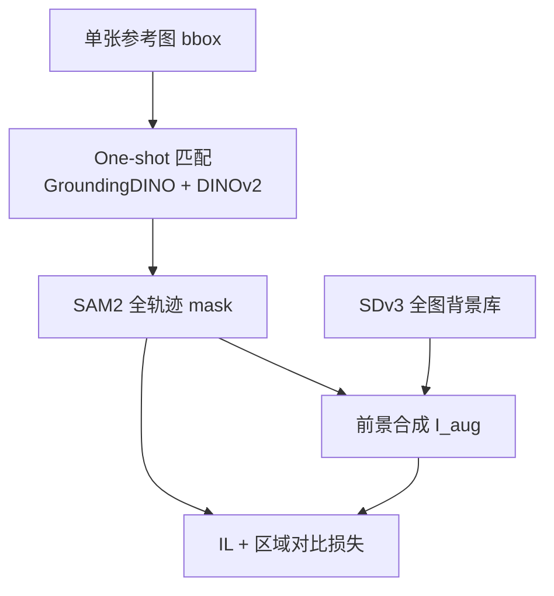

# RoboAug：一标注扩百场景的区域对比操纵增广

**RoboAug**（*One Annotation to Hundreds of Scenes via Region-Contrastive Data Augmentation for Robotic Manipulation*，[arXiv:2602.14032](https://arxiv.org/abs/2602.14032)，[项目页](https://x-roboaug.github.io/)）由 **北京人形机器人创新中心（X-Humanoid）** 等提出：在 **单任务模仿学习** 下，用 **一张参考图的 bbox** 驱动全数据集任务相关区域分割，再以 **生成式全背景 + 前景合成** 扩语义多样性，并用 **plug-and-play 区域对比损失** 让策略关注操纵相关区域、对背景变化不变。

## 一句话定义

**用最少人工标注把演示轨迹里的机械臂与操作物抠准，合成大量新桌面场景训练视觉策略，并用同类物体特征对比损失抑制背景干扰。**

## 英文缩写速查

| 缩写 | 英文全称 | 简要说明 |
|------|----------|----------|
| DA | Data Augmentation | 数据增广；本文侧重语义/生成式强增广 |
| RCL | Region-Contrastive Learning | 区域对比目标，与 IL 损失联合训练视觉编码器 |
| VFM | Vision Foundation Model | GroundingDINO、DINOv2、SAM2 等零样本视觉栈 |
| OOD | Out-of-Distribution | 未见背景、光照、干扰物等分布偏移 |
| IL | Imitation Learning | 单任务示教策略学习（论文基线为 ACT） |
| mAP | mean Average Precision | RoboAug-D 上检测评测指标（@0.5 IoU） |

## 为什么重要

- **标注成本：** 相对逐帧 mask 或重训检测器（如 RoboEngine 路线），**每任务仅一帧 bbox** 即可传播全轨迹 mask。
- **生成管线：** 避开 inpainting 在遮挡下的纹理覆盖风险，改为 **整图背景生成 + mask 线性合成**，保留任务相关几何。
- **检测假设：** 实证 RoboAug-D 上通用 VFM 检测不足会污染增广；one-shot DINOv2 匹配显著优于 GroundingDINO / LLMDet。
- **真机规模：** **35k+ rollout**，三机身（UR-5e、AgileX、天工 2.0）与组合 OOD 设置，增益相对 GenAug 与无增广 ACT 均大。

## 核心信息

| 项 | 内容 |
|----|------|
| **机构** | 北京人形机器人创新中心（X-Humanoid）；慕尼黑工业大学（TUM）；香港城市大学（CityU）；北京航空航天大学（Beihang）；北京大学（PKU） |
| **策略基线** | ACT（无增广 0.09–0.19 三因子平均成功率） |
| **增广基线** | GenAug、RoboEngine-T/G |
| **生成** | Stable Diffusion v3 全背景；500 条 LLM 材质 prompt |
| **分割栈** | GroundingDINO 提案 + DINOv2 one-shot 匹配 + SAM2 传播 |
| **开源** | 截至 **2026-09-29** 项目页 **Code/Dataset Coming Soon**；论文承诺开源 RoboAug-D 与多任务真机数据 |

## 核心原理

### 三阶段管线

### 区域对比（概要）

- 由 \(M_{\text{task}}\) 裁出物体图 \(I_{\text{obj}}\)，编码得 \(z_{\text{obj}}\)；全图 \(z\) 经自注意力得到 \(z_{\text{att}}\)。
- batch 内 **同类别为正对、异类为负对**，优化监督对比 \(\mathcal{L}_{\text{RC}}\)，与行为克隆损失相加，**不改动策略网络拓扑**。

## 源码运行时序图

**不适用** — 截至入库日（2026-09-29）项目页 **无 GitHub 链接**（Code Coming Soon）。若后续发布，预期离线链：参考帧标注 → VFM 匹配与 SAM2 批处理 → SDv3 背景批生成与合成 → ACT（或任意 visuomotor）训练脚本读 \(\mathcal{D}_{\text{fnl}}\) 并启用 \(\mathcal{L}_{\text{RC}}\)。

## 工程实践

| 项 | 建议 |
|----|------|
| 何时选用 | 真机示教有限、部署场景背景/光照/ clutter 变化大，且不愿依赖 **完美上游检测** 做 inpainting 增广 |
| 标注 | 每任务 **一帧、多 bbox**（操纵物等 \(K\) 类）；首帧尽量无遮挡 |
| 与 GenAug | 同为生成式语义增广；RoboAug 强调 **抠图质量 + 对比损失**，三因子平均成功率常高 **15–25 pt** 量级（Table II） |
| 与 RoboEngine | 后者依赖专用分割/背景管线；RoboAug 用 **one-shot 匹配** 降低检测失败导致的「空抓」增广 |
| 与大规模预训练 VLA | 框架 **架构无关**；论文讨论可接 diverse policy，但实验以 **单任务 ACT + 真机** 为主 |
| 复现等待 | 跟踪 [项目页](https://x-roboaug.github.io/) 代码与 **RoboAug-D** 发布后再做检测与增广 ablation |

## 实验与评测

**RoboAug-D（Table I）：** 33 任务；7576 轨迹；73,749 帧；366,835 bbox；46 物体类（Franka / UR / Agilex 等采集）。

**三因子 OOD（3 背景 × 4 光照 × 3 干扰物，Table II 平均）：**

| 方法 | UR-5e | AgileX | 天工 2.0 |
|------|-------|--------|----------|
| ACT 无增广 | 0.09 | 0.16 | 0.19 |
| GenAug | 0.31 | 0.34 | 0.42 |
| **RoboAug** | **0.47** | **0.60** | **0.67** |

**单因子：** 例如 UR-PutCornPot 在 **170** 个未见背景上仍显著优于 GenAug（Fig.6）；光照/干扰物亦有独立 sweep（项目页视频）。

**检测：** one-shot 匹配相对 GroundingDINO / LLMDet 整体 mAP@0.5 提升 **34.6% / 25.0%**（§IV-A）。

## 结论

**操纵策略的 OOD 脆弱性，很多时候来自增广阶段的错误抠图与编码器对背景的过拟合 — RoboAug 用「一标注 + 全背景合成 + 区域对比」同时压这两类误差。**

1. **一帧 bbox 够用** — SAM2 传播使稠密 mask 成本接近常数，而非随轨迹长度线性涨标注。
2. **全背景优于 inpainting** — 机械臂遮挡桌面时，inpainting 易覆盖目标物；合成式保留前景像素。
3. **对比损失是 plug-in** — 不绑特定 VLA/ACT 结构，适合作为现有 IL 栈的增广模块。
4. **检测不能盲信 VFM** — RoboAug-D 证明操纵视角下 GroundingDINO 等会失败；one-shot 匹配是管线前提。
5. **真机数字可行动** — 三因子下相对无增广，成功率约 **5×（UR）**、**4×（AgileX）**、**3.5×（天工 2.0）** 量级。
6. **GenAug 仍强但可被超越** — 同设置平均仍低 **16–25 pt**，说明区域质量与对比学习不是可有可无。
7. **开源待定** — 复现依赖即将发布的代码与 RoboAug-D；入库日仅项目页与 PDF。

## 与其他工作对比

| 对照 | 差异读法 |
|------|----------|
| 弱增广（crop / color jitter） | 不改语义场景；对复杂背景 OOD 帮助有限 |
| GenAug 等 inpainting 语义增广 | 依赖 mask 质量；RoboAug 改 **全图背景 + 对比损失**，Table II 全面更高 |
| RoboEngine-T/G | 自动化分割 + 背景生成；RoboAug 强调 **one-shot 匹配** 与 **RoboAug-D 上 VFM 失效证据** |
| 大规模 cross-embodiment 预训练（RT-X 等） | 数据贵；RoboAug 在 **单任务 IL + 增广** 层补泛化，可并存 |
| [RoboEdit](./paper-roboedit.md) | 人类视频→机器人 **像素/轨迹** 编辑；RoboAug 在 **已有示教轨迹** 上做场景扩增，问题设定不同 |

## 局限与风险

- **SDv3 与 prompt 库：** 背景分布受 500 模板与生成模型偏见约束，极端真实场景可能仍 OOD。
- **单参考帧：** 首帧严重遮挡时 one-shot 匹配可能失败；论文依赖选清晰首帧实践。
- **ACT 为主：** 未在 VLA 类策略上给出同等规模 ablation，迁移到 chunking/VLA 需自行验证 \(\mathcal{L}_{\text{RC}}\) 与增广 batch 设计。
- **计算：** 离线 SD 背景生成 + SAM2 全库传播有 GPU 与存储成本。
- **开源空窗：** Coming Soon 期间无法复现 RoboAug-D 检测数字与增广 magnitude scaling law（§IV-F）。

## 关联页面

- [Manipulation 任务](../tasks/manipulation.md) — 真机 pick-place / 双臂等任务语境
- [Imitation learning](../methods/imitation-learning.md) — ACT 与示教数据效率
- [Sim2Real](../concepts/sim2real.md) — 视觉域偏移与增广作为 bridge
- [RoboEdit](./paper-roboedit.md) — 另一类「扩机器人视觉数据」生成路线

## 参考来源

- [RoboAug 论文归档](../../sources/papers/roboaug_arxiv_2602_14032.md)
- [RoboAug 项目页归档](../../sources/sites/x-roboaug-project.md)

## 推荐继续阅读

- [arXiv:2602.14032 PDF](https://arxiv.org/pdf/2602.14032) — 附录含实现细节与更多泛化因子实例化
- [RoboAug 项目页](https://x-roboaug.github.io/) — 三因子/单因子 demo 与 RoboAug-D 可视化
