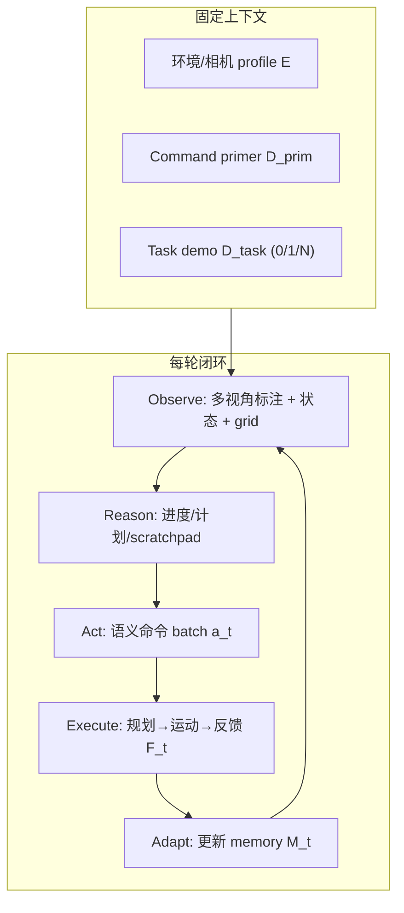
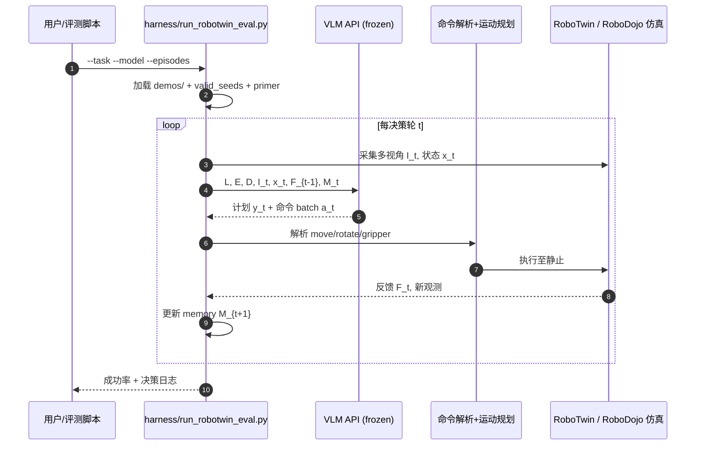

# RoboDawn（arXiv:2609.22966）

**RoboDawn**（*Transferring the Intelligence of VLMs to Robotic Control*，[arXiv:2609.22966](https://arxiv.org/abs/2609.22966)，[项目页](https://robodawn.top)，[评测回放](https://robodawn.top/results)，[GitHub](https://github.com/Hugo-AGI/RoboDawn)）由 **清华大学** 与 **腾讯混元** 提出：通过 **人类直觉语义动作接口** 与 **in-context 演示**，让 **冻结的 agentic VLM** 在闭环中完成双臂操纵——**无需任务特定的机器人参数更新**。

## 一句话定义

**把 VLM 当在线决策器：用少量离散 GIP 命令（move/rotate/grip）+ 1 条任务演示做 ICL，把数字世界里的通用智能迁移到物理闭环控制。**

## 英文缩写速查

| 缩写 | 英文全称 | 简要说明 |
|------|----------|----------|
| GIP | Gripper Interaction Point | 双指尖中点；标注、状态与命令统一参考 |
| ICL | In-Context Learning | 上下文演示，无梯度更新 |
| C2R | Clean-to-Randomized | RoboTwin 干净场景演示 → 随机化场景评测 |
| VLM | Vision-Language Model | 冻结权重的多模态大模型 |
| WAM | World Action Model | 对比基线：需机器人数据后训练 |

## 为什么重要

- **「智能迁移」路线：** 相对 VLA/WAM **大规模 action 微调**，RoboDawn 假设 **预训练 VLM 已具备可迁移的推理** — 瓶颈在 **接口 + 在线课**，而非从头学 embodied intelligence。
- **强 benchmark 证据：** [RoboTwin 2.0](./robotwin.md) C2R **1-shot 73.6%**（GPT-6 Astra）超过 **π₀.₅ 46.0%**（全量后训练）；[RoboDojo](./robodojo.md) **47.17%** 1-shot vs DM0.5 **19.34%**（论文 Table 4 语境）。
- **超越同类 agentic harness：** 同 C2R 上高于 [Harness VLA](./paper-harness-vla.md)（58.4%，冻结 VLA + 记忆编排但需全量 robot 训练的后端）。
- **可审计开源：** **710** 评测 episode + **128** ICL demos 可在 [robodawn.top/results](https://robodawn.top/results) 逐步回放；代码 MIT 公开（2026-09-22）。

## 核心信息

| 字段 | 内容 |
|------|------|
| 机构 | 清华大学（Tsinghua）；腾讯混元（Tencent Hunyuan） |
| 平台 | [RoboTwin 2.0](./robotwin.md) C2R + [RoboDojo](./robodojo.md) 仿真；Franka 真机 |
| 接口 | 离散语义命令（≤20 cm / 90° 步长）；GIP 世界系 |
| 开源 | **已开源** — [Hugo-AGI/RoboDawn](https://github.com/Hugo-AGI/RoboDawn)（MIT）；prompts / demos / seeds / harness |

## 流程总览



### 语义命令语法（摘要）

```text
<arm> move <x|y|z> <d>
<arm> rotate <roll|pitch|yaw> <θ>
<arm> point <down|forward|down45>
<arm> gripper <open|close|0–1>
<arm> home · wait · done
```

专家轨迹先降为 waypoints，再 **转写** 为在线模型可发出的命令序列；VLM 为每轮补充 **rationale**，构成完整 ICL 条目。

## 源码运行时序图



RoboDojo 路径：`scripts/robodojo/run_vlm_experiment.py` → `evaluation/policies/vlm_agent/` → `RoboDojo/eval_result/`。详见 [`sources/repos/robodawn.md`](../../sources/repos/robodawn.md)。

## 工程实践

| 检查项 | 建议 |
|--------|------|
| API | OpenAI-compatible endpoint；单请求最多 **~58** 张图（primer + 当前 + demo 帧） |
| RoboTwin | `conda activate RoboTwin`；`harness/run_robotwin_eval.py`；单 episode **10–30 min** |
| RoboDojo | `run_vlm_experiment.py`；默认 240 turns / 8000 reply tokens |
| 复现数字 | 使用仓库内 **pinned** 子模块与 `demos/MANIFEST.json` 中演示 MD5 |
| 真机迁移 | 读 `harness/README.md` 将同一 grammar 接到新机器人控制器 |

## 实验与评测

### RoboTwin 2.0 C2R（50 任务 × 10）

| 方法 | Robot 训练 | Shots | SR |
|------|------------|-------|-----|
| **RoboDawn (GPT-6 Astra)** | none | 1 | **73.6%** |
| **RoboDawn (GPT-6 Astra)** | none | 0 | **53.2%** |
| HarnessVLA | full set | — | 58.4% |
| LingBot-VLA | full set | — | 50.4% |
| π₀.₅ | full set | — | 46.0% |

### RoboDojo（GPT-6 Astra，1-shot，五维均值）

| 指标 | 数值 |
|------|------|
| Success rate | **47.17%** |
| Zero-shot | 35.67% |
| 真机 Franka block-in-basket | **9/10**（Gemini 3.8 Flash，零样本无 demo） |

### 消融（Gemini 3.8 Flash）

- **Demo 数量：** 0→1 跳升最大（47.0%→62.2%）；8-shot 略降至 62.7%。
- **Harness 组件（zero-shot）：** 去 grid localization 32.4% vs full 47.0%。

## 与其他工作对比

| 对照 | 差异读法 |
|------|----------|
| [Harness VLA](./paper-harness-vla.md) | 冻结 **VLA** + 记忆编排；RoboDawn 冻结 **VLM** + **语义离散接口** + ICL，C2R 更高且 **零 robot 训练** |
| [EmbodiedSkills](./paper-embodiedskills.md) | AgentLoop + skill contract + **π₀.₅ 低层**；RoboDawn **不用** 后训练 action 头 |
| π₀.₅ / LingBot-VLA | 全量 benchmark 后训练；RoboDawn **参数冻结**，靠接口与 1 demo |
| Show-Harness（论文 Related） | 同类 frontier VLM 闭环；RoboDawn 强调 **ICL 协同设计** |

## 结论

**RoboDawn 用「语义游戏式接口 + 1 条 ICL 演示」把冻结 VLM 推到 C2R/RoboDojo SOTA 量级，证明机器人侧未必总需大规模 action 微调；工程上应优先对齐 harness、demo 与 API 图像预算。**

1. **1-shot 是甜蜜点** — RoboTwin/RoboDojo 增益主要在 0→1；过多 demo 可能伤长上下文。
2. **Grid + reasoning 不可省** — zero-shot 消融显示空间网格与显式推理对 SR 贡献最大。
3. **慢但可扩展** — VLM 推理 ~秒级/轮，适合 **test-time scaling**（RoboDojo 命令预算↑ → SR↑），非 kHz 力控。
4. **精细接触仍是坑** — 硬币入槽、倾倒定量等 **离散步长** 与 **done 判据** 失配（论文 Failure §3）。
5. **已可复现** — MIT 代码 + 710 在线回放；选型时把 **API 成本与延迟** 算进部署账。

## 局限与风险

- **速度：** 迭代 VLM 推理显著慢于端到端 VLA/WAM（论文 Table：Inference/motion 比可达 ~4.65）。
- **旋转与细接触：** 平移优于精确 rotate；离散接口在 grasp 末段可能过粗。
- **安全：** 错误命令可导致碰撞 — 通用部署需护栏（与 [EmbodiedSkills](./paper-embodiedskills.md) guarded runtime 对照）。
- **Backbone 依赖：** SR 随底层 VLM 能力缩放（GPT-6 Astra > Gemini 3.8 Flash > 小模型）。

## 关联页面

- [VLA](../methods/vla.md)
- [RoboTwin 2.0](./robotwin.md)
- [RoboDojo](./robodojo.md)
- [Harness VLA](./paper-harness-vla.md)
- [行为树 VLA 编排](../concepts/behavior-tree-vla-orchestration.md)

## 推荐继续阅读

- [RoboDawn 项目页](https://robodawn.top)
- [全部评测轨迹回放](https://robodawn.top/results)
- [GitHub: Hugo-AGI/RoboDawn](https://github.com/Hugo-AGI/RoboDawn)

## 参考来源

- [RoboDawn 论文归档](../../sources/papers/robodawn_arxiv_2609_22966.md)
- [RoboDawn 项目页归档](../../sources/sites/robodawn-top.md)
- [RoboDawn 代码归档](../../sources/repos/robodawn.md)
