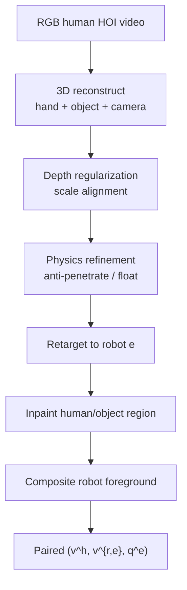
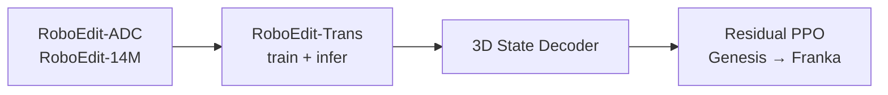

# RoboEdit：人类视频转机器人经验

**RoboEdit**（*Turning Human Manipulation Videos into Scalable Robot Experience*；[arXiv:2608.18948](https://arxiv.org/abs/2608.18948)）由 **UCLA**（Chenfanfu Jiang、Ying Jiang 等）提出：把 abundant **human hand-object RGB 视频** 转成 **action-consistent、物理 plausible 的 target-robot 视频**，并同步恢复 **aligned 3D robot hand states** — 通过 **RoboEdit-Trans**（跨具身 video editor + 3D Robot-State Decoder）与 **RoboEdit-ADC**（自动 paired-data 管线），构造 **RoboEdit-14M**（174K aligned pairs / 14.1M frames / 7 embodiments）。

## 一句话定义

**不从头生成机器人场景，而是在保留原场景、相机与物体动力学前提下，把 human video 编辑成 target-robot 交互视频，并用 decoder 抽出可驱动控制的 3D 手态轨迹。**

## 英文缩写速查

| 缩写 | 英文全称 | 简要说明 |
|------|----------|----------|
| HOI | Hand-Object Interaction | 手-物交互重建与编辑对象 |
| ADC | Automatic Data Curation | RoboEdit-ADC 自动配对管线 |
| LoRA | Low-Rank Adaptation | 跨具身 appearance/motion 适配 |
| PnP | Perspective-n-Point | 由 2D palm anchor + 3D palm 几何估 wrist pose |
| PPO | Proximal Policy Optimization | 下游 residual 跟踪控制器 |
| YCB | Yale-CMU-Berkeley | 真机评测物体集 |

## 为什么重要

- **数据瓶颈：** 机器人 interaction 视频 贵且 embodiment-specific；人类视频覆盖 scene/viewpoint/contact 但 **不能直接训练**。
- **比中间表示更进一步：** 相对只抽 EEF 轨迹 / affordance / value（或 [Ego2Robot](./paper-ego2robot.md) 的相机系 EEF），RoboEdit 输出 **full video + dense 3D states** 双监督。
- **规模：** RoboEdit-14M 174K pairs — Table 1 称唯一同时具备 **Auto curation + RGB pair + Robot state + 14M-frame 级** 的 human→robot 数据集（截至论文）。
- **闭环验证：** decoded 3D trajectory 可训 Genesis residual PPO 并在 **Franka Panda 真机** YCB 任务执行。

## 核心信息

| 项 | 内容 |
|----|------|
| **机构** | 加州大学洛杉矶分校（UCLA）；宾夕法尼亚大学（UPenn，Demetri Terzopoulos）等 |
| **组件** | RoboEdit-Trans / RoboEdit-ADC / RoboEdit-14M |
| **Backbone** | NovaEdit → Wan2.1-VACE-1.3B；flow matching；Qwen-Image-Edit keyframes |
| **Embodiments** | Inspire、XHand、Ability、SCHUNK SVH、Allegro、Unitree Dex3、Franka Panda gripper（7） |
| **源视频** | DexYCB、HOT3D、H2O、GigaHands、TACO + 29K synthetic pairs |
| **开源** | **未列可运行入口**（截至 **2026-08-21** arXiv 无项目页 / GitHub / 数据集 URL） |

## 核心原理

### RoboEdit-ADC（数据管线）

### RoboEdit-Trans（编辑引擎）

- 输入：masked human video \(z^h\) + sparse target-robot condition frames \(z^{c,e}\)  
- 输出：robot latent \(\hat{z}^{r,e}=G_\theta(z^h,z^{c,e})\) via **flow matching**  
- **LoRA** — 跨具身 appearance / spatiotemporal  
- **Residual adapter** — hand geometry / contact pattern（单 adapter 增益 > 单 LoRA）  
- **3D Robot-State Decoder** — 2D heatmap anchors → PnP wrist → temporal Transformer refine → FK 轨迹 \(\hat{q}^e_{1:T}\)

### 流程总览（训练→部署）

## 源码运行时序图

**不适用** — 截至入库日（2026-08-21）**无**官方项目页或 GitHub；RoboEdit-14M 与 Wan2.1/Qwen 推理栈未公开。若后续发布，预期路径：ADC 批处理 → Trans 81-frame 编辑 → Decoder 抽轨迹 → 下游 IL/RL。

## 工程实践

| 项 | 建议 |
|----|------|
| 与 Ego2Robot 分工 | 需要 **像素级 robot video + 手态** 时用 RoboEdit；只需 EEF 轨迹预训练 VLA 时可先用 lighter pipeline |
| Keyframe | 推理用 sparse keyframes \(\{0,10,\ldots,80\}\)；Qwen-Image-Edit 在 RoboEdit-14M 上 fine-tune 生成 |
| 适配模块 | LoRA + residual **并用**（Table 3）；仅 backbone 不够 |
| Retarget 质量 | depth regularization + physics refinement 减 floating/penetration（Fig. 6） |
| 下游控制 | decoded trajectory + residual PPO；sim Panda **71%** / XHand **62%** 再考虑真机 |
| 数据集等待 | RoboEdit-14M 尚未发布；lint 跟进 arXiv / 作者页 |

## 实验与评测

**300-case benchmark（Table 2，multi-keyframe）：**

| Method | SSIM↑ | Edit LPIPS↓ | OpenVE↑ |
|--------|-------|-------------|---------|
| VACE 1.3B | 0.8996 | 0.0258 | 3.1446 |
| OmniWeaving 13B | 0.8107 | 0.0625 | 3.1634 |
| **RoboEdit-Trans** | **0.9282** | **0.0171** | **3.2511** |

**Adaptation 消融（Table 3）：** LoRA+Adapter 全面优于单独模块。

**RoboEdit-14M：** 174,547 pairs；14.1M frames；145,459 real + 29,088 synthetic；7 embodiments。

**下游控制：** Genesis 512 env residual PPO — Panda **71%**、XHand **62%** trajectory reproduction；Franka Panda 真机 YCB 四任务（Fig. 7）。

## 结论

**人类视频的价值不只在于抽稀疏动作，而在于可编辑成 target-robot 像素监督并同步给出 3D 手态 — RoboEdit 把这两路监督绑在同一套件里。**

1. **编辑 > 纯生成** — 保留 scene/camera/object dynamics，避免 de novo 生成破坏上下文。
2. **ADC 可扩展** — 从 DexYCB/HOT3D/H2O/GigaHands/TACO 自动构造 14M-frame 级 paired data。
3. **跨具身** — LoRA + residual adapter 在 1.3B backbone 上适配 7 种 hand/gripper。
4. **3D Decoder** — 编辑视频本身无 metric motion；decoder 是 downstream control 桥梁。
5. **SOTA editing** — SSIM / Edit LPIPS / OpenVE 全面领先 8 个强基线。
6. **真机闭环** — decoded trajectory 可驱动 Franka 操作 YCB — 不只停留在 perceptual metrics。
7. **开源** — 截至 2026-08-21 **无 URL**；RoboEdit-14M 与 Trans 权重待发布。

## 局限与风险

- **BG SSIM 偏低解释：** robot vs human 手空间范围不同，edit-mask 边界处 background metric 系统性低估（论文 §4.3）。
- **Decoder 误差传播：** 编辑 artifact 会进入 3D state；temporal Transformer 缓解 jitter 但非万能。
- **Embodiment 覆盖：** 7 种 hand/gripper 仍远小于真实部署多样性；synthetic 29K pairs 补 visual 但非物理全集。
- **未开源：** 无法复现 ADC 与 14M；benchmark 300 cases 细节依赖未来 release。
- **与 NovaEdit 依赖：** backbone 与 keyframe 生成绑定制化 fine-tune，迁移成本待评估。

## 关联页面

- [Ego2Robot](./paper-ego2robot.md) — 第一人称人视频→机器人 EEF 数据（互补路线）
- [Motion retargeting](../concepts/motion-retargeting.md) — ADC 中 retarget 环节
- [Manipulation 任务](../tasks/manipulation.md)
- [Cross-embodiment 枢纽](../overview/hub-cross-embodiment.md)

## 参考来源

- [RoboEdit 论文归档](../../sources/papers/roboedit_arxiv_2608_18948.md)

## 推荐继续阅读

- [arXiv:2608.18948 全文 PDF](https://arxiv.org/pdf/2608.18948) — RoboEdit-ADC/Trans 细节与 Appendix B decoder
- [NovaEdit（arXiv 引用）](https://arxiv.org/abs/2506.07120) — RoboEdit-Trans 架构基底
