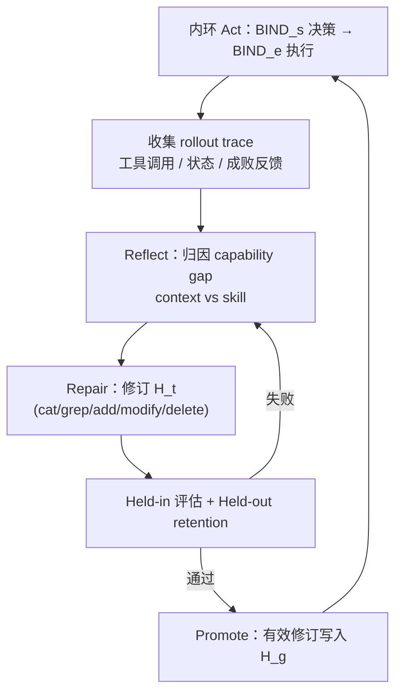

# RoboFoundry（System-as-Policy · arXiv:2609.32862）

**RoboFoundry**（*RoboFoundry: System-as-Policy Evolution for Self-Learning Embodied Agents*，[arXiv:2609.32862](https://arxiv.org/abs/2609.32862)，[PDF](https://arxiv.org/pdf/2609.32862)，[项目页](https://jingsongliang.com/robofoundry/)，[HF Papers](https://huggingface.co/papers/2609.32862)；南洋理工大学 / 北京航空航天大学 / 新加坡国立大学 / 云蝶科技 / 上海交通大学）提出 **Self-Evolving System-as-Policy**：不单独把 foundation model 当作完整具身策略，而是把 **支撑 FM 的整个 agent 系统**（context 管理、分层 skill、语义–执行绑定）视为 **可诊断、可修订、可晋升（promote）的统一 policy**；执行轨迹经 **Act–Reflect–Repair–Promote** 转为 **经 held-in / held-out 校验** 的持久系统变更，并支持 **跨 backbone、跨具身** 复用演化结果。

## 一句话定义

**冻结大模型权重，把文件系统上的 context 与 skill 支撑栈当作可演化 policy，用轨迹归因做任务级修复并晋升到通用系统。**

## 英文缩写速查

| 缩写 | 英文全称 | 简要说明 |
|------|----------|----------|
| FM | Foundation Model | 冻结的 LLM / MLLM 决策核 |
| TSR | Task Success Rate | RoboMemArena 等长程记忆基准的全任务成功率 |
| CSR | Conditional Success Rate | 记忆相关子条件上的成功率（与 TSR 成对报告） |
| VLA | Vision-Language-Action | 可作为 execution binding 后端的冻结 visuomotor 策略 |
| CaP | Code-as-Policy | 以可执行程序组合原语；本文演进到 System-as-Policy |
| LIBERO | LIBrary of ERObotics tasks | 仿真操作套件；LIBERO-PRO 为扰动扩展 |

## 核心信息

| 字段 | 内容 |
|------|------|
| **机构** | 南洋理工大学（NTU）；北京航空航天大学（Beihang）；新加坡国立大学（NUS）；云蝶科技（Cloud Butterfly Technology）；上海交通大学（SJTU） |
| **arXiv** | [2609.32862](https://arxiv.org/abs/2609.32862) |
| **开源** | **截至 2026-09-30 项目页未列 GitHub / 权重** — 复现需等待官方发布或联系作者 |
| **评测规模** | EmbodiedBench 四套件 + RoboMemArena + LIBERO-PRO（文内与项目页合计约 **1200** 量级任务/settings） |
| **Backbone 示例** | GPT-6 Astra、GPT-5.5、Qwen3.7-Plus、GLM5.3-Flash、Qwen3.8-27B 等 |

## 为什么重要

- **从组件优化到系统 policy：** 相对只改 memory harness、skill 库或 code-as-policy 单点，RoboFoundry 让 **执行历史决定改哪一层、改多大范围**（任务级 \(H_t\) vs 通用 \(H_g\)）。
- **自进化需校验环：** 单次交互不等于改进；**held-out retention** 与 **promote** 避免无约束自改写（项目页 EB-Habitat spatial trace：21.4%→78.0% 经多次 commit/discard）。
- **跨模型增益稳定：** GPT-5.5 EmbodiedBench Avg **56.9→72.7**（+15.8 pp）；Qwen3.7-Plus **60.0→70.3**，说明增益主要来自 **系统演化** 而非某一 proprietary backbone。
- **记忆与扰动双 SOTA 叙事：** RoboMemArena Overall **53.5 / 72.8** TSR/CSR；LIBERO-PRO 三类扰动上与 [Harness VLA](./paper-harness-vla.md) 等同榜前列并大幅超 CaP-Agent0。
- **真机闭环：** 页内展示套娃、毛巾泛化、长程化学、人形语义导航等 **zero-shot transfer 与 online evolution**。

## 核心原理

### System-as-Policy 分解

| 对象 | 含义 |
|------|------|
| **\(M\)** | 冻结 foundation model |
| **\(H(M)=H_g+H_t\)** | 通用系统 + 任务级系统 |
| **\(S_t^c / S_t^e\)** | 语义级任务表述 vs 具身相关执行空间 |
| **Context 面** | Active context + 持久文件记忆；操作 **SAVE / RETRIEVE / UTILIZE** |
| **Skill 面** | 原子技能、组合 procedure、failure-conditioned **recovery tree** |
| **BIND_s / BIND_e** | 语义绑定 vs 执行绑定（VLA、coding agent、CuRobo 等） |

外环在 trace 上归因 **capability gap**，在 responsible surface 上做 **task-level repair**；重复有效的修订经 broader trace 检验后 **promote** 到 \(H_g\)。

### 流程总览

## 源码运行时序图

**不适用**（截至 2026-09-30 项目页未发布可运行官方仓库；演化环路由与 filesystem 编辑接口无法对齐到公开 README 入口。）

## 实验与评测

### EmbodiedBench（四套件 Avg.，项目页）

| 方法 | Avg. |
|------|------|
| RoboFoundry (GPT-6 Astra) | **78.0** |
| RoboFoundry (GPT-5.5) | **72.7** |
| RoboFoundry (Qwen3.7-Plus) | **70.3** |
| GPT-5.5 单独 | 56.9 |

### RoboMemArena（TSR / CSR %）

| 方法 | Overall |
|------|---------|
| **RoboFoundry** | **53.5 / 72.8** |
| PrediMem | 38.5 / 55.2 |
| π₀.₅ | 21.5 / 38.7 |

RoboFoundry 还可作为 **context 演化插件** 提升 standalone π₀.₅ / PrediMem（项目页「Context evolution」表，Avg. TSR/CSR 约 **26.8/45.6 → 56.2/72.2** 等）。

### LIBERO-PRO（position / task SR %，节选）

| 方法 | Object | Spatial |
|------|--------|---------|
| **RoboFoundry** | 96.0 / **98.0** | 92.0 / 91.5 |
| Harness VLA (CC) | 94.0 / 80.0 | 87.0 / 87.5 |

### 真机与长程任务（项目页索引）

化学实验、双毛巾泛化、套娃、人形语义导航等；强调 **跨机器人** 复用演化后的 **语义侧** 能力。

## 结论

**RoboFoundry 把「agent 栈整体演化」做成可审计闭环，是在不微调 FM 的前提下拉高 EmbodiedBench / 记忆 / 扰动操作上限的 System-as-Policy 框架。**

1. **系统级 policy 优于单组件补丁** — 同一 FM 在不同 \(H(M)\) 下表现可差 **15+ pp**（EmbodiedBench 上 GPT-5.5）。
2. **Promotion 是安全自进化的关键** — 任务级 commit 必须过 held-out，避免过拟合单次修复（spatial 子集 trace 示例）。
3. **Context 与 Skill 分工明确** — 记忆类失败改 context 面；组合/恢复失败改 skill 面，便于运维归因。
4. **语义接口服务迁移** — 演化落在 BIND_s，换机器人主要换 BIND_e（VLA / API / code）。
5. **开放 backbone 可逼近 frontier** — Qwen3.7-Plus **70.3%** vs GPT-5.5 **72.7%** Avg.，利于工程选型。
6. **与 Harness VLA 同榜但机制不同** — Harness 偏 **冻结 VLA 原语 + 记忆重绑定**；RoboFoundry 偏 **整个支撑系统的版本化演化**（当前 **无公开代码** 对比复现成本）。

## 工程实践

| 项 | 建议 |
|----|------|
| 复现入口 | 关注 [项目页](https://jingsongliang.com/robofoundry/) 是否挂 GitHub；勿与无关 org [`robofoundry`](https://github.com/robofoundry)（ROS 工具）混淆 |
| Backbone | 论文在多 FM 上报告增益；部署前先固定 **评测 backbone** 再谈系统演化预算 |
| 执行后端 | BIND_e 可接 **冻结 VLA**、coding agent、CuRobo 等 — 与 [EmbodiedSkills](./paper-embodiedskills.md) 的 guarded runtime 可组合对比 |
| 记忆基准 | 长程任务优先 RoboMemArena / RMBench 族；对照 [SimpleMemVLA](./paper-simplememvla.md) 等 **模型内记忆** 路线 |
| 扰动基准 | LIBERO-PRO 上与 [Harness VLA](./paper-harness-vla.md) 同榜对照时，区分 **agent 演化** vs **原语记忆** |

## 与其他工作对比

| 对照 | 差异读法 |
|------|----------|
| [Harness VLA](./paper-harness-vla.md) | 固定原语 + TSM/GM **重绑定**；RoboFoundry **修订系统文件** 并 **promote** 到 \(H_g\) |
| [EmbodiedSkills](./paper-embodiedskills.md) | **Skill contract + AgentLoop guard**；RoboFoundry 强调 **跨任务系统版本演化** 而非单栈训练 |
| [RoboHarness](./paper-robo-harness.md) | 异构策略 **路由**；RoboFoundry **统一系统 policy** 随 trace 演化 |
| Code-as-Policy | 一次程序合成；RoboFoundry **持久化、校验、晋升** 系统变更 |

## 局限与风险

- **官方代码未发布** — 截至入库日无法复现 filesystem 演化实现与 compute 成本。
- **FM 名称与版本** — 项目页使用 GPT-6 Astra / GPT-5.5 等 **前沿商用或预览模型**；开源 backbone 结果需单独核对 API 与 prompt 快照。
- **自进化安全** — 无公开 guard 细节时，真机 **unconstrained self-edit** 风险需额外 sandbox（对照 EmbodiedSkills preflight/verify）。
- **与模型内记忆路线竞争** — [SimpleMemVLA](./paper-simplememvla.md) 等通过 **原生上下文** 抬记忆分数；RoboFoundry 走 **系统外持久记忆**，延迟与一致性 trade-off 不同。

## 关联页面

- [VLA 方法](../methods/vla.md) — agentic harness 与冻结 policy 生态
- [Manipulation 任务](../tasks/manipulation.md) — LIBERO-PRO 扰动语境
- [Harness VLA](./paper-harness-vla.md) — LIBERO-PRO 同榜 agentic 对照
- [EmbodiedSkills](./paper-embodiedskills.md) — skill contract 与 runtime guard
- [Baton（RoboMemArena）](./paper-baton-long-horizon-manipulation.md) — 长程记忆基准相关 work

## 参考来源

- [robofoundry_arxiv_2609_32862.md](../../sources/papers/robofoundry_arxiv_2609_32862.md)
- [robofoundry-project.md](../../sources/sites/robofoundry-project.md)

## 推荐继续阅读

- [RoboFoundry 项目页](https://jingsongliang.com/robofoundry/) — 全表、演化动画与真机录像
- [arXiv:2609.32862 PDF](https://arxiv.org/pdf/2609.32862) — Algorithm 1 与 promote 条件
- [Harness VLA 项目页](https://harnessvla.github.io/) — 冻结 VLA + 记忆 agent 对照基线
